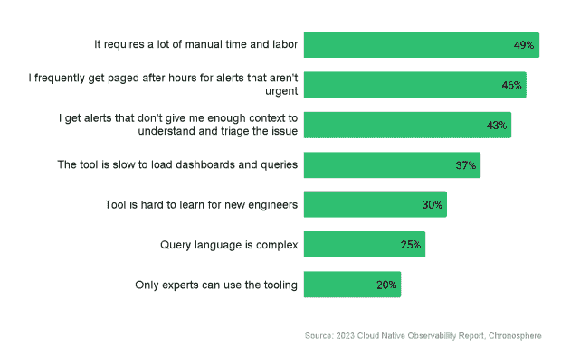
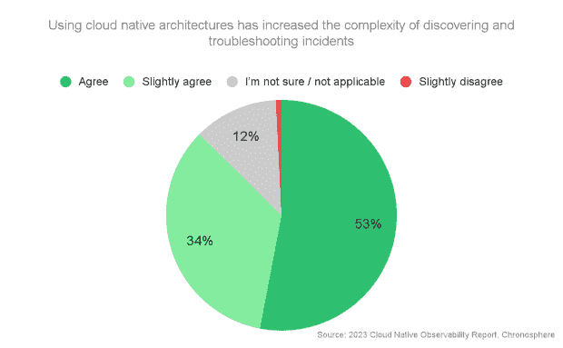
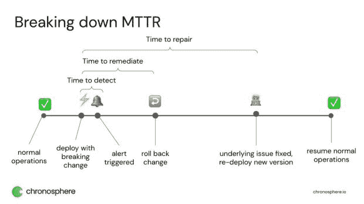

# 为什么我们在修理的时候如此糟糕(MTTR)？

> 原文：<https://thenewstack.io/why-are-we-so-bad-at-mean-time-to-repair-mttr/>

最近的一项调查发现了一个令我非常沮丧的事实:只有 1%的公司达到了平均修复时间的目标。没错，这意味着 99%的公司都达不到目标。在你称之为恶作剧之前，让我解释一下方法:这项调查面向美国公司的 500 名工程师和工程负责人，首先问:“平均来说，你的公司修复一个问题通常需要多长时间？”接下来，调查要求他们回答“修复问题的目标平均时间是多少？”结果是严峻的。500 人中只有 7 人回应说他们达到或超过了他们在 T2 MTTR 的目标。(他们的平均 MTTR 等于或小于他们的目标 MTTR。)

他们差了多少？一般公司的目标是 4.7 小时的 MTTR，但实际上实现了 7.8 小时的 MTTR。汪汪。为什么和*如何*我们在这方面如此糟糕？我有一些理论。让我们深入研究一下。

## 没有人知道平均维修时间到底是什么意思

MTTR 代表“平均修复时间”,用于衡量从第一次警告出现问题到修复问题所需的时间。我声明这是事实，但我也看到 MTTR 代表:

*   平均故障修理时间
*   平均响应时间
*   平均修复时间
*   瑞秋的平均时间

但是考虑到我们在调查中特别问到“你修复的平均时间是多少”，我很有信心，我知道人们回答的是哪个“r”。不过话说回来，修复到底是什么意思？我问了几个人，得到了两种不同的观点:

1.  让系统恢复到某种运行状态所需的时间
2.  彻底解决潜在问题所需的时间

那到底是哪个？这也是无法与同行进行比较的原因之一。但是你可以拿自己做基准，这仍然不能解释为什么 99%的公司没有达到他们对 MTTR 的期望。

## 在重大事故中，可观察性工具是失败的工程师

我的第二个假设也来自调查中的数据:那就是[可观察性](https://thenewstack.io/chronosphere-nudges-observability-standards-toward-maturity-prometheus/)工具从警告到探索和分类到根本原因分析让工程师们很失败。我这么说的原因是:当我们问个体贡献者工程师他们对可观测性解决方案的主要抱怨是什么时，将近一半的人说这需要大量的人工时间和劳动。43%的受访者表示，警报没有提供足够的背景信息来理解和分类问题。

如果他们用来修复问题的工具花费了大量的人工时间和劳动，并且没有提供足够的上下文，这可能是导致公司无法实现 MTTR 目标的很大一部分原因。

## 云原生是福也是挑战

许多领先的组织正在转向原生云，以提高效率和收入。本次调查中的受访者表示，他们的环境平均有 46%在容器和微服务中运行，他们预计这一数字将在未来 12 个月内增加到 60%。虽然这种转变带来了许多积极的好处，但它也带来了指数级的更高复杂性、更大的数据量以及对支持面向客户的服务的工程团队的更大压力。如果管理不当，会给客户和收入带来严重的负面影响。

这不是一个有争议的声明。调查中的绝大多数受访者(87%)认为，云原生体系结构增加了发现和故障排除事件的复杂性。

## 那么我们如何变得更好呢？

如果我们剖析 MTTR 方程，它可能看起来像这样:

所以我会从解决等式的每一部分开始，并找到缩短每一步的方法:

*   **检测时间:** TTD 经常被忽视，但它可能是你减少 MTTR 的方法之一。减少检测 (MTTD)的[平均时间的关键是确保尽可能频繁地收集数据(设置一个低的抓取间隔),并且您的工具能够快速接收和生成警报。在许多行业中，这是秒产生巨大差异的地方。例如，Robinhood](https://thenewstack.io/why-traditional-logging-and-observability-waste-developer-time/) 过去在事故发生和警报发出之间有 4 分钟的间隔。*四分钟*。在一个监管严格、客户期望很高的行业，这是一段很长的时间。但是通过升级它的观测平台，它将 MTTD 缩短到 30 秒或更少。
*   **修复时间:**这是停止客户痛苦并实施(可能是临时的)修复所需的时间。一旦你缩短了检测时间，你就可以攻击检测和[补救](https://thenewstack.io/automated-security-alert-remediation-a-closer-look/)之间的空隙。这通常是通过在警报中提供更多上下文和清晰的可操作数据来实现的。说起来容易做起来难！在最近的调查中，我们发现 59%的工程师表示，他们从当前的可观察性解决方案中收到的一半事故警报实际上没有帮助或不可用。我们之前已经看到，43%的工程师经常从他们的可观察性解决方案中收到警报，但没有足够的上下文来对事件进行分类。当警报具有关于受事件影响的服务或客户的上下文，并将工程师与可操作的控制面板联系起来时，修复时间会大大缩短。
*   **修复时间:**如果您已经优化了检测时间和修复时间，那么修复时间实际上就变成了一个不太重要的指标。为什么？假设您将修复时间定义为在补救后修复潜在问题的时间*，这意味着客户在修复过程中不会受到影响。这仍然是一个需要关注的问题，因为长时间的修复通常意味着团队陷入了无休止的故障诊断循环，但这对客户满意度没有直接影响。*

想要进一步挖掘这些数据吗？这个数据所基于的整个研究在这里[可用](https://go.chronosphere.io/2023-observability-report.html?utm_source=thenewstack&utm_medium=contributed-article&utm_content=blog)。我鼓励你读一读，如果你有任何额外的见解要分享，请在 Twitter 或乳齿象上联系我。

<svg xmlns:xlink="http://www.w3.org/1999/xlink" viewBox="0 0 68 31" version="1.1"><title>Group</title> <desc>Created with Sketch.</desc></svg>