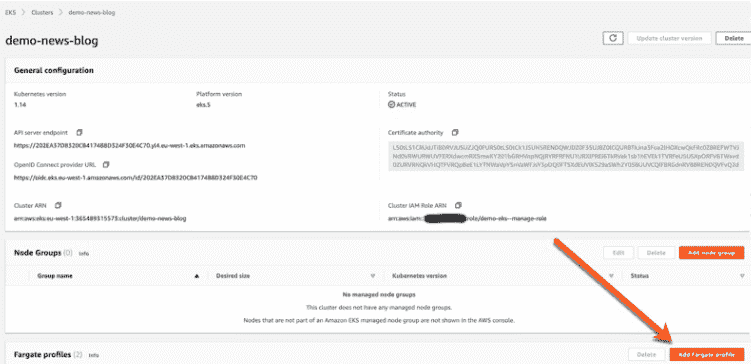

# 为什么 AWS 决定让开发者用无服务器管理 Kubernetes

> 原文：<https://thenewstack.io/why-aws-decided-to-let-developers-manage-kubernetes-with-serverless/>

随着其 [Fargate](/aws-fargate-the-beginning-of-the-end-for-infrastructure-management/) 无服务器容器产品的流行，[亚马逊网络服务](https://aws.amazon.com/)现在将允许用户使用 Fargate 的无服务器模型来管理和提供[弹性 Kubernetes 服务(EKS)](https://aws.amazon.com/eks/) 上的集群。这意味着组织现在可以在 EKS 上为集群管理指定计算和其他标准，因为 Fargate 管理 Kubernetes pods 的复杂配置和基础架构管理。

这是 AWS 首席执行官安迪·杰西(Andy Jassy)周二在该公司本周在拉斯维加斯举行的年度 [Re:Invent](https://reinvent.awsevents.com/) 用户大会上发表的一系列声明之一，表明 AWS 正在积极扩大其云基础设施上使用的产品和工具。Jassy 在三个小时的主题演讲中披露的其他新产品包括新的数据库技术和 AWS 为机器学习推出的集成开发环境(IDE) SageMaker Studio 。

Jassy 说，声称云上超过 80%的容器运行在 AWS 上，而 40%的新容器客户选择使用 Fargate 进行无服务器容器管理，AWS 认为显然需要扩展 Fargate，以通过 EKS 提供和管理 Kubernetes。Jassy 说，为 Kubernetes 选择使用 Fargate 的概念很简单:你指定“你想要的 CPU 和内存并上传容器映像，Fargate 为你做所有剩下的事情”,而不必管理服务器或提供 Kubernetes 集群。

“我们没有预料到 Fargate 会如此受欢迎——可以理解的是，客户会说，‘我们喜欢 Fargate 的想法，但你为什么不让它为 Kubernetes 服务呢？’贾西说。"现在，我们的 Kubernetes 客户能够获得运行容器的所有无服务器好处."

[企业管理协会(EMA)](https://www.enterprisemanagement.com/) 的分析师 [Torsten Volk](https://www.linkedin.com/in/torstenvolk) 说，能够依靠 Fargate 使用无服务器平台来供应和管理 Kubernetes 集群的选择应该会在开发人员中引起共鸣，特别是那些在资源有限的组织中工作的开发人员。“在顶级标准 EC2 基础设施上调整、部署、配置和运行 Kubernetes 集群需要技能、经验和时间，而且为了安全起见，它总是会导致严重的过度供应，”Volk 说。“Fargate 解决了所有这些问题，通过 Fargate 上的 EKS，开发人员可以简单地以几个 CLI 命令的形式定义他们的应用需求。Fargate 随后提供了所需的 Kubernetes 基础设施来运行他们的应用程序，而无需修改代码。”

Volk 说，由于用户可以配置 Fargate 自动运行指定到特定名称空间的 pods，他们可以访问“Kubernetes-as-Code”，而无需担心集群更新、配置错误或过度供应。“Fargate 上的 EKS 是传统虚拟机自动售货机的容器等价物，”Volk 说。

AWS 的主要倡导者马丁·毕比(Martin Beeby)今天在一篇关于[如何使用 Fargate](https://aws.amazon.com/blogs/aws/amazon-eks-on-aws-fargate-now-generally-available/) 提供 Kubernetes 集群的博客文章中写道，除了消除管理多租户的需要，Fargate for EKS(无服务器模式)还允许用户放弃修补、扩展或保护亚马逊 EC2 实例集群。

“使用 [Fargate](https://aws.amazon.com/fargate/) ，客户定义并支付 pod 级别的资源，”Beeby 写道。“这使得调整每个应用程序的资源利用率变得非常容易，并使客户能够清楚地看到每个单元的成本。”

Square 的 [CashApp](https://cash.app/) 的工程经理[杰夫·弗莱里蒂](https://www.linkedin.com/in/gflarity)说，这项新服务应该有助于金融服务公司 [Square](https://squareup.com) 在管理其服务时节省资源，这些服务旨在帮助卖家经营他们的业务，从安全的信用卡处理到销售点解决方案。

“随着我们与 EKS 的军事力量的现代化，我们一直在寻找机会增强我们的安全态势，减轻我们的管理负担，”弗莱里蒂说。“调整我们计算消耗部分的能力，确保最佳利用率，而不必在容量规划或运营开销上花费时间，这一点极具吸引力。毫无疑问，这是 Kubernetes 今年最激动人心的公告。”

Datadog 的产品管理副总裁 Ilan Rabinovitch 说，Datadog 位于 SaaS 的数据分析平台也将从中受益。Rabinovitch 说:“容器和编排正在成为寻求大规模高效运营的组织的标准实践。“我们看到我们的客户广泛采用了 AWS Fargate。我们很高兴看到支持扩展到亚马逊 EKS，这样我们的客户就可以在 AWS 上进一步简化 Kubernetes 的大规模管理。”

<svg xmlns:xlink="http://www.w3.org/1999/xlink" viewBox="0 0 68 31" version="1.1"><title>Group</title> <desc>Created with Sketch.</desc></svg>