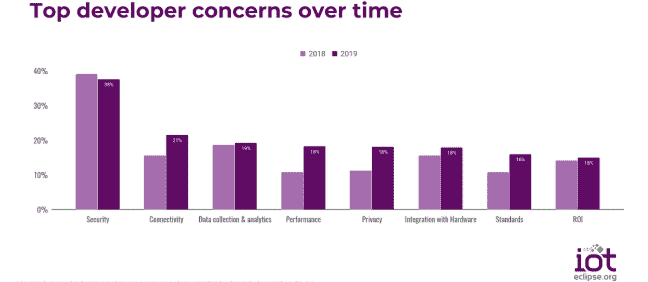

# 为什么 AWS 对 FreeRTOS 的支持有利于开源

> 原文：<https://thenewstack.io/why-aws-support-for-freertos-is-good-for-open-source/>

亚马逊网络服务(AWS) 赞助了这篇文章。

 [马特·阿萨伊

Matt 参与了开源及其支持的所有领域(云、机器学习、数据基础设施、移动等。)近二十年来，为各种开源公司工作，并定期为 InfoWorld 和 TechRepublic 撰写文章。你可以在推特上关注他(@mjasay)。](https://www.linkedin.com/in/mjasay/) 

[FreeRTOS](https://freertos.org/) ，世界[最流行的嵌入式操作系统](https://www.embedded.com/electronics-blogs/embedded-market-surveys/4458724/2017-Embedded-Market-Survey) (OS)之一，并不在大多数人的雷达屏幕上。尽管它在嵌入式开发人员中很受欢迎(在其目标操作系统方面一直排名第一或第二)，但大多数人都没有听说过它。FreeRTOS 还匿名为我们关心的许多设备提供动力，从玩具火车到飞机导航系统(以及介于两者之间的一切)。这就是为什么在亚马逊网络服务(AWS)中，我们认为不仅要维护，而且要围绕 FreeRTOS 扩展开放社区，同时显著提高其安全性和连接性是至关重要的。

考虑到这一点，2017 年 AWS 聘请了 FreeRTOS 的创始人和主要开发者理查德·巴里(Richard Barry)，并承担了 FreeRTOS 项目的管理工作。最近我采访了巴里，几年前他用英国布里斯托尔的雨换了西雅图的雨。根据 Barry 的说法，在 AWS 的管理下，FreeRTOS 的开发已经加速，即使代码已经开放了高度许可(MIT ),他预计这种加速将继续下去。

为什么？

因为帮助开源社区构建世界上最好的嵌入式操作系统是有意义的，对 FreeRTOS 社区和亚马逊都是如此。

## 社区第一

在亚马逊，我们从不羞于谈论我们为 FreeRTOS 的[使命](https://aws.amazon.com/freertos/)。Barry 被雇佣后不久，Amazon FreeRTOS [推出](https://aws.amazon.com/blogs/aws/announcing-amazon-freertos/)的那天，[我们说](https://aws.amazon.com/freertos/)“Amazon FreeRTOS 扩展了 freer tos 内核，这是一个流行的微控制器开源操作系统，具有软件库，可以轻松安全地将您的小型和低功耗设备连接到 AWS 物联网核心等 AWS 云服务或运行 [AWS 物联网 Greengrass](https://aws.amazon.com/greengrass/) 的更强大的边缘设备。”

在 AWS，我们希望更容易地扩展资源受限的嵌入式设备的功能，从而使通用物联网功能的开发更容易、更强大。如果一些开发人员认为我们的云服务可以帮助他们构建创新的应用程序，那就更好了。

> 因此，我们做的第一件事就是将 FreeRTOS 的许可改为更宽松、更容易理解的 MIT 许可，这有助于消除贡献的摩擦。

但在嵌入式开发者需要 AWS 云服务之前，他们首先需要一个高度安全、坚如磐石的操作系统，一个背后有强大的开源社区的操作系统。句号。只有社区受益，AWS 才能受益。

AWS 为 FreeRTOS 社区做出了积极的贡献，但是我们也希望确保其他人能够对项目的治理充满信心。这一举措的一个方面是许可。

多年来，Barry 在一个[修改的 GPL 许可](https://spdx.org/licenses/freertos-exception-2.0.html)下许可 FreeRTOS。正如他解释的那样，他在 GPL 下许可基本操作系统代码，如果开发者修改它，就需要贡献，除非它们静态链接到其他代码，在这种情况下，就会出现异常(这允许开发者以他们想要的任何方式许可完整的工作)。尽管初衷是好的，但这种许可模式也很复杂。因此，我们做的第一件事就是将 FreeRTOS 的许可改为更宽松、更容易理解的 MIT 许可，这有助于消除贡献的摩擦。

与此同时，Barry 说，AWS 增加了“我们图书馆的大量价值”，特别是在安全性和连接性领域。虽然 AWS 提供了 FreeRTOS 的发行版([亚马逊 FreeRTOS](https://aws.amazon.com/blogs/aws/announcing-amazon-freertos/) )，但开发者不必为了利用我们对 FreeRTOS 的许多贡献而使用它。

## 更安全、更互联

安全性是整个技术领域的一件大事，尤其是对物联网(IoT)而言。在 Eclipse Foundation 物联网开发人员调查(2019 年)中，调查受访者将安全性列为他们最关心的问题(38%的人提到了这一点)，大约是第二大问题连接性(21%)的两倍。随着时间的推移，这些首要问题一直保持不变:

根据同一项调查，FreeRTOS 是受限设备使用最广泛的操作系统，也是物联网领域两大主流操作系统之一。除了其他原因，开发人员选择 FreeRTOS 是因为它在安全性和连接性这些关键领域的优势，自 Barry 加入 AWS 以来，这些领域已经取得了显著的进步。

关于安全性，正如 Barry 在我们的采访中提到的，AWS 雇用了一些世界领先的安全专家，他们帮助提供了内存安全证明和用于创建它们的开源工具，以便所有人都能从中受益。“AWS 在 FreeRTOS 上做的安全工作将花费数百万美元，”Barry 说。

但是好处是作为开源贡献的 0.00 美元:“AWS 正在将所有正式的证明放入 GitHub CI 管道中。任何想用它的人都可以，”巴里说。此外，AWS 已经将内核(而不是任何连接库)移植到新的以安全为中心的微控制器，包括 ARMv8-M，并向整个社区提供这些端口，无论他们是否正在创建 AWS 连接的产品。

Barry 强调，在连接性方面，AWS 非常关注基于标准的方法，例如[公钥加密标准#11](https://docs.aws.amazon.com/freertos/latest/userguide/security-pkcs.html) (PKCS#11)、TCP、TLS、MQTT、HTTP 等等。特别是关于 PKCS#11，我们有机会采取专有方法(正如其他人所做的那样)，但我们明确决定不这样做。类似地，我们使用 POSIX 进行 I/O，因为我们希望减少锁定的可能性。“我们把一切都还回去，”巴里说。以[我们对 MQTT 库](https://docs.aws.amazon.com/freertos/latest/userguide/freertos-mqtt-2.html)的贡献为例。

所有这些标准连接都是免费使用的，即使用于将 FreeRTOS 设备连接到另一家供应商的云服务。是的，我们希望开发人员发现我们的云服务是他们嵌入式/物联网工作负载的最有吸引力的补充，并使用我们的集成设备管理和连接到 AWS，但我们必须赢得这一点。

## 每个人都赢了

AWS 的首要关注点始终是客户。当软件包是我们出售给客户的服务的一部分时，我们努力确保我们的软件供应链的持续健康。长期以来，这让我们为各种各样的开源项目做出了重大贡献，比如 Linux、Xen、Kubernetes、Redis、Apache Lucene 等等——我们与 FreeRTOS 的合作也是如此。

根据之前提到的 Eclipse 调查，与其他任何云提供商相比，开发人员更信任 AWS 来处理他们的物联网工作负载。我们希望通过构建云服务，让构建强大的物联网应用变得更加容易，从而继续赢得这种信任。但首先，我们必须帮助开发一个出色的操作系统，开发者可以在这个系统上安全地构建。“任何有助于开发者连接到云的东西对 AWS 来说都是好的，”Barry 说，但它首先对那些开发者有利。

“亚马逊通过我们的图书馆在 FreeRTOS 中创造了大量的价值，”巴里说。“即使您连接到不同的云提供商，我们也希望您使用我们的库来完成这项工作。”

考虑到这一点，AWS 积极为 FreeRTOS 做出贡献，使其成为世界上最安全、最具连通性和 100%开源的嵌入式操作系统。这对 AWS 来说是一件明智的好事，因为这对社区来说是一件明智的好事。

通过 Pixabay 的特征图像。

<svg xmlns:xlink="http://www.w3.org/1999/xlink" viewBox="0 0 68 31" version="1.1"><title>Group</title> <desc>Created with Sketch.</desc></svg>