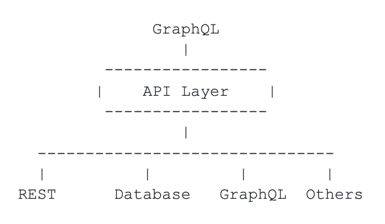

# 为什么后端开发人员也应该爱上 GraphQL

> 原文：<https://thenewstack.io/why-backend-developers-should-fall-in-love-with-graphql-too/>

对于前端开发者来说，GraphQL 代表一个 step 函数。首先，它是一种直观的后端数据查询语言，为开发人员发出请求提供了单一端点。其次，GraphQL 带来了效率，因为它避免了多个后端调用。此外，优秀的开源工具和自我文档改善了开发人员的体验——不再需要阅读笨重的 OpenAPI 文档。

因此，毫不奇怪，行业组织和开发人员采用调查预测，在未来三年内，将有超过一百万的开发人员以某种形式使用 GraphQL。

但是如果你，作为一个后端开发人员，看着它说，“这是我的另一个时尚和另一个噩梦”，让我花几分钟告诉你为什么它对你来说也是一个优秀的技术。

## 后端团队有顾虑

 [阿南特·金格兰

Anant 是 StepZen 的创始人兼首席执行官，step Zen 是一家初创公司，采用新的方法来简化开发人员访问数据的方式，以增强数字体验。Anant 的职业生涯跨越了 IBM Fellow、IBM 信息管理部门的 CTO、Apigee 的 CTO 和 Google Cloud 的产品负责人，他的职业生涯一直处于数据库、机器学习和 API 创新的前沿。在 StepZen，Anant 正在享受创建一家公司，将他对这些技术的热爱结合在一起，以简化、加速和扩展前端开发。](https://www.linkedin.com/in/anantjhingran) 

我们来设定一下背景。在我们与开发人员的交谈中，我们听到了以下担忧:

*   首先，我和我的团队都不具备构建 GraphQL APIs 的技能。
*   GraphQL 代表了一种新的折衷向量。我们封锁了 SQL 注入，然后休息，现在我不得不担心别的事情？
*   GraphQL 中当前的工具使得混合业务逻辑和声明性逻辑变得非常容易，这是一种反模式。
*   最重要的一点是:我在构建 REST 端点上已经投入了多年，那么我需要扔掉它，从头开始吗？

这些担忧是有道理的，但正如任何新技术经常出现的情况一样，现实并不像看上去那么糟糕。此外，服务于 GraphQL 是一个动态的软件开发环境，GraphQL Mesh 等开源工具和 Apollo、Hasura 和 StepZen(我工作的地方)等供应商开始解决这些问题。

但是，尽管消除担忧是必不可少的，但更重要的是考虑 GraphQL 对于后端开发人员构建 API 来说是否是一种好的甚至健壮的技术。或者只是前端团队要求她提供的东西？我认为答案是响亮的肯定，GraphQL 是后端团队的优秀技术。

## 后端团队必须处理各种后端数据源

后端开发者的核心问题是他们有后端！而且不是一个，不是两个，而是几十个甚至上百个。数据的分裂趋势超过了任何统一的力量！因此，问题变成了您必须生成一致的 GraphQL API，即使后端都是不同的。

不仅如此，数据必须混合和匹配。

[](https://cdn.thenewstack.io/media/2021/07/7df997bf-screen-shot-2021-07-17-at-6.57.15-am.png)

因此，您构建的 API 层需要具有以下特征:

*   能够混合和匹配来自 REST 或 GraphQL 的 JSON、来自 SQL 数据库的表格结果和来自老一代后端的 XML。
*   连接这些点的能力:给定 X，找到 y。例如，给定一封“客户的电子邮件”，返回“客户订单的交付状态”
*   最常见用例的抽象。例如，“一个`customer`是一个`customer`，不管提供数据的后端是什么”，并在必要时获取关于客户的详细信息——例如，“付费客户有相关的信用卡信息，所以也检索该信息。”
*   自动生成的文档和自省功能。

让我们详细阐述其中的每一个。

## 混合和匹配响应

JSON，或者某种层次化的表示，似乎是 API 层内部合适的表示，因为它是来自后端的最常见响应的超集。(我们可以很容易地将 XML 转换成 JSON。)但事实证明，连接不同的响应从 GraphQL 结构中获益匪浅。

例如，假设您想要提供“使用地址+日期调用天气将天气添加到交付状态”的功能需要使用从交付后端提取的值来“查询”天气后端的能力。所以你要的是:

```
type  Delivery  {
  address:  String
  status:  String
  deliveryDate:  Date
  ...
}
extend  type  Delivery  {
  weather:  Weather  #using query weather(address:String!, date: Date!)
}
type  Query  {
  deliveryStatus  (trackingId:  String!):  Delivery
  weather  (address:String!,  date:  Date!):  Weather
}

```

实际上，您正在使用 GraphQL 查询功能缝合两种类型——`Delivery`和`Weather`。首先，我们使用`extend`子句指定一个新字段`weather`应该添加到类型`Delivery`中。这种拼接允许关注点的分离。您可能会看到这种被称为“联合”的“拼接”功能

其次，也是更重要的一点，最好使用 GraphQL 的查询功能进行连接。因此，在这种情况下，通过调用 GraphQL 查询(`weather`)并向其传递正确的参数，将`Weather`连接到`Delivery`。

可能有其他方法来构建混搭中间件，但是使用 GraphQL 构造可能是最简单和最干净的方法。

## 将这些点联系起来的能力

GraphQL 为前端开发人员提供了一种奇妙的方式来连接这些点。让我们举一个例子，一个开发者正在建立一个电子商务网站。她可能正在制作一个用户身份已知的页面，但是她还想获得该用户订单的交付状态。因此，她可能会构建一个如下所示的查询:

```
{
  deliveryStatus  (email:  String!)  {
    status
    deliveryDate
}

```

她不知道也不关心，为了支持这个查询，必须有人将`Customer`、`Order`、`Lineitem`、`Shipment`和`Delivery`之间的点连接起来。

所以在幕后，上面的查询可能需要被翻译成这样:

```
{
  deliveryStatus  (email:  String!)  {
    customerInfo  {
      orderInfo  {
        lineitemInfo  {
          shipmentInfo  {
            deliveryInfo
          }
        }
      }
    }
  }
}

```

换句话说，支持开发人员使用的直观查询就是构建一些抽象其他 GraphQL 查询的其他查询。此外，如果您的内部中间件内置了 GraphQL 的概念，这将非常简单。

## 抽象和细节结合在一起

您有两个后端，一个管理免费计划的客户，另一个管理付费计划的客户。虽然两者可能有许多共同点，但它们也可能有许多不同的功能。

在一个简单的例子中，处理免费计划客户的后端可能有一个`expiry`日期，处理付费计划客户的后端可能有一个与客户相关联的`creditCard`。设计一个两者结合的接口是一场噩梦，大多数时候，记录会导致大量的空值。但是，另一方面，根据最小公分母进行设计似乎也不正确，因为这两个系统之间的差异被忽略了。

GraphQL 有一个很好的使用片段的机制，开发者可以发出这样的查询:

```
{
  customer(email:  "john.doe@example.com")  {
    name
    address
    ...  on  Free  {
      expiry
    }
  }
}

```

片段允许开发者在需要的时候处理抽象概念(`name`，`address`)，但是在必要的时候深入细节(`expiry`)。作为后端开发人员，这太棒了。你有一个没有被简化到最小公分母的 API。或者更好地说，你有一个 API，在那里你可以完全控制你所公开的抽象和细节。随着更多的后端上线，或者随着需求的变化，开发人员可以调整抽象和细节之间的界限。

## 文档的自动生成和自省能力

OpenAPI 太棒了。它会带来来自不同公司的优秀博士，比如 SmartBear、Redoc 和其他公司。邮递员也可以帮助生成文档。然而，GraphQL 将文档带到了一个新的高度。我已经很久没有读过 GraphQL API 文档了。并不是说它们不存在。但老实说，他们是不需要的。这有两个原因:

*   GraphQL 支持自省。所以有工具——而且有很多——可以内省后端并确定它所暴露的能力。我非常喜欢 GraphQL，但这是一个让我兴奋不已的特性。许多基于 REST 的 API 都附带了由 OpenAPI 规范、Postman 集合或其他什么生成的文档。尽管如此，它们都被设计成由开发人员进行交互，并且自省能力已经丧失。
*   是的，通过 REST API 的交互文档与它进行交互是有趣且有帮助的。但是像失眠症、GraphQL 和 GraphQL Playground 这样的工具的免费提供使得 GraphQL 端点的交互性对于开发者来说更加直观。

作为后端人员，即 API 提供者，您不希望仅仅构建 API，您希望构建直观且易于探索、测试和学习的 API。GraphQL 自省，以及开源工具，把这带到了一个新的水平。随着 API 的变化，您不再需要花费时间来纠正文档中的错误或跟上文档。相反，GraphQL APIs 自动显示为测试驱动、注释等等。

## **总结**

作为负责构建 API 的人，其他人(甚至是你！)的用途，它只是用 GraphQL 做得更好。GraphQL 帮助您向用户交付更直观的 API。将功能缝合在一起有助于您有效地混合和匹配来自后端的响应。GraphQL 片段有助于抽象和细节的连续性，自省和自我文档化功能可以节省您的时间。

我在 IBM 做 SQL 已经二十多年了。我在 Apigee 和 Google 做了将近十年的 REST APIs。因此，我坚信 GraphQL 尽管古怪，但它是正确的，不仅对前端开发人员如此，对那些工作就是收集和小心暴露后端的人也是如此。

正如你所猜测的，我们在 StepZen 正在将这些观察构建到我们的软件中。试试看。在 stepzen.com/signup 的[报名是免费的。](https://stepzen.com/signup)

<svg xmlns:xlink="http://www.w3.org/1999/xlink" viewBox="0 0 68 31" version="1.1"><title>Group</title> <desc>Created with Sketch.</desc></svg>