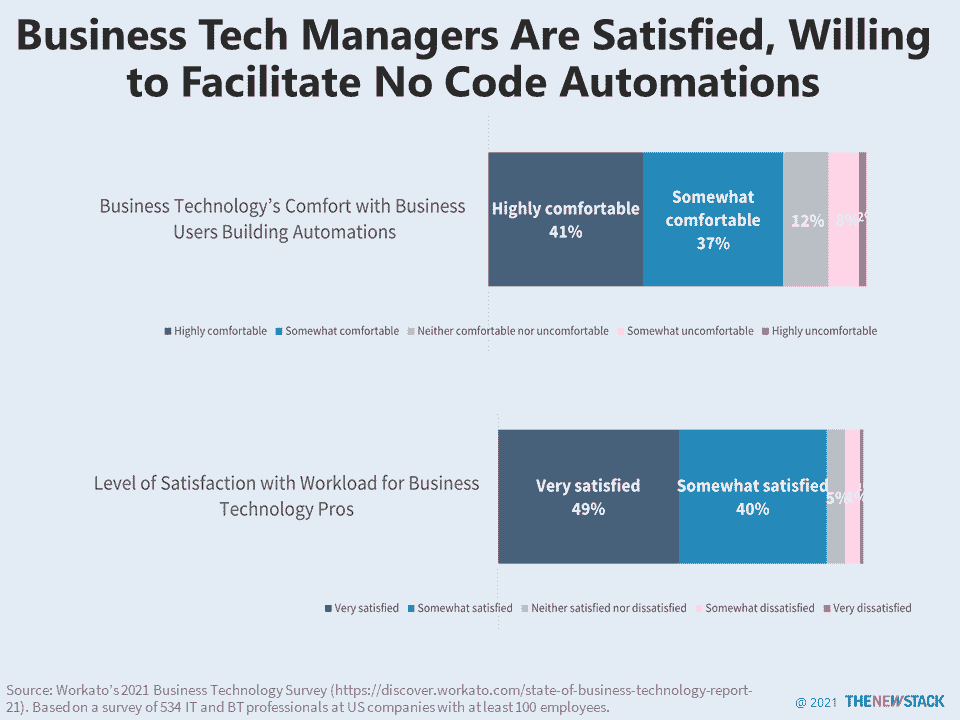

# 为什么企业希望实现“无代码”和“低代码”自动化

> 原文：<https://thenewstack.io/why-businesses-want-to-enable-no-code-and-low-code-automation/>

商业技术的管理者(例如，Salesforce、Slack、Gmail、Workday)被激励去推动新一波的“无代码”和“低代码”开发。根据 Workato 的《2021 年商业技术状态报告》( State of Business Technology 2021 )( T1 ), 51%的人表示他们面临的最大挑战是使用工具完成工作需要多少时间。尤其是在较小的公司，业务技术经理负责回答组织的所有日常 IT 问题，以及供应设备和许多其他职责。他们经常与高级业务用户协作，帮助实现流程自动化。他们亲眼目睹了业务流程是如何管理的，78%的人仍然允许最终用户构建自动化。

到目前为止，正在实施的顶级自动化是 ITSM、帮助台、管理其他自动化，以及将客户支持升级到工程。这可能解释了为什么 92%的商业技术专家对他们的工作生活平衡感到满意，而 89%的人对他们的工作量感到满意。希望所有这些好处不会让我们容易忽略与数据集成、安全性和应用程序维护相关的潜在缺陷。

<svg xmlns:xlink="http://www.w3.org/1999/xlink" viewBox="0 0 68 31" version="1.1"><title>Group</title> <desc>Created with Sketch.</desc></svg>