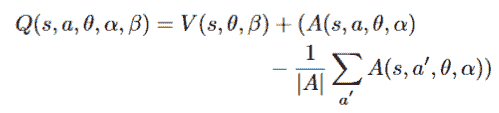

# 为什么《愤怒的小鸟》AI 打不过人类？

> 原文：<https://thenewstack.io/why-cant-ai-beat-humans-at-angry-birds/>

七年来，人工智能研究人员一直在努力应对一个不同寻常的挑战:向卡通猪射击卡通鸟。一年一度的比赛测试他们制作一个能玩流行视频游戏《愤怒的小鸟》的人工智能代理的能力。

然后最好的人工智能代理与人类竞争对手展开较量…

本月，两名研究人员[在 arXiv.org 上发布了一篇论文](https://arxiv.org/abs/1910.01806)，描述了他们的旅程，以及他们一路上学到的东西。这是所有人工智能研究人员在试图将尖端技术应用于一些非常人性化的努力时所面临的怪异障碍的一个例子。世界各地的团队正在解决更复杂的问题，坚持不懈地克服通往我们闪亮的技术增强的未来的道路上的障碍。但是在一个我们被要求信任让我们在高速公路上行驶的软件的世界里，我们甚至能让它成功地玩一个视频游戏吗？

这比看起来要复杂。该论文的作者之一叶卡捷琳娜·尼科诺娃(Ekaterina Nikonova)目前是澳大利亚国立大学的博士生，她告诉我，例如在国际象棋中，每一回合的选择数量都要少得多，而且结果是事先可知的，因此更容易提前计划。围棋也是如此——但《愤怒的小鸟》的卡通世界远没有那么可预测。

因此，Nikonova 与另一个大陆的研究员 Jakub Gemrot 合作，Jakub gem rot 是布拉格查尔斯大学捷克共和国游戏开发讲师。他们一起从捷克科学基金会筹集了一些资金，然后花了接下来的六个月进行合作。他们的目标是参加一年一度的“ [AIBirds](https://aibirds.org/) ”比赛，参赛者使用 Java、C、C++或 Python 创建自己的自主愤怒的小鸟游戏代理。(对于初学者，他们甚至提供了一个基本的 Java 游戏框架来帮助参与者入门。)在他们的论文中，两位勇敢的研究人员描述了他们如何仔细地描述了比赛场地的状态和可用的行动，然后根据所取得的分数纳入了一个奖励系统。

## 弹弓效果

然后，他们应用了可靠的深度强化学习策略，使用了基于谷歌 DeepMind Deep Q-network 的架构，该架构因在几个雅达利游戏的实验中使用而获得了一些声誉。这些动作是 1 到 90 之间的数字，代表愤怒的小鸟被发射的角度。是的，这需要测试 90 种可能的组合，但正如论文指出的，“即使是 1 度也会产生巨大的差异。”实际上，他们观察到 49 度的击球产生了平庸的结果，而 50 度的击球产生了新的高分。根据他们的论文，实验者曾试图以更大的 2 度增量调整该角度，但它“极大地降低了整体代理的性能。”

让鸟瞄准猪的计算

他们还必须计算弹弓的橡皮筋被拉回后的释放点，因为这也会影响卡通鸟的轨迹。他们完全避免了一只白鸟投掷卡通炸弹的复杂关卡，这需要单独点击(因此是完全不同的计算)。最困难的部分原来只是找到足够的训练数据，因为竞争使人工智能代理面临他们从未见过的全新水平。该论文指出，竞争水平是专门设计来消除使用“蛮力”解决水平的人工智能代理，而不是那些已经想出某种人工逻辑来选择目标的人工智能代理。

在他们的研究过程中，他们收集了超过 115，000 张他们的 AI 玩最初的愤怒的小鸟游戏的前 21 关的截图。结果看起来很有希望。在 14 级的时候，他们的代理甚至能够持续获得比两个顶级人工智能代理更高的分数。

“起初我们认为这是一个错误，”他们的论文报道，“或者是一个幸运的结果……”满怀希望，他们随后测试了他们的人工智能，测试对象是一些具有不同程度玩“愤怒的小鸟”经验的志愿者。该论文指出，人工智能必须与人类玩家竞争，“对他们来说，在复杂的物理 2D 世界中推理和规划似乎很容易。”他们将他们的代理人在所有 21 个级别上的得分总和与其人类对手进行了比较。结果呢？

在四分之三的情况下，“它输给了人类……”

这一定很令人失望。回忆起后来的经历，Nikonova 告诉我，至少他们的代理人输给了人类“只是相对少量的点。”即使在第 14 级，代理人取得了比顶级人工智能以往任何时候都高的分数——它仍然输给了人类玩家。文章最后乐观地指出，他们仍有办法提高自己的表现。

然后他们带着他们的 AI 去了 2018 年的比赛。

Nikonova 记得那个重要的日子终于到来了。“对我们来说，这是一个非常紧张的时刻，看到我们的代理人与其他代理人在新的游戏级别上进行直播比赛，这些新的游戏级别对人工智能来说特别困难。”这是一个人工智能竞争者拥有令人生畏的名字的世界，如 BamBirds 和 AngryHex，他们公布了自己的创造——“DQ 鸟”最终，他们的人工智能代理在四分之一决赛中排名第六。“尽管我们的代理能够从训练集中掌握 21 个级别，并能够从验证集中解决以前从未见过的更大难度的级别，但在比赛中解决所有 8 个级别仍然是一个问题，”他们的论文报告说。

这可能有助于有更多的水平进行训练，但他们无法得到一个官方的愤怒的小鸟水平发电机。他们的论文还指出，另一个团队使用了《愤怒的小鸟》游戏的克隆版来生成 100 多个训练关卡——却发现其物理引擎与《愤怒的小鸟》中使用的略有不同，导致他们在四分之一决赛中获得第九名。

他们的论文给出了明确的结论。"对于人工智能代理来说,“愤怒的小鸟”游戏仍然是一项艰巨的任务."但 Nikonova 仍然将整个六个月描述为“一次真正有趣和好玩的经历。”

但那是 2018 年。那么在*这*年的比赛中发生了什么？

这场大对决于 8 月在中国澳门举行的国际人工智能联合会议期间举行。“今年，参赛的人工智能智能代理的性能有了明显的提升，”比赛官方网站上的一个帖子解释道。他们在另一个页面上开玩笑说，“这可能是[打败 AI](https://aibirds.org/call-for-participation.html) 的最后机会，并且很可能成为最后一个赢得这项挑战的人类。”

两名决赛选手“用一些出色的镜头展示了非常令人信服的表现。”

这篇博文开玩笑说，人工智能面临着严峻的挑战，因为人工智能研究人员“到目前为止在玩愤怒的小鸟方面非常有经验。”在四级考试中，成绩最好的是来自阿尔伯塔大学的内森·斯特蒂文特，总分 228，270 分。

## 人类的最后一战

根据这场比赛的博客，在所有的队伍中，小鹿斑比艾执行了“整场比赛的最佳射门”。这太不可思议了，只用三只鸟就能实现这种级别的解决方案。”每一个完成关卡的玩家都需要一只额外的鸟。但是，用一个人类的术语来说，人工智能窒息了。“只需要两次更简单和直接的击球就可以完成即使是初学者现在也能完成的水平。但是斑鸟失败了。他们用剩下的鸟向一些想象中的猪开火。而且没解决水平。”

“我们简直不敢相信……在我们这么多观众面前表演，经纪人似乎很紧张。”

事实上，这篇博文称游戏代理的表现是“一场灾难”面对四个专门为比赛创造的全新关卡，四个顶级人工智能中只有*一个*要完成*任何一个*关卡——正好解决一个关卡。"在一场精彩的比赛之后，多么令人失望."

他们的结论？“在《愤怒的小鸟》中，人类仍然击败了人工智能，但人工智能似乎没有更进一步。人工智能还有很长的路要走，才能掌握这个非常困难的问题，这个问题比国际象棋或围棋等看似困难的游戏更接近现实世界的问题。”

Nikonova 告诉我，人工智能每年都在进步，“我坚信在不久的将来，人工智能在《愤怒的小鸟》中的表现会超过人类玩家。我并不孤单。”她引用了《人工智能研究杂志》上的一篇论文，这篇论文报道了[对机器学习研究者](https://arxiv.org/pdf/1705.08807.pdf)的大规模调查结果。“研究人员认为，在 45 年内，人工智能有 50%的机会在所有任务中超越人类，”该论文报告说，“在 120 年内，人工智能有 50%的机会自动化所有人类工作。”他们还预测，人工智能将在 2049 年前写出一本畅销书，并在 2053 年前在外科手术方面超过人类，同时在 2027 年前在卡车驾驶能力方面超过人类。甚至有一个表格，他们预测*何时*人工智能将在各种任务中击败人类。

是的，有一项任务预计将在接下来发生，比所有其他任务都要早。在愤怒的小鸟上打败人类。

但是还没有发生。

* * *

# WebReduce

来自 Pixabay 的 M. Maggs 的特写图像。

<svg xmlns:xlink="http://www.w3.org/1999/xlink" viewBox="0 0 68 31" version="1.1"><title>Group</title> <desc>Created with Sketch.</desc></svg>