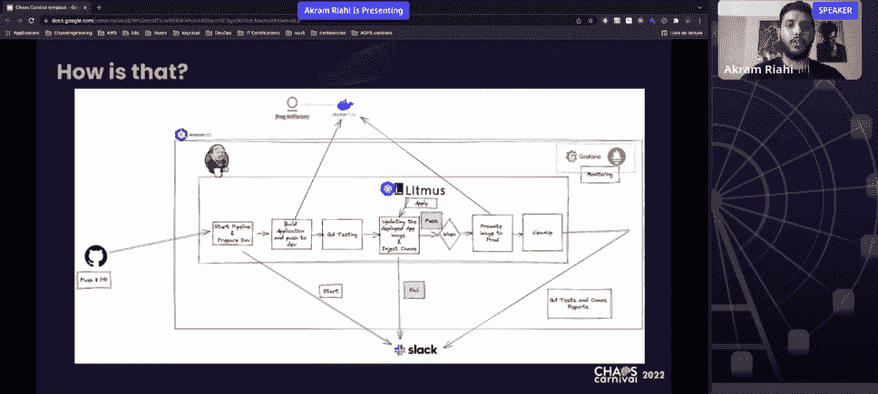
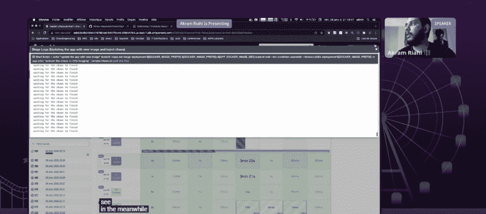
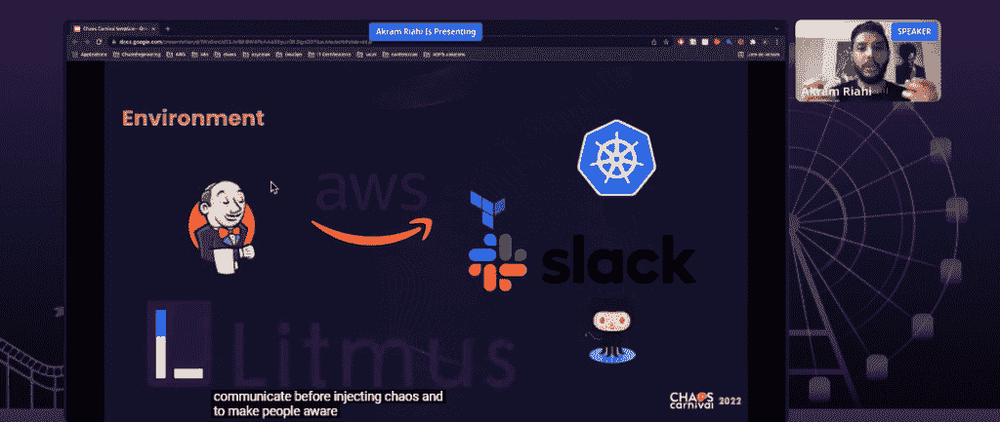
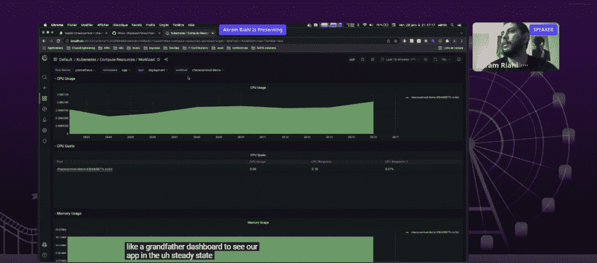
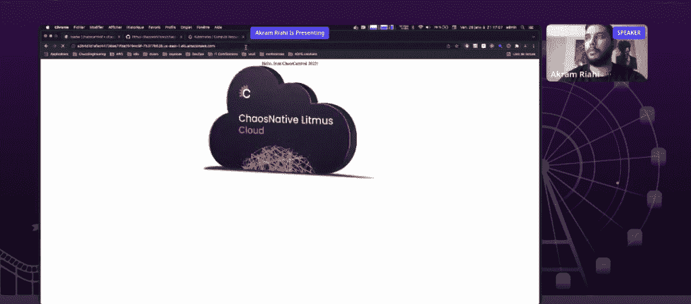

# 为什么詹金斯的混沌工程比你想象的要容易

> 原文：<https://thenewstack.io/why-chaos-engineering-for-jenkins-is-easier-than-you-think/>

[混沌工程](https://thenewstack.io/chaos-engineering-for-cloud-native/)对于开发者来说，既可以代表恐惧，也可以代表希望。对于那些还没有在他们的[持续集成/持续交付(CI/CD)](https://thenewstack.io/category/ci-cd/) 管道中实现混沌测试的人来说，他们可能担心混沌工程会引入软件发布延迟。

将失败引入模拟或真实生产环境以测试弹性的混沌实验，可能会被视为更多的测试——在最坏的情况下，可能会减慢开发人员的速度。当 [Kubernetes](https://thenewstack.io/category/kubernetes/) 环境已经非常复杂时，这些实验也可能被视为在将代码提交给 Jenkins 管道时潜在地增加了更多的复杂性。

然而，开发人员也不想测试他们的应用程序如何在隔离的环境中运行，只是在将代码提交给 Jenkins 后，让它们在生产环境中崩溃或无法正常工作。

有了合适的工具和流程，混沌工程可以直接提高软件部署速度，并且可以在应用程序在生产中崩溃时降低故障率和平均恢复时间(MTTR)。

在 [ChaosNative 的](http://cloud.chaosnative.com/?utm_content=inline-mention)年度用户大会 [Chaos Carnival 2022](http://chaoscarnival.io) 期间，[数据访问平台提供商 WeScale 的云构建者 Akram Riahi](https://www.linkedin.com/in/akram-riahi-323892123/?trk=public_post_follow-view-profile&originalSubdomain=fr) 展示了 chaos engineering 如何使用 Jenkins 管道，使用开源的 [LitmusChaos](https://github.com/litmuschaos/litmus) 作为框架。

## 如何将混乱注入 DevOps 管道

Riahi 说，CI 开发阶段的传统测试用于“寻找我们已经知道的东西——我们有时也有权对我们不知道和不期望的问题感到惊讶，以提高应用程序的弹性”。“出于这个原因，我们必须让开发人员能够随心所欲地在他们的 DevOps 管道中注入混乱。”

Riahi 展示了开发人员如何通过 Jenkins 管道上的一个简单的 pull 请求“轻松地注入混乱”。正如他所描述的，做起来并没有那么复杂。

“这里的问题真的不难:我们有足够的知识来制造混乱吗？你知道你正在推进大量必须具有弹性的代码，你怎么能每天处理它呢？”里亚希问道。“我们能让开发者或(网站可靠性工程师)更容易做到这一点吗？嗯，答案当然是肯定的。”

除了使用 LitmusChaos 作为框架的 Jenkins 管道用于通过 pull 请求注入 Chaos 之外，演示中的部署环境包括带有 Terraform 的 [Amazon](https://aws.amazon.com/?utm_content=inline-mention) Elastic Kubernetes 服务 [(EKS)](https://docs.aws.amazon.com/eks/latest/userguide/what-is-eks.html) 。

Slack 用于警告，因为正如 Riahi 所描述的，强烈建议向所有 DevOps 团队成员传达注入混乱的过程可能会造成一些性能问题，甚至在实际生产环境中造成爆炸半径的故障。

GitHub 钩子被用来触发詹金斯管道。对于监控和可观察性指标，Grafana 和 [Prometheus](https://prometheus.io/) 用于监控堆栈。

在演示过程中，一旦管道用新图像更新了应用程序，LitmusChaos 就被应用。LitmusChaos 然后在 Kubernetes 环境中应用了为混沌实验设计的工作流。

生成的结果不是通过就是失败。如果出现故障，通知会通过 Slack 自动发送，提示开发人员重新开始工作，为应用程序构建更多弹性。

开发人员不应该害怕混沌实验，而是应该拥抱它，尤其是当事情失败的时候。“利用混沌工程……我们将会遇到很多失败，”里亚希说。“我们不必害怕它们，因为它们对最终在应用程序中构建更强的弹性是有指导意义的”。

要了解更多细节，请点击这里查看 Riahi 的演示:

[https://www.youtube.com/embed/fb8CzFZ7cPg](https://www.youtube.com/embed/fb8CzFZ7cPg)

视频

<svg xmlns:xlink="http://www.w3.org/1999/xlink" viewBox="0 0 68 31" version="1.1"><title>Group</title> <desc>Created with Sketch.</desc></svg>