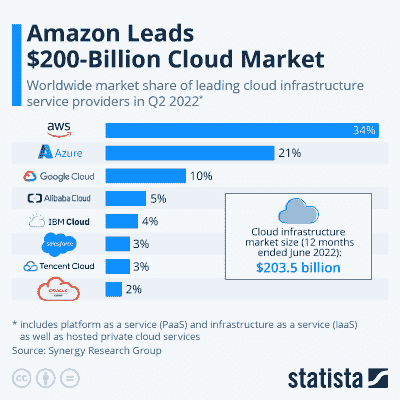
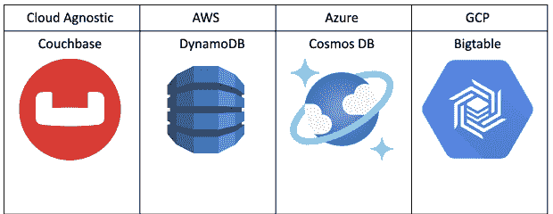

# 为什么云锁定越来越严重

> 原文：<https://thenewstack.io/why-cloud-lock-in-is-getting-worse/>

几乎我们所做的一切，无论是线上还是线下，都是由云驱动的。无论是在当地超市购买食品杂货，播放你最喜欢的电视节目，还是打开电子邮件，你都在使用云。

[云生态系统](https://thenewstack.io/category/cloud-native/)的计算能力、存储能力和无与伦比的便利性正在刺激难以置信的采用。今天，世界上 50%的公司数据存储在云中，仅今年[就创造了 1780 亿美元的收入。](https://explodingtopics.com/blog/cloud-computing-stats#top-cloud-computing-stats)

随着云计算变得越来越普遍，它的竞争也越来越激烈，三大提供商——亚马逊网络服务(AWS)、谷歌云平台(GCP)和微软 Azure——都在争夺更大的份额。

[AWS](https://www.statista.com/chart/18819/worldwide-market-share-of-leading-cloud-infrastructure-service-providers/) 占据了 34%的市场份额，但其最接近的竞争对手正在快速增长。这需要战略性的产品改进来占领更多的市场。

在初期，该领域主要以基础设施即服务(IaaS)的形式存在，使用户能够轻松访问表面上无限的硬件资源，而无需维护复杂而昂贵的技术。从那时起，主要的云提供商已经成为与硬件提供商一样多的软件解决方案提供商，发布越来越多的在其云中运行的封闭应用程序解决方案，将其软件即服务(SaaS)产品定位于其 IaaS 产品之上。提供的不同 SaaS 解决方案回答了过于宽泛的技术需求选择，三位一体都有自己的定制实现，相互竞争。

## 我们是如何来到这里的

从历史上看，尽管信息非常不透明，但主要平台之间的底层硬件在很大程度上仍然是同质的，这完全是因为英特尔、AMD 和 Nvidia 提供的产品。这使得基于成本的差异化成为主要的收入策略，推动了像 spot 和 preemptible instances 这样的创新。但是，提供商需要新的方法来吸引增长，捆绑和发布定制的特定于平台的软件提供了一个令人兴奋的竞争途径。

客户现在必须在特定云提供商提供的看似相似的软件解决方案或第三方非锁定软件解决方案之间做出选择。

NoSQL 数据库产品精选

## 传统风险

从表面上看，现有的 GCP 客户选择 Bigtable 是有道理的，因为基础设施和计费已经存在。使用 Bigtable，他们可以获得熟悉的整合体验。然而，这掩盖了云锁定的隐性成本。大多数人都熟悉这些缺点:

*   性能:在追求简单的过程中，很容易忽略性能和卓越的特性。
*   价格:一旦您依赖单一云供应商，您就无法再利用竞争对手的基础架构来节省成本。
*   质量:云提供商很大，有数十种 SaaS 产品。一般来说，与专用的云无关的产品公司相比，他们无法将同样多的开发资源投入到任何单一产品中。
*   单点故障:如果某些东西影响了云基础设施和软件的可用性，过度依赖单一供应商会让您面临难以置信的风险。

然而，行业趋势正引导我们回到差异化硬件，这在与单一提供商合作时带来了新的无与伦比的性能风险:下一代芯片。

## 我们要去哪里

随着苹果 M1 芯片的发布，一种新的硅范式被揭开。使用 [ARM 架构](https://thenewstack.io/big-three-in-cloud-prompts-arm-to-rethink-software/)，苹果设计并制造了完全定制的芯片，在客户需要的地方表现出色:

*   难以置信的性能功耗比=无与伦比的电池续航时间
*   视频编码器/解码器引擎=创意人员可以花更多时间进行创作
*   专门构建的 ML 引擎=加速的人工智能(AI)体验

这种功能是苹果芯片特有的，M 系列仅在苹果产品中可用。我们已经进入了专为擅长特定工作负载而设计的专业计算引擎时代。

这一趋势随着谷歌的消费者手机而延续，这些手机现在由新的硅张量线驱动，为机器学习(ML)工作负载提供了令人难以置信的性能。此外，今年，英特尔、英伟达和 AMD 发布了带有专业 AV1 编码引擎的 GPU，这些引擎都是定制设计的，以在一个特定的工作负载上表现出色。这些硬件效率只能在这些产品上实现。

这种模式在云生态系统中也在快速加速。AWS 已经推出了第二代机器学习专用虚拟机，名为 [Trainium](https://aws.amazon.com/machine-learning/trainium/) 。在 Google Cloud Next 2022 上，谷歌展示了其新的虚拟机家族:C3，被称为公共云中第一个运行在第四代英特尔至强可扩展处理器和定制基础设施处理单元(IPU)上的虚拟机，名为 E2000，由谷歌[与英特尔共同设计](https://cloud.google.com/blog/products/compute/introducing-c3-machines-with-googles-custom-intel-ipu)。该芯片仅在 GCP 上市，是他们所谓的工作负载优化基础设施的最新版本。

GCP 还率先推出了超越计算引擎的专用硬件，推出了 Hyperdisk，提供了令人难以置信的存储性能。你不需要成为预言家就能看出这一趋势的走向。云提供商肯定会继续针对一系列工作负载需求快速开发专用硬件。

最终结果很清楚:为了最大限度地提高您自己的应用程序的性能，您需要为正确的工作利用正确的资源。这种新模式可以极大地提升现有应用程序的性能，但前提是您可以访问正确的实例集。如果您已经致力于 AWS DynamoDB，您就不能利用 GCPs 新的 Hyperdisk 存储技术。同样，如果你完全锁定在 GCP，你不能使用 AWS 的 Trainium 实例。在接下来的几年中，那些被锁定在特定云生态系统中的人将会错过重要的性能提升，最终通过破坏他们的产品来损失他们的业务收入和机会。

## 如何应对新的范式

云锁定从未如此危险。为了避免让您的企业面临不必要的风险，请考虑实施以下双管齐下的策略:

### 1.Kubernetes:

Kubernetes (K8s)是领先的开源容器编排平台。作为业界 DevOps 团队的最爱，它允许您使用自己的计算，并轻松扩展/缩减节点和单元(一个或多个容器)以适应应用程序负载。Kubernetes 是 100%云无关的，这意味着您可以使用任何云提供商提供的任何计算，从而获得最适合您需求的计算和硬件。

使用 Kube 从未如此容易，数以千计的在线免费和付费资源将教你基础知识。您还可以通过 [CKA 和 CKAD](https://kubernetes.io/training/) 项目获得认证，以确保您拥有开发云原生应用所需的所有知识。

### 2.与云无关的软件/SaaS:

设置好 Kubernetes 后，下一步是在其上部署最好的软件栈。您的大部分软件栈可能已经支持 Kubernetes，并且已经有了 Docker 容器。如果没有，肯定有一个合适的替代品，将您从特定云生态系统的链条中解放出来。

## Couchbase 支持多云策略

有了 Couchbase 自动操作符 T1，你可以得到一个流行的 NoSQL 数据库，它可以在任何计算机上运行。只需几周时间，你就可以用 Autonomous Operator 准备好 Couchbase 产品。

Couchbase 的内存优先架构实现了令人难以置信的性能。在最近针对 MongoDB 和 DataStax 的第三方基准测试中，Couchbase 在 20 节点集群上的吞吐量显著优于竞争对手，该集群拥有 5000 万条记录，在不到 10ms 的延迟下达到近 100k ops/sec。[点击这里阅读报道。](https://resources.couchbase.com/nosql_comparison_web)

今天就用我们的免费[试用版](https://cloud.couchbase.com/sign-up/)亲自体验一下 Couchbase 吧。

<svg xmlns:xlink="http://www.w3.org/1999/xlink" viewBox="0 0 68 31" version="1.1"><title>Group</title> <desc>Created with Sketch.</desc></svg>