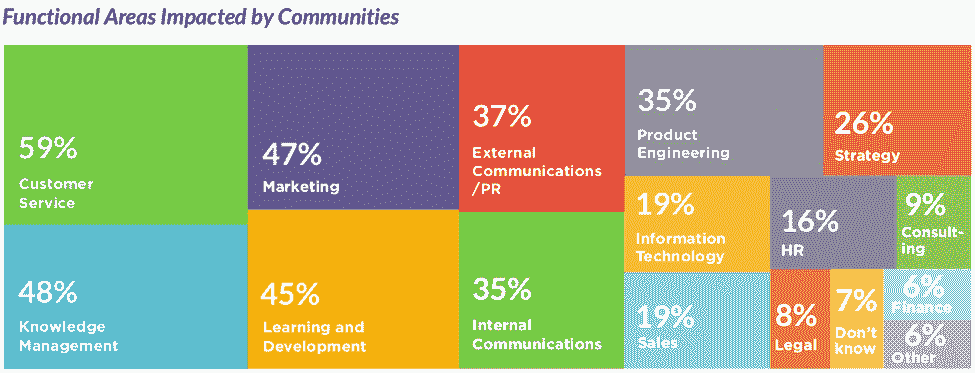
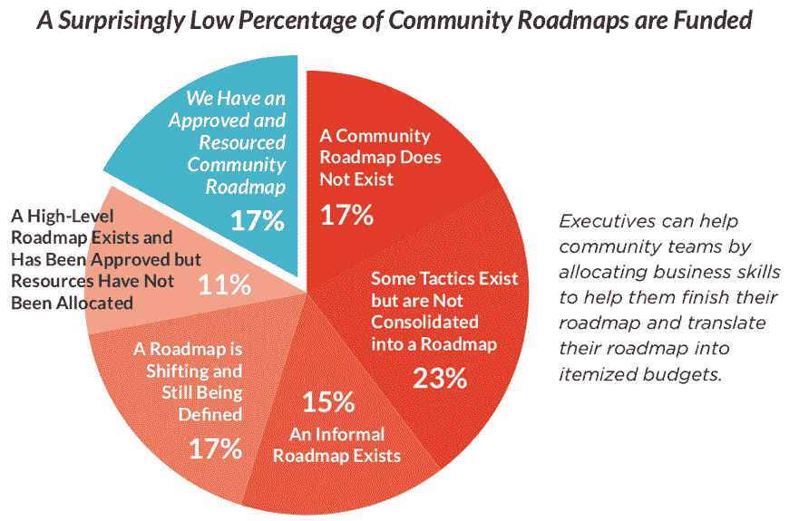

# 为什么社区经理是一份没有前途的工作——以及该怎么做

> 原文：<https://thenewstack.io/why-community-manager-is-a-dead-end-job-and-what-to-do-about-it/>

Stefano MAF fulli

Stefano MAF fulli 是 Scality 的社区营销总监，他的职业生涯是围绕自由软件和开放源码展开的。在他担任社区经理期间，OpenStack 成为发展最快的开源项目。作为 DreamHost 的云营销总监，他成功管理了新产品发布，并提高了云产品的采用率。在业余时间，他在旧金山湾教授帆船运动。

社区经理有职业道路吗？或者这份工作可以作为进入更传统的公司角色的敲门砖？我自己也为这个问题纠结过，以下是我的想法和同事们的经验。

那一天总会到来，而且比你预期的要早。我意识到我不是会议室里最年轻的人，一个问题跃入我的脑海:这是我长大后想做的事吗？我 30 多岁了，头发花白，在一家很有前途的初创公司 Funambol 担任社区经理，并参加了一个紧张的 MBA 夜校项目。在我的组织课程中，从来没有提到“社区管理”是一项功能。我的同学中没有一个人确切理解我在公司价值链中的角色。在完成那门 MBA 课程之前，连我都很难理解什么是价值链，更不用说解释我该如何定位自己了。

作为 Funambol 的社区经理，我向营销副总裁汇报，我的职责是保持营销漏斗的顶部填满。我的目标是进入“意识”层面，或者发现/评估客户生命周期的[阶段](https://searchsalesforce.techtarget.com/definition/Customer-Life-Cycle)，开源是我使用的主要工具。我只想说，我有明确的目标，并且每天都知道我的努力适合公司的目标。

后来我换了工作。同样的头衔，但我在一个非营利组织(OpenStack Foundation)向工程部门报告。这一次，我在精神上将自己的角色定位为更接近于人力资源部门的工作人员:我的目标是让工程师们开心、高效，并确保更多的人进入社区并保持活跃。

## 那么，什么是社区经理呢？

当今就业市场的一个显而易见但又至关重要的事实是，要时刻思考:下一步是什么？向上看，似乎很明显社区经理是一个不成功的人。在非营利、开源组织之外，这个头衔有太多不同的含义。高级职位在当地也很稀缺。

看看这些职位描述——在 LinkedIn 上快速搜索会发现大量的角色和职责:

*   MapR，一家拥有开源产品的公司:
    *   MapR 的数字营销团队正在寻找一个充满活力和积极主动的人，他可以推动我们的开放用户社区[…]你将利用 MapR 数据科学家、工程师和其他技术专家在世界各地讲述、教授和传播不同的大数据技术。此人将直接向数字参与副总裁汇报。
*   苹果公司:
    *   我们帮助客户从他们的苹果产品和服务中获得最大收益，方法是提供对整个苹果产品用户和爱好者社区的支持资源的访问。作为倡导项目团队的一员，你将支持苹果支持社区(discussions.apple.com)努力推动苹果公司与其客户之间丰富而重要的互动
*   住宅设施:
    *   为 Equity Residential 工作意味着成为社区(员工和居民)的一部分，努力提供最好的公寓生活，大胆谈论创新的新想法，并在我们共同生活和工作的方式中激发创造力……您将指导您的物业的销售活动、租赁管理和维护计划

三个职位头衔相同，一个向市场营销部门汇报，一个向支持部门汇报，一个向业务开发部门汇报。谈综艺！

### 社区影响大，资金少，清晰度低

从积极的一面来看，[社区圆桌会议](https://communityroundtable.com/)的[最新报告](https://communityroundtable.com/what-we-do/research/the-state-of-community-management/)显示，无论社区计划在组织中处于什么位置，社区计划都会对许多职能产生巨大的积极影响。

来源:社区圆桌会议-2018 年社区状况报告

该报告指出，“例如，属于客户服务部的社区项目不仅为营销(91%的时间)和知识管理(59%的时间)带来好处，还为学习和发展功能(35%的时间)带来好处。”

接下来，积极的消息是，社区圆桌会议强调了大多数社区管理计划的深层缺陷:超过 50%的社区缺乏最基本的业务管理机制，如确定的业务问题声明。超过 70%的社区项目缺乏可衡量的策略，80%的项目缺乏图表化的用例，只有 23%的项目能够衡量社区的投资回报率。一个可怕的数字是，只有 17%的抽样社区分配了资源。

来源:社区圆桌会议-2018 年社区状况报告

这 17%表明只有少数社区经理和主管有机会在工作面试和简历中展示他们的技能。

没有可衡量的目标、路线图和资源，就很难向招聘人员展示你的价值，或者争取加薪和升职。拥有一份“社区经理”的工作意味着你需要建立自己的阶梯来提升薪水和责任。这就是为什么我把我的求职导向一个更清晰的营销职能。幸运的是，我设法跳到了 DreamHost，担任营销总监，然后到了我目前在 Scality 的职位，也有类似的头衔。

职业道路——尤其是在科技行业——从来都不是直线的，但大多数角色都有可预测的轨迹。例如，在像通用电气这样的大型组织中，传奇首席执行官杰克·韦尔奇的职业生涯从初级化学工程师到塑料部副总裁仅用了八年时间。从那时起，他在这家巨型企业集团的许多其他部门四处奔波，直到在公司工作了 20 年后，董事会投票选举他为首席执行官。

### 除了脱离社区管理，真的没有向上的路吗？

对我自己来说，我决定退出“社区管理”以获得专业发展，并投身市场营销，但这不是唯一的选择。在最近的[社区领导峰会](http://www.communityleadershipsummit.com/schedule/)上，我与人们交谈得知，至少有三家公司正在努力在其人力资源系统中建立社区轨道。好消息是:一些大公司已经修改了他们的公司人力资源系统，允许社区经理在组织内部有一个清晰的职业道路。一个明显的例子是[谷歌](https://careers.google.com/jobs)在项目管理和开发者拓展功能方面的社区职业。Red Hat 也在这方面做了工作，希望它能更广泛地发布它的经验。

峰会上的对话以一个非常积极的基调结束:每个人都同意社区管理的跨职能方面是一个巨大的优势。为自己设定可衡量目标的聪明人有很好的机会增加他们的薪水和责任。他们比大多数扮演“经典”角色的人有更好的机会让其他人知道他们的出色工作，这是晋升机会的巨大乘数。对于成功的职业发展，我对社区经理的建议是:

*   接受经典商业学科的教育，如营销、金融、项目管理、组织、生产:学习不同角色的人所说的语言将有助于你理解他们，并更有效地工作。
*   永远记住你能给公司带来什么价值:问问你自己和你的经理这种价值是什么，当人们问你做什么的时候，你要随时准备好引导他们
*   不要再说你是一个养猫的人(或者其他可爱的描述):作为一个赛格威，不要拿你的工作开玩笑。同事们已经不知道你到底是做什么的了，不要给他们更多的元素来贬低你的专业性。

让我们继续这个话题:如果 Jack Welch 从一名社区经理开始他的职业生涯，没有业务问题陈述，也没有衡量 ROI 的方法，他会这么快被提升为他的部门的副总裁吗？[给我发推文](https://twitter.com/smaffulli)或者在下面评论。

<svg xmlns:xlink="http://www.w3.org/1999/xlink" viewBox="0 0 68 31" version="1.1"><title>Group</title> <desc>Created with Sketch.</desc></svg>