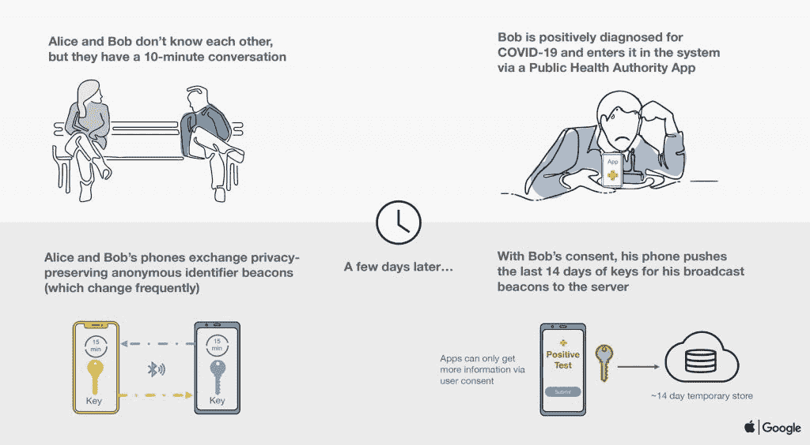

# 为什么新冠肺炎联系人追踪需要分布式数据库

> 原文：<https://thenewstack.io/why-covid-19-contact-tracing-requires-a-distributed-database/>

随着新冠肺炎全球疫情病毒继续在人群中传播，一场关于追踪病毒的最佳方法的讨论开始了。无论如何，美国提出的一个建议是通过使用每个人的手机追踪联系人。这种追踪人们活动的方法在东亚很有效。这个想法是，如果用户与其他携带病毒的人接触，他们将通过电话得到通知，并可以采取适当的预防措施，如呆在家里并戴上口罩。

那么构建这样一个数据收集系统对数据库有什么要求呢？鉴于有各种各样的开源分布式数据库可以轻松完成这项工作，乍一看，这对于任何 RFP 来说都是一个简单的复选框，[Patrick McFadin](https://twitter.com/PatrickMcFadin),[Datastax](https://www.datastax.com/)Apache Cassandra 的首席传道者指出。

当然，保留一个包含这些信息的中央数据库已经引起了隐私方面的担忧，所以当谷歌和苹果[提议](https://www.wired.com/story/apple-google-bluetooth-contact-tracing-covid-19/)为他们各自的移动设备整合[蓝牙驱动的跟踪软件](https://www.apple.com/covid19/contacttracing)——定于下个月推出——他们很聪明地设计了这一点，这样手机自己就可以完成繁重的工作，而不是依赖于一些中央数据库。

他们小心翼翼地没有说明哪些政府机构或其他实体将实际收集和管理数据。相反，他们会提供电话管道，以便其他实体可以解析数据。

苹果和谷歌的架构不涉及追踪用户位置或识别数据。相反，每个设备将为自己创建一个由手机硬件生成的“信标”号。当手机在主人的旅途中与其他设备接近时，它们将共享信标，每部手机都保留一份它们接触过的所有其他手机的列表。

然后，感染病毒的人会主动向应用程序报告自己的状态，应用程序会将其 64 位信标号(由蓝牙芯片生成)和相关时间戳转发到后端数据库，这将是与进行跟踪的组织的第一次联系。可以说，数据库会定期发送一份被感染的按键列表，用户的手机会对照自己的列表检查被感染的按键。

换句话说，“这不是一个真正的数据库问题，”麦克法丁说。数据库将只存储密钥，以及它到达的时间和日期。即使对于整个美国来说，拥有 3.28 亿人口的美国在任何给定的时间内也可能最多只有几十万把钥匙。轻松适用于任何企业级数据库管理系统。

然而，有趣的是谁将收集数据，如果是多个实体，他们将如何协调他们的信息？各州可能会为他们的公民收集数据，或者保险公司也可以这样做。然而，为了使该系统发挥作用，其覆盖面应该尽可能全面。换句话说，这种方法只有通过多个数据收集机构的联合模式才能发挥作用。

麦克法丁指出，这就是拥有分布式数据库(如 Cassandra)将派上用场的地方。

多方可以各自将数据保存在他们自己的 Cassandra 数据库中，但是所有数据库可以共享一个密钥空间，并且每个数据库可以保存由所有数据库收集的所有密钥的副本。

“Cassandra 的工作方式是，一个集群可以有多个数据中心，每个数据中心存储所有数据。假设您想要运行一个跨越两个云的数据库，比如 Amazon 和 Google。你可以在亚马逊建立一个“数据中心”，在谷歌建立一个“数据中心”。当您创建集群时，在 Cassandra 的世界中，您将创建一个键空间，并且该键空间适用于跨越两个数据中心的所有表。所以当你在谷歌数据中心插入数据时输入，它会在几毫秒内出现在亚马逊数据中心，”他说。

该数据库的另一个要求是生成一个列表，列出在过去 14 天内提交的所有身份证明，或官员选择的任何时间窗口。基于时间戳的简单查询可以完成这项工作，尽管 McFadin 承认需要一个非常健壮的服务层，因为数百万部手机会定期请求这些数据。显然，内容交付网络(CDN)在这里会很方便。

## 丰富的数据集

另一个分布式数据库，开源的面向文档的 MongoDB 已经被用于类似的数据收集任务，尽管规模较小，据该公司的发言人说。

波士顿儿童医院使用 [MongoDB 地图集](https://www.mongodb.com/cloud/atlas/efficiency)建立了 [CovidNearYou](https://covidnearyou.org/#!/) 网站，用户可以在该网站上报告当前症状，并且仅通过邮政编码进行识别。这个应用程序为卫生官员提供该地区病毒热点的实时更新。

MongoDB 还托管着约翰霍普金斯大学新冠肺炎数据集的副本，该数据集用于该大学被广泛咨询的美国感染病例跟踪系统。Hopkins 本身提供了一个平面 CSV 文件形式的数据副本，每次更新数据时，必须将该文件作为一个文件下载。MongoDB 自己的副本只能查询更新，这使得它更适合用作其他应用程序的基础。

据该公司称，MongoDB 的文档数据模型对这类工作有一定的优势。这种数据收集需要灵活的数据模式，以便开发人员可以跟踪和轻松处理新类型的数据。对记录位置信息的 GeoJSON 对象的支持将有助于追踪病毒的物理传播。

就复制而言，MongoDB 的文档模型是“自然”分布的，据该公司称。每个案例将被捕获到一个独立的文档中，然后可以在多个位置共享。本机分片可以确保数据库可以扩展到所需的任何大小，并提供一种简单的数据分发途径。

## 图形遍历

苹果/谷歌方法的一大缺点是，它不能向医疗保健提供商提供任何种类的新冠肺炎传输数据。该数据库只列出了自愿提供状态的人数，没有列出他们去过的地方，也没有列出他们交往过的人。这对于任何类型的接触追踪来说都是一个很大的限制，它不仅应该在用户进入病毒范围时通知用户，还应该通知卫生保健社区，一个名为 Zerobase 的新接触追踪项目的首席执行官 Aron Szanto 指出。

迄今为止，Szanto 已经统计了 140 个不同的联系追踪提议，大多数都有相同的弱点:它们要求每个人都下载一个应用程序。“不是每个人都会下载同样的应用，”他指出。美国相当大一部分人甚至没有使用该应用程序所需的最新 iPhone 或 Android。在位置至关重要的其他情况下，它也不起作用，例如一天中有多人使用的自动取款机。

Zerobase 提出的方法不需要应用程序。相反，它在一个 QR 码网状网络上运行。它确实要求所有“基本企业”，如在封锁期间仍然营业的药店和杂货店，在入口处张贴二维码，每个进入企业的人都可以扫描。扫描代码将打开一个网页，在用户的手机上存储一个独特的标识符，就像一个 cookie。它还将该号码与该位置配对。当用户开始一天的工作时，他们会查看其他网站，创建一个匿名概览，显示该用户去过哪些地方，以及其他用户去过哪些地方。

可以在诊断出携带冠状病毒的人的地方进行识别。由于卫生保健专业人员在筛查过程中收集患者信息，他们可以使用相同的二维码在系统中识别该人，同样是匿名的。

在这种方法中，后端数据库将是一个图形数据库，一个设计用来绘制连接网络的数据库。Zerobase 使用亚马逊网络服务的 [Neptune](https://aws.amazon.com/neptune/) 图形数据库，这将很容易扩展到大规模使用。

就图形网络而言，用户和他们访问的地方是“节点”当用户访问一个地方时，两者之间的“边缘”被创建。

“当有人被检测出新冠肺炎病毒呈阳性时，你可以认为他们的淋巴结变亮了。然后你只需沿着那个节点的边缘去他们去过的所有不同的地方，然后你及时前进，找出所有去过那些地方的人，可能在两天内，然后那些人可能联系过的其他人，”Szanto 解释道。“因此，只要创建和构建这个图表，您就可以立即获得接触追踪的基本信息，即‘在病人入住之后，还有谁入住了这个位置。’"

亚马逊网络服务、DataStax 和 MongoDB 是新堆栈的赞助商。

专题图片:[约翰霍普金斯冠状病毒资源中心](https://coronavirus.jhu.edu/)。

<svg xmlns:xlink="http://www.w3.org/1999/xlink" viewBox="0 0 68 31" version="1.1"><title>Group</title> <desc>Created with Sketch.</desc></svg>