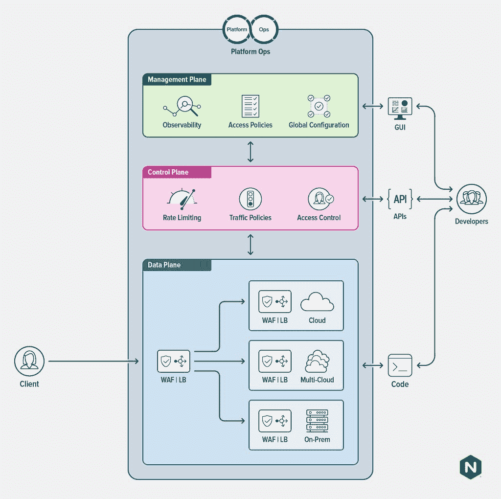

# 为什么开发人员需要管理平面

> 原文：<https://thenewstack.io/why-developers-need-a-management-plane/>

这是三部分系列的第二部分。阅读[第一部分](https://thenewstack.io/data-control-management-three-planes-different-altitudes/)和[第三部分](https://thenewstack.io/why-enterprises-need-a-management-plane/)。

我们已经写了企业如何需要一个管理平面来更容易地[左移](https://www.nginx.com/blog/shifting-security-tools-left-for-safer-apps/)，并授权更多的用户和角色来控制基础架构和应用程序部署。

 [埃里克·布劳恩

Eric 是 F5 NGINX 产品管理和商业战略副总裁。Eric 在 SaaS、PaaS 和 IaaS 领域工作了 20 年，在公有云、私有云(系统软件)和混合云领域拥有 10 年的经验，任职于 Joyent、三星、甲骨文和德国电信的 MobiledgeX(已被 Google 收购)。Eric 是社区和生态系统的架构师，拥有开发人员体验领域的专业知识，以及云与电信和新兴 AI、ML、XR 和其他用例及互联设备的交叉。](https://www.linkedin.com/in/ebraun/) 

没有哪个群体比开发人员从管理层面获益更多。

这就是为什么是的，左移对开发者来说意味着更大的自主性、敏捷性和生产力。这意味着更快的上市时间。左移还意味着，开发人员越来越多地被期望执行以前由更专业的团队完成的任务——运营、安全、网络和应用架构方面的任务。这就是微服务的本质。开发人员越来越多地拥有整个应用程序，而不仅仅是部分代码。拥有越多，责任越大

不幸的是，所有其他学科的学习曲线都很陡峭；这就是为什么今天有这么多“运营”工作的原因。而且光说“左移”并不能让它成为一个可行的发展战略。期望开发人员知道如何设置 [web 应用防火墙](https://www.nginx.com/learn/waf-web-application-firewall/)，配置[负载平衡器](https://www.nginx.com/resources/glossary/load-balancing/)或为 [API 网关](https://www.nginx.com/learn/api-gateway/)编写策略会招致错误和安全风险。这是一个新的构造——管理平面——成为开发人员云原生堆栈的必要组成部分，赋予他们元操作的超能力。

## 招聘:现代应用的快乐运营媒介

今天的开发人员希望并期望对他们的应用程序代码如何运行以及在哪里运行有更多的控制。这种控制允许他们更快地移动，并创建更具弹性、松散耦合的应用程序，这些应用程序与云无关，并在云本机部署模式中工作。更多的控制使开发人员能够配置最适合应用需求的基础设施。

同时，开发人员更喜欢把大部分时间花在编写代码上。配置基础设施、保护网络安全或确定 API 速率限制并不是他们最想花时间去做的事情。因为开发人员的时间非常宝贵，任何让他们在更短的学习曲线内更有效地向左转的方法都可以交付真正的商业价值(并让开发人员更开心)。[平台运营团队](https://www.nginx.com/blog/why-every-company-needs-platform-ops/)尤其努力将复杂性降至最低，同时仍为开发人员提供选择和灵活性。这就是管理平面对开发人员变得至关重要的地方。

## 为什么开发人员需要管理平面

概括地说，管理平面是一个抽象层，用于处理左移所暴露的新的复杂性级别。数据平面是网络系统(负载平衡器、防火墙、API 网关、入口控制器、缓存系统)读取入站或出站数据包并决定如何处理它们的层。

控制平面是位于数据平面之上的策略层。在控制平面中，管理和配置数据平面的行为规则。这两者必须完全分开，以便具有可伸缩性，并且与系统和架构无关；这是 NGINX 产品设计的一贯宗旨。

管理平面是控制平面之上的一层，开发者无需成为网络、安全和 API 方面的专家。管理平面为开发人员提供了一种快速简便的方法来实现以下目标:

*   其应用程序和相关基础设施的可观察性
*   在单个工作空间中管理和设置多种功能的策略
*   应用程序和访问控制的开箱即用安全性和轻松的安全性调整
*   所有这些参数的可配置性允许开发人员轻松修改控制和策略(例如实现弹性和可伸缩性),而无需突破防护

管理平面使生产线开发人员能够完成所有这些工作，而无需深入了解或掌握如何为防火墙、网络、API 管理和应用性能管理使用本机数据平面配置文件和策略。

借助管理平台，平台运营团队可以减少开发人员在开发人员专业知识的正常领域之外构建特定领域知识的需求。例如，管理平面可以有一个选项菜单或决策树，以确定应用程序需要什么程度的可用性和弹性，可以针对应用程序或服务发出多少 API 调用，或者出于数据隐私或监管原因，应用程序应该位于云中的什么位置。

同样重要的是，管理平面可以通过向开发人员提供关于良好安全实践的明智建议，或者对关键资源或基础设施实施特定限制来提高安全性，以确保向左转移的开发人员不会无意中使他们的组织面临严重风险。例如，管理平面可以建议(或实施)端口转发或代理规则，以防止将敏感的个人身份信息(PII)或客户数据暴露给其他服务或外部 IP 地址。或者，平台运营团队可以自动将一个 [Kubernetes 入口控制器](https://www.nginx.com/resources/glossary/kubernetes-ingress-controller)和一个 [WAF](https://www.nginx.com/learn/waf-web-application-firewall/) 添加到所有开发人员部署中，作为 CI/CD 管道的一部分，确保推出 Kubernetes 应用的开发人员以更安全的方式部署它们。(我们已经把这个写成“[用剪刀安全奔跑](https://www.nginx.com/blog/nginx-announces-eight-solutions-that-let-developers-run-safely-with-scissors/)”)

随着微服务和小型应用的总数激增，这一点变得尤为重要。许多企业拥有数以千计的微服务，远远超过任何安全团队或网络运营团队能够充分审查并提出建议的数量。开发人员可以进入他们的管理平台并遵循工作流，而不是提交一张罚单，这样可以给他们选择，同时将风险降至最低。这就是管理平面如何成为快乐的操作媒介，节省开发人员在配置管理、安全设计等方面浪费的数天或数周时间。

<svg xmlns:xlink="http://www.w3.org/1999/xlink" viewBox="0 0 68 31" version="1.1"><title>Group</title> <desc>Created with Sketch.</desc></svg>