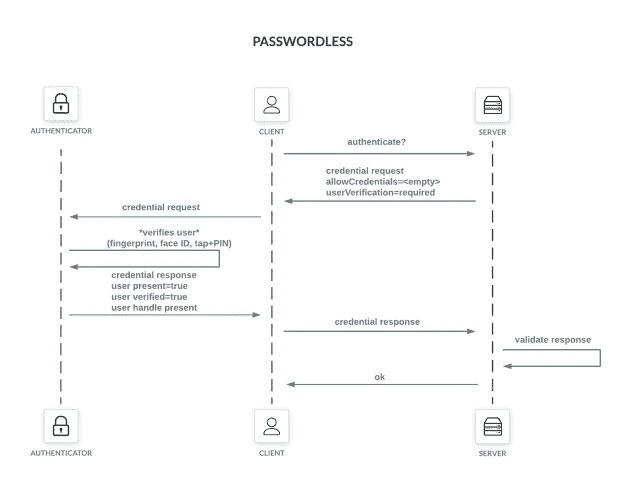
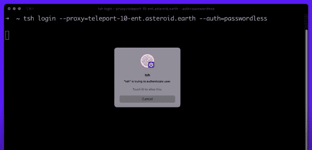
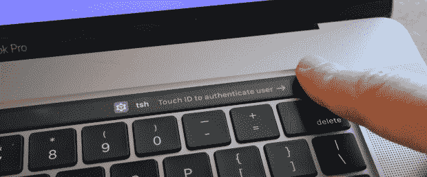

# 为什么开发者需要无密码

> 原文：<https://thenewstack.io/why-developers-need-passwordless/>

多年来，我们已经看到了一系列因密码而导致的系统攻击。密码被泄露、重复使用或被钓鱼——这是进入系统的易受攻击的入口。

 [本·阿伦特

在过去的十年中，Ben 一直从事开发工具方面的工作，帮助提供已经被超过 100，000 名开发人员使用过的工具。在 Teleport，他擅长帮助保护公司和开发者的网络和机器的安全。](https://www.linkedin.com/in/benarent/) 

解决方案:去掉密码。

替换密码通常被称为无密码，但这是一个容易混淆的术语，因为它没有描述替换它的是什么。核心上，无密码是一种结合了身份证明(生物识别/触控 ID)和存在证明(Mac 上 Secure Enclave 的证明)的认证方法。这两件事都包含在诸如 web 认证(WebAuthn)之类的现代 Web 技术中，以使事情变得简单并为用户提供流畅的用户体验。比如你用 Face ID 登录你的 iPhone，它是无密码的；你不去想它。

除了用户密码，还有其他类似密码的凭证分散在您的基础架构中。这些有时被明确称为密码，如 MySQL 服务器的用户名和密码，但也可以是长期 Kubernetes 配置的形式，其中有一个非常长的密码。它也可以是 SSH 配置，用于 CI/CD 服务器与其他机器通信。在本文的后面，我们将深入探讨机器对机器的通信和认证。

## **开发天堂的问题**

在过去几年中，开发人员一直是多种攻击的目标，因为大多数开发人员需要访问试运行、构建或生产环境。由于可以访问敏感系统，他们成为黑客甚至国家攻击的热门目标。[网络安全管理软件产品](https://www.npr.org/2021/04/16/985439655/a-worst-nightmare-cyberattack-the-untold-story-of-the-solarwinds-hack)黑客展示了“非凡的交易技巧”——一旦攻击者在系统中获得立足点，就在构建系统中放置后门，然后最终部署到客户。

Twilio 和 Cisco 等其他公司也受到了复杂攻击，这些攻击甚至可以绕过单点登录(SSO)和多因素身份验证(MFA)。思科最近[观察到](https://blog.talosintelligence.com/2022/08/recent-cyber-attack.html)通过语音钓鱼或“视像”高级绕过 MFA 这些事件突出表明，即使 SSO 和 MFA 也不足以抵御最持久的攻击。

## **开发者的肮脏秘密**

作为开发人员日常工作的一部分，他们会遇到许多秘密。这些包括从服务的 API 密钥到 AWS 凭证和 kubeconfigs。这些秘密大多有两个问题:

1.  大多数是长期有效的凭证。
2.  它们存储在磁盘上。

长期凭据可能会带来许多风险。例如，一个开发人员可能有一个发送 SMS 的 Twilio API 密钥，但是这个密钥和生产密钥是同一个密钥吗？当有人离开公司时，这个 API 密匙会被轮换吗？拥有长期有效的凭据会带来横向调动和特权升级的可能性。秘密管理的两个开源解决方案是[黑盒](https://github.com/StackExchange/blackbox)和 [sops](https://github.com/mozilla/sops) 。这些工具对秘密进行加密，这意味着即使它们被泄露，攻击者也无法使用它们。

使用短期和临时凭据对于保护开发人员帐户非常有用。AWS 用户可以将 IAM 中的[临时安全凭证与 AWS SSO 和概要文件`aws sso login --profile`结合使用，以检索短期凭证。如果一台机器被入侵，攻击者实际上可以使用秘密的时间会很有限。另一个有趣的开源项目，](https://docs.aws.amazon.com/IAM/latest/UserGuide/id_credentials_temp.html) [aws-vault](https://github.com/99designs/aws-vault) ，有助于在开发环境中解决这个问题。

最后，使用专用服务帐户进行机器对机器的通信非常重要。例如，CI/CD 服务应该有自己的服务帐户，具有有限的权限和凭据。值得评估的是，你是否可以完全删除秘密，例如使用 GitHub 工作流的 [OIDC 来消除存储长期秘密的需要。对于其他系统，值得研究开源的](https://docs.github.com/en/actions/deployment/security-hardening-your-deployments/configuring-openid-connect-in-amazon-web-services)[transport Machine ID](https://goteleport.com/docs/machine-id/introduction/)作为一个系统，它将不断地获得短期证书以访问服务器、Kubernetes 和数据库。

## **无密码是怎么工作的？**

无密码的基础是建立在一些标准的网络标准之上的。为了深入了解，我强烈推荐这篇文章“无密码是如何工作的”，深入回顾了 WebAuthn 和无密码是如何工作的。让无密码变得安全的一个有趣的细节是，无论是通过生物识别还是个人识别码(PIN ),身份验证都不会离开用户的设备。这使得远程网络钓鱼尝试变得不可能，因为攻击者需要访问设备。

## **开发者有什么独特之处？**

不用说，开发人员是他们工作机器的超级用户。为了完成工作，他们经常在集成开发环境(ide)和终端之间切换。他们使用命令行工具，而不是基于浏览器的应用程序，这些 CLI 工具通常需要某种形式的身份验证。

这就是无密码变得棘手的地方。WebAuthn 主要是为浏览器设计的，一些安全特性如证明还没有完全实现。例如，Chrome 依赖于触控 ID 的自我认证，因为它不能安全地使用不同的格式。

下一个问题是能够在 CLI 中支持无密码身份验证方法。在开发开源 tsh 客户端时，需要用正确的配置文件打包二进制文件，以便[能够运行](https://github.com/gravitational/teleport/pull/12751)。对于其他开源开发者来说，这意味着需要一个[苹果开发者账户](https://developer.apple.com/)来构建与触控 ID 兼容的 CLI。

## 

## **为什么开发者需要无密码**

这篇文章概述了一些与密码相关的风险，并向我们指出了密码将成为过去的未来。通过升级到无密码身份验证方法，攻击风险大大降低。 [Teleport](https://goteleport.com/passwordless/) 是第一款面向开发者的工具，它让[终端](https://goteleport.com/blog/infrastructure-access-without-passwords/)无需用户名或密码。

## 开发人员无密码的行动呼吁

**审计您的开发人员和系统:**为了更好地了解您当前的安全状况，有必要确定用于开发人员和开发人员相关服务的所有不同的工具和认证方法。如果使用集中式密码管理器，可能值得调查密码最后一次轮换的时间，并探索其他选项。

**将 U2F 升级到 WebAuth:** 如果你正在开发一个提供身份验证的产品，首先将你的旧 U2F 和[第二因子](https://2fa.directory/us/)升级到 web auth；有多个库可以简化这一过程:

**投资硬件代币:**从购买你的团队硬件代币开始，可以是 [YubiKeys](https://www.yubico.com/) 、 [Google Titans](https://store.google.com/us/product/titan_security_key?pli=1&hl=en-US) 或 [SoloKeys](https://www.indiegogo.com/projects/solo-v2-safety-net-against-phishing#/)

**将机器对机器通信升级为无密码:**研究从基础设施服务中删除密码的方法。例如，如果你目前使用 Postgres 用户名和密码，考虑升级到使用 [TLS 连接到你的 MySQL](https://goteleport.com/blog/secure-database-with-tls/) ，然后使用[证书代替](https://goteleport.com/blog/production-mysql-ssl/)密码。

## **无密码与有密码的未来**

苹果、谷歌和微软一直在合作，为大众提供更好的无密码用户体验。目前，用户需要注册和登记他们拥有的每台设备。例如，在你的 MacBook 上注册的触控 ID 就不会在你的 iPhone 上使用。

[Passkeys](https://developers.google.com/identity/fido) 是这个问题的解决方案，FIDO2 的改进将让用户轻松安全地跨设备和操作系统访问无密码系统。FIDO2 身份验证标准基于公钥加密进行身份验证，比密码和 SMS 一次性密码更安全。FIDO2 身份验证使仅使用密码的登录被跨网站和应用的安全快速的登录体验所取代。

<svg xmlns:xlink="http://www.w3.org/1999/xlink" viewBox="0 0 68 31" version="1.1"><title>Group</title> <desc>Created with Sketch.</desc></svg>