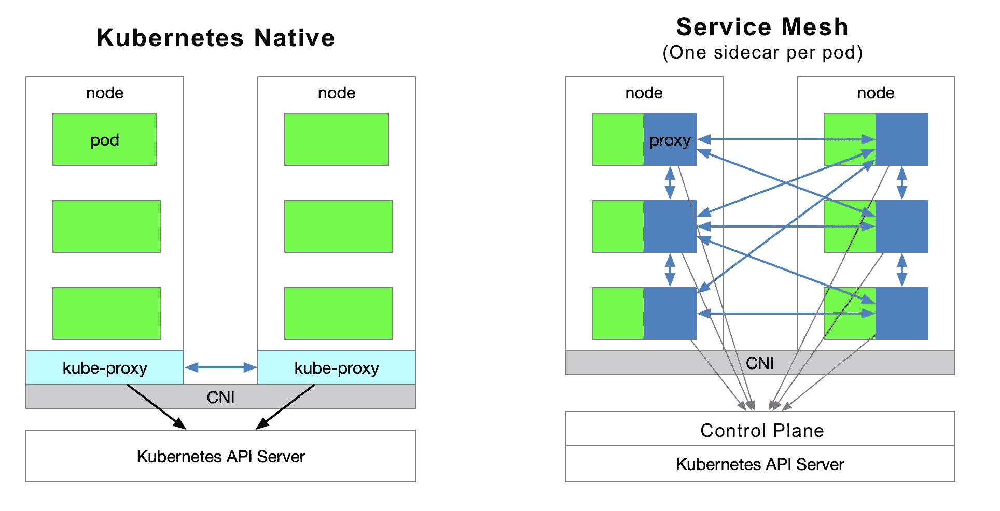
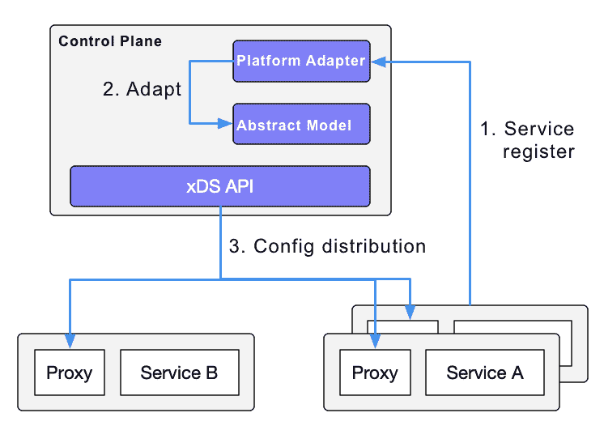
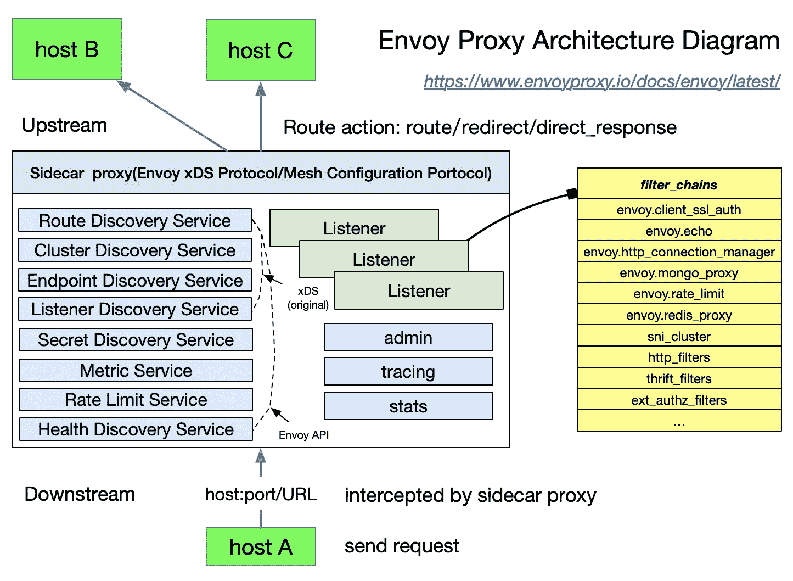
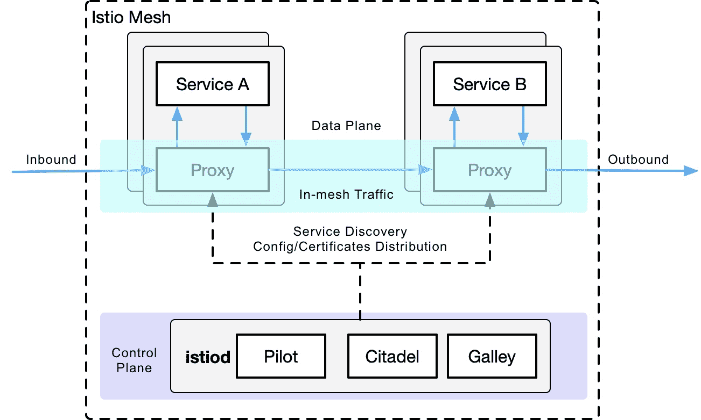

# 既然已经有了 Kubernetes，为什么还需要 Istio？

> 原文：<https://thenewstack.io/why-do-you-need-istio-when-you-already-have-kubernetes/>

[Jimmy Song](https://www.linkedin.com/in/jimmysongio/)

[Jimmy 是 Tetrate 的开发者倡导者，CNCF 大使，ServiceMesher 和云原生社区(中国)的联合创始人。他主要关注 Kubernetes、Istio 和云原生架构。](https://www.linkedin.com/in/jimmysongio/)

如果你听说过[服务网](https://thenewstack.io/category/service-mesh/)并尝试过 [Istio](https://istio.io/) ，你可能会有以下问题:

1.  Istio 为什么在 Kubernetes 上运行？
2.  Kubernetes 和服务网格在云本地应用程序架构中分别扮演什么角色？
3.  Istio 延伸了 Kubernetes 的哪些方面？它解决什么问题？
4.  Kubernetes，Envoy 和 Istio 是什么关系？

本文将带您了解 Kubernetes 和 Istio 的内部工作方式。此外，我将介绍 Kubernetes 中的负载平衡方法，并解释当您有 Kubernetes 时为什么需要 Istio。

Kubernetes 本质上是通过声明性配置进行应用生命周期管理，而服务网格本质上是提供应用间流量、安全管理和可观察性。如果您已经使用 Kubernetes 构建了一个稳定的应用程序平台，那么如何为服务之间的调用设置负载平衡和流量控制呢？这就是服务网格发挥作用的地方。

Envoy 介绍了 xDS 协议，该协议受到各种开源软件的支持，如 [Istio](https://istio.io) 、 [MOSN](https://github.com/mosn/mosn) 等。Envoy 将 xDS 贡献给服务网格或云原生基础设施。Envoy 本质上是一个可以通过 API 配置的代理的现代版本，基于它可以衍生出许多不同的使用场景——例如 API 网关、服务网格中的 sidecar 代理和 edge 代理。

本文包含以下内容:

*   kube-proxy 角色的描述。
*   Kubernetes 对微服务管理的限制。
*   Istio 服务网格功能介绍。
*   Kubernetes、Envoy 和 Istio 服务网格中一些概念的比较。

## Kubernetes vs 服务网格

下图显示了 Kubernetes 和 service mesh 中的服务访问关系(每个 pod 型号一个边车)。

### **流量转发**

Kubernetes 集群中的每个节点部署一个 kube-proxy 组件，该组件与 Kubernetes API 服务器通信，获取集群中服务的信息，然后设置 iptables 规则，将服务请求直接发送到相应的端点(属于同一组服务的 pod)。

### **服务发现**

Istio 可以遵循 Kubernetes 中的服务注册，还可以通过控制平面中的平台适配器与其他服务发现系统对接；然后使用数据平面的透明代理生成数据平面配置(使用存储在 etcd 中的 CRD)。数据平面的透明代理被部署为每个应用服务的 pod 中的边车容器，并且所有这些代理都需要请求控制平面来同步代理配置。代理是“透明的”,因为应用程序容器完全不知道代理的存在。流程中的 kube-proxy 组件也需要拦截流量，只不过 kube-proxy 拦截来自 Kubernetes 节点的流量，而 sidecar 代理拦截来自 pod 的流量。

### **服务网格的缺点**

由于 Kubernetes 在每个节点上运行许多 pod，将原始的 kube-proxy 路由转发功能放在每个 pod 中会增加响应延迟(由于边车拦截流量时会有更多的跳数),并消耗更多的资源。为了以细粒度的方式管理流量，将添加一系列新的抽象。这将进一步增加用户的学习成本，但随着技术越来越受欢迎，这种情况将会慢慢缓解。

### **服务网格的优势**

kube-proxy 设置是全局的，不能在粒度级别上对每个服务进行控制，而 service mesh 通过 sidecar 代理将流量控制从 Kubernetes 的服务层中移除，从而实现更大的灵活性。

### Kube 代理的缺点

首先，如果转发的 pod 服务不正常，它不会自动尝试另一个 pod。每个 pod 都有一个健康检查机制，当 pod 出现健康问题时，kubelet 将重新启动 pod，kube-proxy 将删除相应的转发规则。此外，节点端口类型的服务不能添加 TLS 或更复杂的消息路由机制。

Kube-proxy 在 Kubernetes 服务的多个 pod 实例之间实现了流量的负载平衡，但是如何对这些服务之间的流量进行细粒度控制呢——例如将流量按百分比划分给不同的应用程序版本(它们都是同一服务的一部分，但在不同的部署上),或者进行金丝雀发布(灰度发布)和蓝绿色发布？

Kubernetes 社区提供了一种使用 Deployment 进行 canary 发布的方法，这实质上是一种通过修改 pod 的标签将不同的 pod 分配给部署服务的方法。

## Kubernetes 入口与 Istio 网关

如上所述，kube-proxy 只能在 Kubernetes 集群内路由流量。Kubernetes 星团的豆荚位于 CNI 创建的网络中。入口(Kubernetes 中创建的资源对象)是为集群外部的通信而创建的。它由位于 Kubernetes 边缘节点的[入口控制器](https://thenewstack.io/kubernetes-ingress-for-beginners/)驱动，负责管理南北流量。Ingress 必须与各种 Ingress 控制器对接，例如 [nginx ingress 控制器](https://github.com/kubernetes/ingress-nginx)和 [traefik](https://traefik.io/) 。Ingress 只适用于 HTTP 流量，使用简单。它只能通过匹配有限数量的字段(如服务、端口、HTTP 路径等)来路由流量。这使得不可能路由诸如 MySQL、Redis 和各种 RPC 之类的 TCP 流量。这也是为什么你看到有人在 ingress 资源注释里写 nginx 配置语言。直接路由南北流量的唯一方法是使用服务的负载平衡器或节点端口，前者需要云供应商的支持，后者需要额外的端口管理。

Istio 网关的功能类似于 Kubernetes 入口，因为它负责进出集群的南北流量。Istio Gateway 描述了一种负载平衡器，用于承载往来于网格边缘的连接。该规范描述了一组开放端口和这些端口使用的协议、用于负载平衡的 SNI 配置等。Gateway 是 CRD 的扩展，它也重用了 sidecar 代理的功能；详细配置见 [Istio 网站](https://istio.io/latest/docs/reference/config/networking/gateway/)。

## 使者

特使是 Istio 中默认的边车代理。Istio 基于 Enovy 的 xDS 协议扩展了其控制平面。在谈论 Envoy 的 xDS 协议之前，我们需要熟悉 Envoy 的基本术语。以下是 Envoy 中基本术语及其数据结构的列表；更多详情请参考[特使文件](https://envoyproxy.io)。

【T2

### 基本术语

以下是你应该知道的 Enovy 中的基本术语。

*   **下游**:下游主机连接特使，发送请求，接收响应；即发送请求的主机。
*   **上游**:上游主机接收特使的连接和请求，并返回响应；即接收请求的主机。
*   **Listener** : Listener 是一个命名的网络地址(例如，端口、UNIX 域套接字等。);下游客户端可以连接到这些侦听器。Envoy 向要连接的下游主机公开一个或多个侦听器。
*   **集群**:集群是 Envoy 连接的一组逻辑上相同的上游主机。Envoy 通过服务发现发现集群成员。或者，可以通过主动运行状况检查来确定集群成员的运行状况。Envoy 决定通过负载平衡策略路由请求的集群成员。

在 Envoy 中可以设置多个监听器，每个监听器可以设置一个过滤器链(过滤器链表)，过滤器是可扩展的，这样我们可以更容易地操纵流量的行为——比如设置加密、私有 RPC 等。

xDS 协议由 Envoy 提出，是 Istio 中默认的 sidecar 代理，但只要实现了 xDS 协议，理论上就可以作为 Istio 中的 sidecar 代理——比如 Ant Group 的 [MOSN](https://github.com/mosn/mosn) 开源。

Istio 是一个功能非常丰富的服务网格，包括以下功能。

*   流量管理:这是 Istio 最基本的特点。
*   策略控制:启用访问控制系统、遥测捕获、配额管理、计费等。
*   可观察性:在 sidecar 代理中实现。
*   安全认证:Citadel 组件负责密钥和证书管理。

## 伊斯蒂奥的交通管理

Istio 中定义了以下 CRD 来帮助用户进行流量管理。

*   网关:网关描述了一种运行在网络边缘的负载平衡器，用于接收传入或传出的 HTTP/TCP 连接。
*   VirtualService: VirtualService 实际上将 Kubernetes 服务连接到 Istio 网关。它还可以执行其他操作，例如定义一组在主机寻址时应用的流量路由规则。
*   DestinationRule:由 DestinationRule 定义的策略决定了流量路由后的访问策略。简而言之，它定义了流量的路由方式。其中，这些策略可以定义为负载平衡配置、连接池大小和外部检测(用于识别和排除负载平衡池中不健康的主机)配置。
*   envoy filter:envoy filter 对象描述代理服务的过滤器，这些过滤器可以自定义由 Istio Pilot 生成的代理配置。主要用户通常很少使用这种配置。
*   ServiceEntry:默认情况下，Istio 服务网格中的服务无法发现网格之外的服务。ServiceEntry 支持将附加条目添加到 Istio 内部的服务注册中心，从而允许网格中自动发现的服务访问并路由到这些手动添加的服务。

## Kubernetes vs. xDS vs. Istio

在回顾了 Kubernetes 的 kube-proxy 组件、xDS 和 Istio 中的流量管理抽象之后，现在让我们仅从流量管理的角度来比较一下这三个组件/协议(注意，这三个组件/协议并不完全相同)。

## 外卖食品

*   Kubernetes 的本质是应用生命周期管理，特别是部署和管理(纵向扩展、自动恢复、发布)。
*   Kubernetes 为微服务提供了一个可扩展、高弹性的部署和管理平台。
*   服务网格基于透明代理，这些代理通过边车代理拦截服务之间的流量，然后通过控制平面配置管理它们的行为。
*   服务网格将流量管理从 Kubernetes 中分离出来，不再需要 kube-proxy 组件来支持服务网格中的流量；以及通过提供更接近微服务应用层的抽象来管理服务间流量、安全性和可观察性。
*   xDS 是服务网格配置的协议标准之一。
*   服务网格是 Kubernetes 中服务的更高层次的抽象。

## 摘要

如果说 Kubernetes 管理的对象是一个 pod，那么 service mesh 中管理的对象就是一个服务，那么使用 Kubernetes 管理微服务，然后应用 service mesh 就可以了。如果你甚至不想管理一项服务，那么就使用像 [Knative](https://knative.dev) 这样的无服务器平台——但那是事后的想法。

<svg xmlns:xlink="http://www.w3.org/1999/xlink" viewBox="0 0 68 31" version="1.1"><title>Group</title> <desc>Created with Sketch.</desc></svg>