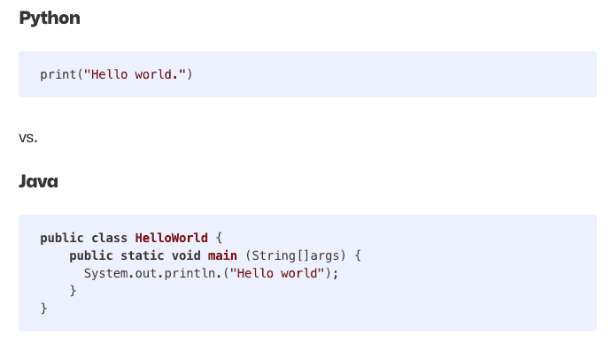

# Python 为什么这么受欢迎？GitHub 知道发生了什么

> 原文：<https://thenewstack.io/why-does-python-keep-getting-more-popular-github-knows-whats-up/>

根据 GitHub 的年度“Octoverse”顶级编程语言调查，Python 编程语言已经有 30 多年的历史了，并且仍然以每年 22%的速度增长。为什么会这样呢？

Github 最近发表了一篇由 GitHub 开发者和开源倡导者[雷泽尔·斯嘉丽](https://www.linkedin.com/in/rizel-bobb-semple/)撰写的[博客文章](https://github.blog/2023-03-02-why-python-keeps-growing-explained/)，探讨了 Python 的持久流行。这篇文章借鉴了 GitHub 用户的见解。

简而言之，Python 非常适合数据密集型操作，学习起来[很简单](https://thenewstack.io/an-introduction-to-python-a-language-for-the-ages/)。

HTML、CSS、JavaScript 是前端 web 的网关编码语言。你可以认为 Python 是后端的 JavaScript。它是多用途的，学习起来也很简单，这是新手开发人员的热门入门途径。或者对那些做前端编程的人来说是一个很好的回避。

Python 崛起的第二个原因是因为[数据正在崛起](https://thenewstack.io/data-streaming-for-when-micro-batching-just-isnt-fast-enough/)而 Python 非常擅长处理数据。

## **Python 入门**

与 JavaScript 类似，Python 是一种高级解释语言，对初学者友好，很大程度上是因为其简单的语法。它使用关键字而不是标点符号和换行符来定义代码块。

Scarlett 写道，这些语法设计选择甚至可以帮助不熟悉代码编写的读者更容易地通过查看代码来识别代码在做什么。

## **Python 重职业**

想想 [Python 和数据](https://thenewstack.io/7-must-have-python-tools-for-ml-devs-and-data-scientists/)。因此，这可能是数据分析、金融数据、机器学习或人工智能。Python 可以很好地处理数据，因为它擅长自动化手动的、重复的任务。Python 有自动化的内置模块，可用于常用的自动化。

据 GitHub 报道，以下是一些可能的职业选择:

**机器学习与人工智能**

说到数据密集型…大规模 ML 模型可以接受多达数十亿个参数的训练数据，而且它们看起来不会缩小。由于数据量很大，自动脚本和算法非常重要。Python 的数据可视化能力将 AI 或 ML 的大型数据集转换成可理解的图形。OpenAI 使用 Python 框架 [Pytorch](https://thenewstack.io/pytorch-takes-ai-ml-back-to-its-research-open-source-roots/) 作为其深度学习的标准框架，因此 ChatGPT 是用 Python 编写的。

**数据科学**

Scarlett 断言“Python 是数据科学和研究的首选语言。”这部分是因为它对于没有开发背景的人来说是可以理解的，同时也是因为它对于大型数据集来说非常有用。收集和解析数据是耗时的任务，这使得机器学习的使用在数据科学中相当普遍。

Python 库，如 NumPy、Pandas 和 Matplotlib，用于自动执行清理、数据转换和可视化等功能。

python.org列出了 50 份工作，这也让你更好地了解 Python 的职业前景。

## 一些链接

Scarlett 还提供了一组 GitHub 资源的链接:

以下是一些非 GitHub Python 资源:

*   [亚马逊网络服务的 Deep Racer](https://aws.amazon.com/deepracer/) 工具更适合学习如何训练机器学习模型，但也是建立或加强 Python 基础的好工具。
*   [Udemy](https://www.udemy.com/topic/python/?utm_source=adwords&utm_medium=udemyads&utm_campaign=Brand-Topic_la.EN_cc.US&utm_content=deal4584&utm_term=_._ag_137319661098_._ad_634190769258_._kw_udemy%20python%20course_._de_c_._dm__._pl__._ti_aud-1279170979662:kwd-300081141576_._li_9004402_._pd__._&matchtype=b&gclid=CjwKCAiA3pugBhAwEiwAWFzwdaL2fsA3Hu3YVEtp5UlVgF_0n80t35lNC5h17wFWkxw1A__QANcENxoCGpAQAvD_BwE) 为希望入门的人提供了一门 Python 入门课程。
*   [Career Foundry](https://careerfoundry.com/en/blog/data-analytics/best-data-bootcamps-for-learning-python/) 列出了一些专门为寻找专业学习环境的人教授 Python 的训练营。
*   当然还有… [YouTube](https://www.youtube.com/results?search_query=learn+python) ！

<svg xmlns:xlink="http://www.w3.org/1999/xlink" viewBox="0 0 68 31" version="1.1"><title>Group</title> <desc>Created with Sketch.</desc></svg>