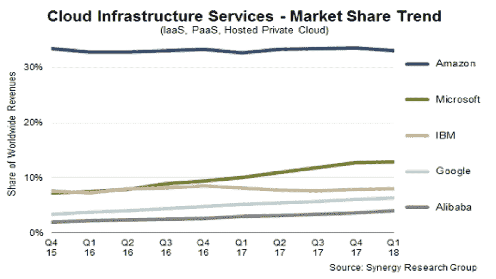
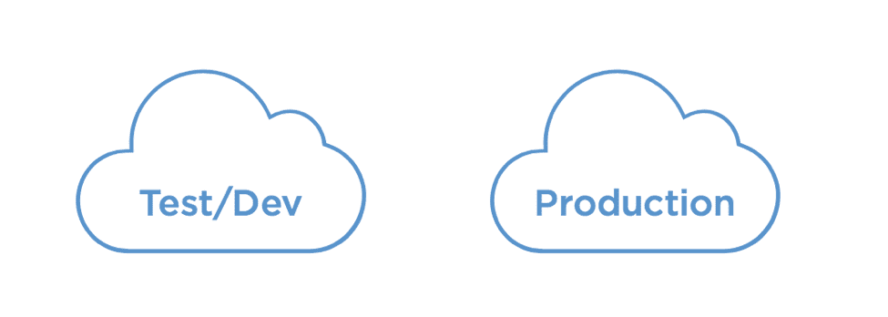
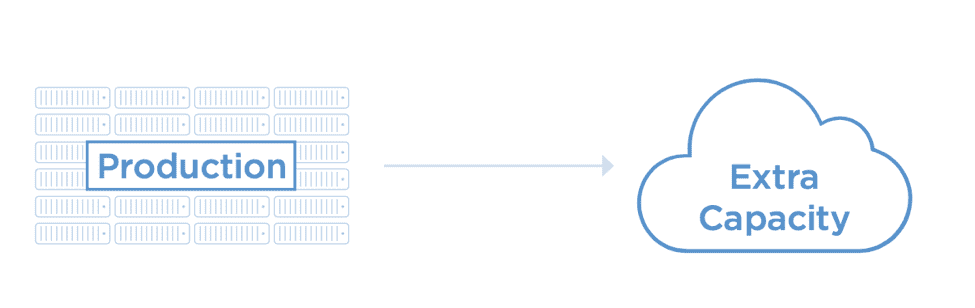
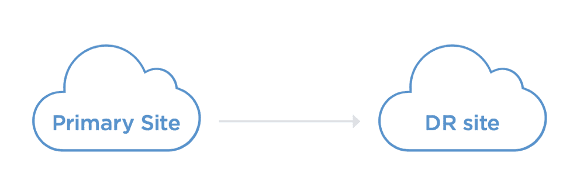
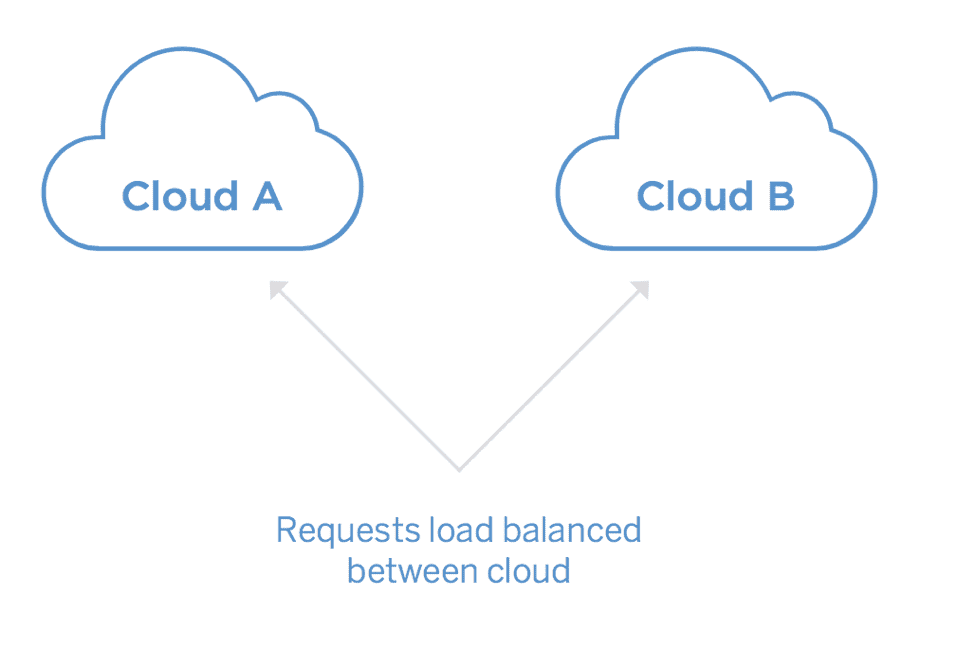
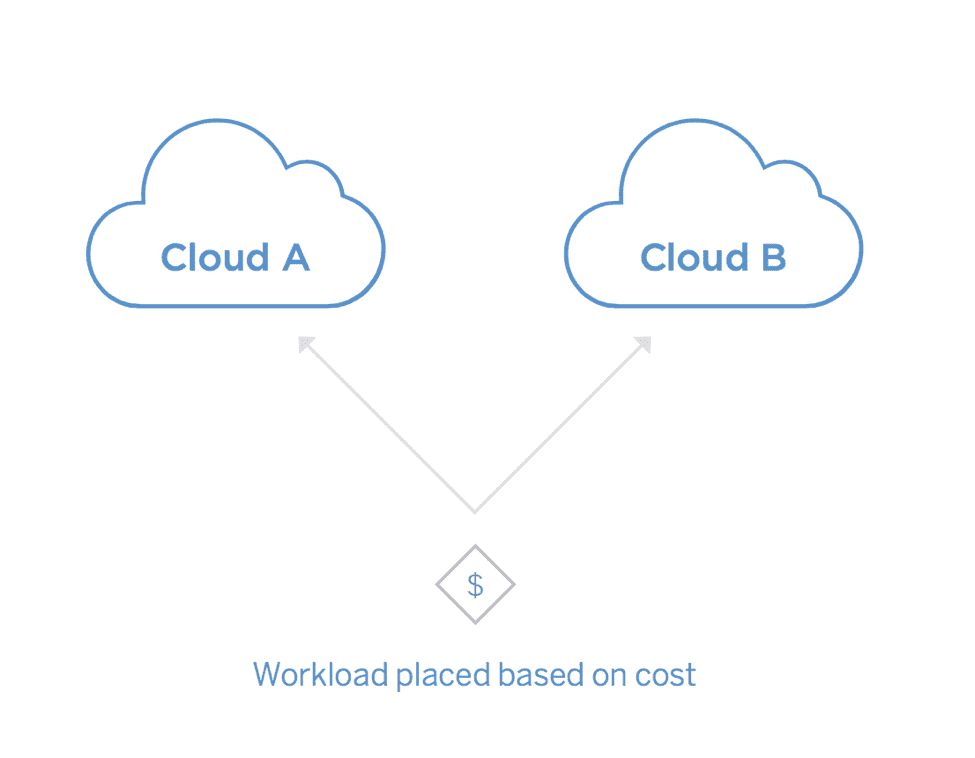

# 为什么企业采用多云战略

> 原文：<https://thenewstack.io/why-enterprises-are-adopting-a-multicloud-strategy/>

 [苟饶，Portworx

苟饶，Portworx 联合创始人兼首席技术官，曾任戴尔数据保护部门和思杰系统 ASG 公司首席技术官；Ocarina Networks 和 Net6 的联合创始人兼首席技术官；也是英特尔和洛克希德·马丁公司的主要架构师。他拥有计算机科学学士(班加罗尔大学)和硕士(宾夕法尼亚大学)学位。](https://portworx.com/) 

作为一家专注于云原生存储转型细分市场的容器革命市场公司的首席技术官，我花时间与前沿早期采用者合作。我喜欢与致力于解决难题的架构师和其他 CTO 一起工作。

尽管这很有趣，但作为一名商业人士，希望这些早期采用者不是局外人，而是大量采用中的第一滴。当然，早期的客户采用可能会转瞬即逝——能够区分这两者是很重要的。例如，用消费产品来类比，你读过多少关于虚拟现实头戴设备的文章会最终导致大规模采用？有时市场需要一段时间来发展。

我最近经常观察到，在与我们日益增长的财富 1000 强企业、政府机构和创新创业客户合作时；采用企业 IT 的多云方法的具体战略决策。所以问题是，多云是一种趋势，还是只有最前沿的人才会接受的时尚？

我与我们的客户一起工作的观察是，多云已经存在。一项更广泛的市场调查也证实了这一观点。

随着盈利季节的到来，我们已经看到，虽然亚马逊继续主导云基础设施市场，但随着其他公司的大举入侵，它的领先优势开始随着微软和谷歌而减弱。微软和其他公司的这种多季度增长趋势表明，许多组织希望使用亚马逊以外的云。但我也相信这一趋势并不意味着他们将只使用其他云。

即使是亚马逊的主要用户也在采用亚马逊+ 1 的云计算方式，其中+1 可以是另一个公共云，如 Azure 或谷歌或内部数据中心。更普遍的是，我们看到几乎所有客户都在进行某种形式的公共+公共以及公共+私有部署。

## **为什么多云具有战略意义**

云原生开发和运营模式使组织能够采用多云策略。云原生开发使组织能够构建一个可移植的软件堆栈，该软件堆栈由开发运维驱动，不受供应商限制，能够提供比单一云更出色的功能集。虽然这些优势非常巨大，但有几个原因使得多云运营成为企业的战略问题。

*   **降低服务中断的风险**

随着 IT 成为当今几乎每个企业的竞争中心，公司不得不考虑如何在大范围的停机或安全漏洞中生存下来。多云操作将服务中断的风险分散到更大的表面区域。把它当成一种投资多样化策略。

众所周知，云给了我们每小时的价格，现在甚至是分钟的价格，云中的主要交易是谈判达成的，而不是在网站上以定价购买的。简而言之，如果你能证明自己有能力将工作负载转移给另一家提供更优惠条件的提供商，那么你在谈判中就处于更有利的地位。

*   **为工作选择合适的(云)工具**

最后，尽管有所谓的商品化趋势，但云之间存在差异，这些差异有助于应用程序的放置，原因不在于多样化和谈判优势。一些云在某些区域，而另一些不在。对于某些应用程序，有些有更好的工作流程。正如现代开发团队不希望中央 IT 告诉他们使用任何数据库，只要它是 Oracle，应用程序团队也不希望部署在不适合手头任务的环境中。

## **如今的多云战略是什么样的？**

记住所有这些，让我们来看看我们今天看到的多云架构的一些实际应用。多云是一种频谱，许多客户使用以下一种或多种变体。此外，虽然这些模型中的一些以前已经使用过，但是随着企业向分布式容器化应用程序的过渡，它们正在呈现出新的含义、重要性以及在许多情况下的复杂性。首先，我们将看看多云模型本身，然后我们将看看容器如何影响这些模式。

### 云 A 中的开发，云 B 中的生产

这可能是最常见、最简单的多云版本。企业 IT 已经这样做了很多年。一开始，最常见的模型是使用云进行测试和开发，但是在内部运行生产应用程序。这种做法仍然很常见，但有时模型会被翻转。例如，企业可能会在主机托管设施中进行测试，因为自己租赁服务器和虚拟化比从亚马逊按小时付费购买虚拟机更便宜，也更可预测。但是，您仍然希望 Amazon 的多区域功能或 CloudFront CDN 等高级功能适用于您的生产环境。

### 爆发为云

企业使用多年的另一种常见的多云方法是云爆发，在这种方法中，他们的应用程序通常在内部环境中运行，但在某些高峰时期，他们会在云中增加额外的容量。云爆发的目标是避免为峰值容量购买足够硬件的成本，因为硬件在大多数时间都没有得到充分利用。

### 多云灾难恢复

一种更新、更复杂的多云方法是云灾难恢复。这包括在一个云或内部环境中运行生产应用程序，但在另一个环境中维护该应用程序的一个单独的最新副本。这一点非常重要，因为依赖单一云提供商灾难恢复策略越来越不明智。由于物理原因，云灾难恢复通常会涉及恢复点目标(RPO ),它定义了您在故障期间愿意承受的最大数据丢失量。此 RPO 可能是几小时甚至几天，具体取决于应用程序。

### 单个应用程序的多云操作

虽然上述多云模型涉及在单独的环境中运行完全不同的应用程序，但一些应用程序同时在多个云中运行。例如，GPS 服务 Waze [的代表最近在一篇联合文章](http://www.googblogs.com/guest-post-multi-cloud-continuous-delivery-using-spinnaker-at-waze/)中写道，“通过在[谷歌云平台](https://cloud.google.com/) (GCP)和 AWS 上运行主动-主动架构，我们能够更好地抵御 DNS DDOS 攻击，这是一个区域性的失败，甚至是整个云提供商的全球性失败。”在这种情况下，应用程序的同一个实例跨云提供商运行。这与多云灾难恢复模式不同，因为如果整个云离线，RPO 理论上为零，或者至少比传统灾难恢复模式小得多。

### 云套利

多云的圣杯，但可能是实践中最不常见的模型，是云套利。在这种模式下，工作负载被动态地放置在具有当时最具成本竞争力的基础架构的环境中。目前面临的挑战是云套利非常大，而且并不常见。但是随着时间的推移，随着 Kubernetes 等工具的改进，我们可能会看到更多的企业试图利用他们应用程序中需要最多计算资源的部分。

## 容器和数据管理:多云的关键。

正如本文开头提到的，我们的大多数客户都在运行上面强调的多云操作的一些版本。这些客户真正接受多云的关键有两个。

一个是采用像 Kubernetes 这样的容器管理平台来处理跨环境的微服务的复杂部署和管理。因为每个云或内部数据中心都有不同的硬件配置和操作系统环境，所以容器的隔离和依赖性管理允许跨异构环境的一致操作。

然而，即使有了容器管理平台，客户也不得不寻找一种在容器环境之间移动数据并在这些环境中管理数据的解决方案。事实上，如果没有数据管理解决方案，客户不仅无法执行多云工作流，如多云灾难恢复或单个应用程序的多云操作(减轻重大云故障的重要模式)，他们与云提供商的谈判地位也会大大降低。因为数据是每个应用程序的核心，所以云提供商知道，如果你只能将应用程序的无状态部分转移到另一个环境，你就永远无法真正实现多云。是的，他们可能会损失 5-10%的企业工作负载，但他们绝不会损失更多，因为数据是移动性的限制因素。

我对快速成熟的多云运营世界感到兴奋。我认为，随着多云运营的成本和可靠性激励变得如此之高，多云将成为一种趋势。不用说，在波特沃斯，我们很乐意帮助您。

<svg xmlns:xlink="http://www.w3.org/1999/xlink" viewBox="0 0 68 31" version="1.1"><title>Group</title> <desc>Created with Sketch.</desc></svg>