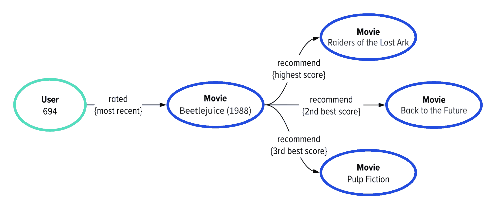
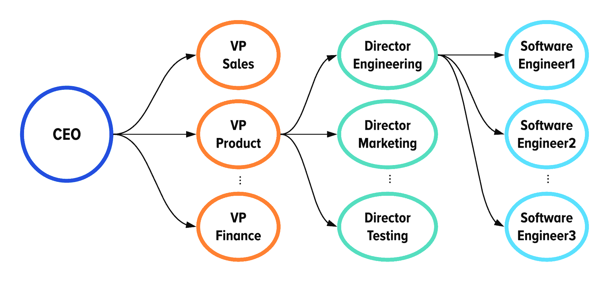
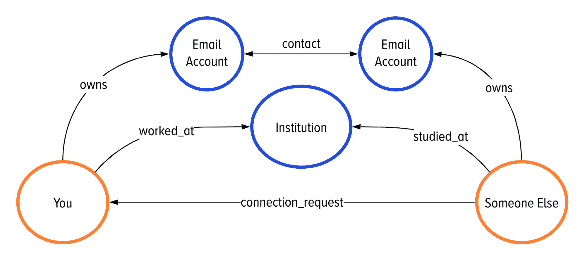
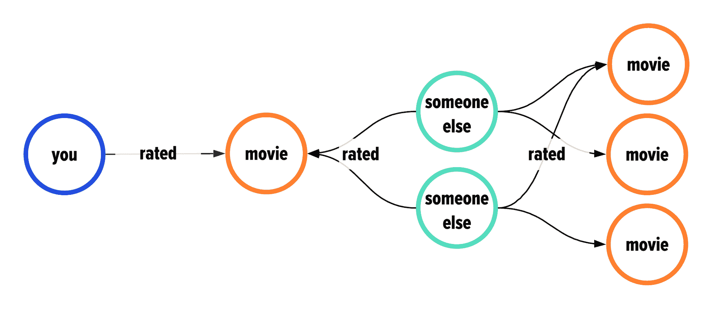

# 为什么企业越来越多地使用图表技术

> 原文：<https://thenewstack.io/why-enterprises-are-increasingly-using-graph-technology/>

[DataStax](https://www.datastax.com/) 赞助本帖。

 [丹尼斯·戈斯内尔

丹尼斯是 DataStax 的首席数据官。戈斯内尔博士于 2017 年加入 DataStax，创建并领导全球图形实践(Global Graph Practice)，这是一个构建世界上一些最大的分布式图形应用的团队。她与人合著了奥莱利媒体书籍*图形数据从业者指南*。](https://www.linkedin.com/in/denisekgosnell/) 

图形数据库的[市场预计到 2024 年将增长近两倍，这是有充分理由的:图形技术使组织能够构建满足越来越苛刻的用户期望的应用程序。那么，用户要求 graph 解决的到底是什么？用户需要个性化的上下文。](https://www.marketsandmarkets.com/Market-Reports/graph-database-market-126230231.html)

尽管图形数据对于数据驱动型企业的成功越来越重要，但对于企业来说，这项技术仍处于相对初级的阶段。然而，我们看到[图形技术获得了很大的吸引力](https://www.datastax.com/blog/2020/01/observations-from-dataday-2020)。我们也看到一些常见的数据模型出现在事务图数据库中。

在本文中，我将解释为什么开发人员越来越多地使用图形技术，那些常见的数据模型是什么，以及图形行业的未来是什么。

## 用户对现代应用程序有什么期望？

这个问题的答案很简单:个性化体验。

根据 Salesforce 的数据，84%的客户认为被像人一样对待对赢得业务很重要。此外，59%的客户表示，基于过去合作的定制体验对于赢得业务至关重要。

最熟悉图形数据和图形技术的技术专家也是最熟悉图形算法的人。这很有道理:任何新技术的早期采用者总是会关注新玩具的 R&D 方面。

R&D 最初的努力包括在图形数据的全局结构中运行算法。如果你像我或我认识的大多数人一样，你每天都与图形算法打交道。以下是这些约定的三个例子。

## 图形技术应用的 3 个日常例子

### 谷歌搜索结果

你在互联网上，所以你以前用过谷歌查找信息(甚至可能找到这篇文章！).你可能不知道的是，谷歌搜索的排名结果是按照 PageRank 排序的，page rank 是一种流行的图形算法，用于根据有多少其他页面链接到内容来确定内容的相关性。

你可以把它想象成一场*谁认识谁*的人气竞赛。但是在图形世界里，是*什么链接到什么*。

### LinkedIn 的“你可能认识的人”部分

这是专业社交网络巨头版本的 [*六度凯文·贝肯*](https://en.wikipedia.org/wiki/Six_Degrees_of_Kevin_Bacon) (又称培根定律 *)* ，假设地球上的每个人都可以通过六个或更少的熟人链接到*自由活动*恒星。

该算法不会跟踪一起出演电影的人，而是将“谁与谁一起工作”游戏放在搜索结果的最前面。

### 网飞的推荐引擎

如果你已经浪费了无数个小时甚至无数天去狂看网飞的内容——或者只是看一些展示网飞的小片段——你并不孤单。

这是同类的例子:

看过这个也看过那个的人

但是，请记住，所有这三个大规模算法都是图形算法的预先计算结果。这里的重点是*预计算*。当你在谷歌、LinkedIn 或网飞上点击搜索时，任何图形算法都不可能抓取数十亿个链接来确定你正在搜索的内容的相关性。

我提到这一点是因为预计算图算法在事务数据库中的出现是图行业中第一个值得注意的趋势。

在基于云的应用程序中实时提供图形结构数据的下一步是了解当今的领先公司实际上是如何做的。

## 事务图数据库的 4 个常见用例

其核心是，在生产应用程序中使用图形数据能够提出更好的问题。下面是我们在事务数据库中图形数据的生产使用中发现的四个最常见的问题和数据模型。

### 客户 360

今天最有效的组织知道关于他们的顾客的一切；包括他们住在哪里，他们最后一次购物是什么，他们的联系信息是什么，他们最后访问的商店，他们首选的支付方式，他们使用的设备，等等。

总之，这些信息汇集在一起创建了一个客户 360 度应用程序，使企业能够鸟瞰与特定客户相关的一切。

虽然在过去，数据湖和数据仓库等解决方案被用于这些目的，但今天的应用程序要求数据更易于访问。图形技术允许开发人员创建健壮的检索系统，以补充跨越数据湖和数据仓库的更长时间的搜索。

因此，组织能够跨平台和渠道提供一致的体验，满足消费者的期望并推动更多销售。

### 分层数据

哪些员工向哪些主管汇报？员工 A 属于哪个部门或成本中心？

图形技术提供了一种更自然的方式来显示分层数据中的嵌套关系(如组织结构图)，这反过来提高了开发人员的生产率，因为开发团队需要维护的代码更少了。

例如，图形技术的早期采用者能够将 HBase 上的 150 行查询简化为 20 行 Gremlin。由于人们喜欢使用更简单的代码库，越来越多的组织可能会跟随他们的脚步。

### 寻路

如果你使用过像脸书这样的网络，你无疑会在某个时间点对自己说这样的话:*脸书怎么知道我认识这个随机的人？*

图表技术可以帮助你弄清楚两个人是如何认识的，两个人之间有多少联系(如果有的话)，从一个特定的机场乘坐两次航班可以到达多少个机场，等等。

在区块链时代，特别是比特币，寻路将变得越来越重要，如果没有其他原因，只是它有助于用户知道他们是否可以信任网络上的某个未知用户。

如果有人与你信任的人进行交易，你会愿意信任那个用户吗？如果他们和你信任的 25 个人交易呢？

### 推荐

最后但同样重要的是，我们来看推荐用例；这是网飞和亚马逊这样的公司使用图表技术向用户建议他们下一步可能要做什么的方式。

2006 年，网飞发起了一场价值 100 万美元的机器学习竞赛。参与者被鼓励尝试创建一种算法，可以击败网飞自己的内容评级预测过程。

最终，比赛告诉我们，对于这种用例，图形思维比传统的基于矩阵的算法更有效。如果你喜欢一定数量的电影，另一群人也喜欢那些电影，你看那群人喜欢的*其他*电影，然后*瞧*，有一个你可能也喜欢的电影列表。

使用图表，推荐引擎遵循三个步骤来提供个性化建议:

1.  找出用户最近评价、浏览或购买的商品。
2.  根据历史评分、观看或购买模式查找类似商品。
3.  根据评分模型提供内容建议。

## 一句话:图表有助于回答更高价值的问题

如你所见，图表技术已经在我们的生活中扮演了一个重要的角色。随着越来越多的组织寻求成为云原生企业并转型为数据驱动型企业，几乎可以肯定的是，我们将在未来几年看到更多强大的用例出现，这些用例将帮助他们回答越来越重要的问题。

我不知道你怎么想，但我很想知道接下来会发生什么。

*如果你喜欢目前所读的内容，并想了解更多，可以考虑看看[图数据从业者指南:应用图思维和图技术解决复杂问题](https://www.oreilly.com/library/view/the-practitioners-guide/9781492044062/)，这是我和马蒂亚斯·布罗意切勒合写的一本书。*

通过 Pixabay 的特征图像。

*目前，新堆栈不允许在该网站上直接发表评论。我们邀请所有希望讨论某个故事的读者通过 [Twitter](https://twitter.com/thenewstack) 或[脸书](https://www.facebook.com/thenewstack/)访问我们。我们也欢迎您通过电子邮件发送新闻提示和反馈: [feedback@thenewstack.io](mailto:feedback@thenewstack.io) 。*

<svg xmlns:xlink="http://www.w3.org/1999/xlink" viewBox="0 0 68 31" version="1.1"><title>Group</title> <desc>Created with Sketch.</desc></svg>