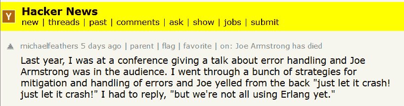
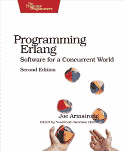

# 为什么是二郎？乔·阿姆斯特朗的容错计算遗产

> 原文：<https://thenewstack.io/why-erlang-joe-armstrongs-legacy-of-fault-tolerant-computing/>

Erlang 编程语言的原始设计者之一乔·阿姆斯特朗最近去世，导致本周对他在计算机科学领域所做贡献的感激之情溢于言表。

虽然 Erlang 在 33 年前从瑞典跨国电信公司爱立信的工作中成长起来，但它的影响最终蔓延到了全世界。去年 6 月在 Code BEAM 会议上的一次介绍中提到，思科每年运送大约 200 万台装有 Erlang 的设备，90%的互联网流量[通过 Erlang 控制的节点](https://twitter.com/guieevc/status/1002494428748140544)。

是什么赋予了这种语言在开发人员心中的特殊地位？Armstrong 的去世为开发者社区提供了一个机会来反思这种特殊语言的特别之处，以及 Armstrong 的语言设计方法的独特之处。

## **寻求更好的方法**

历史都隐藏在眼前。阿姆斯壮 2003 年的博士论文的全部 295 页都在网上，题目是“在软件错误的情况下制造可靠的分布式系统”它提交给斯德哥尔摩的皇家理工学院，描述了阿姆斯特朗从 1981 年开始寻求更好的电信应用编程方法的研究，该研究“导致了一种新的编程语言(称为 Erlang)的开发，以及一种设计方法和一套用于构建健壮系统的库(称为 OTP)。”

“我认为构建容错系统所需的某些需求是如何在语言中解决的，而其他需求是如何在标准库中解决的。这些共同构成了构建容错软件系统的基础……”

今年一月，68 岁的阿姆斯特朗在接受 Erlang Solutions 的采访时回顾了那些日子——就在他去世前三个月。“当时，爱立信建造了拥有数十万用户的大型电话交换机，而建造这些交换机的一个关键要求是它们绝不能停机。换句话说，它们必须完全容错。”

[https://www.youtube.com/embed/i9Kf12NMPWE?feature=oembed](https://www.youtube.com/embed/i9Kf12NMPWE?feature=oembed)

视频

解决方案需要运行大量并行进程的能力(这些进程的状态不会受到任何其他进程中的任何错误的影响)。阿姆斯特朗最初试图在 Prolog 中添加并发进程，作为一种为基本电话服务提供编程的方式——但这最终导致了一种全新的语言。Armstrong 的论文将 Erlang 描述为“一种基于并发进程的语言，在并发进程之间具有很强的隔离性”，同时也是一种“纯粹的消息传递语言”，大量使用了“快速失败进程”。他探索了 SmallTalk 语言——但对它的并发性或故障处理不满意，从 1985 年到 1989 年开始开发 Erlang。

很快，其他人——特别是罗伯特·维尔丁和迈克·威廉姆斯——也加入了阿姆斯特朗的行列，事实证明这是一次富有成效的合作。他的论文也承认了在 1981 年到 2003 年的 22 年间所做的大量工作。“我们今天所知道的制度是许多人集体努力的结果。没有他们的才华和我们用户的反馈，Erlang 就不会有今天。”

事情开始发生得很快。到 1990 年，Erlang 成为了自己的语言(而不是 Prolog 的方言)，很快这种语言就被用于爱立信的项目中。1993 年，Erlang 的第一个商业版本发布，爱立信成立了一个子公司向外部客户销售 Erlang。1995 年，作为一个大规模交换机项目的一部分，一个新的支持小组成立了，在此期间，Erlang 库被合并并重新命名为 OTP(意为“开放电信平台”)，希望为所有 Erlang 用户提供一个稳定的软件核心。早些时候，爱立信试图构建下一代交换机，但在一个为期八年的项目(于 1995 年结束)后“失败”，因此该项目随后使用 Erlang 重新启动，并于 1998 年交付。

但也是在那一年，爱立信做出了开源 Erlang 代码的决定。“大多数 Erlang/OTP 用户[仍在爱立信](https://web.archive.org/web/19991009002753/http://www.erlang.se/onlinenews/ErlangOTPos.shtml)内，”该公司 1998 年的公告解释道。“为了加速 Erlang/OTP 的开发，确保 Erlang/OTP 程序员的良好供应，最大限度地降低语言的维护和开发成本，并保持 OTP 应用程序达到世界一流水平，我们需要在爱立信之外推广这项技术。”

根据 Armstrong 在一月份对 Erlang Solutions 的采访，Erlang 也受益于一些幸运的时机。“当然，当多核出现的时候，我们所做的就很好地映射到了并行程序上，”阿姆斯特朗回忆道。到那时为止，并发程序实际上是在操作系统中相当快地交错的顺序程序。当多核出现时，并行执行程序的可能性出现了。因此，我们立即能够利用并行内核。事实上，这可能是 Erlang 在过去 15 到 20 年中发展壮大的原因——因为它可以自然地扩展到现代多核计算机上。”

> 阿姆斯特朗自己也曾开玩笑说“如果 Java 是‘一次编写，随处运行’，那么 Erlang 就是‘一次编写，永远运行’。”

这篇论文最终将自己定位于对弹性系统编程的基本*需求*。大型系统在交付时可能总会在软件中包含一些错误，尽管如此，这种系统仍被期望以合理的方式运行

## **正在进行的遗产**

这些都给了 Erlang 一些独特的优势。“Erlang 使用多组并行进程，而不是大多数编程语言中常见的单个顺序进程 Armstrong 在他自己的书《Erlang 编程》中解释道，该书补充道，Erlang“将改变你对世界和编程方式的看法……”

“一个多用户游戏、网站、云应用程序或网络数据库可以让成千上万的用户同时进行交互。您需要一个强大的工业级工具来处理并行、并发环境中固有的真正困难的问题。”

一些 Erlang 爱好者甚至将他们对这种语言的热爱追溯到 Armstrong 自己对简单性的承诺。“乔的书平易近人，一如既往，”弗雷德·赫伯特回忆道,*的作者《为了更大的利益向你学习一些二郎腿！*在[中，一篇发自内心的文章题为《再见乔》](https://ferd.ca/goodbye-joe.html)

他能够像其他人一样解释 Erlang 的原理是什么，是什么导致了它的设计，以及它所体现的容错的核心方法。这是少数几本不满足于让你写代码，而是让你理解*为什么*你应该那样写的语言类书籍之一。这种语言之所以有特性不仅仅是因为它们很酷，它之所以有特性是因为容错需要它们。

Joe 在他的文章中提到的一件令人惊奇的事情是*开发者会犯错误，而我们无法防止他们全部犯错误*，这与我之前读到的相比是不同寻常的。相反，我们必须能够应付他们。他不只是告诉你一门语言，他让你踏上了一条教你如何编写整个系统的道路。

但是乔的建议和作品比这更进一步。他一直是系统简单性、独立直截了当性和从旧的计算时代获得的对一切事物的全新视角的故事的超级粉丝。他不认为软件永远不会完成，而是希望软件简单到能够真正完成。

或者，正如一名程序员[在 2018 年](https://news.ycombinator.com/item?id=16840455)的《黑客新闻》上发布的那样，“Erlang，以及在那之后的灵丹妙药，让我以不同的方式思考代码，让我成为一名更好的程序员。”

Erlang 对并发性的谨慎处理一直以来都是值得骄傲的。2008 年，Erlang 的联合创始人之一 Robert Virding 在一篇简洁的博客文章中分享了“Virding 的编程第一法则”[。"任何用另一种语言编写的足够复杂的并发程序都包含一个非正式指定的、充满 bug 的、缓慢的 Erlang 实现的一半."](https://rvirding.blogspot.com/2008/01/virdings-first-rule-of-programming.html)

阿姆斯特朗本人曾在 2013 年接受 Rackspace 采访时开玩笑说[“如果 Java 是‘一次编写，随处运行’，那么 Erlang 就是‘一次编写，永远运行’。”](https://www.youtube.com/watch?v=u41GEwIq2mE&t=3m59s)

谁知道他的影响到哪里去了？本月早些时候 [web 开发人员 Kenny Bergquist](https://blog.kenforthewin.com/what-erlang-taught-me-about-distributed-systems/) 写道“kube 集群中的每个节点都可以运行一个或多个 pods，就像 Erlang 集群中的每个节点都可以运行一个或多个进程一样……您可以将 Kubernetes 视为与语言无关的实现，与 Erlang 环境中的分布式系统相同。”

本周，网络上的程序员们正在分享关于乔·阿姆斯特朗精神如何影响他们生活的故事。纽约市的软件工程师 Thomas Gebert 记得，在他职业生涯的早期，他曾向 1985 年启动 Erlang 项目的人发送过“一些严肃的问题”。“他没有回复‘去读本书，别再烦我了’，而是回复了[一封令人难以置信的长且写得很好的电子邮件](https://blog.usejournal.com/rip-joe-armstrong-b6252ff93654)，解释了 Erlang 如何避免许多陷阱和通用并发理论的许多细节，”Gebert 在[对黑客新闻](https://news.ycombinator.com/item?id=19708792)的评论中回忆道。“他非常善于用简单的方式解释事情，足以让我理解，而不会显得傲慢或粗鲁。”

大约一年后，我找到了一份做 Erlang 的工作，我给他发了另一封邮件告诉他这件事，大意是“很抱歉一年前打扰你，但你的邮件对我真的很有帮助。

他的回答基本上是“你没什么好道歉的！我一直认为帮助人们提问很重要，尤其是在他们职业生涯的早期。”

伟大的并发程序员的价值观就是这样代代相传的。

* * *

## WebReduce

<svg xmlns:xlink="http://www.w3.org/1999/xlink" viewBox="0 0 68 31" version="1.1"><title>Group</title> <desc>Created with Sketch.</desc></svg>