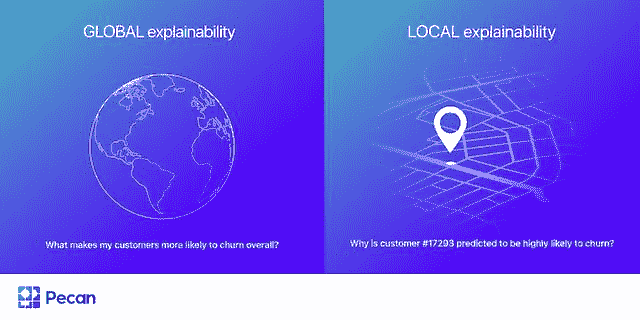

# 为什么“可解释的人工智能”能让企业受益

> 原文：<https://thenewstack.io/why-explainable-ai-can-benefit-business/>

如果你曾经收到一封来自银行的信，解释不同的金融问题如何影响信贷申请，你就会看到可解释的人工智能在工作——一台计算机使用数学和一组复杂的公式来计算分数，并决定是批准还是拒绝你的申请。

在做出这个决定时，一些数据点或多或少都很重要。也许你长期按时付款的历史或者你的低负债促成了你的申请被批准。

同样，可解释的人工智能向人类展示了它是如何通过评估计算中的不同输入来做出决定的。虽然这可能听起来晦涩难懂，或者只与最核心的数据人员相关，但可解释的人工智能带来了重大的商业优势，任何对应用人工智能感兴趣的人都应该考虑。可解释的人工智能也提供了一个进入人工智能工作的窗口，并在其建议中建立信任。

## 并非所有的人工智能都是可以解释的

人类建造人工智能系统，但这些建造者并不总是能够精确地确定人工智能如何做出特定的决定或输出。这些类型的人工智能系统有时被称为“不透明的”，因为很难知道它们内部到底发生了什么。他们做出一个决定或吐出一个数字，但很难准确知道导致这一结果的过程。

然而，许多人工智能过程的建立是为了让人类能够理解他们是如何得出结论的。这些被称为“可解释的”在一些行业和国家，[对监管](https://mailtrack.io/trace/link/af840de913fe74824b896858a2e4b29008b18f98?notrack=1&url=https%3A%2F%2Fhbr.org%2F2021%2F09%2Fai-regulation-is-coming&userId=7597162&signature=2a913f2a0980c4b6)越来越感兴趣，要求当人工智能用于某些领域时，如金融服务、人力资源和医疗保健，需要有可解释性。营销也可以在[负责任的人工智能治理](https://mailtrack.io/trace/link/eee575ddd554c420dfc248c3ef321548016d73de?notrack=1&url=https%3A%2F%2Fmartech.org%2Fgoverning-ai-what-part-should-marketing-play%2F&userId=7597162&signature=ccd33908dad899ca)中发挥作用，尤其是当可解释的分析方法被用于营销过程时。

## 可解释的人工智能为商业提供了什么

可解释的人工智能可以揭示哪些因素对整个系统最重要，以及哪些因素对任何特定的决策或产出最重要。在数据科学中，这些因素通常被称为“特征”

可能有两种解释:

*   **全球解说。**例如，如果您正在预测客户流失，您可能会了解到客户服务互动和网站访问是指导模型预测所有客户整体流失的主要功能。
*   **当地的解释。虽然对人工智能预测的整体解释很有帮助，但更有价值的是为特定预测找出最有效的特征。在客户流失的例子中，为什么预测某个特定的客户很有可能流失？他们的个人原因可能是最近活动减少和延迟付款。了解这些原因可以让你决定采取正确的行动来留住客户，或者让他们流失。**

理想情况下，一个可解释的人工智能系统预测流失将提供全球和局部的解释。您可以获得对这两个级别的功能的重要性的详细见解——与客户流失相关的更广泛的问题以及具体的客户级别的解释。这两种解释对利用人工智能的企业都有很大的用处。

## 对战略使用全球解释

预测模型的全局解释有助于理解模型的运行方式，并评估模型是否按预期运行。即使你发现了一些令人惊讶的东西，在指导模型预测中最重要的特征应该是有意义的。在检查重要特性时，您可能还会注意到一些问题:看起来顺序不对的特性，或者您知道应该存在的特性丢失了。全局特征重要性信息可以指导下一步优化模型的步骤。

一旦你对你的模型感到满意，对模型预测的整体解释也可以作为指导商业策略的无价信息来源。这些高水平的预测性见解可以揭示投资或改进的关键领域。

例如，让我们回到客户流失的场景。您注意到，在您的客户流失模型中，一个重要的预测因素是代表客户联系客户服务的次数的特征。这种洞察力可能会帮助你决定客户服务培训和人员配备是你的企业需要投资的领域，以帮助全面减少流失。

## 使用当地的解释来个性化客户体验

这种高层次的指导只是可解释的人工智能帮助商业目标的一种方式。更有价值的是解释个人预测的能力，例如，用模型分析的每个客户的预测行为。

了解哪些功能对单个客户的预测结果影响最大是非常宝贵的信息。现在，您可以准确地处理这些因素，以尝试影响(或强化)客户的结果。

在客户流失的情况下，对于一个特定的可能流失的客户来说，最强有力的预测因素可能是你的服务活动的减少。有了这些细节，你现在就可以计划如何去接触那个特定的客户来留住他们。也许这是一次促销或一个特殊的活动邀请，可以重新激发他们的兴趣，让他们重新参与进来，并防止他们翻腾。

当然，你不会费力地为你成千上万的客户中的每一个人研究一行又一行的特性重要性细节，然后单独选择要采取的正确行动。相反，您可以使用这些行级预测洞察来定义客户群，每个客户群都会收到与其需求相匹配的不同行动。

当然，客户细分是业务分析中的一项常见活动，但它通常基于包含过去客户行为信息的业务规则集。当可解释的人工智能提供前瞻性预测时，这些细分可以改为基于未来可能发生的事情。对于那些希望个性化和塑造未来客户体验的人来说，这是一个更有价值的视角，而不仅仅是看到昨天发生的事情。

## 可解释人工智能的局限性

重要的是要注意，虽然可解释的方法对于实现业务成果来说仍然好得多，但它们也不是没有一些限制。首先，对于复杂的机器学习模型，通常唯一可用的解释形式是特征重要性。很难准确理解如何在模型中一起使用这些特征来生成最终预测。

当然，如果特征是基于低质量的数据，即使可解释的人工智能也没有用。如果您没有基于干净、准备充分的数据的准确、有意义的特征，您的模型的性能和可解释性都会受到影响。

这个问题就是为什么数据科学专家越来越多地转向以数据为中心的思维模式，这种思维模式强调高质量数据和构造良好的功能的重要性。(我已经在其他地方建议过，这种观点应该从自然语言处理(T2)扩展到表格数据。)虽然许多数据科学家花费大量时间修补模型，但投资于数据准备可能对模型性能、可解释性和业务成果更有益。

无论它是如何实现的，模型可解释性增强了对重要业务流程的理解，并且它通过对未来的了解来授权高层和个人级别的行动。在快速变化的市场条件下，企业需要尽可能多的远见，可解释的人工智能提供了一个了解当前和未来趋势的宝贵窗口。

<svg xmlns:xlink="http://www.w3.org/1999/xlink" viewBox="0 0 68 31" version="1.1"><title>Group</title> <desc>Created with Sketch.</desc></svg>