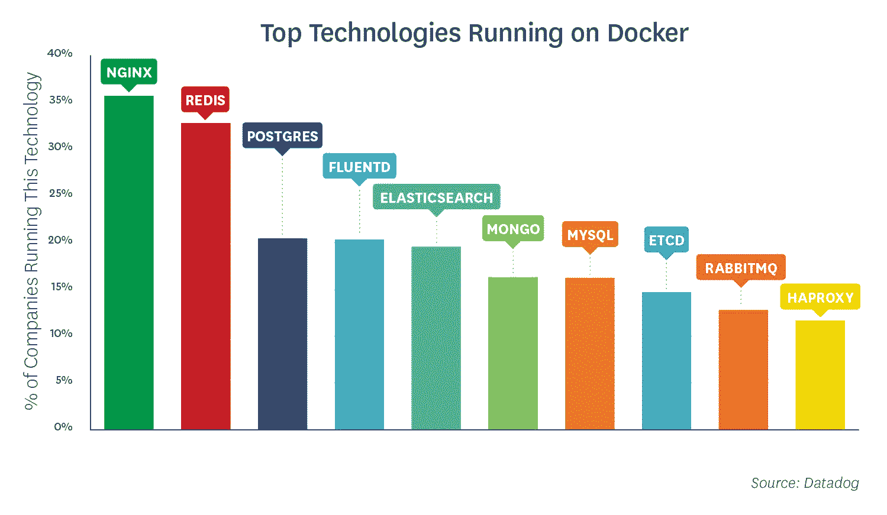

# F5 Networks 为何收购 NGINX:容器和现有用户群

> 原文：<https://thenewstack.io/why-f5-networks-bought-nginx-containers-and-existing-user-base/>

[去年](https://dzone.com/articles/the-three-http-routing-patterns-you-should-know)，F5 Networks 发现其 BIG-IP 客户的虚拟服务器中有 63%是 HTTP/S。根据 F5 的[应用服务状态报告 2019](https://www.f5.com/state-of-application-services-report/interactive-report-2019) ，部署 HTTP/2 网关的调查受访者比例从 2017 年的 27%增加到 2019 年的 47%，另有 25%的受访者预计在未来 12 个月内使用这项服务。凭借其庞大的服务器安装基础和先进的功能，难怪 F5 Networks [寻求收购](https://thenewstack.io/f5-to-buy-nginx-to-enhance-cloud-native-and-multicloud-capabilities/) NGINX，以支持这一需求不断增长的领域。

根据来自 [Netcraft](https://news.netcraft.com/archives/2019/01/24/january-2019-web-server-survey.html) 和 [Web 技术调查](https://w3techs.com/technologies/overview/web_server/all)的数据，Ngnix 和 Apache web 服务器在计算机上的使用比例大致相同，并且在全球范围内处于领先地位。Ngnix 本身是一项成熟的技术，但它作为反向代理的使用使其处于微服务架构的中心。

HTTP 网关通常用于提供入口控制，入口控制通常用于将应用程序流量路由到容器化的环境。正如我们之前[提到的](https://thenewstack.io/f5-to-buy-nginx-to-enhance-cloud-native-and-multicloud-capabilities/)，64%的 Kubernetes 用户受访者将 Nginx(开源或由同名公司提供)用于入口控制，只有 15%的受访者使用 F5 网络。Nginx 正在为容器做大量的路由工作。事实上，根据 Datadog 对运行其软件的客户的分析，Nginx 在 Docker 容器中运行的次数比任何其他技术都多。

根据你营销的内容，负载平衡和反向代理之间有一条细微的界限。传统上，负载平衡由硬件在网络级别处理，但软件定义的方法多年来一直占据优势，Citrix 和 F5 现在都提供了提供许多高级应用服务的解决方案。对于反向代理来说，开源选项是最广泛使用的，并且启发了像 [NGNIX、](https://www.nginx.com)T2、【HAProxy】和 [Containous](https://thenewstack.io/traefik-a-dynamic-reverse-proxy-for-kubernetes-and-microservices/) 这样的企业。

老牌公司和新兴公司正在根据它们提供的高级服务类型以及它们如何与更新的云原生基础架构集成来展开竞争。这些公司将继续在多条战线上竞争。一个是针对 DNS 安全等高级服务，根据 F5 的调查，除了 HTTP/2 网关，对 DNS 安全也有强烈的需求，这通常由 Cloudflare 和 NS1 提供。一年多前，Cloudflare 宣布他们希望不再使用 NGINX，部分原因是他们希望与 Nginx 进行更直接的竞争。

有趣的是，目前只有 27%的 F5 调查对象使用服务网格，这些服务网格几乎总是连接到某种代理。其中最引人注目的是名为[特使](https://thenewstack.io/envoy-and-the-programmable-edge-edge-proxies-and-the-developer-experience/)的服务代理。虽然它是由 Lyft 创建的，但它现在由谷歌工程师主导，并用于 AWS 自己的[服务网格产品](https://aws.amazon.com/about-aws/whats-new/2018/11/introducing-aws-app-mesh---service-mesh-for-microservices-on-aws/)。Istio 是最著名的[服务网格](https://thenewstack.io/tag/service-mesh/)之一，也是 VMware 和 F5 Networks 等公司商业产品的基础。事实上，F5 最近将 [Aspen Mesh](https://aspenmesh.io/) 剥离出来，成为一家专注于服务网格的公司。

随着服务网格使用的进展，我们不知道公司是否能够从中赚钱。或许大型云提供商会提供捆绑的免费服务？现有的硬件提供商可以将这种能力添加到他们现有的付费服务菜单中。也许服务网格将只是像 Kubernetes 这样的管弦乐队的一个组成部分。此外，尽管 NGINX 被一家大公司吞并，但开源初创企业可能会成为竞争对手。

<svg xmlns:xlink="http://www.w3.org/1999/xlink" viewBox="0 0 68 31" version="1.1"><title>Group</title> <desc>Created with Sketch.</desc></svg>