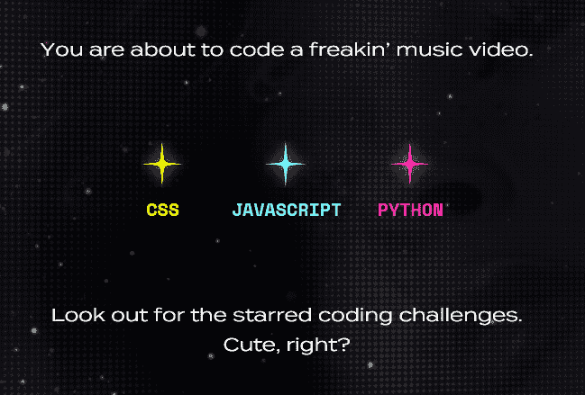
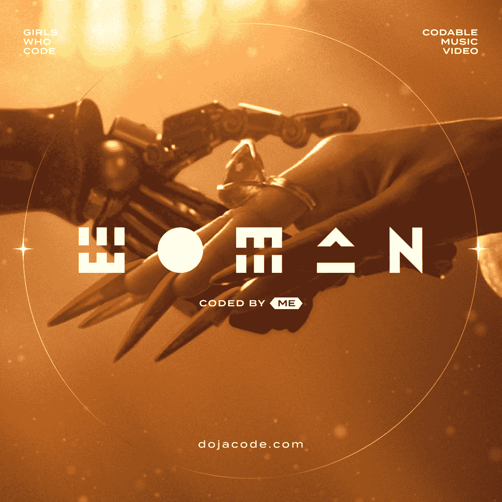

# 为什么“编码女孩”用 Doja Cat 制作了一个音乐视频

> 原文：<https://thenewstack.io/why-girls-who-code-created-a-music-video-with-doja-cat/>

在过去的一年中，我最喜欢的时刻之一是一次非常有创意的尝试，为计算机编程世界带来长期的变化——当女说唱艺术家 Doja Cat 发布了她称之为“T0”的世界上第一个可驯服的音乐视频

这是吸引年轻女性进入计算机科学的更大运动的一部分。或者，正如编码女孩[后来在推特](https://twitter.com/GirlsWhoCode/status/1467974113507659778)上说的，“好吧，这是官方的。Doja Cat 可能是有史以来最酷的编码老师。”

该非营利组织于 2012 年成立，专门解决技术领域的性别差距——其中一项任务是让年轻女孩*对计算机科学领域感兴趣*。

创始人 [Reshma Saujani](https://www.linkedin.com/in/reshma-saujani/) [最近在推特上写道](https://twitter.com/reshmasaujani/status/1466827282992054285)“当我创建《编程女孩》时，我打了个赌。“你不能仅仅通过教女孩编程来缩小科技领域的性别差距。你必须改变我们的整个文化。关于什么是编码以及它能让我们做什么的态度。关于谁是编码员，编码员长什么样。”

这就是 Doja Cat 的用武之地。

## “她星球”上的编程乐趣

一个特殊的网站在一个独特的界面上展示 Doja Cat 的最新音乐视频，让观众使用计算机代码改变视频中的图像——这已经大受欢迎。当编程女孩在推特上发布关于新网站的公告时，它吸引了超过 1000 次转发和 2714 次赞。(这条推特的第一条回复来自芭比的官方推特账户，她回应道:“[难以置信](https://twitter.com/Barbie/status/1466793752387895302)”)

《编程女孩》在一份声明中表示，“这项体验的目的是向新一代粉丝展示，他们可能不知道科技和计算机科学领域的职业机会，以及它有多么有创意和有趣。”

嗡嗡声开始迅速形成…

到圣诞节时，YouTube 仅在头三周就显示了超过 4000 万的新视频浏览量——而且每天还吸引着近 100 万的新浏览量。其中一些来自十几岁的女孩通过 DojaCode.com 访问视频，享受其独特的教育和娱乐的结合。

音乐视频显示，多加猫是“她的星球”的统治者，收到了关于有人窃取她的王位的紧急警告。但对于 DojaCode.com 的观众来说，视频暂停在女王多加迷人的长指甲特写上，屏幕提示敦促游客在屏幕左下方突出显示的一行 CSS 代码中键入新的颜色名称。

当他们开始输入时，网站会自动填充一些建议，包括指甲颜色主题的选择，如彩虹、像素、水、蛇、豹和爬行动物。对于困惑的人，有一个圆圈中的问号图标，但它只是再次提出了同样的简单挑战:“键入任何你想要的颜色。”

特写镜头中的长指甲会立即切换到访客输入的任何颜色。

当视频到达一个神秘的金色闪光漩涡时，视频再次暂停——这一次在屏幕的左下角显示了一段 *JavaScript* 代码。“激活 Doja power，”评论暗示，突出显示了三行 JavaScript 代码，并建议观众“尝试键入任何数字。”

有名为`particles.height`和`particles.speed`的变量(以及一个名为`particles.color`的基于文本的变量)——果然，改变变量的值会给动画图像带来变化。

歌曲和视频的新鲜创意不知何故注入了编程挑战。“把你的天空带到她的星球上，”后来的一条评论建议，让用户向名为`date.timeZone`(以及`sky.clouds.type`和`sky.tint.Color`)的 JavaScript 变量输入他们自己的值。

最后的编码挑战是什么？"创造花洒——改变花的数量和颜色."《the Verge》的周末新闻编辑 Emma Roth[写道](https://www.theverge.com/2021/12/5/22817753/doja-cat-video-girls-who-code)“虽然 DojaCode 视频不涉及任何大量的编程，但我仍然发现尝试输入不同的选项并看到我的改变立即生效很有趣。”

视频结束时，观众被邀请保存他们在四个挑战中任何一个挑战的作品截图，或者在 Twitter 或脸书上分享网站链接。

## 让编码变得酷

这是一次真诚的三方合作的最终结果，其中包括积极的营销机构 Mojo 超市，它在 2020 年创建了一个在线门户网站用于观看奥斯卡直播，所有广告都被女性导演的电影预告片取代。

RCA Records 与 Active Theory 合作，这是一家创意数字制作工作室，可以建立独特的应用程序和网站，以及装置，甚至 VR 和 AR 体验。(除此之外，该工作室还与美国宇航局喷气推进实验室在[合作开发了一个教育网站](https://opensourcerover.jpl.nasa.gov/)，列出了你建造自己的火星漫游车所需的所有现成零件。)

所有的合作者似乎都带着明确的目的感来参与这个项目。 [Emily Berger](https://www.linkedin.com/in/emilyrberger/) ，Mojo 超市的创意负责人，在该项目的[公告](https://girlswhocode.com/news/doja-cat-and-girls-who-code-create-dojacode-interactive-music-video-experience-for-woman)中声明“我们想让更多的女孩尝试编码。但是有一千件事情是女孩们比编码更关心的。而 Doja 猫就像是其中的 999 只。所以我们就想 Doja 能让学习编码变得很酷吗？”

视频的导演名叫[孩子。](https://www.littleminx.tv/child))在声明中补充道“这个项目对我来说是一个特别有意义和独特的项目。在创意领域看到更多包容性是我真正热衷的事情，因此成为一个项目的一部分，让年轻女孩接触到一个全新的行业，同时通过使用代码担任 Planet Her all 的创意总监，这真的意义重大。”

Doja Cat 表示，她也对此次合作感到非常兴奋。“世界各地的粉丝将可以通过一个微型网站输入代码，解锁一些非常酷的特殊功能，”她在该项目的公告中说，并补充说“这将非常棒。”

在为 Twitter feed 编码的女孩上，该组织分享了一些热情的反应。“我一直是我的编程班里唯一的女孩，”一位观众在推特上写道。“我过去常常隐藏自己的女性特质，因为我害怕不被重视。这就是为什么这对我如此重要。谢谢大家。”

## 正确的榜样？

由于 Doja Cat 正成为流行音乐中最热门的名字之一，该网站在青少年中有着额外的声望。2020 年，她[创造了一项吉尼斯世界纪录](https://www.guinnessworldrecords.com/world-records/617361-first-female-rap-duo-to-reach-no-1-on-the-us-singles-chart)，成为第一个在美国“公告牌 100 大热门”排行榜上拥有冠军记录的女子说唱组合(和妮琪·米娜)的一员。

截至 2021 年底，她已经获得了 11 项格莱美提名，在 Instagram 上拥有 1800 万粉丝，在 Twitter 上还有 400 万粉丝。(福布斯 10 月的一篇文章提到了她“冷漠、不敬、长期在线的形象”，但也是“不知疲倦的职业道德”)

但并不是每个人都相信她的视频传达了正确的信息。[安妮塔·拉瓦库马尔](https://www.linkedin.com/in/anita-lavakumar-ed-d-260945)，波斯顿公立学校的计算机科学项目主任，是编程女孩的粉丝，称可编程视频是一个“伟大的想法”但是拉瓦库马尔也对歌曲的选择提出了质疑，他问道“性的画面和歌词‘让我成为你的女人’到底是如何赋予女性力量的？”

Lavakumar 还想知道这个视频最终是针对哪个年龄组的，并抱怨说这个练习最终“没有达到目标”。

或者，正如一位评论者在 the Verge [上所说的](https://www.theverge.com/2021/12/5/22817753/doja-cat-video-girls-who-code#546414992)，“我不确定一个半裸女孩穿着珠宝制成的比基尼旋转的音乐视频是正确的形象。”

林赛·萨克斯(Lindsey Sachs)也参与了进来，他是一所天主教独立学院的技术整合专家，该学院面向学龄前至八年级学生。萨克斯曾让女生与女中学生一起编写素材，而[在推特上发布了关于视频](https://twitter.com/sachs_lindsey/status/1466862478944620557)的消息，“我知道她们会喜欢这种体验。”

但萨克斯认为该视频过于色情(包括饮酒)，最终称其“不合适”她还抱怨说，在视频中 Doja Cat 也在视觉上传递了错误的信息。“对不起，不会用这个把编码带到我的学校，”她在推特上说。

公平地说，在该网站的歌曲版本中，一些露骨的词语被替换成了一种快速的电台风格的声音音量下降。一位评论者反驳说“看到一个很多女孩都崇拜的榜样以一种有趣的方式推广 STEM 真是太好了。”

[Code.org 的首席项目官杰奎琳·斯莫斯](https://www.linkedin.com/in/jacqueline-smalls-7aa091118)，还特意[称赞](https://twitter.com/jackrocs/status/1466799156400324611)这个视频“建立了相关的联系来激励年轻女性去编码！”

虽然称之为“T6”对追求 STEM 的一代妇女和女孩来说是如此鼓舞人心，但面向青年的非营利组织 Do Something 也称赞它是“提醒人们，这个领域远不止广告宣传的那样。”

事实上,“编码女孩”的声明[强调这是一系列活动的一部分,“旨在改变对编码者长相和行为的普遍描述。”。让女孩和来自技术领域代表性不足的群体的人能够想象自己是行业的未来，是实现该组织到 2030 年消除技术领域性别差距的北极星使命的关键。”](https://girlswhocode.com/news/doja-cat-and-girls-who-code-create-dojacode-interactive-music-video-experience-for-woman)

在 Twitter 上，该组织补充道，“我们认为与一位格莱美提名的超级巨星合作是实现这一转变的惊人一步。”

或许是为了强调这一点，他们分享了 Slack 软件工程师[玛雅·贝洛](https://linktr.ee/mayabello)的反应视频，她滔滔不绝地说，“我觉得我的心从来没有这么开心过。”

<svg xmlns:xlink="http://www.w3.org/1999/xlink" viewBox="0 0 68 31" version="1.1"><title>Group</title> <desc>Created with Sketch.</desc></svg>