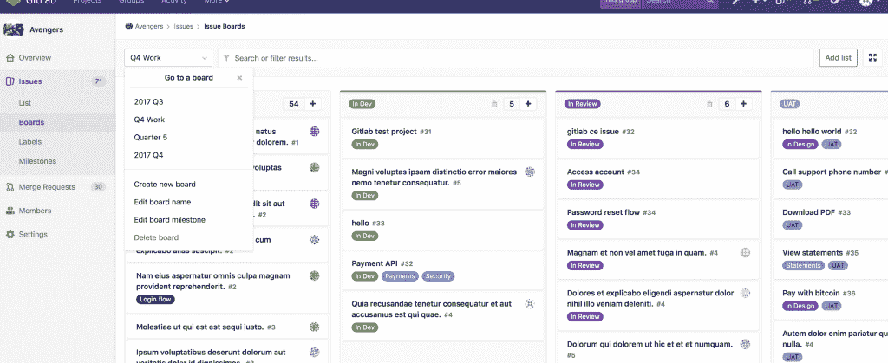

# 为什么 GitLab 选择免费提供其“核心”产品

> 原文：<https://thenewstack.io/why-gitlab-opted-to-make-its-core-offering-free/>

在软件开发和编码的[新冠肺炎·疫情](https://www.nytimes.com/2020/04/09/us/coronavirus-live-updates.html)之后，软件开发人员和工程师的工作方式可能不会发生很大变化，尤其是如果你是远程工作的话。

然而，外部世界已经发生了很大的变化，尽管发生了其他事情，这些可能的深刻变化将影响软件行业。事实上，我们刚刚了解到经济形势有多糟糕。对于任何依赖软件开发作为其商业模式的组织来说，很有可能成本削减即将到来。这可能包括避免投资专有软件，转向开源软件。此举也可能是避免裁员的一种方式，尤其是当经济再次复苏时，组织可以避免寻找和雇用有才华的开发人员的困难。

正是在这种背景下，DevOps 平台提供商 [GitLab](https://about.gitlab.com/) ，因其基于 [git 的](https://thenewstack.io/git-at-15-how-git-changed-the-way-we-code/)版本控制服务而广为人知，选择免费提供大量之前付费的功能，作为其[核心产品](https://about.gitlab.com/blog/2020/03/30/new-features-to-core/)的一部分。

GitLab 这样描述这些现在可以免费下载和使用的功能:

*   **计划**:同步与相关问题、导出问题、问题板焦点模式和服务台的协作。
*   **创建**:利用 web 终端为 WebIDE 构建更好的代码和强大的分支，文件同步到 web 终端和设计管理。
*   **验证**:通过合并请求的报告提高代码质量。
*   **包**:在一个地方用一组包管理器更有效地构建和共享
*   **发布**:canary 部署、增量部署、功能标志和部署板简化了持续交付。
*   **配置**:支持多个 Kubernetes 集群，方便不同环境的部署。
*   **保卫**:用容器网络安全的网络策略支持应用程序安全。

在许多方面，GitLab 的举动表明了它对与开源社区的工作关系的承诺，并保持了它对开源平台的管理作用，GitLab 产品管理执行副总裁 Scott Williamson 告诉 New Stack。显然，GitLab 计划肯定会在此举中“回归”，以帮助扩大其作为完整 DevOps 平台提供商的角色，同时“回馈”，Williamson 说。

“这是公司的根本:继续回报，并为社区提供价值，”威廉姆森说。“我的意思是，一部分是我们想回来——一部分是，从长远来看，我们相信这有助于 GitLab。”

“回来”部分反映了这一举动也可能有助于增强 GitLab 的核心功能，当然，这也是开源社区合作的魔力所在。“这一举动是有意义的，因为供应商在构建专有的新功能和功能时，往往会将更多的功能和功能转移到开源，部分是为了防止他们的开源版本远远落后于他们的付费版本，”[cloud native and devo PS，](https://451research.com/analyst-team/analyst/Jay+Lyman) [451 Research](https://451research.com/) (现为 S&P Global Market Intelligence 的一部分)首席分析师杰伊·莱曼告诉新堆栈。“我们已经看到开源软件的模块化、灵活性和社区方面可以通过实现集成和创新而使 DevOps 团队受益。”

对 whit 来说，DevOps 团队现在可以利用 GitLab 存储库中集中的一系列开源包管理器，并为之做出贡献。[企业管理协会(EMA)](https://www.enterprisemanagement.com/) 的分析师 [Torsten Volk](https://www.linkedin.com/in/torstenvolk) 告诉新的堆栈，集中管理今天过剩的特定于语言和操作系统的包管理器使开发人员更容易重用已经存在的代码模块，而不是花费时间重写它们。“开发人员越容易找到并构建现有代码，他们就可以花越多的时间来编写自己的原始代码，”Volk 说。

Volk 说，开发人员还可以在他们已经使用的代码包中添加注释，使他们更容易被他们的同事重用。与此同时，管理层可以集中应用部署策略和访问使用报告，以实现持续合规，当然，还可以主动鼓励或阻止特定代码包的使用，他说。“开源这些统一的包管理功能有助于 GitLab 成为连续交付的一站式商店的最终目标，”Volk 说。

威廉姆森指出，DevOps 团队现在可以访问 C、C++、Java、Node.js 和其他项目的包注册工具——Python 功能即将推出。威廉姆森说:“许多客户为这种服务支付额外费用，所以它在核心中可用，有大量的额外价值。”

作为开源替代方案，Core makes 的功能和特性的可用性也应该保持可访问性，无论业务环境和经济条件如何。

“开源以前专有的工具集提供的第一件事是保证。“如果软件是开源的，公司知道他们总是拥有它，不管供应商做出什么决定，如果只是作为紧急情况下的一种选择，”[red monk](https://www.linkedin.com/in/sogrady/)的分析师斯蒂芬·奥格雷迪说。“因此，DevOps 团队在使用它时会更有信心，因为他们知道他们不会受制于单一的专有供应商。重要的是，小型和大型组织都从中受益。”

Core 的发布也被视为 GitLab 的一项更广泛的举措，旨在帮助组织在经济环境变得更加严峻的情况下，至少在短期内，增加对开源软件的使用，以节省成本。

“以前的经济衰退，包括 2008-2009 年，确实推动了企业使用开源软件，我希望在当前的疫情中看到同样的效果，因为组织寻求避免支付软件使用费和提高效率，”Lyman 说。

莱曼说，严峻的经济形势也可能——至少在理论上——促使组织转向 DevOps 平台，如 GitLab 为其软件即服务(SaaS)应用程序提供的平台。“虽然组织希望从现有的内部部署中获取尽可能多的价值，但 SaaS 也可能变得更有吸引力，因为它可以替代可能消耗更多人力资源的本土工作，”Lyman 说。

对于 DevOps 的采用，最近的 451 Research [“企业之声:DevOps”](https://451research.com/services/customer-insight/voice-of-the-enterprise)调查数据表明，“响应市场变化的灵活性是 devo PS 的主要驱动力和优势之一，”Lyman 说。“当前的市场形势凸显了这种就绪性的价值，它很可能会推动更广泛地采用 DevOps，”Lyman 说。

然而，几乎具有讽刺意味的是，例如，相对于较小的初创公司，大型组织通常拥有内部资源来利用新的开源替代方案，这些替代方案以前可能只作为昂贵的专有软件提供。“在使用社区开源软件时，大型组织往往有更多的内部专业知识和人才，而没有相同类型人员的小型组织往往选择开源的付费商业支持，”Lyman 说。“也有例外，但像(GitLab 的核心版本)这样的举措通常对大型企业最有意义。”

GitLab 是新堆栈的赞助商。

来自 Pixabay 的特征图像。

<svg xmlns:xlink="http://www.w3.org/1999/xlink" viewBox="0 0 68 31" version="1.1"><title>Group</title> <desc>Created with Sketch.</desc></svg>