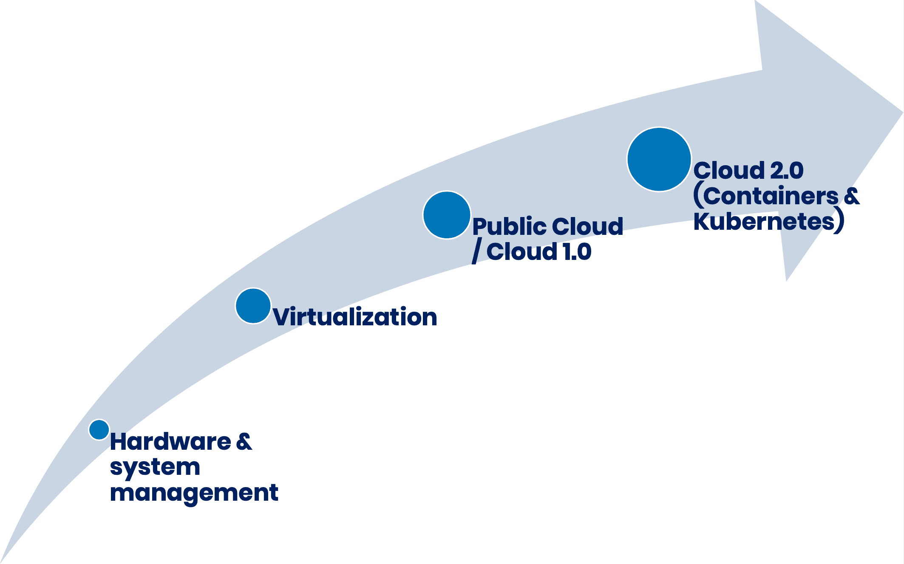

# 当人们说 Kubernetes 是新的虚拟化层时，我为什么会退缩

> 原文：<https://thenewstack.io/why-i-cringe-when-people-say-kubernetes-is-the-new-virtualization-layer/>

你见过多少次这样的图表？也许某个云供应商向您展示了它，或者您在分析师演示中看到了它。

了解基础设施如何从裸机到虚拟化再到云，再到现在的容器和 Kubernetes？虚拟化是一个基础架构概念，它将裸机分割成工作负载可以驻留的较小单元。容器可以是一个更小的计算单元，你可以把应用程序的一部分塞进去。所以容器化是新的虚拟化。这个想法表达起来很整齐。如此简单。太误导了。

 [蒂娜·诺尔特

Tina Nolte 是 Spectro Cloud 的产品副总裁。近十年来，她一直在专注于云基础架构和机架级架构的初创公司以及更成熟的基础架构公司从事云原生和横向扩展技术方面的工作。她拥有麻省理工学院分布式计算博士学位，喜欢阅读科幻小说和建造大型乐高星球大战套件。](https://www.linkedin.com/in/tinanolte/) 

让我们后退。最终，当某人使用图中的任何技术时，都是为了运行某个东西，不管它是否简单。某处有一个应用程序运行的基础设施，加上一些平台服务和应用程序本身。这就是我认为误导在图表中发挥作用的地方。该图暗示了通过 Kubernetes 的容器和容器管理是基础设施。基础设施的发展往往会带来密度和成本方面的“硬”优势，但最重要的是，这在历史上对应用程序来说几乎是不可见的。

对于图表中的前几个步骤来说，情况确实如此。以虚拟机(VM)为例，从裸机到 VM，应用层没有太大变化，因为 VM 只是提供了一种部署相同旧应用程序的新方法；主要的区别是应用程序现在与它们主机上的邻居共享空间。云 1.0 也是一个基础架构重头戏—您运行的是相同的旧的、现在已虚拟化的应用程序，只是在其他地方。正如一个流行的贴纸所说，“云只是别人的电脑。”到目前为止，图表还不错。

但是……云 2.0 有所不同。当然，有容器和管弦乐队。但是还有更多。你的应用看起来不一样。它的架构和构造都不同。它的行为不同。一般来说，你不会把旧的工作负载搬到这个世界上；这些应用以前是不存在的。现在我们碰到了图表的障碍。云 2.0 不仅仅是一种将更多相同的旧应用程序打包到各处机器上的方式。云 2.0 不仅要求 IT 有所不同，还要求应用程序和开发人员有所不同。云 2.0 不仅仅是看似不可避免的“升级到正确的”基础设施之旅的又一步。容器化不是新的虚拟化层。

你可能认为这是一个愚蠢的语义论点，或者问“这有什么关系？”世界观很重要。通过语言引入或放大的偏见。它们改变了我们解读和推理周围事物的视角。想象一下，如果柯达认为自己是一家成像和图片捕捉公司，而不是一家胶片公司，事情会有多么不同(如果这个例子对你没有印象，柯达发明了数码相机，但后来放弃了，因为他们是一家“胶片”公司；柯达 2012 年破产是因为……其他公司的数码相机)。

我们有很多以基础架构为中心的观点会将 IT 工作引入歧途的例子。还记得 OpenStack 是如何在各地部署的吗？IT 供应商和管理人员认为，如果他们在内部提供的神圣基础架构三要素(计算、存储和网络)比在公共云中更便宜，那么人们就会继续使用自己的基础架构。通过从 IT 基础架构的角度思考问题，他们错过了许多将公共云变成今天这个庞然大物的实际行动——在平台服务和弹性资源消耗方面。他们构建了昂贵的产品和解决方案(想想思科 Intercloud、惠普 cloud、我自己的 Nebula 和其他创业公司尸体的整个墓地),但这些产品和解决方案从来没有去过任何地方，因为它们的设计观点不仅忘记了开发人员，而且从一开始就没有真正理解他们。因此，他们肯定错过了开发人员正在用微服务和深度平台服务做的事情。认为云只是基础设施，这让他们甚至看不到除了提供三位一体之外还有更多事情要做。

像 Kubernetes 和 containers 这样的技术提供的东西正好位于基础设施和一些人不得不求助于 PaaS 的东西之间，即分布式计算工具。尤其是 Kubernetes，它以声明性模型的形式为开发人员提供了大量的功能来真正描述他们的容器层，同时还提供了所需的状态维护，以确保模型得到满足。通情达理的人可能会对基础架构团队是否应该管理该层有不同的看法，并且不同公司的实际答案肯定会有所不同。但是，让我们都清楚，有比图中的箭头懒洋洋地暗示并让您相信的更深更复杂的东西，即我们已经找到了一种方法，可以神奇地将应用程序打包到不同的盒子中。

容器和编排是在一个非黑即白的世界中迈出的一大步，在这个世界中，基础设施、服务和应用程序之间的界限变得更加模糊，开发人员和 IT 人员都需要了解它并做出改变以适应它和彼此。

<svg xmlns:xlink="http://www.w3.org/1999/xlink" viewBox="0 0 68 31" version="1.1"><title>Group</title> <desc>Created with Sketch.</desc></svg>