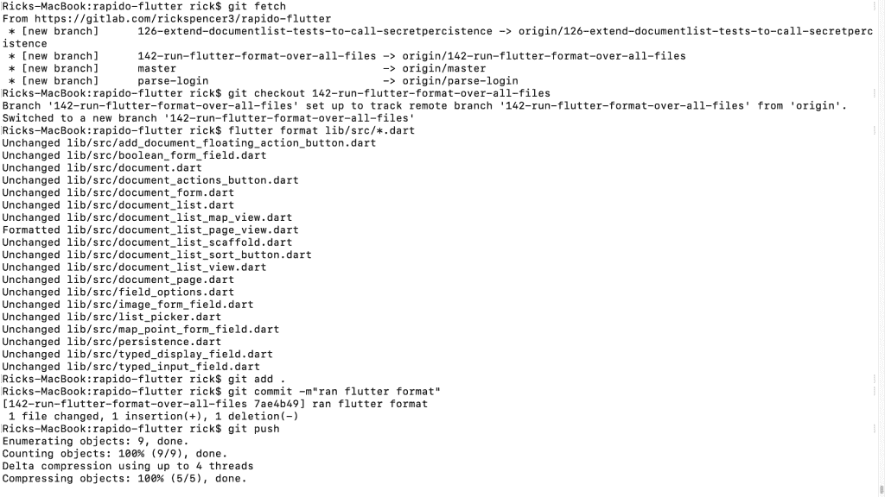
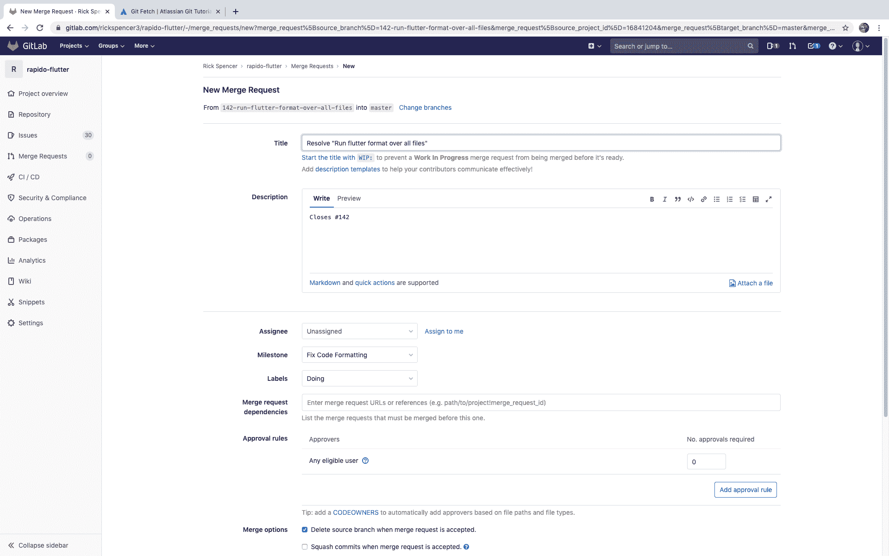

# 为什么我将个人项目转移到 GitLab

> 原文：<https://thenewstack.io/why-i-moved-my-personal-projects-to-gitlab/>

 [里克·斯潘塞

里克是 InfluxData 的平台主管，他的职责包括领导核心存储引擎、开发人员工具以及在多个云和地区的 Kubernetes 上运行 InfluxDB Cloud 2.0。Rick 的背景包括 Visual Studio.net 第一版开发人员可用性方面的开创性工作，以及 Ubuntu 项目的领导，Ubuntu 项目是最大和最活跃的开源社区之一。](https://www.linkedin.com/in/rickspencer3/) 

我已经记不清第一次使用第三方公共源代码库是什么时候了。为了便于讨论，让我们假设我上传到 SourceForge 上的这段代码标志着我离开微软后的事件。显然，我在那里的第一个项目使用的是 CVS，但后来为了以后的项目，我换到了 SVN。这可能提供了我当时工作的时间框架的一个很好的感觉。

然后在 2009 年，当我加入 Canonical 时，我们有一个名为 [Launchpad](https://launchpad.net/) 的网站和一个名为 [bzr](https://bazaar.canonical.com/en/) 的相关并发版本工具。如果你浏览[我的库](https://code.launchpad.net/~rick-rickspencer3)，你会发现我养成了把所有代码放在网上的习惯。

在这个过程中的某个地方，我也开了一个 GitHub 账户，并养成了将代码存放在那里的习惯。在我离开 Canonical 之后，我还把所有我认为有趣的代码都转移了。去年，我开始了一个副业项目，并在一段时间内完全投入到使用 GitHub 特性上。

1.  我为这个项目创建了一个组织。
2.  我甚至使用 github.io 来存放文档。

## 转移到 GitLab

最近，我把我正在进行的项目 100%转移到了 GitLab。为什么？

1.  我发现 GitLab 的用户界面总体来说更整洁，也更容易找到路。然而，这纯粹是个人喜好问题，可能不是搬家的有力理由。
2.  我也喜欢 GitLab 的开源方式。我远不是一个开源狂热者，但是我更喜欢编写和使用开源软件。虽然 Github 充满了开源项目，但 Github 本身是专有的。相比之下，Gitlab 有一个支持良好的开源版本。
3.  项目导入功能工作得非常好，所以转移代码、分支和问题非常容易。

## GitLab 工作流程

可能最重要的原因是我发现他们的项目管理工作流程很容易使用。让我给你看一个简短的例子。我注意到我自己的程序 Rapido 的[项目标签](https://pub.dev/packages/rapido#-analysis-tab-)上的分析页面抱怨我没有在所有的代码文件上运行 *$flutter 格式* ( [flutter](https://flutter.dev/) )。通常情况下，我会解决这个问题并推送到 master，但这是一个很容易的改变，以演示我为什么使用 GitLab。

首先，我创建一个带有开始和结束日期的新里程碑。这一步不是必需的，但我喜欢这样做，因为这样可以更容易地创建一个讨论板，因为您可以告诉讨论板过滤那个里程碑中的问题。如果我花几分钟给每个问题添加权重，它也会自动创建一个燃尽图。

默认情况下，里程碑中没有任何问题，因此板上也没有问题。这个项目只有两个任务，但是出于演示的目的，我将添加它们。

使用“+”按钮可以快速添加问题。

接下来，我选择一个要处理的任务，并通过拖拽将它移动到“正在做”栏。

这让世界知道我正在做这个项目。请注意，添加新列很容易。例如，我在我的一个板上为一个不同的里程碑添加了一个“阻止”栏。

接下来，我单击我正在处理的问题，为该问题创建一个分支:

接下来，我转到我的开发计算机，并实际解决了这个问题。通常，这将涉及到编码，但这个特殊的问题我将用一个简单的命令来解决。

1.  使用 *$git fetch origin* 获取我刚刚在本地创建的分支。
2.  使用 *$git checkout* 开始在新分支上工作。
3.  使用 *$flutter 格式*修复代码。
4.  推树枝。

整个工作流程如下所示:

现在我回到 GitLab，提出合并建议(他们对拉式请求的称呼)。并接受它。当然，在有合作者的项目中，我会将 MP 分配给其他人来接受，但是这样会让人理解。

 

注意 GitLab 知道这个 MP 关闭了什么问题，它自动为我添加了一个评论。因此，当我返回到项目板时，您可以看到该板已为我自动更新。

我忽略了集成到 GitLab 中的许多其他功能，例如 CI，我计划在将来使用它。就报告而言，这个特定里程碑的燃尽图(至少我是这么称呼它的)很无聊，但是一个更大的项目的[里程碑是自动创建并保持更新的，有点更有趣。](https://gitlab.com/rickspencer3/rapido-flutter/-/milestones/1)

我喜欢这个工作流程是完全集成的。我和一个朋友合作了另一个项目，我发现 GitLab 的工作流程非常适合这个项目。

我想有些人会指出，我可以通过 GitHub 功能的不同组合和附加产品来完成所有这些，但是，我不得不说，它从来没有像这样简单和设计得如此好。

## 互联网积分

那么，搬到 GitLab 我放弃了什么？据我所知，大部分是免费上网点。

我认为 GitHub 对我个人项目的最大拉动是社交网络。Rapido 现在有 69 颗星，这是一个适度的表达兴趣的数量，但这比我自己在 GitLab 中添加的一颗星要多。此外，我从来没有听到任何人说，“这是我的 GitLab 句柄”，人们对 GitHub 这样说。

除了假的互联网积分，我在 GitHub 收到过一些投稿。到目前为止，这些大多是打字错误的修复，但不要搞错:它们是有用的贡献。我怀疑人们不会为 GitLab 上的项目做贡献，因为他们没有 GitLab 帐户，也不想学习新工具。时间会证明一切。如果我认为我犯了一个错误，我可以随时在 GitHub 中取消归档项目。

<svg xmlns:xlink="http://www.w3.org/1999/xlink" viewBox="0 0 68 31" version="1.1"><title>Group</title> <desc>Created with Sketch.</desc></svg>