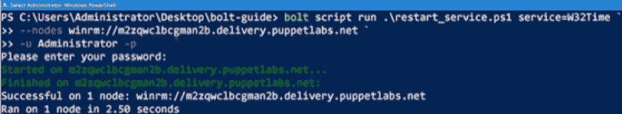
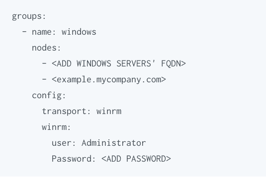
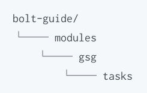
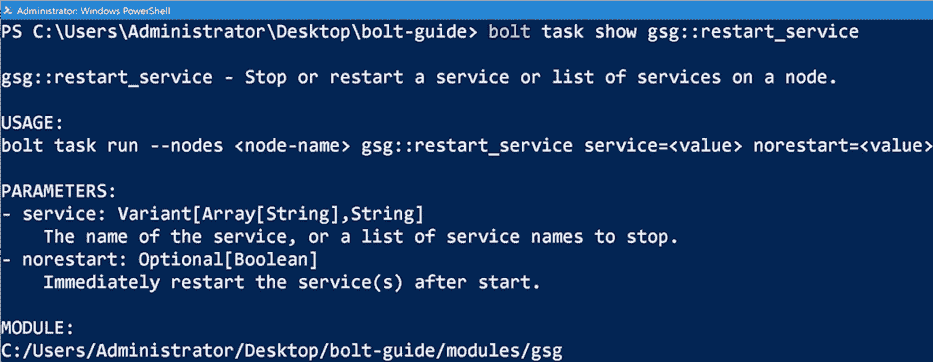
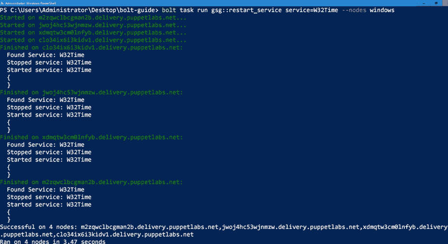

# 为什么基础设施自动化需要 PowerShell + Bolt

> 原文：<https://thenewstack.io/why-infrastructure-automation-needs-powershell-bolt/>

PowerShell 和 Bolt 是一个强大的团队。

为什么？

Bolt 是一个无代理的多平台开源工具，允许您根据需要或作为更大的编排工作流的一部分来自动化任务。您可以使用 Bolt 来修补和更新系统，排除服务器故障，部署应用程序，提供云资源或停止和重启服务。PowerShell 是一种基于任务的命令命令行外壳和脚本语言，有助于自动化管理操作系统的任务。

在本文中，我们将看看 PowerShell 和 Bolt 一起使用的好处，然后通过 PowerShell 脚本和 Bolt 来重新启动服务。

## 结合使用 PowerShell 和 Bolt 的强大功能

 [克莱尔·卡德曼

Claire 是 Puppet 技术出版团队的一员，该团队创建并维护 Puppet 产品文档。她目前负责 Windows 相关内容。在国外学习和工作了几年后，克莱尔现在回到了她在伦敦长大的地方，并在那里建立了木偶办公室。在空闲时间，她喜欢尝试伦敦的许多餐馆，徒步旅行和旅行。](https://www.linkedin.com/in/clairecadman/?originalSubdomain=uk) 

在典型的 Windows 域环境中，您可以用 Bolt 做的许多事情，也可以用 PowerShell 来做。然而，如果您需要在混合的 Windows 和 Linux 环境中执行任务，或者如果您需要编排一个复杂的工作流，Bolt 相对于常规的脚本具有关键的优势。这是因为使用 Bolt，您可以将 Windows 上 PowerShell 中的任务与 Linux 上其他语言的任务混合在一起，同时保持它们都是同一工作流的一部分——一个受版本控制且易于分发的工作流。

通过这种方式，Bolt 允许您轻松地与您的团队成员共享用 PowerShell 编写的小型可重用任务，从而节省重复的工作并减少重复的代码。

Bolt 计划允许您通过[应用清单块](https://puppet.com/docs/bolt/latest/applying_manifest_blocks.html)来添加 Puppet 模块代码，这超出了本文的范围。您可以使用 Puppet 支持的模块或 PowerShell DSC，通过 [dsc_lite 模块](https://forge.puppet.com/puppetlabs/dsc_lite)，将命令性的特定任务与声明性的状态配置混合在一起。

## 运行重新启动服务的 PowerShell 脚本

为了查看 Bolt 的运行情况，让我们来看一个例子，这个例子包括用 Bolt 运行一个脚本，将这个脚本转换成 Bolt 任务，然后执行这个任务。我们将使用的示例脚本名为 [restart_service.ps1](https://gist.github.com/RandomNoun7/03dfb910e5d93fefaae6e6c2da625c44#file-restart_service-ps1) ，执行按需重启服务的常见任务。该过程包括以下步骤:

1.  在远程 Windows 节点上运行 PowerShell 脚本。
2.  创建一个库存文件来存储有关节点的信息。
3.  将脚本转换为任务。
4.  执行新任务。

在我们开始之前，请确保您首先满足了以下要求。

## 在远程节点上运行您的第一个 PowerShell 脚本

让我们从使用 Bolt 在单个目标节点上运行脚本开始。

创建一个名为 bolt-guide 的 Bolt 项目目录。[访问此链接](https://gist.github.com/RandomNoun7/03dfb910e5d93fefaae6e6c2da625c44#file-restart_service-ps1)并将名为 restart_service.ps1 的脚本下载到 bolt-guide 目录中。

现在，在该目录中，使用以下命令运行该脚本。将“节点名”替换为远程 Windows 节点的主机名:

bolt 脚本运行。\ restart _ service . PS1 service = W32Time–nodes winrm://NODENAME-u Administrator-p

系统将提示您输入密码。



现在，您已经将这个脚本置于 Bolt 控制之下，并在一个远程节点上执行了它。该过程将脚本复制到远程节点上的临时目录中，运行它，然后通过删除脚本和临时目录进行清理。

## 使用螺栓清单文件

使用清单文件，您可以同时在多个节点上运行 Bolt 命令和执行 PowerShell 脚本。一个[库存文件](https://puppet.com/docs/bolt/latest/inventory_file.html)使用 YAML 来包含目标节点列表和每个节点的具体数据。

让我们创建您的第一个螺栓清单文件。请遵循以下步骤:

1.  在 bolt-guide 目录中，使用您最喜欢的文本编辑器创建一个名为 yaml 的文件。
2.  编辑文件以添加以下内容。列出要定位的每个远程 Windows 节点的完全限定域名。请确保替换 winrm 部分中的凭据:



要让 Bolt 安全地提示输入密码，请在不提供任何值的情况下使用–password 或-p 标志运行它。现在您有了一个库存文件，可以在其中存储有关节点的信息。

有关如何让 Bolt 在您的环境中工作的更多信息，请参见 Bolt 配置选项。有关配置 Bolt 以使用 WinRM 的详细信息，请参阅 Bolt 文档中的 WinRM 传输配置选项。

## 将脚本转换为 Bolt 任务

Bolt 中的任务类似于脚本，但它被打包在一个 Puppet 模块中。这意味着它可以包含元数据，为脚本的运行提供更多的上下文和控制。您还可以轻松地重复使用并与其他 Bolt 用户共享任务。让我们将 restart_service.ps1 脚本转换为一个任务。

要创建一个任务，需要做一个[任务元数据](https://puppet.com/docs/bolt/latest/writing_tasks.html#concept-677)文件。任务元数据文件描述任务参数，验证输入，并控制任务运行程序如何执行任务。

这些说明展示了如何通过在名为 tasks 的目录中手动创建. ps1 文件来将脚本转换为任务。您还可以使用 Puppet Development Kit (PDK)在命令行创建一个新任务。如果你要创建很多任务，PDK 会帮你节省很多精力。[查看文档了解更多信息。](https://puppet.com/docs/pdk/1.x/pdk_reference.html#pdk-new-task-command)

以下是手动创建任务的步骤。

1.  在 bolt-guide 目录中，创建以下子目录:



2.  将 ps1 脚本移动到任务目录中。
3.  在 tasks 目录中，使用您的文本编辑器创建一个任务元数据文件，该文件以脚本命名，但带有. json 扩展名，在本例中为 json。
4.  将以下内容添加到新的任务元数据文件中:

```
{
  "puppet_task_version":  1,
  "supports_noop":  false,
  "description":  "Stop or restart a service or list of services on a node.",
  "parameters":  {
    "service":  {
      "description":  "The name of the service, or a list of service names to stop.",
      "type":  "Variant[Array[String],String]"
    },
    "norestart":  {
      "description":  "Immediately restart the services after start.",
      "type":  "Optional[Boolean]"
    }
  }
}

```

保存任务元数据文件并导航回螺栓导向

现在 gsg 模块的 tasks 目录中有两个文件:restart_service.ps1 和 restart_service.json。从 Bolt 命令调用文件扩展名时，不再需要指定文件扩展名。

要验证 Bolt 是否将脚本识别为任务，请运行以下命令:

bolt 任务展示 gsg::restart_service 

## 运行 Bolt 任务

要运行新任务，请使用以下命令:

bolt 任务运行 gsg::restart _ service service = W32Time–nodes windows



请注意**–节点**窗口参数。这是指在您的库存文件中指定的一组[目标节点。有关如何定制它的信息，请查看 Bolt 文档中清单文件中的节点一节。](https://puppet.com/docs/bolt/latest/bolt_options.html#specify-nodes-from-an-inventory-file)

现在，您已经使用 Bolt 和 PowerShell 成功地自动化了在多个目标节点上按需重启服务的工作流。

关于本指南中使用的命令的更多信息，参见[螺栓命令参考](https://puppet.com/docs/bolt/latest/bolt_command_reference.html)。

## 更进一步:螺栓计划

一旦你熟悉了 Bolt 任务，下一步就是把它们组合成一个 Bolt 计划。计划使您能够创建结合多项任务的复杂多服务器工作流，包括那些用本机 Puppet 代码编写的任务。查看 Bolt 文档指南，了解开始计划。

您可能刚刚开始您的自动化之旅。如果您有一个跨越多个团队的大型组织，您将从 [Puppet Enterprise](https://puppet.com/products/puppet-enterprise) 中受益，这是一个自动化平台，让您能够对基础设施自动化进行大量控制。

正如我们上面所描述的，开始使用 PowerShell 是非常有意义的。

<svg xmlns:xlink="http://www.w3.org/1999/xlink" viewBox="0 0 68 31" version="1.1"><title>Group</title> <desc>Created with Sketch.</desc></svg>