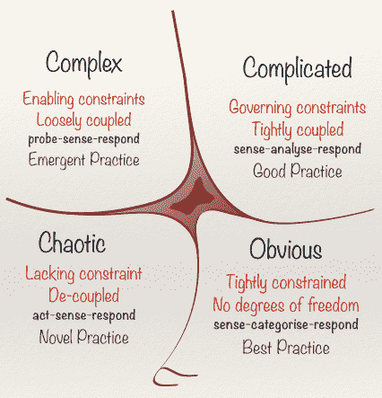

# 为什么直观的故障诊断对您不起作用了

> 原文：<https://thenewstack.io/why-intuitive-troubleshooting-has-stopped-working-for-you/>

 [皮特·霍奇森

皮特是一名独立的软件交付顾问，他帮助团队以可持续的速度交付软件。在独立之前，他是 ThoughtWorks 的首席顾问，也是多家初创公司的技术主管和架构师。](https://www.linkedin.com/in/beingagile/) 

与 2001 年相比，理解和操作 2021 年的生产系统更加困难。这是为什么呢？在过去的二十年里，我们不应该在这方面做得更好吗？

它变得更难是有正当理由的:在过去的 20 年里，我们系统的架构变得更加复杂。如今，我们不是在几个强大的服务器上运行 monoliston。

我们在运行于其他人的服务器(也称为“云”)上的框架、抽象和运行时的深层堆栈之上运行分布式微服务生态系统。对我们大多数人来说，用希腊神的名字命名服务器，然后放进一个盒子里运行`tail`和`top`的日子已经一去不复返了。

向这些现代建筑的转移是有充分理由的。工程组织面临着在更短的时间内以越来越快的速度交付更多价值的持续压力。

高耸的单体和手工制作的服务器配置根本无法与小型、可独立部署的服务的可扩展性和灵活性相媲美，这些服务由多个团队管理，运行在可弹性扩展的基础架构之上。

然而，这种转变是有代价的。我们的系统从复杂的领域进入了复杂的领域；随着这一转变，我们发现，传统的了解生产环境并对其进行故障排除的方法在这个新世界中不再适用。

## 从复杂到复杂

对于复杂和复杂，我使用的是来自 [Cynefin 模型](https://en.wikipedia.org/wiki/Cynefin_framework)的特定术语。Cynefin(发音为 kuh-NEV-in)是一个广受好评的系统管理框架，它根据系统的可理解性对不同类型的系统进行分类。

它还列出了如何在这些不同的类别中最好地操作——在一种环境中工作的东西在另一种环境中不一定工作得好——事实证明，这些操作模型与操作当今生产软件的工程师极其相关。

概括地说，Cynefin 描述了四类系统:明显的、复杂的、复杂的和混乱的。从命名中，您可能会猜到这种分类的范围从更可预测和更可理解的系统到那些不太可预测的系统，其中可预测性由因果关系的清晰程度来定义。

Cynefin 模型中的四类系统，作者:戴夫·斯诺登

显而易见的系统是最可预测的；任何一个观察这个系统的人都清楚因果之间的关系。复杂的系统有一个很好理解的因果关系，但只对那些有系统专业知识的人。复杂系统的因果关系一点也不直观，即使对专家来说也是如此，只有通过实验才能理解。混沌系统似乎根本没有可辨别的因果关系。

当我们将 Cynefin 分类应用到软件架构时，我们看到更传统的单片系统倾向于落入复杂的类别。

虽然对于新手来说，请求延迟或错误率增加背后的原因可能并不明显，但是操作系统一段时间的人往往知道当他们看到生产系统中突然出现这些影响时应该从哪里着手。然后，他们可以利用这种专业知识进行推理，从而理解因果关系。

相比之下，现代分布式系统是复杂的；即使是有经验的操作员，对于可能导致生产问题的原因也只有有限的直觉，至少在最初是这样。操作这些系统的工程师倾向于将事故比作神秘谋杀案或医疗剧。为了理解潜在的原因，他们绞尽脑汁寻找各种线索。

事故的很大一部分花费在试图理解系统中的因果关系上。这种循环对我们今天的许多人来说应该是熟悉的，我们不应该对此感到难过。这是现代系统复杂性不可避免的结果。

在最坏的情况下，一些分布式系统可能会陷入混乱。某些生产行为背后的原因永远笼罩在神秘之中，工程师们通过以过去修复事物的相同神奇顺序重新部署和重新启动事物，从而沦为操作巫术的咒语。

## 复杂系统的已知未知

了解了这些系统类别，我们就能够利用 Cynefin 的指导在每个类别中进行操作。在动态系统中做决策就是要把因果联系起来，Cynefin 告诉我们，理解这些不同系统的适当方式很大程度上取决于理解因果的难易程度。

当操作复杂的系统时，专家通常会直觉地知道去哪里寻找，以便理解问题的原因。换句话说，复杂的领域是一个“已知未知”的世界当试图理解系统的行为时，我们知道要问什么问题，尽管这些问题的答案最初是未知的。

Cynefin 将理解复杂系统的最佳过程定义为“感知-分析-响应”我们观察或“感知”一组预定义的系统特征，分析我们所看到的，然后根据我们的分析决定如何响应。

当处理复杂软件系统中的生产事件时，工程师们直观地应用这种感知-分析-响应方法，例如一个整体的 web 应用程序。

想象一下，这样一个 web 应用程序的操作员正在应对不断增加的 API 错误率。根据经验，他们知道——或者正在使用一个剧本说——高错误率通常是由于过载的数据库服务器或特定的第三方服务，有时(太频繁了！)因计划外维护而停机。

接线员已经知道该问什么问题了。他们做的第一件事是查看预配置的控制面板，检查数据库负载和第三方错误率。根据他们看到的情况(可能是来自第三方服务的高错误率)，运营商通过将系统置于部分降级状态来做出响应，这将绕过该服务，然后观察错误率是否降低。

这就是运行中的感知-分析-响应循环:感知一些预定义的关键指标，分析错误的原因，然后通过绕过有问题的服务做出响应。

问题是这种方法在现代复杂的系统中不再有效。

## 在复杂系统中生存

复杂的系统需要不同的方法。理解复杂系统的行为意味着直面“未知的未知”。换句话说，一开始我们甚至不知道我们应该问什么问题，更不知道答案可能是什么。

Cynefin 告诉我们，在这种情况下，我们最好的选择是“探测-感知-响应”我们不是像对复杂系统那样，在系统的几个标准区域进行感测，而是从探测我们在系统中看到的当前行为开始。探索让我们寻找模式或线索，以找出该问什么问题。它帮助我们更深入地了解系统中到底发生了什么，对可能发生的事情提出一些假设，然后提出可以证实或否定我们假设的问题。

经过几次反复的探索和感知，我们开始理解我们所看到的因果关系。当我们把原因和结果联系起来时，我们开始制定一个反应。

这一次，假设我们是一个大型 web 应用程序的待命工程师，该应用程序具有由数百个独立微服务组成的复杂架构。和前面的例子一样，我们正在应对不断增加的 API 错误率。尽管我们有多年操作这个生产系统的经验，我们仍然不能一开始就判断出是什么导致了错误。这个系统太复杂了，有太多的活动部件。所以我们的第一反应是探索以获得更好的理解。

这就是开放式和探索性可观察性工具的作用所在。可观察性工具让我们更深入地检查失败的响应。它们帮助我们寻找不同维度的共性或模式。

我们调查并注意到一个模式:大多数错误来自特定的端点。我们进一步调查，有一个子集的请求似乎比其他请求有更高的延迟。

进一步探究，我们详细查看一个缓慢的请求，看看它在哪里花费了时间。它似乎挂在缓存子系统中。进一步调查，所有慢速缓存调用似乎都指向同一个对象 ID。

既然我们已经探索了未知的东西，我们就有足够的信息来感知这种情况。在与另一位更了解缓存系统的工程师聊天时，我们提出了一个假设，即某个特定的缓存对象已经以某种方式损坏了。然后，我们可以通过查看这些对象的有效载荷来测试该假设。我们的假设被证实了:物体被破坏了。

接下来，我们回应。我们执行一个命令来刷新缓存对象并观察效果。我们的错误率开始回落到基线水平！在短暂的延迟增加后，我们的系统恢复到正常的基线活动状态。

在可观察性中，这就是所谓的核心分析循环。通过这个例子，您可以看到，在我们对导致问题的原因有一个合理的理解之前，我们是多么依赖快速的、特别的探索。这种探索帮助我们形成一种假设，我们可以通过制定响应(清除缓存)和验证结果来测试这种假设。

值得注意的是，核心分析循环本质上是 OODA 循环的变体，OODA 循环是一种军事战略框架，用于在作战行动中遇到的不确定和高度动态的环境中做出决策。

OODA 循环在军事和民用行业的多种情况下都很有效，事实证明，在理解您的花哨的微服务架构时，OODA 循环也很有效。

## 操作复杂的系统需要不同的工具包

在过去，我们可以通过基于经验和已知未知的故障排除来了解我们复杂的系统:CPU 负载是多少，在过去的一个小时里我们成功登录了多少次，每个 API 端点的平均延迟是多少？

我们主要依靠预配置的仪表盘来回答这些标准问题。也许有时我们会更深入地挖掘日志或一些额外的特别查询，但是理解我们系统行为的主要工具是面向固定的、聚合的分析。

如今，仅提供预成型的聚合视图的工具已经不够用了。理解复杂系统需要以探索性和开放性的方式探索它们，形成一系列关于系统行为的特定和非常具体的问题，从不同维度观察结果，然后形成新的问题——所有这些都在一个紧密的反馈循环中。

这种对特别探索和剖析的需求导致了一类新工具的兴起:可观察性。可观察性允许我们深入探究我们的系统以理解行为，直到服务之间的单个请求的级别。

它允许您将这些个人行为汇总成任意维度的总体趋势，或者以任何分辨率分解这些趋势，直至分解为单个客户 ID。可观察性工具提供了极其快速地遍历 OODA 循环的必要能力，在我们进行的过程中建立理解。

## 用可观察性增强你的直觉

2021 年的软件比 2001 年更难理解，这是有道理的。现代架构从根本上来说更加复杂，这种情况不会很快改变。

仅凭直觉和经验进行调试对于当今复杂的应用系统来说是行不通的。我们需要用迭代的方法来增强我们的直觉，探索系统行为的各个方面，以理解因果之间的关系。

好消息是，我们掌握的工具也发生了变化。新一代的可观测性技术允许我们拥抱这种复杂性并深入研究，每次都能解决新的谜团。

慈善专业的学生[简洁地说](https://charity.wtf/2020/03/03/observability-is-a-many-splendored-thing/)，“…如果你不能提前预测你需要问的所有问题，或者如果你不知道你在寻找什么，那么你就在[可观察性]领域。”

<svg xmlns:xlink="http://www.w3.org/1999/xlink" viewBox="0 0 68 31" version="1.1"><title>Group</title> <desc>Created with Sketch.</desc></svg>