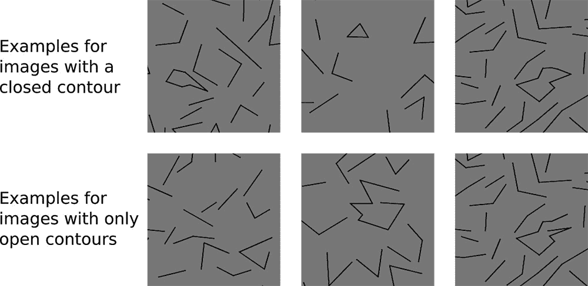
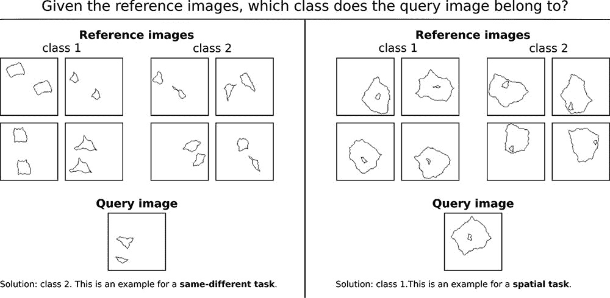
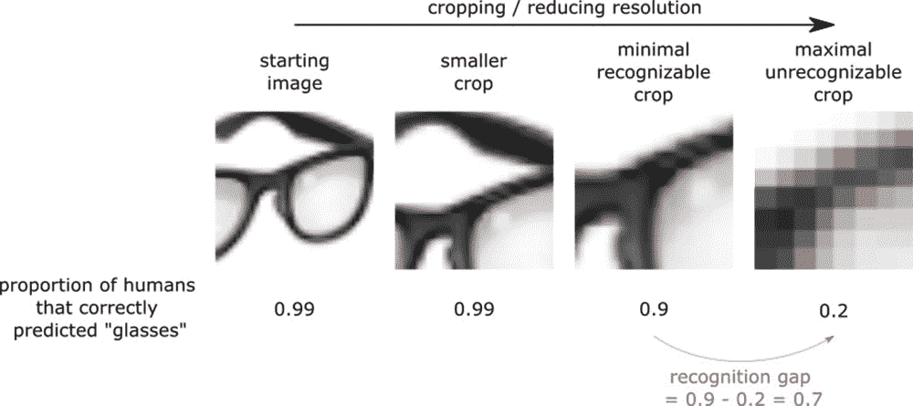
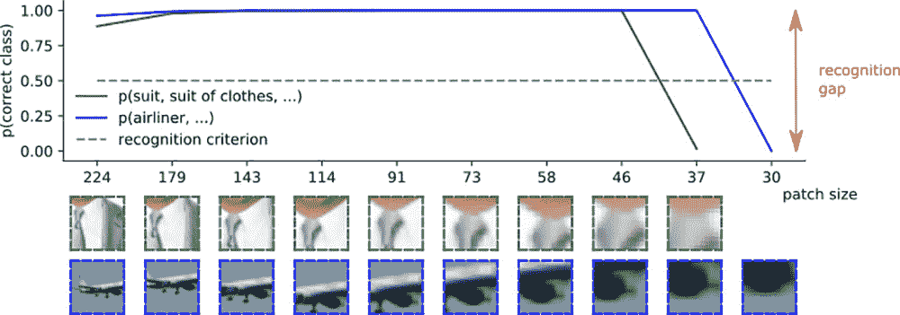
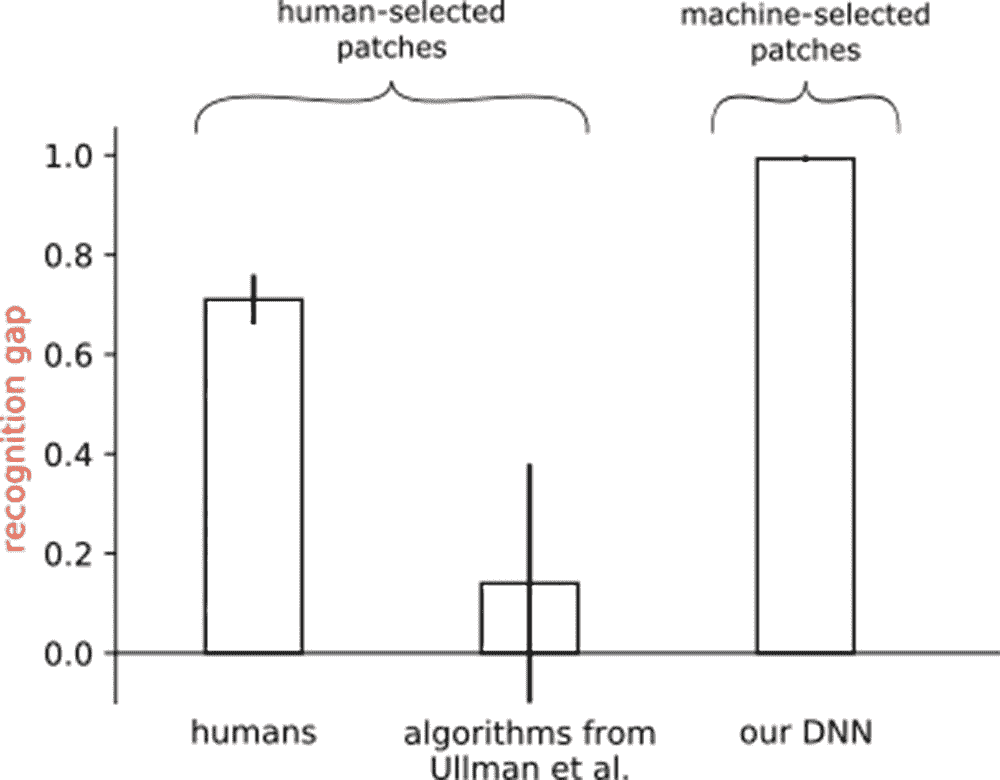

# 为什么比较人工智能和人类感知是众所周知的困难

> 原文：<https://thenewstack.io/why-its-notoriously-difficult-to-compare-ai-and-human-perception/>

随着越来越智能的机器逐渐出现，科幻小说正在成为现实——这些机器不仅擅长于像国际象棋这样的事情，而且还可以进行更高层次的推理，甚至回答深刻的哲学问题。在过去的几十年里，专家们一直在集体努力创造这样一种类似人类的人工智能，或所谓的“强”或[人工通用智能](https://www.mckinsey.com/business-functions/operations/our-insights/an-executive-primer-on-artificial-general-intelligence) (AGI)，它可以像人类一样轻松地学习执行广泛的任务。

但是，虽然当前的人工智能发展可能会从人类大脑的神经科学中获得一些灵感，但是将人工智能处理信息的方式与人类处理信息的方式进行比较真的合适吗？

根据来自图宾根大学和其他研究机构的德国研究人员团队的新研究，这个问题的答案取决于实验如何设置，以及人工智能模型如何构建和训练。

该团队的[研究](https://arxiv.org/pdf/2004.09406.pdf)表明，由于人工智能和人类做出这种决定的方式存在差异，从这种比较中得出的任何概括都可能不完全可靠，特别是如果机器被用于自动化关键任务。

## 旁观者的眼睛

特别是，该团队专注于分析人类视觉感知的机制，这与计算机视觉形成对比，计算机视觉是一个研究领域，旨在开发机器“看”的方法，并理解他们所看到的东西。

图宾根大学 [Bethge 实验室](http://bethgelab.org/)的 [Christina Funke](http://bethgelab.org/publications/christina+funke//publications/christina+funke/) 解释道:“随着[深度神经网络](https://thenewstack.io/deep-learning-broadens-the-reach-of-artificial-intelligence/) (DNNs)在人工智能领域变得非常成功，它们已经开始通过图像识别、自动机器翻译、精确医疗和许多其他应用直接影响我们的生活，”Christina Funke 与 [Judy Borowski](https://twitter.com/judy_borow) 一起担任该研究的第一合著者。“鉴于这些现代人工算法和生物大脑之间的许多相似之处，许多问题出现了:人类和机器视觉真的有多相似？研究机器视觉能理解人类视觉吗？或者反过来:我们能从人类视觉中获得洞察力来改善机器视觉吗？所有这些问题促使人们对这两个有趣的系统进行比较。”

比较这两个系统是发现如何建造人类水平的 AGI 的合乎逻辑的第一步。但正如博罗夫斯基警告的那样:“虽然比较研究可以增进我们的理解，但它们并不容易进行。两个系统之间的差异可能会使这一努力复杂化，并带来一些挑战。”

为了突出在比较机器和人类如何在复杂的识别任务中做出决定时的一些严重缺陷，研究人员选择并比较解构了各种处理视觉数据的标准基准测试——即闭合轮廓检测、[合成视觉推理测试](https://www.pnas.org/content/108/43/17621) (SVRT)，以及评估识别差距。

该团队首先使用闭合轮廓检测测试来看看[ResNet-50](https://arxiv.org/pdf/1512.03385.pdf)——一种深度学习、图像分类[卷积神经网络](https://thenewstack.io/train-a-convolutional-neural-network-with-nvidia-digits-and-caffe/)(CNN)——是否能够识别图像是否包含闭合形成闭合轮廓的线条——这是人类可以很容易做到的事情。最初，该模型似乎能够像人类一样轻松地识别带有硬边和曲线的闭合轮廓形状。

然而，当线条粗细或线条颜色等参数发生变化时，该模型未能成功，这表明一旦出现进一步的变化，人工智能的人类水平性能可能会下降，同时也表明，深度神经网络有时可能会找到超出人类感知偏差的意想不到的解决方案。芬克说，这是一个“人类可能太快得出结论，机器学习了类似人类的概念”的例子。

在实验的合成视觉推理测试部分，团队随后开始验证人工智能是否可以挑出相同的形状(“相同-不同”任务)，以及分析空间排列(“空间任务”)，例如找到嵌套在其他形状中的形状。

基于对以往研究的回顾，该团队假设 DNN 人在空间任务中表现出色，但在同异任务中表现不佳。人类通常在这两种类型的任务上都做得很好，因为他们只需要几个例子来学习，然后能够将这些知识推广并应用到未来的例子中。然而，令人惊讶的是，研究人员发现 DNN 在两种测试中都表现良好，这表明差异可能更多地源于神经网络的训练方式，使用了多少训练数据，以及它们的结构。

Borowski 指出:“第二个案例研究强调了对超出测试架构和培训程序的潜在机制得出一般性结论的难度。

该团队实验的下一部分涉及使用物体的图像，这些图像被连续裁剪和放大，直到受试者再也无法识别图像中的内容——换句话说，就是“识别差距”。

先前的研究工作表明，在测试人类受试者时，存在很大的识别差距，而在测试机器时，差距较小。然而，该团队选择给他们的实验增加一个额外的扭曲，用最先进的搜索算法选择的样本来测试 DNN，而不是像其他研究那样由人类研究人员选择。他们发现，人工智能在最小可识别作物和最大不可识别作物之间的识别差距与人类受试者一样大，这表明必须一致地设置测试条件，以便正确地比较这两个系统。

“所有条件、指令和程序都应该尽可能接近人类和机器，以确保所有观察到的差异都是由于固有的不同决策策略，而不是测试程序中的差异，”该团队总结道。

最终，该团队的工作表明，在比较机器和人类系统时，需要更精心设计的实验，并更好地理解人类偏见在进行这种比较时可能扮演的角色。

“我们所有案例研究的首要方面是人类偏见:它们说明了我们自己的观点可以在多大程度上扭曲实验的设计和解释，”芬克解释说。“日常生活中的一个例子可能是我们倾向于快速描述一种动物是快乐还是悲伤，仅仅因为它的脸可能有类似人类的表情。”

Funke 告诉我们，该团队现在计划向科学论文预印本的在线资源库 [arXiv](https://arxiv.org/) 发布一份修改后的论文和清单，这将提出如何更好地设计、进行和解释考虑到这些偏见的比较实验的想法。

“从更广泛的角度来看，我们希望我们的工作能激励其他人进行比较研究，即使‘比较苹果和橘子’的习语甚至建议一些系统不应该进行比较，”Borowski 说。“我们希望科学家们会感到鼓舞，进行这些具有挑战性的研究，并会发现我们的清单(在我们论文的新版本中)可以再次检查他们的实验，有助于做出‘富有成效’的贡献。”

<svg xmlns:xlink="http://www.w3.org/1999/xlink" viewBox="0 0 68 31" version="1.1"><title>Group</title> <desc>Created with Sketch.</desc></svg>