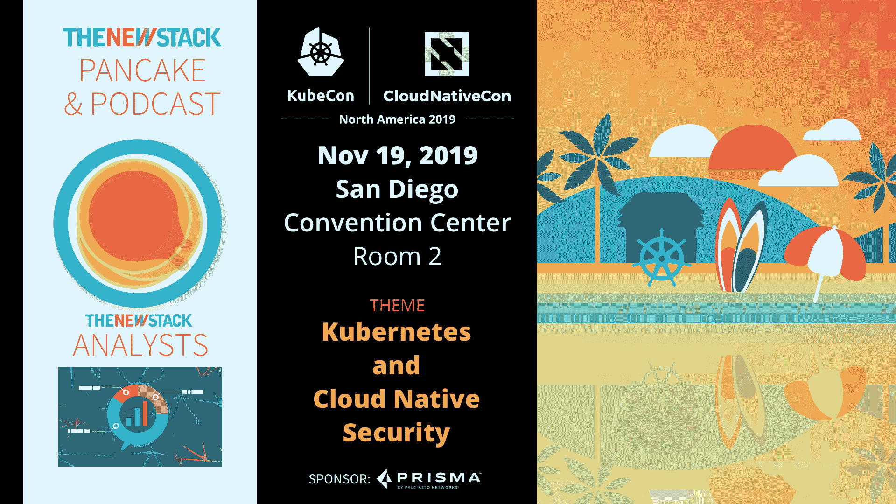

# 为什么 Kubernetes 成为边缘计算的关键因素

> 原文：<https://thenewstack.io/why-kubernetes-has-emerged-as-a-key-ingredient-in-edge-computing/>

 [阿马尔·纳克维

阿马尔是 Ubuntu 的出版商 Canonical 的 MicroK8s 产品经理。在加入 Canonical 之前，Ammar 曾在微软、Zoom 和诺基亚担任产品管理职务。他拥有计算机科学硕士学位和 MBA 学位。](https://twitter.com/microk8s1) 

边缘计算是云计算的一种变体，用于计算、存储和网络的基础设施服务在物理上更靠近生成数据的现场设备。可以说，这消除了到数据中心的“往返”，提高了服务可用性。自推出以来，边缘计算已经成为一个成熟有效的运行时平台，有助于解决电信、媒体、交通、物流、农业、零售和其他细分市场的独特挑战。

Kubernetes 已经迅速成为边缘计算的关键组成部分。通过 Kubernetes，公司可以在边缘运行容器，从而最大限度地利用资源，使测试更容易，并允许 DevOps 团队在这些组织消耗和分析更多数据时更快、更有效地移动。

随着数据以前所未有的速度产生，公司必须考虑将数据从边缘传输到核心的经济性，以及在本地过滤和预处理数据是否更经济。不受苛刻延迟要求限制的工作负载应继续由尽可能最佳的云解决方案提供服务。然而，即将到来的新用例浪潮要求运营商重新思考网络的架构。这就是边缘计算的用武之地。

这提供了三个好处。首先，更低的延迟，通过使现场设备不仅能够更快地响应，而且能够响应更多的事件，提高了现场设备的性能。其次，降低互联网流量，这有助于降低成本和提高整体吞吐量，使核心数据中心能够支持更多的现场设备。最后，对于独立于互联网的应用程序，如果边缘和核心之间出现网络中断，可用性会更高。

物联网中智能设备的指数级数据增长、5G 网络即将到来的影响以及在边缘执行人工智能任务日益增长的重要性，都推动了人们对边缘计算的兴趣——所有这些都要求能够处理弹性需求和不断变化的工作负载。因此，Gartner [表示](https://www.gartner.com/smarterwithgartner/what-edge-computing-means-for-infrastructure-and-operations-leaders/)到 2025 年，在传统集中式数据中心或云之外创建和处理的企业生成数据量将从目前的 10%飙升至 75%。

边缘云应该至少有两层——这两层都将最大限度地提高运营效率和开发人员的工作效率，尽管每层的构造都不同。

第一个是基础设施即服务(IaaS)层。除了提供计算和存储资源，IaaS 层还应满足超低延迟和高带宽的网络性能要求。

第二个涉及 [Kubernetes](https://www.ubuntu.com/kubernetes?utm_source=Kubernetes_PR) ，它已经成为在数据中心和公共云中编排容器化工作负载的事实上的标准。Kubernetes 已经成为[边缘计算](https://www.brighttalk.com/webcast/6793/362200?utm_source=Takeover&utm_campaign=CY19_DC_EdgeMonth)的一个非常重要的基础。

虽然在这一层使用 Kubernetes 是可选的，但对于那些进入边缘计算的组织来说，它已经被证明是一个有效的平台。由于 Kubernetes 在物理资源(计算、存储和网络)之上提供了一个通用的抽象层，开发人员或 DevOps 工程师可以在任何地方以标准方式部署应用和服务，包括在边缘。

Kubernetes 还使开发人员能够简化他们的 DevOps 实践，并最大限度地减少与异构操作环境集成所花费的时间，从而带来快乐的开发人员和快乐的操作人员。

那么，组织如何部署这些层呢？

第一步是考虑物理基础架构，以及可以使用什么技术来有效管理基础架构，将原始硬件转换为 IaaS 层。

需要可用于硬件发现的操作原语，以便灵活地分配计算资源并动态地重新调整它们的用途。

存在基于 KVM pods 自动创建边缘云的技术，这有效地支持运营商创建具有预定义资源集(RAM、CPU、存储和超额订阅率)的虚拟机。

一旦边缘云的物理基础设施的发现和供应完成，第二步是选择一个编排工具，该工具将使在边缘基础设施上安装 Kubernetes 或任何软件变得容易。

然后，瞧，是时候部署环境并开始部署和验证应用程序了。

随着越来越多的组织在未来几年采用这种模式，这将是一件非常有趣的事情。

要了解更多关于集装箱化基础设施和云原生技术的信息，请考虑 11 月 18 日至 21 日在圣地亚哥举办的 [KubeCon + CloudNativeCon NA](https://events.linuxfoundation.org/events/kubecon-cloudnativecon-north-america-2019/) 。

<svg xmlns:xlink="http://www.w3.org/1999/xlink" viewBox="0 0 68 31" version="1.1"><title>Group</title> <desc>Created with Sketch.</desc></svg>