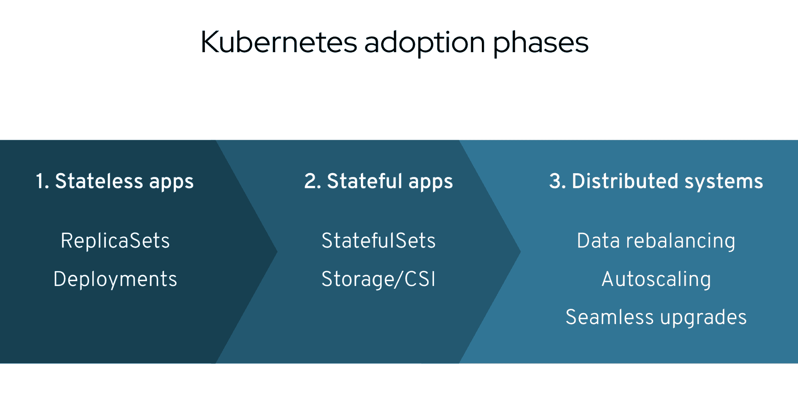
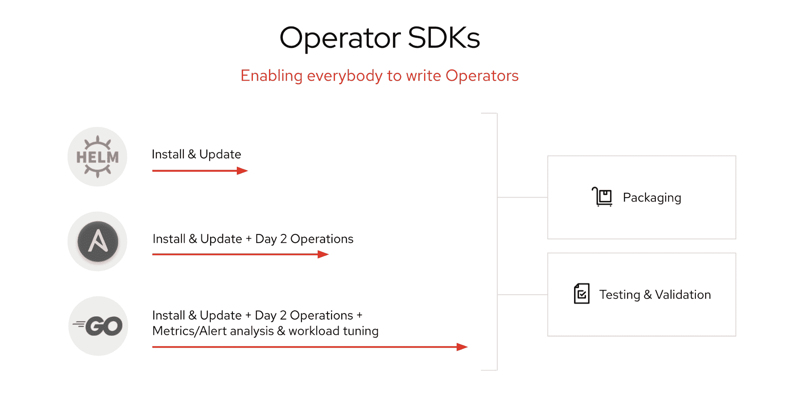
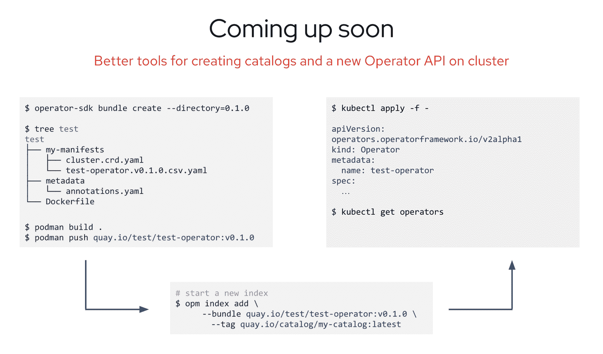

# 为什么 Kubernetes 运营商会通过降低复杂性来解放您的开发人员

> 原文：<https://thenewstack.io/why-kubernetes-operators-will-unleash-your-developers-by-reducing-complexity/>

 [罗布·苏姆斯基

罗布是红帽](https://www.linkedin.com/in/robszumski/) open shift 的产品经理

Kubernetes 和云计算原生计算基金会(CNCF)旗下的许多项目进展如此之快，以至于有时感觉开放混合云的好处可能还没有均匀分布。当系统管理员和操作人员正兴致勃勃地对遗留应用程序进行现代化改造，并对高度可伸缩的、基于容器的系统进行自动化时，有时开发人员会感到有点被冷落。

这是因为在 IT 通过采用容器而经历的速度提升和提供给开发人员的敏捷性提升之间存在脱节。Kubernetes 为 IT 运营商提供的好处是简化他们的开发人员的生活。开发人员和 IT 管理员想要不同的东西，对吗？或者他们有吗？

回到 2016 年，当我在 CoreOS 时，我们看到这种脱节开始形成。我们担心，虽然支持开发人员是 IT 的首要任务，但当开发人员为了采用容器而不得不从头开始重新学习他们的整个堆栈时，这并不容易。It 管理员也很难按照云开发的预期速度提供合规、受治理的服务。

为了解决这个问题，CoreOS 引入了 Kubernetes 操作符的概念。不久之后，我们开发了一套叫做 Operator Framework 的工具来帮助用户构建、发布和发现他们自己的 Kubernetes 操作符。虽然自 2016 年以来，我和 CoreOS 发生了很多变化，最明显的是我们现在都是 Red Hat 大家庭的一员，但运营商仍然是我们帮助开发人员和管理员专注于使用 Kubernetes 的战略的重要组成部分，而不是调整其各种旋钮和配置。

自然，所有关于操作符的工作都是开源的，因此我们最近将操作符框架贡献给了 CNCF，成为一个孵化项目。我们这样做有几个原因，包括在这个开放的生态系统中这样做是正确的。但我们这样做也是为了让运营商成为将服务器分布到 Kubernetes 集群的普遍途径。随着每个 Kubernetes 发行版都可以使用运营商，整个开放式混合云生态系统将受益于更高的兼容性、简单性和更容易的管理。

运营商是帮助我们实现这一自动化、按需、基于集装箱的未来的重要组成部分。操作员是编入软件的操作程序和最佳实践。它们使 Kubernetes 上的自动化第二天操作成为可能，并模拟了当今分布式系统的复杂性。

例如，Kubernetes 中没有数据重新平衡的概念，但是可以在 Kubernetes APIs 的基础上用 Operator 框架来构建。这些类型的应用程序是在 Kubernetes 上运行我们所谓的第三波应用程序所必需的:复杂的分布式系统。

Operator Framework 附带了开发人员构建该软件所需的所有工具，以及集群管理员安全安装、升级和管理其操作员所需的一切。这些工具与 CNCF 的其他项目——如 KubeBuilder、Helm、kuttl——以及 Ansible 等流行的开源软件结合在一起。

这个框架是松散耦合的，所以如果你有一个喜欢的测试工具，你可以继续使用它；如果您想在 SDK 之外构建您的运营商，也没问题，您仍然可以使用运营商生命周期管理器来运行它。

Operator Framework 目前有三种风格的 SDK，未来还会有更多。每一个都面向不同类型的作者，从 IT 管理员到传统开发人员，再到铁杆 Kubernetes 专家。

## 建筑帮助

测试你的操作符是至关重要的，这就是为什么我建议大多数操作符作者使用我们的 SDK，或者至少加入我们的[社区](https://github.com/operator-framework/community-operators)。我们社区中的专家已经将许多类型的应用程序建模为操作符，因此我们可以帮助您节省时间并避免一些错误。另外，看到所有项目进入我们的社区并帮助人们实现他们的目标真的很有趣。

一旦你写好了你的操作符，你需要把它交给你的用户并实际运行它。这就是运营商生命周期管理器发挥作用的地方。这里实际上有很多你可能还不知道的棘手问题，比如 CRDs 的碰撞检测。假设您有一个由自定义资源定义(CRD)管理的数据库，但是有另一个操作员也想管理该数据库。那可不行。CRD 本身的生命周期也很重要。运营商可以在升级过程中管理 CRD。

我们深深地致力于运营商，我们已经为这些强大的抽象的未来做了很多规划。例如，我们目前正在研究捆绑包的概念，它将允许操作者在集群中一起编目。管理员将能够使用我们正在开发的名为 OPM 的新工具，这将使他们能够更好地管理这些集群内目录。我们还在开发一个新的操作员 API，它旨在提供一种通过 Kubernetes APIs 访问操作员的更简单的方法。

虽然在集群中设置操作员的大部分工作将由 IT 人员完成，但真正受益的是开发人员。例如，它可以使用 [Crunchy Data PostgreSQL 操作符](https://operatorhub.io/operator/postgresql)来预配置数据库 RBAC 和安全控制，同时还预连接备份和复制服务。完成此操作后，集群的任何授权用户都可以按需部署 PostgreSQL 的新实例，从而消除了为新应用程序开发工作调配服务器所需的时间。

这一优势还延伸到测试和构建环境的自动化按需供应。这些环境可以通过 IT 管理员正确配置的操作员进行预配置，以遵守公司治理和数据控制策略。最棒的是，他们只需这样做一次，并且根据这些规则的部署会在整个集群中自动进行。

自去年夏天第四版发布以来，OpenShift 上就有操作员了。我们一直在努力与企业和开源领域的许多开发人员合作，以帮助充实我们面向 Kubernetes 运营商的公共存储库 [Operatorhub.io](https://operatorhub.io/) 。因此，运营商生态系统已经相当活跃，并准备好进行探索。

我们很高兴看到这个社区能发展到什么程度，现在它已经完全成为了 CNCF 开源进程的一部分。这一直是我们打算用 Operator 框架做的事情，现在经过四年的努力，我们非常自豪地看到该项目迈出了下一步，并作为开源项目在 CNCF 内免费运行。在您的帮助下，运营商将为 Kubernetes 社区中的每个人(包括管理员和开发人员)节省大量时间和精力。

<svg xmlns:xlink="http://www.w3.org/1999/xlink" viewBox="0 0 68 31" version="1.1"><title>Group</title> <desc>Created with Sketch.</desc></svg>