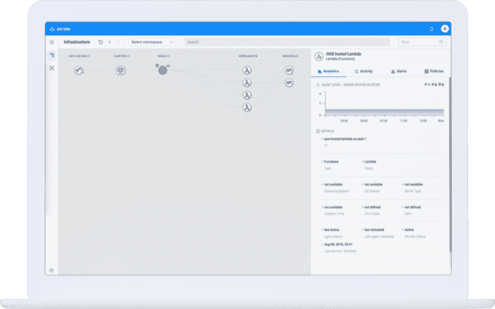

# 为什么锁定内核不会阻碍 Linux 的改进

> 原文：<https://thenewstack.io/why-locking-down-the-kernel-wont-stall-linux-improvements/>

 [凯西·绍弗勒

凯西·绍弗勒在 20 世纪 70-90 年代致力于 Unix 内核的研究。他实现了访问控制列表、强制访问控制、扩展的文件系统属性、X11 访问控制、网络协议和更多的审计系统。他对 Linux 的参与始于世纪之交的 Linux 安全模块工作，在 2007 年引入了 Smack LSM。凯西正在改造 LSM 的基础设施，以支持多个并发模块。他曾在 Linux Conference Australia、OLS、LinuxCon、Linux Plumbers 等许多场合发表演讲。](https://www.linuxfoundation.org/) 

Linux 基金会赞助了这篇文章。

Linux 内核强化项目在减少漏洞和增加利用剩余漏洞所需的努力方面取得了重大进展。许多已经实现的东西显然是有价值的，但有时好处更微妙。在某些情况下，具有明显优点的变革会因为绩效问题而遭到反对。在其他情况下，所需的代码更改量可能会令人望而却步。有时，额外安全开发的成本超过了对 it 的期望值。

[Linux 内核强化项目](https://kernsec.org/wiki/index.php/Kernel_Self_Protection_Project)并不是要添加新的访问控制或者在系统中搜寻后门。它是关于使内核更难被滥用，并且任何滥用导致实际伤害的可能性更小。前者很重要，因为内核是系统资源的最终保护者。后者很重要，因为有 5000 名开发人员在 2500 万行代码上工作，在如何编写代码和判断一个机制有多脆弱方面都会出现错误。此外，在让内核做它不应该做的事情的过程中，原始的独创性数量随着这样做的财务可能性而不断增长。

Linux 内核几乎完全是用 C 编程语言编写的——而内核需要加固的最重要的原因来自于这种编程语言的各个方面。

C 语言创建于 20 世纪 70 年代，与 Unix 操作系统步调一致。像 Fortran 和 COBOL 语言一样，C 语言是为特定目的开发的。此外，像那些语言一样，C 被许多开发人员认为是神秘而古老的。C 语言是为操作系统开发而设计的，它允许直接控制代码流和数据管理。这种 C 经常被比作锯片上没有防护装置的圆锯，因为它在正确使用时有效，在不小心使用时危险。

## 收益和风险

Linux 内核强化项目正在使用几种方法来改进 C 语言的使用方式。虽然 C 缺乏强数据类型，但现有的类型可以用来减少常见错误的发生。一个例子是引用计数器的数据类型的引入。引用计数器有一些有趣的属性:它们不应该包含小于 1 的值，也不应该被直接赋值。使用代码来检测这两种操作中的任何一种，都可以更容易地确定资源的正确分配和释放。另一个例子是在变量和参数声明中增加使用“const”修饰符。这指示编译器识别值被改变的任何情况，因为程序员认为它不应该被改变。虽然编译器没有严格执行这一点，但它提供了一种简单的方法来识别数据没有按照预期的方式使用的情况。

该项目的另一个重点是函数调用参数堆栈。这不仅包含系统调用参数，还可能包含某些处理器架构上保存的寄存器内容和返回执行地址。以系统不希望的方式更改这些信息会破坏预期的行为，因此这是企图利用的常见目标。

使篡改这些数据变得更加困难的方法是改变为数据分配内存的方式，使其不连续。这使得定位需要更改的数据变得更加困难。正在实现的另一个方案是，一旦不再需要所有堆栈组件，就清除它们的内存。不幸的是，这些都不是免费的。前者会引入内存碎片，而后者会产生禁止性的处理和缓存访问影响。

最后要谈的是地址隐藏和随机化。攻击者掌握的关于内存布局和组织的信息越多，就越容易识别出易受攻击的点。不幸的是，这也是内核开发人员用来跟踪编码错误和其他意外行为的信息。包含数据或代码地址的系统日志消息可用于欺骗代码执行，因此更改它们以提供符号地址反而会减慢利用过程。类似地，如果每次系统运行时所有代码都以相同的顺序加载，那么侵入要比随机确定函数的顺序容易得多。甚至数据结构成员的顺序也可以被打乱，因此即使在数据的地址已经确定之后，也能阻止攻击。

这些方法都不是没有代价的，一个重要的目标是保持影响足够小，使得获得的价值超过引入的困难。

## 好的比坏的多

要回答这个问题，是的，让内核更难确实会让内核在未来更难开发。该项目必须保持对系统所有方面的认识，并确保安全性的附加值不会被其他方面的影响淹没。类型和栈的改变已经通过识别带有细微缺陷的代码提高了整体系统质量。通过开放和积极地解决开发过程中出现的问题，Linux 内核强化项目加快了 Linux 内核的接受度和整体安全性水平。还有很多事情要做。在[内核自我保护项目](https://kernsec.org/wiki/index.php/Kernel_Self_Protection_Project)页面找到更多关于你能做什么的信息。

*本文是即将于 8 月 29 日至 31 日 在温哥华 召开的开源峰会系列演讲的一部分。开源峰会将开源生态系统连接在一个屋檐下。它涵盖了基础开源技术；帮助生态系统领导者通过多样性授权峰会导航开源转型，并跟踪业务和合规性；并深入研究涉及开源的最新技术和最新趋势，包括网络、原生云、边缘计算、人工智能等等。这是开发人员、系统管理员、DevOps 专业人员和 It 架构师之间交流的绝佳机会，推动着技术的未来。*

通过 Pixabay 的特征图像。

<svg xmlns:xlink="http://www.w3.org/1999/xlink" viewBox="0 0 68 31" version="1.1"><title>Group</title> <desc>Created with Sketch.</desc></svg>