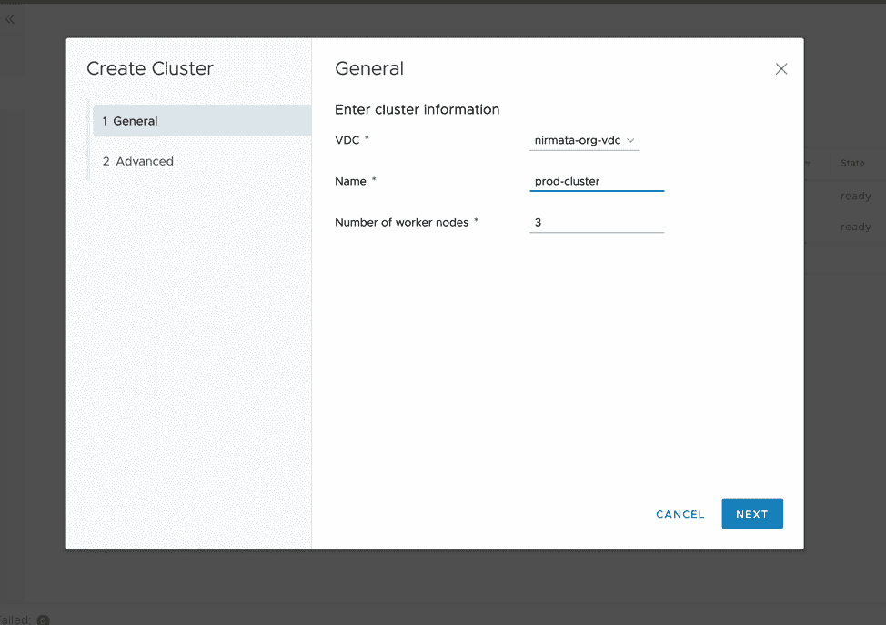
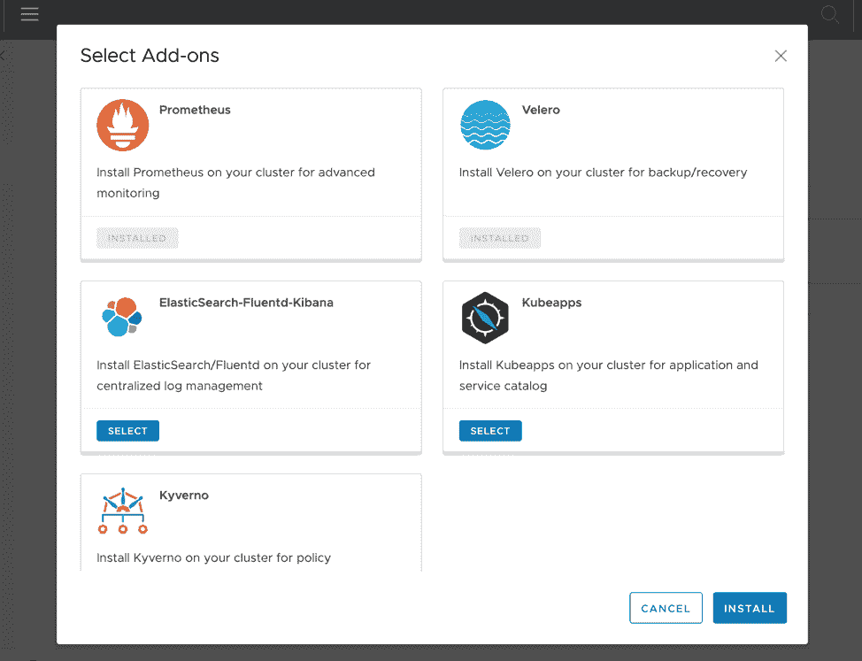

# 采用 Kubernetes 时的粗鲁叫醒电话

> 原文：<https://thenewstack.io/why-managed-services-for-kubernetes-mean-opportunity/>

[Ritesh Patel](https://www.linkedin.com/in/patelrit/)

[Ritesh 是 Nirmata 的创始人兼产品副总裁，Nirmata 是基于 Kubernetes 构建的云原生应用管理平台。Ritesh 拥有大约 20 年的企业软件开发经验，并领导过软件开发团队。在加入 Nirmata 之前，Ritesh 负责 Brocade 的私有云战略和业务开发，领导了各种云和安全相关计划，并创建了合作伙伴生态系统。Ritesh 还在 Trapeze Networks、Nortel 和摩托罗拉担任过重要的技术职务。Ritesh 拥有加州大学伯克利分校的 MBA 学位和密歇根州立大学的硕士学位。](https://www.linkedin.com/in/patelrit/)

我们都知道 Kubernetes 大受欢迎，但许多组织都突然意识到在他们的云原生应用程序堆栈中采用 Kubernetes 时所面临的挑战。

Kubernetes 虽然功能强大且可扩展，但提供和维护起来相当复杂。此外，随着您扩展到不同的应用程序和团队，这种复杂性也会增加。大多数企业 IT 团队不具备管理 Kubernetes 所需的技能。坦率地说，这涉及到许多无差别的繁重工作，他们不想在这些工作上花费资源。

在 [Kubecon + CloudNativeCon 2018 大会](https://events19.linuxfoundation.org/events/kubecon-cloudnativecon-north-america-2019/)与会者完成的[调查](https://www.nirmata.com/2019/01/24/new-survey-yields-kubernetes-as-mainstream/)中，超过一半(53%)的受访者认为缺乏专业知识是采用 Kubernetes 的最大挑战，其次是管理和运营复杂性以及安全性，这是其他主要挑战。此外，企业发现很难雇佣和留住拥有 Kubernetes 专业知识的个人，从而减缓了他们对云的原生采用。这为托管服务提供商(MSP)创造了一个独一无二的机会来填补这一空白。

提供私有云服务的托管基础设施提供商有机会向其客户提供 Kubernetes 即服务。通过采用 Kubernetes，MSP 可以利用其快速增长，并“向上移动堆栈”以提供应用程序生命周期管理服务。开发团队还需要建立端到端的连续交付工具链，这可以由 MSP 提供。在未来十年，封装在容器中的应用程序将推动基础设施使用的显著增长，这是 MSP 可以利用的。

## 云 MSP 如何提供全面的 Kubernetes 产品

如今，许多 MSP 都使用 vCloud Director (vCD ),以便轻松地向客户提供虚拟化基础架构服务。今年早些时候，VMware [推出了](https://blogs.vmware.com/cloudprovider/2019/05/vcloud-director-%F0%9F%92%9A-containers.html)容器服务扩展(CSE)。CSE 允许在 vCD 中启用 Kubernetes 集群，方法是创建定制的虚拟机模板(Kubernetes 模板),并允许租户用户将全功能的 Kubernetes 集群部署为独立的 vApps。最近， [Nirmata 发布了一个 vCD 扩展](https://www.nirmata.com/2019/11/01/vmware-vcloud-director-with-nirmata-kubernetes-as-a-service/),支持直接从 vCD 用户界面部署和管理使用 CSE 创建的集群，并提供额外的管理功能。这种组合产品提供了 Kubernetes 即服务产品中必需的功能。

以下是 Nirmata Kubernetes 扩展可以实现的一些核心功能:

### 启用自助部署

自助服务通过节省管理多个租户需求的时间和资源，降低了服务提供商的成本。租户可以按需启动 Kubernetes 集群，并在不再需要时将其拆除，这一切都可以从一个熟悉的 vCD web 客户端完成。

### 提供精细的访问控制

几个应用程序可能在一个集群中运行，因此需要进行访问控制来防止任何未经授权的访问。租户管理员可以使用现有的身份验证和授权技术来管理集群访问。

### 确保完全可见

集群所有者需要了解集群的运行状况，应用程序所有者也需要了解他们的应用程序是否运行良好。提供运行状况的可见性以及故障的详细信息可以确保满足应用程序正常运行时间 SLA。

### 简化附加管理

监控、记录、备份等附加服务。是应用程序所有者所必需的。谈到这些服务，每个租户可能都有自己的偏好。服务提供商现在可以提供一个附加服务目录，租户可以在集群中使用，而无需构建专业知识。

### 集成备份和灾难恢复

当客户在 Kubernetes 上运行任务关键型应用程序时，他们需要能够帮助他们从任何基础架构故障中快速恢复的功能。服务提供商可以通过群集和应用程序的集成备份来提供灾难恢复。

## 摘要

借助 VMware vCloud Director 和 Nirmata，提供托管云服务的 MSP 可以通过提供托管的“Kubernetes 即服务”在客户的云原生之旅中与其合作，加速他们的旅程，帮助他们节省大量采用成本，并使他们能够专注于增加业务价值。通过提供这些高级功能，MSP 可以解决企业面临的 Kubernetes 技能缺口，并通过承担管理和操作 Kubernetes 集群和工作负载的无差别重任，成为应用程序团队值得信赖的合作伙伴。

<svg xmlns:xlink="http://www.w3.org/1999/xlink" viewBox="0 0 68 31" version="1.1"><title>Group</title> <desc>Created with Sketch.</desc></svg>