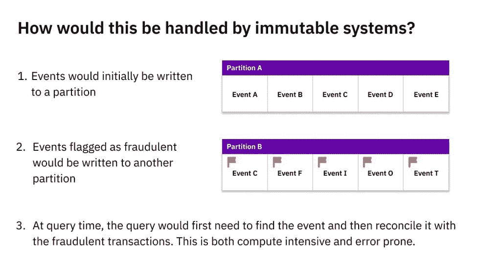
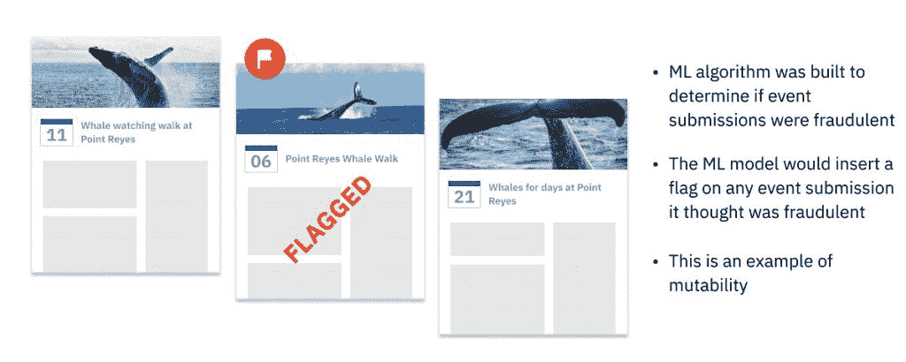
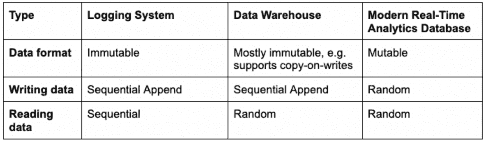

# 为什么可变性对于实时数据分析至关重要

> 原文：<https://thenewstack.io/why-mutability-is-essential-for-real-time-data-analytics/>

优步、脸书和亚马逊等成功的数据驱动型公司依赖于实时分析。个性化的电子商务客户体验、管理车队和供应链以及自动化内部运营都需要对最新数据的即时洞察。

 [Dhruba Borthakur

Dhruba 是 Rockset 的 CTO 和联合创始人，负责公司的技术方向。他是脸书大学数据库团队的工程师，也是 RocksDB 数据存储的创始工程师。此前在雅虎，他是 Hadoop 分布式文件系统的创始工程师之一。他也是开源 Apache HBase 项目的贡献者。](https://www.linkedin.com/in/dhruba) 

为了提供实时分析，公司需要一个现代技术基础设施，其中包括以下三项:

*   实时数据源，如网络点击流、传感器产生的物联网事件等。
*   用于发布事件数据流的平台，例如 Apache Kafka/Confluent、Spark 或 Amazon Kinesis。
*   一个实时分析数据库，能够持续接收大量实时事件，并在几毫秒内返回查询结果。

事件流/流处理已经存在了将近十年。很好理解。实时分析不是。实时分析数据库的技术要求之一是可变性。可变性是对数据存储中现有记录进行更新或变更的超级能力。

## 可变数据和不可变数据的区别

在我们讨论为什么可变性是实时分析的关键之前，理解它是什么很重要。

可变数据是存储在表记录中的数据，可以用更新的数据擦除或更新。例如，在一个雇员地址的数据库中，假设每个记录都有这个人的名字和他们当前的居住地址。如果员工将住所从一个地方搬到另一个地方，当前的地址信息将被覆盖。

传统上，这些信息存储在事务数据库中，如 Oracle 数据库、MySQL、PostgreSQL 等。—因为它们允许可变性:存储在这些事务数据库中的任何字段都是可更新的。对于今天的实时分析，我们需要可变性还有许多其他原因，包括数据丰富和回填数据。

不可变数据则相反，它不能被删除或修改。更新是仅追加的，而不是覆盖现有记录。这意味着更新被插入到不同的位置，或者您被迫重写旧的和新的数据来正确地存储它。稍后会有更多的负面影响。不可变数据存储在某些分析场景中非常有用。

## 不变性的历史效用

数据仓库普及了不变性，因为它简化了可伸缩性，尤其是在分布式系统中。可以通过在 RAM 或 SSD 中缓存频繁访问的只读数据来加速分析查询。如果缓存的数据是可变的，可能会发生变化，那么就必须不断地对照原始数据源进行检查，以避免过时或出错。这将增加数据仓库操作的复杂性；另一方面，不可变数据不会产生这样的问题。

不变性还降低了意外删除数据的风险，这在某些用例中是一个显著的优势。采取医疗保健和病人健康记录。像新的医疗处方这样的东西将被添加，而不是写在现有的或过期的处方上，这样你总是有一个完整的病史。

最近，一些公司试图将 Kafka 和 Kinesis 等流媒体发布系统与不可变的数据仓库结合起来进行分析。事件系统捕获物联网和网络事件，并将其存储为日志文件。这些流日志系统很难查询，因此通常会将日志中的所有数据发送到不可变的数据系统，如 Apache Druid，以执行批量分析。

数据仓库会将新的流式事件追加到现有的表中。由于过去的事件理论上不会改变，因此不变地存储数据似乎是正确的技术决策。虽然不可变数据仓库只能顺序写入数据，但它支持随机数据读取。这使得分析业务应用程序能够随时随地高效地查询存储的数据。

## 不可变数据的问题

当然，用户很快发现，由于许多原因，数据确实需要更新。对于事件流来说尤其如此，因为多个事件可以反映真实对象的真实状态。或者网络问题或软件崩溃会导致数据传递延迟。迟到的事件需要重新加载或回填。

公司也开始接受数据丰富，将相关数据添加到现有的表格中。最后，公司开始不得不删除客户数据，以满足消费者隐私法规，如 GDPR 及其“被遗忘权”

不可变的数据库制造商被迫创建变通办法来插入更新。Apache Druid 和其他人使用的一种流行方法叫做写时复制。数据仓库通常先将数据加载到暂存区，然后再将数据成批接收到数据仓库中，在数据仓库中对数据进行存储、索引并准备好供查询。如果任何事件延迟到达，数据仓库将不得不写入新数据，并且[重写已经写入的相邻数据](https://www.druidforum.org/t/backfilling-dimension-data-on-existing-segements/2275)，以便以正确的顺序正确地存储所有数据。

在不可变的数据系统中处理更新的另一个糟糕的解决方案是将原始数据保存在分区 A(如上)中，并将晚到达的数据写入不同的位置，分区 b。应用程序(而不是数据系统)将必须跟踪所有链接但分散的记录存储在哪里，以及任何产生的依赖性。这个过程被称为*参照完整性*，必须由应用软件来实现。

这两种解决方法都有严重的问题。写入时复制需要数据仓库消耗大量的处理能力和时间——当更新很少时，这是可以忍受的，但随着更新数量的增加，这种成本和速度就变得令人难以忍受。这造成了严重的数据延迟，从而无法进行实时分析。数据工程师还必须手动监督写入时拷贝，以确保所有新旧数据都被准确写入和索引。

实现引用完整性的应用程序有自己的问题。必须仔细检查查询是否从正确的位置提取数据，否则会有数据错误的风险。当对同一记录的更新分散在数据系统的多个位置时，尝试任何查询优化(如缓存数据)也会变得更加复杂。虽然这些在较慢的批量分析系统中可能是可以忍受的，但在关键任务实时分析中却是个大问题。

## 可变性有助于机器学习

在脸书，我们建立了一个 ML 模型，在全新的日历事件被创建时扫描它们，并将它们存储在事件数据库中。然后，ML 算法将实时检查该事件，并决定它是否是垃圾邮件。如果它被归类为垃圾邮件，那么 ML 模型代码将在现有的事件记录中插入一个新字段，将其标记为垃圾邮件。因为如此多的事件被标记并立即被删除，所以为了效率和速度，数据必须是可变的。许多现代 ML 服务系统已经模仿我们的例子，选择可变数据库。

对于不可变数据，这种性能水平是不可能的。使用写入时复制的数据库很快会因为必须更新的标记事件的数量而陷入困境。如果数据库将原始事件存储在分区 A 中，并将标记的事件附加到分区 B，这将需要额外的查询逻辑和处理能力，因为每个查询都必须合并两个分区中的相关记录。这两种变通办法都会给我们的脸书用户造成无法忍受的延迟，增加数据错误的风险，并给开发人员和/或数据工程师带来更多的工作。

## 可变性如何实现实时分析

在脸书，我帮助设计可变分析系统，提供实时的速度、效率和可靠性。

我创立的技术之一是开源 [RocksDB](https://rockset.com/blog/how-we-use-rocksdb-at-rockset/) ，MySQL、Apache Kafka 和 CockroachDB 使用的高性能键值引擎。RocksDB 的数据格式是可变的数据格式，这意味着您可以更新、覆盖或删除记录中的单个字段。它也是 Rockset 的嵌入式存储引擎，Rockset 是我创建的一个实时分析数据库，具有完全可变的索引。

通过调优开源 RocksDB，可以对几秒钟前到达的事件和更新启用 SQL 查询。这些查询可以在数百毫秒内返回，即使在复杂、特殊和高并发的情况下。RocksDB 的压缩算法还自动合并旧的和更新的数据记录，以确保查询访问最新的、正确的版本，并防止会影响存储效率和查询速度的数据膨胀。

通过选择 RocksDB，您可以避免不可变数据仓库的笨拙、昂贵和产生错误的工作区，例如写时复制和将更新分散到不同的分区。

总而言之，可变性是当今实时分析的关键，因为事件流可能不完整或无序。当这种情况发生时，数据库将需要纠正和回填丢失和错误的数据。为了确保高性能、低成本、无错误的查询和开发效率，您的数据库必须支持可变性。

如果你想了解实时分析数据库的所有关键需求，[请观看我最近在](https://youtu.be/NOuxW_SXj5M)的演讲。

<svg xmlns:xlink="http://www.w3.org/1999/xlink" viewBox="0 0 68 31" version="1.1"><title>Group</title> <desc>Created with Sketch.</desc></svg>