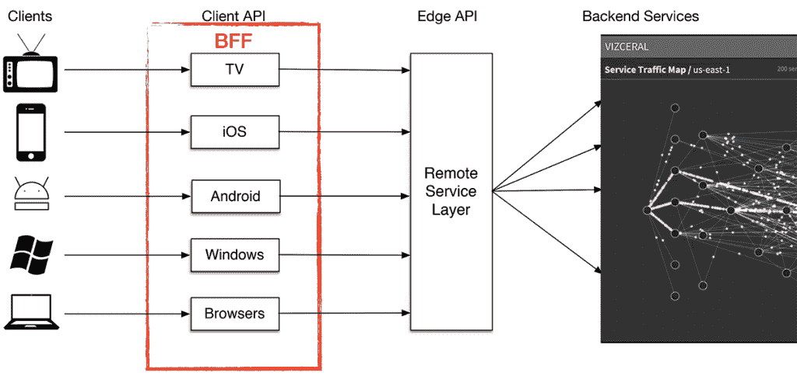
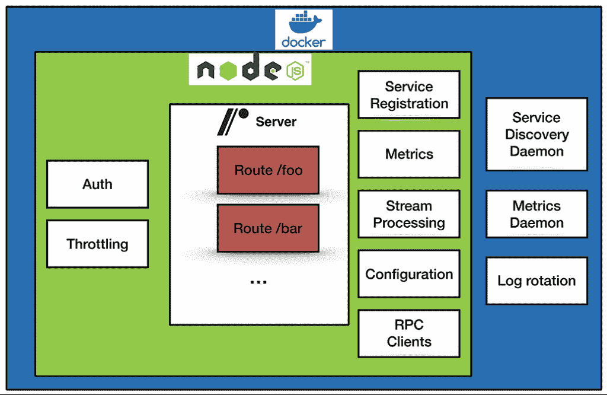

# 为什么网飞为其 API 平台推出了自己的 Node.js 功能即服务

> 原文：<https://thenewstack.io/why-netflix-rolled-its-own-node-js-functions-as-a-service-runtime/>

自从 hook.io 在 2014 年推出功能即服务(FaaS)以来，开发人员一直在用两只手抓住这项新技术。这是无服务器计算梦想中的下一个地平线:一个一体化的“无运营”平台，允许开发人员构建开发、启动和管理应用程序功能，而没有构建通常附带的基础架构的麻烦。仅仅四年后，FaaS 已经成为云工程工具包中的一个交钥匙工具，这是一个内置的标准产品，由 AWS Lambda、谷歌云功能和微软 Azure 功能等云服务提供商提供。

工程师喜欢 FaaS 的“无操作”方面，这使得只需将模块化功能块上传到您选择的云提供商，然后将它们作为独立、可靠、低延迟的生产服务来执行。企业喜欢他们的开发人员能够比以前更快地将代码部署到生产环境中。网飞是一家因早期和非常有效地采用云原生技术而受到尊重的公司，它欣然接受了 FaaS，以保持电影平稳地流向他们的 1.3 亿客户，每天播放 1.4 亿小时的视频。

《新堆栈》采访了的软件工程师、API 平台的设计/架构负责人肖，讲述了该公司为其 API 平台开发内部 FaaS 功能的经验。

在 FaaS 解决方案成为云服务提供商的内置产品之前，网飞于 2015 年初开始构建这一解决方案。现在，随着网飞超越其 API 平台的特定用例，以及云产品的成熟，他们正在全公司范围内广泛启用基于 AWS Lambda 的功能用例。

**是什么促使我们决定采用 FaaS 的网飞 API 平台？**

FaaS 特性非常适合网飞 API 平台，该平台为工程师提供了使用 JavaScript 编写和部署第 1 层服务的能力，而无需管理基础设施或运营。基于 JavaScript 的 FaaS 平台允许 UI 工程师将 JavaScript 功能部署为生产服务，这意味着我们可以在每个对网飞 API 平台的请求中提供延迟敏感的服务。

**在什么时候，编写自己的 FaaS 平台看起来是正确的事情？**

几年前，我们在网飞 API 平台团队中有一个引人注目的无服务器使用案例。我们的客户遍布 190 多个国家，这意味着我们有许多客户团队，每个团队都拥有独特的用户界面，这需要快速创新和高可用性。同时，我们的客户团队为他们的 ui 使用后端对前端(BFF)模式，这意味着他们拥有的 ui 的每个版本都有一个定制服务。我们为创新而设计产品，每年进行数百次 A/B 测试，每次都有许多变体。为了实现这种类型的快速创新，这些 BFF 由客户团队自己拥有，并且通常会随着每个版本而改变。

设计、构建和运行高性能、低延迟和高可用性的服务非常困难，即使对于拥有多年经验的资深服务器工程师来说也是如此。期望客户工程师拥有并操作这些有这些需求的服务是不合理的——因为他们的核心专长是构建最好的用户界面。

网飞 API 使用后端对前端模式，其中 BFF 与每个客户端/设备紧密耦合。每个 BFF 都由 UI 团队为该客户端维护，因为它们与 UI 紧密耦合。

FaaS 和无服务器允许每个客户端团队将其服务的架构和操作卸载到由我的团队 API 平台团队——维护的公共平台，并允许他们专注于编写区分每个 BFF 的业务逻辑。

**你建立了自己的 FaaS 平台，因为……**

当我们在 2015 年开始这一旅程时，我们无法找到满足我们 API 平台需求的第三方 FaaS 平台。尽管自那时以来，许多当前产品(如 AWS Lambda)已经走过了漫长的道路，但在那时，FaaS 和无服务器产品的大多数外部使用都是针对延迟不敏感的事件驱动任务，而不是大规模的延迟敏感服务。此外，在网飞 API 平台上运行高度可用的服务需要与网飞服务堆栈集成，这在当时也是不存在的。我们的平台由许多不同的组件组成，例如开发人员工具、运行时、基础设施编排和操作工具。

顺便说一下，运行时被命名为 node quark——因为它使用 Node.js。

NodeQuark FaaS 平台是一个服务容器，已经预装了生产就绪服务所需的所有组件。客户需要做的只是添加他们的业务逻辑。

【NodeQuark 是如何融入网飞堆栈的？

首先，我们的选择是由简化整个软件开发生命周期的目标驱动的。

我们首先能够通过 NEWT 为每个工程师引导一致的开发环境，我们的开发人员生产力工具团队构建了一个名为 [Newt(网飞工作流工具包)](https://www.slideshare.net/aspyker/velocity-nyc-2016-containers-netflix)的本地开发工具。它是由我们的工程工具团队维护的可扩展开发工具的集合。通过 NEWT，我们提供了一个本地开发环境和工作流程。NEWT 引导 FaaS 开发环境，我们可以在本地开发、测试和调试功能。在底层，我们在本地提供了一个包含 FaaS 运行时的 Docker 容器，该工具无缝地在容器和本地主机之间同步代码，通过日志和调试端口提供调试信息。

在构建和管理方面，通过函数，我们构建了一个函数索引，它可以不变地对函数进行版本化和存储。因为我们有许多团队使用函数，所以索引是多租户的，并且支持团队和项目的名称空间。

我们使用 [Spinnaker](http://spinnaker.io/) 和 [Titus](https://github.com/Netflix/titus) 来管理我们的基础设施。Spinnaker 作为 CI/CD 工具，Titus 用于容器编排。Spinnaker 允许我们协调支持 FaaS 所需的复杂部署交互。Titus 允许我们大规模可靠地部署容器。Newt 有助于简化容器开发，包括本地迭代和通过 Titus onboarding。在 Newt 和 Titus 之间拥有一致的容器环境有助于开发人员放心地部署。NEWT 工具还提供了一个 CLI 来轻松管理部署过程。

在操作上，我们将 [Atlas](https://github.com/Netflix/atlas/wiki) 用于度量和仪表板——提供对每个服务健康状况的运行时可见性——并与 PagerDuty 集成用于警报。这些指标、警报和仪表板都是为每个新功能自动生成的，确保了每个服务的完全可见性和可操作性。

**哇。我们仍然在网飞有一个内部开发人员生产力工具团队，以确保您的开发人员有完美的工具来完成他们的工作。**

我们对技术的使用很务实，知道它只是达到支持业务这一主要目标的一种手段。你可以在我们采用 AWS 和许多其他开源技术(如 gRPC、Node.js、Docker 等)的过程中看到这一点。

<svg xmlns:xlink="http://www.w3.org/1999/xlink" viewBox="0 0 68 31" version="1.1"><title>Group</title> <desc>Created with Sketch.</desc></svg>