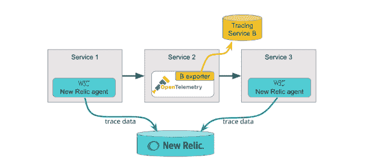
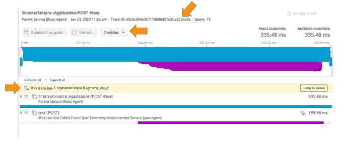
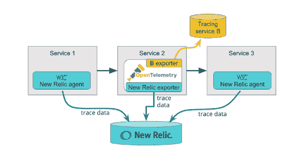
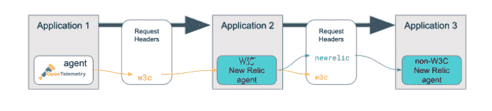

# 为什么 New Relic 支持 W3C 的分布式跟踪协议

> 原文：<https://thenewstack.io/why-new-relic-supports-w3cs-distributed-tracing-protocol/>

[新遗迹](https://newrelic.com/)赞助本帖。

 [朱迪·瓦尼

Jodee 是俄勒冈州波特兰市的新遗迹产品经理，她致力于提高可观测性。她把多余的精力用在骑自行车上，过着更小的生活，培养自己创造性的一面。](https://www.linkedin.com/in/jodee-varney/) 

对于使用高度分布式微服务应用程序的开发人员来说，分布式跟踪是一个必不可少的工具，允许他们跟踪跨越多个微服务的事件交互。但是，当跟踪从一个服务转移到另一个服务时，并不是所有的跟踪工具都遵循相同的通过 HTTP 头传递上下文信息的标准。

这种标准化的缺乏导致了互不兼容的标题格式的混乱——当一个组织中的开发团队选择他们自己的跟踪工具时，这肯定会是一个问题。

[W3C Trace Context](https://www.w3.org/TR/trace-context-1/) 是一个推荐标准，它使分布式跟踪更容易实现，更可靠，最终对使用现代高度分布式应用程序的开发人员更有价值。该标准极大地简化了开发人员使用来自不同分布式跟踪解决方案的工具来检测服务的用例。现在，所有符合 W3C 跟踪上下文标准的跟踪器和代理都可以参与跟踪。跟踪数据可以从根服务一直传播到终端服务。

近两年来，New Relic 参与了 [W3C Trace Context 工作组](https://www.w3.org/2000/09/dbwg/details?group=108594&order=org&public=1)，帮助定义标准并指导其通过审批流程。W3C Trace Context 规范已经达到了[“推荐”状态](https://blog.newrelic.com/product-news/w3c-trace-context-distributed-tracing-standard/)，现在我们很兴奋地宣布，我们已经启动了对该标准的支持，因为它已经获得了完全批准。

以下新的 Relic APM 代理现在支持 W3C 跟踪上下文标准:

*   Java 5.1.0 及更高版本。
*   Python 5.5 及更高版本。
*   Go 3.1.0 及更高版本。

[New Relic 开源药剂代理](https://github.com/newrelic/elixir_agent)现在也支持该标准，我们将很快为其他 APM 代理以及 New Relic 浏览器代理添加跟踪上下文支持。

要开始，只需[将您的代理](https://docs.newrelic.com/docs/agents/manage-apm-agents/installation/update-new-relic-agent)更新到适当的版本。(我们在下面解释向后兼容性。)然后，我们将详细描述在 New Relic 平台上，标准对于分布式跟踪和可观测性意味着什么。

## 如今分布式跟踪的问题是

每个分布式跟踪工具都需要一种方法，以正确的顺序“关联”跟踪的每个步骤，以及其他必要的信息来识别和诊断性能。这包括为每个事务分配一个唯一的 ID，为跟踪中的每个步骤分配一个唯一的 ID，将此上下文信息编码为一组 HTTP 头，并在跟踪通过应用程序环境时将头和编码的上下文从一个服务传递(或传播)到下一个服务。

要了解更多信息，请查看我们的[分布式跟踪简介](https://blog.newrelic.com/engineering/understanding-distributed-tracing/)，并了解[我们如何实现自己的跟踪解决方案](https://blog.newrelic.com/product-news/distributed-tracing-general-availability/)。

以前，每个分布式跟踪工具都采用定制的头和上下文格式；例如， [Zipkin 使用了 B3 格式](https://github.com/openzipkin/b3-propagation)，而在 New Relic，我们开发了自己的专有格式。当跟踪上下文标头主要在由单个跟踪工具监控的服务之间传递时，或者当标头很少传播到单个组织的网络和中间件基础设施之外时，这不是问题。

正如我们所说的，对于今天的许多开发团队来说，使用他们自己的跟踪工具并发现他们自己留下了互不兼容的头格式并不罕见。当跟踪工具收到它不理解的跟踪上下文标头时，它通常会丢弃这些标头，并中断依赖它们的跟踪。跟踪上下文头也更有可能穿过中间件边界，包括代理、服务网格和消息传递系统。这些设备中的一些将原封不动地传递专有报头，但许多其他设备将丢弃它们，再次导致中断的跟踪。

## W3C 跟踪上下文:打破可观察性的障碍

W3C 跟踪上下文支持跟踪的跨供应商互操作，这是四种基本遥测类型之一。这与 New Relic 的[开放仪器倡议](https://blog.newrelic.com/product-news/open-instrumentation/)和我们的[API、遥测 SDK 和导出器](https://blog.newrelic.com/engineering/opentelemetry-opentracing-opencensus/)的发布相一致，以满足客户对供应商和开源工具之间互操作的需求。

我们选择 W3C Trace Context 是因为我们观察到它的有用功能，可以确保 New Relic 的分布式跟踪工具可以遍历由其他供应商的代理提供的服务，而没有中断跟踪的风险。它还帮助 New Relic 的跟踪工具可靠地遍历第三方组件，包括代理和 API 网关。

同时，W3C Trace Context 将赋予开源跟踪器同样的优势，使我们的客户能够整合来自任何来源的跟踪遥测，并在高度分布式的应用环境中实现跟踪。

我们的主要目标是支持 Trace Context，因此它有望成为一项关键的、非常受欢迎的技术，用于未来的可观测性。

在功能上，W3C 跟踪上下文定义了一对标准化的上下文 HTTP 头，用于在服务之间传播上下文相关信息:

*   traceparent 标头包含每个分布式跟踪模型定义和传播上下文所需的数据元素:跟踪 ID、父 ID 和样本标志。
*   tracestate 头保存特定于供应商的上下文数据，通常是为了支持与特定跟踪工具相关联的附加功能或优化。

这种通用的上下文传播格式支持在符合标准的其他跟踪工具之间进行跟踪传播。标准的跟踪头格式也为中间件供应商支持传播跟踪头和框架供应商构建跟踪工具扫清了障碍。

如果您需要或希望使用除 New Relic 代理之外的工具来检测您的服务，但仍然希望在 New Relic 中捕获这些跟踪，我们希望大多数供应商和开源检测工具将支持 W3C 跟踪上下文。许多公司已经发布了兼容的跟踪器，包括 [OpenTelemetry](https://opentelemetry.io/) ，用于标准化整个行业的可观测性所需的仪器。

随着标准的成熟，我们希望任何使用其他头格式的跟踪器或工具能够采用 W3C Trace Context，并希望有更多的工具和垫片能够将现有的工具转换成 W3C Trace Context，以参与多供应商跟踪。

最终结果是更大的灵活性和更少的障碍。

## W3C 跟踪上下文如何在 New Relic 中工作

W3C Trace Context 在 New Relic 平台上有两种工作方式:

*   场景 1:一些跟踪数据被发送到 New Relic。
*   场景 2:所有跟踪数据都被发送到 New Relic。

让我们来看看两者。

### 场景 1:一些跟踪数据被发送到 New Relic

如果您的所有跟踪数据都被发送到 New Relic，您将能够在分布式跟踪用户界面(UI)中观察到完整的跟踪。但是，如果跟踪的一些数据被发送到另一个跟踪服务，或者根本没有发送到任何地方，那么您可能需要到处寻找这些数据。但是，使用 W3C 跟踪上下文，您可以使用跟踪 ID 来查找与该跟踪相关联的其他数据。

An example of call flow where some services are not sending trace data to New Relic, but the trace is still propagated.

例如，在上述场景中，您可能会有一个缺少跨度的跟踪。新的 Relic 分布式跟踪 UI 将显示跟踪有一个间隙，但使用周围的跨度，您仍然可以计算跟踪的总时间，或执行其他故障排除。

Use the trace ID in the distributed tracing UI to find trace data for missing spans.

### 场景 2:所有跟踪数据都被发送到 New Relic

如果您正在使用开源跟踪器，并希望将这些跟踪发送到 New Relic，我们已经为流行的开源监控工具创建了几个[导出器，包括 OpenCensus 和 OpenTelemetry。我们使用](https://docs.newrelic.com/docs/data-ingest-apis/get-data-new-relic/new-relic-sdks/telemetry-sdks-send-custom-telemetry-data-new-relic#external-data)[遥测 SDK](https://docs.newrelic.com/docs/data-ingest-apis/get-data-new-relic/new-relic-sdks/telemetry-sdks-send-custom-telemetry-data-new-relic) 构建了导出器，这是一组开源的 API 客户端库，可以将您的跟踪数据发送到 New Relic 平台。

在这种情况下，您可以使用为服务 2 收集跟踪数据的 OpenTelemetry 代理的导出器将数据发送到 New Relic，而不会中断您对其他导出器的使用。

An example of a call flow where an exporter allows New Relic to have data for the complete trace.

## 向后兼容性是如何工作的？

支持 W3C 跟踪上下文的新 Relic APM 代理可以接受和发出 W3C 跟踪上下文头格式和新 Relic 头格式。新代理也是向后兼容的，这意味着它们将继续与旧代理一起工作，因此跟踪上下文将在新旧版本的新遗留代理的服务之间传播。

在某些情况下，跟踪中可能会涉及到使用新遗留代理之外的工具进行检测的服务。只要该工具符合 W3C 跟踪上下文，您就可以使用任何支持 W3C 跟踪上下文的新遗留代理版本作为跟踪的一部分，并确保跟踪将被传播。

如果您有一个混合了新旧新遗留代理和符合 W3C 跟踪上下文的非新遗留工具的跟踪，如果您总是有与 W3C 跟踪上下文相邻的符合 W3C 跟踪上下文的新遗留代理，则跟踪仍然可以传播。支持 W3C 跟踪上下文的新遗留代理将充当新遗留专有跟踪上下文的“翻译者”。

例如，此跟踪包括一个 OpenTelemetry 代理、一个符合 W3C 的代理和一个不符合 W3C 的代理，但跟踪上下文仍然可以传播:

新遗留代理将始终接受和发出 W3C 跟踪头格式，并且它优先于新遗留跟踪头格式。您可以选择在代理的配置文件中禁用 New Relic 跟踪头格式。参见[文档](https://docs.newrelic.com/docs/understand-dependencies/distributed-tracing/get-started/how-new-relic-distributed-tracing-works#headers)中关于禁用新遗迹格式的说明。

有关向后兼容性的详细信息和限制，请参见[新遗迹分布式追踪文档](https://docs.newrelic.com/docs/understand-dependencies/distributed-tracing/enable-configure/enable-distributed-tracing)。

## 不仅仅是另一个无聊的协议

作为 W3C 分布式跟踪工作组的一员，我们与整个行业的同事密切合作，使该规范获得最终批准。

New Relic 致力于 W3C 集团，我们将继续提供与开放标准无缝协作的可组合仪器解决方案。我们还将继续增加对更多分布式跟踪用例的支持，以帮助我们的用户在整个 DevOps 生命周期中提高可观察性。同时，我们希望听到您的意见，以及您如何利用 W3C Trace Context 和我们的开源导出程序。在我们的 [GitHub 出口商规格报告](https://github.com/newrelic/newrelic-exporter-specs)中给我们留言。

升级您的代理并立即开始使用开放的 [New Relic One 平台](https://newrelic.com/platform)。

想进一步了解为什么您需要一个开放、互联和可编程的平台来实现可观察性？看看我们的电子书[“可观察的时代”](https://newrelic.com/resource/what-is-observability)

通过 Pixabay 的特征图像。

<svg xmlns:xlink="http://www.w3.org/1999/xlink" viewBox="0 0 68 31" version="1.1"><title>Group</title> <desc>Created with Sketch.</desc></svg>