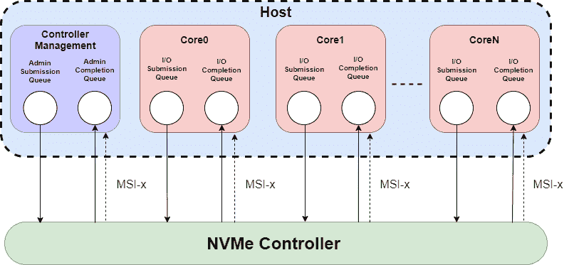

# 为什么 NVMe 是您数据中心的更好选择

> 原文：<https://thenewstack.io/why-nvme-is-a-better-choice-for-your-data-center/>

NVMe 是一组协议和技术，大大加快了数据传输、存储和检索的速度。在本文中，我们将讨论为什么 NVMe 正在兴起，总结 NVMe 和 NVMe 在结构上的架构，并概述常见的使用案例和优势。

## 什么是非易失性存储器快车(NVMe)？

 [穆拉特·卡尔斯利奥格鲁

Murat 是一名基础架构架构师，拥有存储、分布式系统和企业基础架构开发方面的经验。他是 MayaData 的产品副总裁，也是 CNCF 项目 OpenEBS 的维护者之一，还是《Kubernetes-devo PS 食谱大全》的作者。](https://www.linkedin.com/in/muratkarslioglu/) 

自 20 世纪 70 年代 SCSI 发明以来，NVMe 可以说是传输和存储数据方面最重要的进步。根据最近的分析报告，在过去的半个世纪中，每年存储的数据量呈指数级增长，从 20 世纪 70 年代的每年数百或数千万亿字节增长到 2021 年的超过 50 万亿字节，增长了 100 多万倍。与此同时，底层磁盘驱动器并没有得到很大改善，它们的性能受到声速和协议的限制，每台设备传输和检索数据的速度约为 150 IOPS。

例如，通过 SAS 协议连接的 JBODs(仅由一堆磁盘组成的服务器机箱)在每个设备的可用吞吐量以及可以连接的设备数量方面受到限制。相比之下，TCP 上的 NVMe 具有几乎无限的连通性；虽然 SAS 仅限于单个队列，但 NVMe 每个队列有 65，000 个。

通过端到端使用 NVMe，从工作负载访问到任何容器连接存储和高性能固态硬盘，NVMe 和 NVMeoF 使数据中心硬件和软件能够高效利用固态硬盘的闪存优势。这给了 NVMe 各种优势，包括:高输入/输出速度，较低的延迟和处理更多命令的能力。

## NVMe 建筑

在其核心，NVMe 包括一个目标控制器和一个主机端接口，同时使用非易失性存储器来保存数据。NVMe 接口规范允许使用 PCIe 接口优化固态硬盘。在典型的数据中心设置中，NVMe 主机通过 PCIe 总线连接到一个或多个 NVMe 固态硬盘。NVMe 固态硬盘由固态硬盘控制器、PCIe 主机接口和非易失性内存组成。

主机的 NVMe 驱动程序将内存映射 I/O (MMIO)控制器寄存器和系统的 DRAM 用于输入/输出中的提交和完成队列。它可以支持的并行操作数量取决于映射寄存器的数量。如上所述，NVMe 允许 65，000 个深度为 65，000 的队列。

### 关键性能特征

*   NVMe 存储比基于 SATA 的固态硬盘速度快得多，也比传统旋转硬盘快得多。硬盘受到转速的限制，最高转速为 7200 转/分。SATA 硬盘的最大读取速度高达 500 MB/s，而使用 SATA 的固态硬盘的最大读取速度为 2 GB/s。相比之下，PCIe Gen 4.0 NVMe m.2 版固态硬盘显示的性能数据为 7，000 MB/s 顺序读取和 5，000 MB/s 顺序写入，比 SATA 连接的固态硬盘的性能提高了 10 倍以上。
*   NVMe 还提供了更低的延迟。逻辑设备接口利用固态硬盘提供的并行性和低延迟来确保快速响应。SATA 存储的典型延迟是 6 毫秒，而 NVMe 是 2.8 毫秒。PCIe 体系结构允许在内存中进行速度和映射操作，每个队列最多允许 64，000 次操作。

## 选择 NVMe 作为数据中心的优势

*   **高性能闪存:** NVMe 允许企业利用高性能闪存。虽然 SATA 与硬盘驱动器(HDD)配合良好，并且已经发展到支持 SSD 的 I/O 需求，但当与现代的基于闪存的 SSD 配合使用时，它仍然会遇到各种效率低下的问题。另一方面，NVMe 提供多个数据流，允许完全利用 CPU 和 GPU 资源。
*   **数据的分割和精简:**为了提高速度，NVMe 允许数据的分割和精简，这样就可以同时写入。这意味着 NVMe 提供了数倍的带宽、多核支持和延迟改进。
*   **支持不同的外形规格和连接:**该规范还支持不同的外形规格和连接，允许为任何存储平台提供基于闪存的多种选项。NVMe 附带了几个命令，允许 NVMe 主机和固态硬盘之间的直接通信。这为在固态存储上读写数据创建了更快的界面和简化的工作流程。PCIe 和 NVMe 消除了低效 SATA 总线带来的瓶颈，改善了数据的存储和管理，同时优化了系统性能。
*   **降低功耗:**由于读/写速度更快，采用 NVMe 的数据中心的功耗降低了。闪存中的数据持久性几乎是完全不可变的，这降低了灾难发生的几率。NVMe 还使用固态元件，几乎不会移动、制造噪音或散热。这保证了很少的磨损，允许完全利用数据中心基础设施的投资。

### 流行的 NVMe 用例

NVMe 可能适用的一些使用案例包括:

**瓶颈数据库:**任何性能受限于数据库响应能力的应用程序都可以从采用 NVMe 中受益匪浅。直接连接到应用节点或通过低开销存储管理系统连接到应用节点的 NVMe 闪存存储介质可提供增强的性能，从而减少数据集所需的服务器和数据库系统的数量。这是因为 NVMe 的快速 IOPS 性能大大减少了数据库扫描时间。此外，NVMe 可以有效地用于数据库的各个方面，包括内存扩展、临时空间、日志记录、数据访问和内存部署等。

**高性能计算应用:** NVMe 固态硬盘被广泛应用于关键任务应用，如外汇交易、医疗保健、视频游戏服务和国防，这些应用非常需要低延迟。通过减少数据读取时间，可以更快地执行计算，从而更好、更快地做出决策。

**人工智能:** AI 和机器学习系统通常依赖现场可编程阵列、定制集成电路和图形处理单元进行数据处理和决策。凭借其大带宽和低延迟，通过 NVMe 端到端连接的 NVMe 设备可以解除此类系统的阻塞。

### 织物上的 NVMe(NVMe)

2020 年，随着 Linux 内核 5.0 的发布，TCP 上的 NVMe 出现了。该协议承诺有效地使存储底板可路由。这一进步的含义是加速将存储分解到操作环境中，可从本地磁盘和以弹性方式部署的高性能 NVMe 连接 JBODs 获得。TCP 上的 NVMe 使服务器和存储之间的连接更加高效，并可以降低服务器工作负载的 CPU 利用率，尤其是在与数据处理单元(dpu)一起提供时。英伟达、可替代和其他提供商正在大力投资 dpu，这预示着未来数据流量能够更好地通过数据中心，而不会使 CPU 负担过重。

### 顶级 NVMe 供应商

NVMe 通过指定标准 PCIe 连接来支持标准全闪存系统。包括戴尔、HPE、NetApp、Pure Storage、IBM 和 Nimble 在内的各种供应商都提供了面向市场的闪存系统，可以用 NVMe 固态硬盘取代传统的 SATA 和 SAS 固态硬盘。这些一体化共享存储系统的基础架构与以前的存储系统相似。这些解决方案不是通过 TCP 上的 NVMe 和 NVMe 将存储分解到操作环境中，而是通过集中化和控制提供传统的管理优势。

相反，一些容器附加存储解决方案提供了共享存储系统架构和本地存储之间的中间地带，倾向于将存储功能分解为本地磁盘和远程访问 JBODs、云卷和对象存储的混合。其中最受欢迎的是 MayaData 的 [OpenEBS，这是一个开源和云原生计算项目，由 Arista、Flipkart 和彭博等企业使用。](https://mayadata.io/) [Mayastor](https://github.com/openebs/Mayastor) ，OpenEBS 的最新存储引擎，与底层设备的性能能力相比，提供了非常低的开销，并基于 TCP 围绕 NVMe 和 NVMe 构建。虽然 OpenEBS Mayastor 不需要 NVMe 设备，也不需要工作负载通过 NVMe 访问数据，但从运行支持 TCP 上 NVMe 的容器的工作负载，通过低开销的 OpenEBS Mayastor 和 NVMe 设备进行端到端部署，将尽可能接近底层设备的理论最高性能。

OpenEBS Mayastor 在内部使用 TCP 上的 NVMe 是开源存储项目中独一无二的。要了解更多关于 OpenEBS Mayastor 如何能够提供不到 6%的开销(相对于英特尔快速底层 NVMe 设备的理论最大性能)，请[访问本文](https://openebs.io/blog/mayastor-nvme-of-tcp-performance/)。这是仅有的能够处理每个集装箱可能需要超过 150 万 IOPS 的工作负载的解决方案之一。

OpenEBS Mayastor 构建了一个基础层，使工作负载能够以一种声明性的 Kubernetes 本机方式按需合并和控制存储。在这样做的同时，用户可以专注于重要的事情:从使用有状态工作负载的应用程序想要发现的洞察中受益。

如果您有兴趣亲自试用 Mayastor，可以在这里找到关于如何建立自己的集群并运行常用的基准测试`fio **的说明。另请参见 OpenEBS Mayastor 和英特尔 Optane 的[性能指标评测详情](https://mayadata.io/assets/pdf/product/intel-and-mayadata-benchmarking-of-openEBS-mayastor.pdf)。**`

`**<svg xmlns:xlink="http://www.w3.org/1999/xlink" viewBox="0 0 68 31" version="1.1"><title>Group</title> <desc>Created with Sketch.</desc></svg>**`