# 为什么可观察性对开发人员至关重要

> 原文：<https://thenewstack.io/why-observability-is-crucial-for-developers/>

[LightStep](https://lightstep.com/) 赞助本帖。

 [卡尔蒂克·库马尔

Karthik 是 Lightstep 的一名软件工程师，他对软件性能、可靠性和可观察性很感兴趣。](https://www.linkedin.com/in/karkum/) 

我的工作中最酷的事情之一就是使用我们自己的产品 Lightstep 来监控 Lightstep 正在进行的开发。在产品方面，我们发现了功能改进和可用性增强的机会。在运营方面，我们发现问题，调试事件，并对我们发布的软件更有信心。

在这篇文章中，我将通过例子来说明可观察性对于开发人员经常承担的任务是如何至关重要的:分解一个整体，部署新代码，调试 CI 问题，以及对生产事件进行分类。

## 部署新代码

“不要在星期五部署”是软件工程中常见的陈词滥调。我们的座右铭是“不要在星期五部署…没有适当的可观察性。”我们在几周前测试了这一点，当时我们部署了我的团队的一个服务的新版本。变更集包括不熟悉的变更，因此我们密切关注我们知道重要的特定操作。[部署的服务健康状况](https://docs.lightstep.com/docs/investigate-changes-in-service-performance)指出了错误率增加的问题。

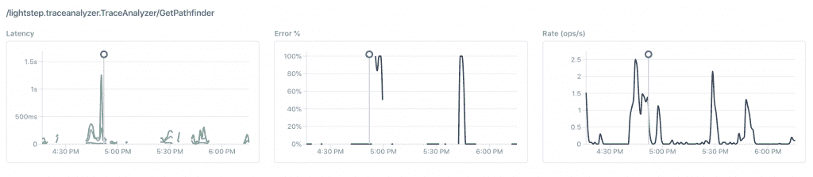

首先，检测到服务的新版本(竖线)。这个操作很少被触发，但是应该永远不会返回错误，所以在部署后立即看到 100%的错误率是令人担忧的。

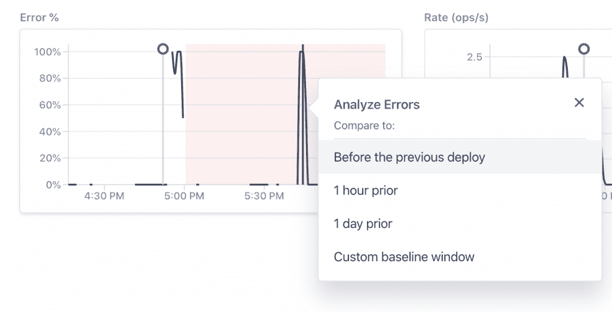

自信地部署意味着快速了解发生了哪些变化。在这种情况下，我们深入研究了在之前的部署中没有发现的错误。

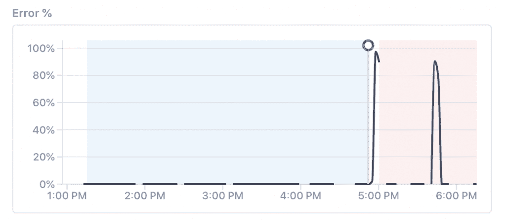

选择的两个时间窗口是基线(蓝色，部署前)和回归(红色，部署后)。窗口具有不同的宽度，因为当检测到异常时，捕获更多的轨迹用于分析。

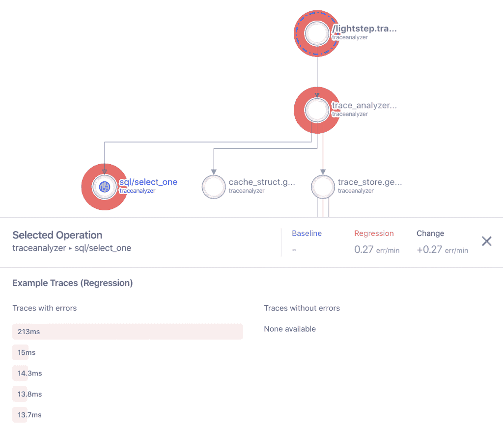

接下来，有两条信息指出了根本原因。首先，在所有跟踪中聚集的操作图有助于可视化调用堆栈，并直接暗示“sql/select_one”是错误的来源(红色晕圈表示错误)。下表链接了一些可能感兴趣的跟踪。

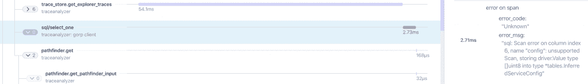

在跟踪视图中，日志消息有答案。反序列化列时出现的问题导致错误传播到用户。在这种情况下，我们回滚了部署，并且有足够的信息来解决问题。

## 调试事件

随叫随到压力很大。这种压力随着体系结构的复杂性而增加。但是还是有希望的:在你的系统中拥有[端到端的可观测性](http://lightstep.com/observability)对于减少这种压力至关重要。

在最近的一次值班中，我面临着一个噩梦般的场景:在清晨收到一个陌生服务的陌生警报。

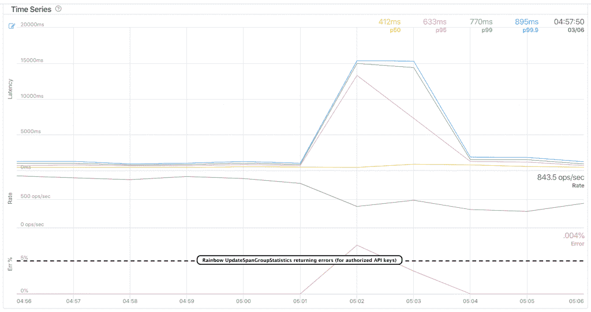

警报来自为一项重要行动设置的流。违反了 SLO(最后 10 米的误差率超过 5%)。从图中可以看出，延迟也达到了 15 秒左右。

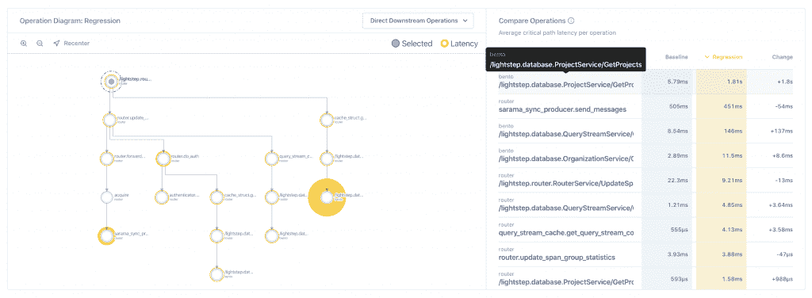

对这个特定操作的深入研究揭示了这个操作的分层复杂性(每个节点都是一个操作，黄色晕圈表示延迟贡献)。调用了几个服务，因此调查的表面积可能非常大。但是上面显示的操作图给了我一个从哪里开始调查的提示。部落知识告诉我,“bento”服务负责管理对我们的 SQL 数据库的调用，因此查看那里似乎是有希望的第一步。

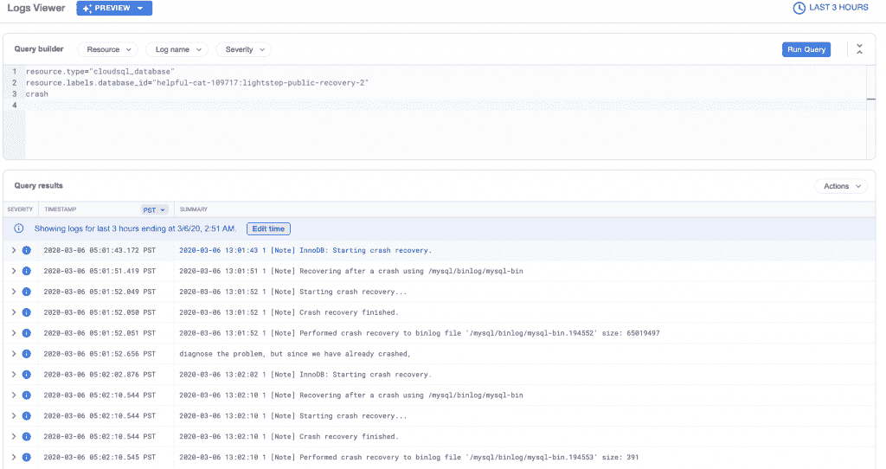

数据库日志显示意外的崩溃和重启。此时，根本原因已经完成。采取了补救措施，并且通过将调查范围缩小到相关服务，大大缩短了平均就寝时间(MTTGBTB)。

## 分解一块巨石

一位老经理用“当你在驾驶飞机时改变它的引擎”来描述向微服务的迁移。停机在大多数组织中是禁忌，所以可观察性通常是安全地拆开一块巨石的最好方法。

我们最近分解了一个整体的 gRPC 服务(称为“liveview”)，将一些 RPC 转移到一个新的服务(称为“historian”)。Lightstep 的[服务目录](https://docs.lightstep.com/docs/view-individual-service-performance#view-service-health-and-compare-ingress-operation-performance)有助于验证入口操作(我们关心的那些)是否正确地过渡到新服务。“[金色信号](https://landing.google.com/sre/sre-book/chapters/monitoring-distributed-systems/#xref_monitoring_golden-signals)指示如下:

*   延迟没有改变，所以历史记录者有适当的资源分配。
*   错误仍然不存在(0%)——所以我们没有引入任何错误。
*   吞吐量在 historian 中保持不变，在 liveview 中变为 0——所以我们没有忘记更新客户端。

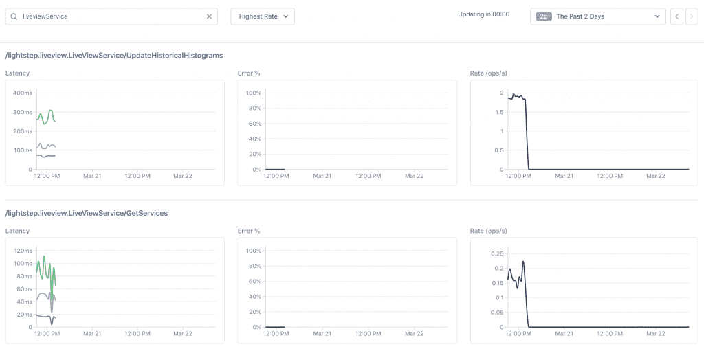

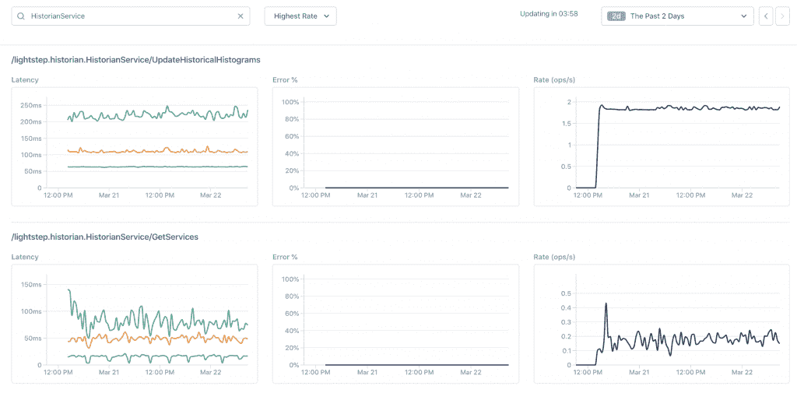

*上图:Liveview 的流量过渡到历史学家。*

## CI 故障分类

我们使用 [Cypress](https://www.cypress.io/) 进行持续集成。Cypress 测试在我们的临时环境中运行，该环境可能相当不稳定(频繁地从头部署)。失败会触发如下所示的松弛通知:

这通常会提示多个问题:是否存在后端问题？是短暂的吗？测试过时了吗？是部署造成的吗？我应该把这件事上报给哪个团队？

为了提供对测试问题的更多可见性，我们[在 Lightstep 中创建了一个流](https://docs.lightstep.com/docs/monitor-a-service-level-indicator-with-streams)来跟踪测试所使用的特定项目中的错误。这是最近一期测试的一个例子:

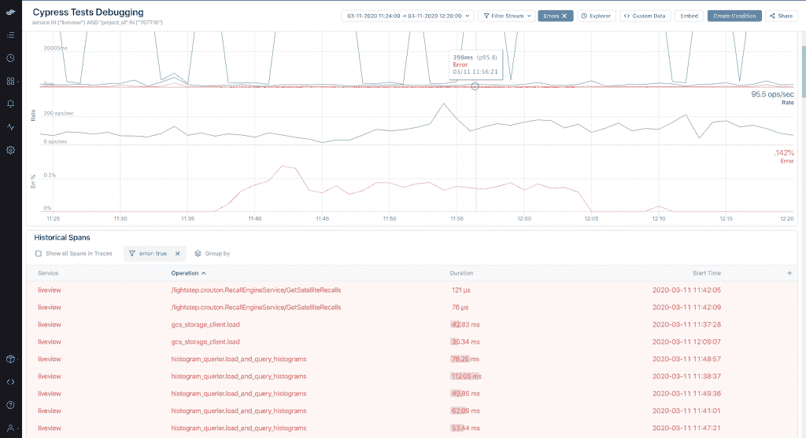

对测试失败进行分类的前端工程师可以查看这个流，以确定可能的根本原因。在这种情况下，问题的范围是“liveview”服务，并通知适当的团队进行进一步调查。

你正在采用微服务吗？你和上面的例子联系得太好了吗？如果你有兴趣了解 LightStep 是如何工作的，请查看我们的[互动沙盒](https://app.lightstep.com/play/service-directory/android/deployments)。

通过 Pixabay 的特征图像。

<svg xmlns:xlink="http://www.w3.org/1999/xlink" viewBox="0 0 68 31" version="1.1"><title>Group</title> <desc>Created with Sketch.</desc></svg>