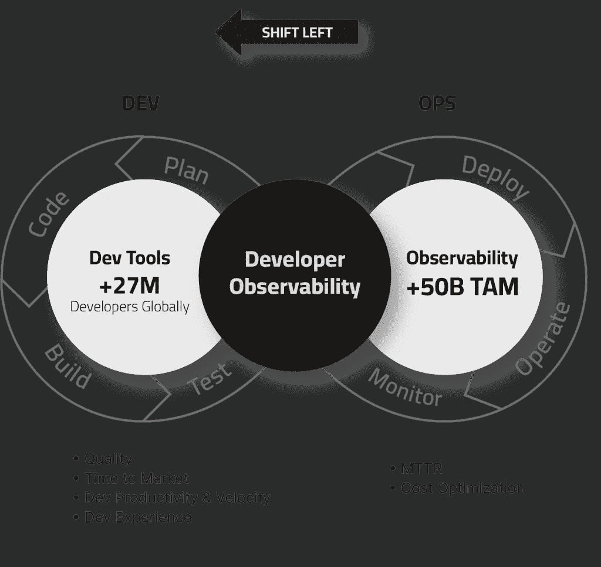
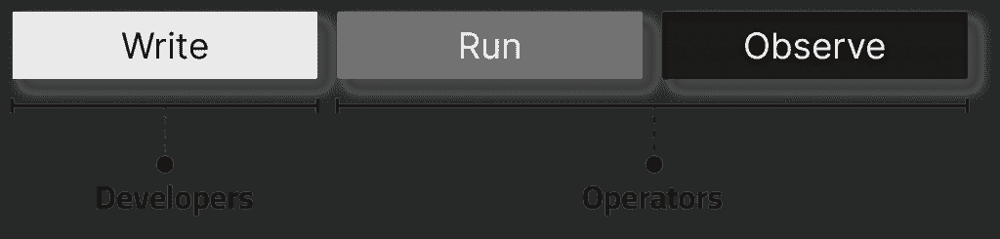

# 为什么可观察性在左移

> 原文：<https://thenewstack.io/why-observability-is-shifting-left/>

编者按:这是 Lightrun 的“左移可观测性”三部分系列的第一部分。

在传统的软件公司中，写代码的人和运行代码的人之间有严格的界限:你要么在开发部*、*工作，要么在运营部工作。

这种划分非常清晰:开发人员为应用程序设计和编写代码，反过来，应用程序运行在操作人员(开发人员工程师、生产工程师、站点可靠性工程师、IT 人员等)构建、监控和维护的基础设施上。

 [伊兰·皮莱格

Ilan 担任 Lightrun 的首席执行官，是该公司的联合创始人之一。他拥有独特的技术和领导背景，包括在 FireGlass(已被赛门铁克收购)和 LivePerson 担任开发角色。](https://www.linkedin.com/in/ilan-peleg-5a31396b/?originalSubdomain=il) 

因此，毫不奇怪，[可观测性](https://thenewstack.io/observability/)——简单地通过观察系统的输出来检查其内部状态的实践——是为操作人员保留的。系统输出是一个 ops 问题，而不是 dev 问题。开发人员拥有输入，但不拥有输出——他们与他们最初编写的代码发出的实际应用程序输出相去甚远。

一般来说，可观测性是操作员在部署后关心的问题。一旦系统启动并运行，预计它会发出操作员可能需要了解其内部情况的所有信息。不期望操作员推送新代码或以其他方式显著改变系统状态来获取更多信息——它应该已经在那里了。

## “记录一切并在以后有意义”的成本

对工具的过度依赖导致一种奇怪的模式出现:团队倾向于简单地尽可能多地记录日志，并在生产中使用复杂、昂贵(有时甚至是笨重)的日志分析工具来解析所有数据并理解它。使用和分析这些日志的工具越来越多，这个问题就越来越严重。90%的公司使用多种[观察工具](https://thenewstack.io/serverless-needs-more-observability-tools/)，复杂性快速增加。

在内部，我们称这种方法为“记录一切并在以后有意义”，我们认为这是由于两个主要因素造成的:

**1。静态可观察性的广度**——您永远无法记录应用程序中的所有内容。如果每一行功能都伴随着一行遥测技术，那么随着时间的推移，维护一个适当大小的代码库将会非常困难。在永无止境的日志记录的重压下，应用程序的吞吐量将会急剧下降，有效地阅读这些数据将是一项艰巨的任务。

作为理智的开发人员，我们做了一个妥协:我们只记录我们认为在开发过程中需要的信息，并希望这些信息在我们生产中需要它们时可以作为指路明灯。

当然，问题是盲点是不可避免的。开发人员无法在开发过程中预测所有已知的未知和未知的未知，因为软件系统是无限复杂的存在，具有无限的相互依赖性，在任何给定的时间都可能出现新的问题。

当你因前方明显的能见度差距而束手无策时，你会面临两个糟糕的选择:

*   *   **再现**——启动一台机器，复制生产系统的确切状态，尝试“重做”导致错误的动作。这并不总是可能的，而且几乎总是耗时且不符合人体工程学。
    *   **热修复**——增加更多遥测技术来填补空白。这将导致漫长的重新部署周期，花费每个开发人员在上下文切换和等待他们问题的正确答案上的时间。

****2。可观察性成本****——当开发人员过度记录他们的应用程序时，日志成本会迅速攀升。我们举个具体的例子:你的一般电子商务网站。在一个流量足够大的商店中，你可能会看到同一段代码每天被执行数百万次——例如，想象一下在每次页面加载时检查购物车状态的逻辑，或者一段分析代码。在那里添加一行新代码将导致每月发出数亿行日志。让我们以一个每秒钟点击 100 次、每次点击发出三个日志的正常流量端点为例。由于每个日志的平均大小为 200 字节，所以我们说的是每年超过 1.9TB 的新日志！在一个普通的日志管理系统中，每年仅接收一次(保留 30 天)就要花费大约 190 美元。

在高流量环境中，一个像样的代码库有成千上万个这样的日志，光是接收日志一年就要花费 200 万美元，这就给你留下了一个很大的日志成本问题。这还不包括调试开发人员留下的日志。

在下一篇文章中，我们将定义“左移可观察性”在实践中的实际含义，[什么是开发人员可观察性](http://lightrun.com)以及为什么我们应该使用它作为上述问题的解决方案。

阅读本系列的第二部分。

[阅读本系列的第三部分。](https://thenewstack.io/shifting-left-observability-in-practice-an-overview/)

<svg xmlns:xlink="http://www.w3.org/1999/xlink" viewBox="0 0 68 31" version="1.1"><title>Group</title> <desc>Created with Sketch.</desc></svg>