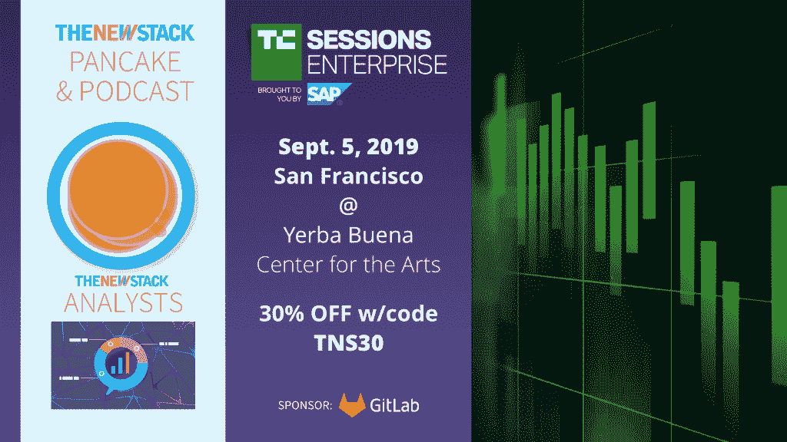

# 为什么开源自由引领了企业的技术采用

> 原文：<https://thenewstack.io/why-open-source-freedom-leads-technology-adoption-in-the-enterprise/>

[云代工厂](https://www.cloudfoundry.org/)赞助本帖。

现代企业是着眼于未来的企业。它知道过去(甚至可能从遗留产品中获得大量收入)，但它的长期生存依赖于为明天做准备。这就是为什么在 [云铸造基金会](https://www.cloudfoundry.org/) 我们经常谈论“构建未来”在我看来，现代企业在构建我们明天、今天所需的应用程序、工具和功能方面处于领先地位。

现代企业也批判性地思考他们应该自己制造什么，应该从其他地方采购什么。有才华的工程师是公司为了保持竞争力可以雇佣的最有价值的资产之一，因此确保这些工程师有专注于差异化的自由对公司的成功非常重要。所有这些都归结为敏捷性，即在不断变化的竞争环境中快速响应客户、合作伙伴和利益相关方需求的能力。您在需求和交付的技术之间迭代得越快，您作为企业的响应就越快。

 [Chip Childers

Chip 在大规模计算和开源软件方面已经花了超过 18 年的时间。2015 年，他成为云铸造基金会的联合创始人，担任技术参谋长。他是 Apache CloudStack 的第一任副总裁，在 SunGard 领导企业云服务时，他帮助推动了该平台的发展，后来又在 Cumulogic 担任产品战略副总裁。在 SunGard 之前，他领导了包括 IRS.gov、USMint.gov、美林和 SEI Investments 在内的组织的任务关键型应用程序的重建工作。](https://www.cloudfoundry.org/) 

几年前，我们谈到“互联网时间”是指商业反应的转变。现在，我们处于“云时间”，这使得互联网时间变得过时。开源软件的 Cloud Foundry 家族就是基于这一基本需求而构建的。我们的项目专注于卓越的开发人员体验和巨大的运营杠杆。当 Cloud Foundry 嵌入到一个组织中时，工程师可以自由地创建他们希望*构建的应用程序，以推动他们的公司和用户走向未来。*

开发人员可以用他们选择的语言、选择的框架进行编码，跳过复杂的环境配置和琐碎的操作任务。 [Cloud Foundry 应用运行时](https://www.cloudfoundry.org/application-runtime/) 抽象出运行软件的环境设置和大部分运营负担。它可以自动处理许多较难和较慢的部署和操作任务，因此开发人员可以专注于创造性地、快速地和大规模地构建应用程序。

### 【Cloud Foundry Foundation 如何支持开发人员和企业

我们在 Cloud Foundry Foundation 的角色是为开源贡献者、Cloud Foundry 最终用户、服务提供商和供应商提供一个健康的生态系统。我们通过为协作和技术领导提供一个中立的领域来确保供应商取得成功，即使他们可能会相互竞争。我们的立场是确保项目管理委员会听到用户的声音，开源贡献者社区的工作对这些用户是可见的——并且我们支持用户对用户围绕共享问题的协作。

这是一次利用我的技术和商业历史来帮助将所有这些组织和人员聚集在一起的练习。我与我们所有成员公司的开发人员和首席信息官密切合作，从大型航空航天公司到非政府组织，从跨国电信提供商到致力于提高能效的智库。我的背景使我能够与各垂直行业的技术领导者和开发人员进行对话，特别是关注对他们日常斗争的同情。我发现与该基金会合作的企业寻求支持，以适应技术领域的快速变化，从云计算到开发工具和框架。这样，开源软件是未来发展的领先指标，基金会的集体知识可以为企业提供关键的指导。

通过 Pixabay 的特征图像。

<svg xmlns:xlink="http://www.w3.org/1999/xlink" viewBox="0 0 68 31" version="1.1"><title>Group</title> <desc>Created with Sketch.</desc></svg>