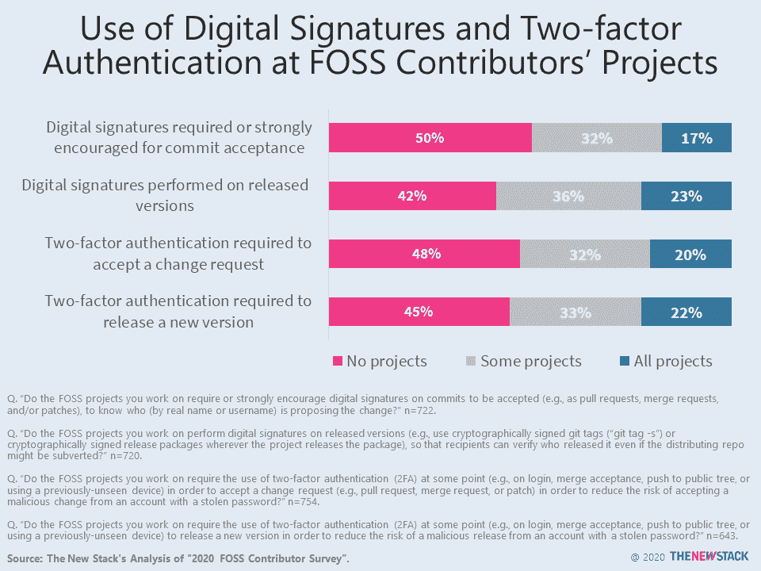
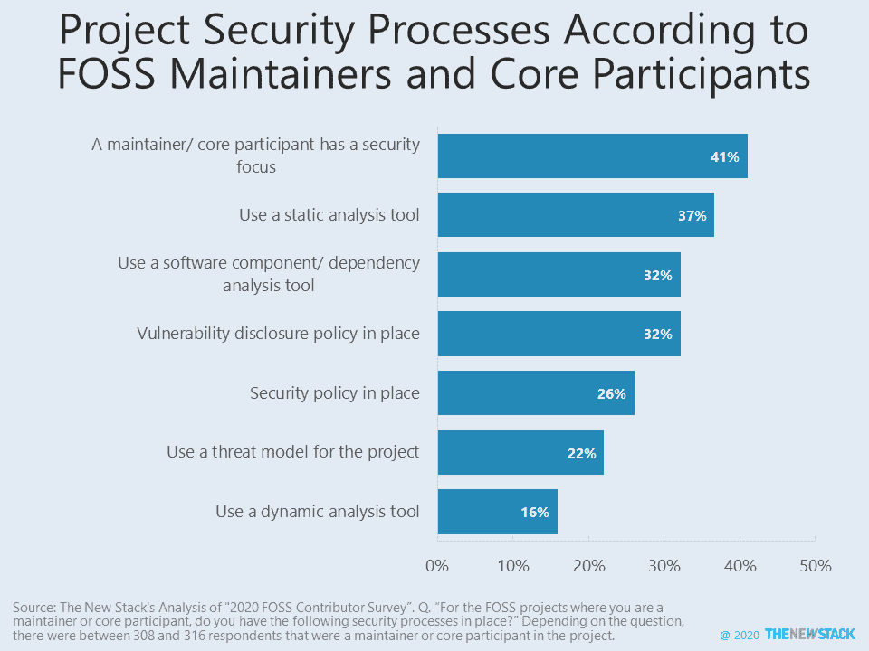

# 为什么开源项目维护者不愿意使用数字签名、双因素认证

> 原文：<https://thenewstack.io/why-open-source-project-maintainers-are-reluctant-to-use-digital-signatures-two-factor-authentication/>

我们都同意开源开发方法有助于创建更好的代码。 [Eric S. Raymond](http://www.catb.org/esr/) 在他的开创性文章《[大教堂和集市](http://www.catb.org/esr/writings/cathedral-bazaar/)》中向我们展示了原因，文章解释了开放的方法论如何在 [GCC](https://gcc.gnu.org/) 、Linux 内核以及他自己的 [Fetchmail](http://www.fetchmail.info/) 项目中发挥作用。但是，那是一般的规则。开源仍然可能被无良开发者滥用。那么，我们为什么不通过使用双因素认证(2FA)或数字签名来确保当程序员试图将代码合并到程序中时，他们确实是他们所说的那个人呢？好问题。

你可能认为这不是一个真正的问题。唉，的确是。例如，2019 年[流行的 RubyGems bootstrap-sass 包的恶意版本在其官方知识库中发布](https://snyk.io/blog/malicious-remote-code-execution-backdoor-discovered-in-the-popular-bootstrap-sass-ruby-gem/)。在被发现和删除之前，它已经被下载了令人难以置信的 2800 万次。

那不是一个孤立的案例。 [CursedGrabber 恶意软件](https://securityaffairs.co/wordpress/111321/malware/cursedgrabber-malware-campaign.html)于 2021 年 1 月成功[发布到 JavaScript npm 开源软件代码库](https://threatpost.com/discord-stealing-malware-npm-packages/163265/)。

显然，有必要确保开发人员可以追溯到现实世界的身份。但是，在 Linux 基金会的 2020 年自由/开源软件贡献者调查中，当开发者被问及他们从事的开源项目是否需要使用 2FA 时，如 [GitHub 组织设置“需要双因素认证](https://docs.github.com/en/enterprise-server@2.21/admin/user-management/requiring-two-factor-authentication-for-an-organization)”，答案令人失望地低。不到一半，47.55%，没有全部用完。只有 32.11%的人说他们的一些项目需要 2FA，而超过五分之一的人(20.34%)说他们的所有项目都需要 2FA。

> 二级身份认证因素采用率低的主要原因是，打开任何多因素身份认证(MFA)都是一个额外的步骤，因为它很少在任何软件包中默认打开

马克·洛夫莱斯，GitLab 高级安全研究员。

为什么不呢？大多数受访者表示，不包括 2FA 是缺乏决策，而不是一个决定。许多人要么不知道这是一个选项，要么因为这不是默认行为，所以不考虑它，或者被认为要求太严格。“这不是决定，这是默认。”

对调查的一些详细回答表明，对于许多开发人员来说，安全性并不是首要任务。他们没有看到任何“低风险项目[2FA]的需求。”其他一些有少量贡献者的项目表示，他们根本不认为有这个必要。而且，正如许多安全失败合理化的例子一样，许多人认为 2FA 太难用了。一个人甚至说，“增加额外的环来跳过通常会对项目不利。我们的目标是让投稿过程尽可能简单。”

至于数字签名，其中发布的版本带有加密签名的 git 标签(“`git tag -s`”)或发布包，以便用户可以验证是谁发布的，即使发布的回购可能被破坏，它们也没有得到应有的使用。41.53%的人根本不使用它们，而 35.97%的人偶尔使用它们。只有 22.5%的人一直在使用它们。

为什么不呢？好的旧惯性和“我们从未使用过它们”出现了很多。当然，其他人认为没有必要使用数字签名。一个人解释道，“信任被放在评审、签署和转发变更的子系统维护者身上，以及公共评审系统中，而不是信任个人贡献者。”不错，但它仍然不能阻止一个被黑客攻击的维护者帐户造成的破坏。事实上，至少有一个程序员认为根本没有必要使用它，“因为[它]给贡献带来的摩擦永远比不上拥有它带来的安全好处。”

如果它更容易实现，例如，“一个我可以使用、理解并坚持让贡献者通过像 [GitHub](https://github.com/) 这样的渠道提供它们的简单流程”，一些人会更倾向于使用它。

这两种方法都会带来帮助。 [Patrick Toomey](https://github.com/ptoomey3) ， [GitHub](https://github.com/) 的产品安全工程总监指出，“成熟项目的开源维护者(超过 100 个贡献者)使用 2FA 的可能性[是普通用户的三到四倍](https://www.microsoft.com/en-us/security/business/security-intelligence-report)这并不奇怪，因为“更大和更受欢迎的项目意识到它们在开源软件供应链中的地位和责任。此外，这些项目通常成为 GitHub 组织，能够使用团队管理对其存储库的访问，并设置安全策略，包括启用 2FA 的要求。”

Toomey 继续说，2FA 也变得更容易使用。“例如，GitHub 是新兴的 [WebAuthn 标准](https://webauthn.io/)的[早期采用者](https://github.blog/2019-08-21-github-supports-webauthn-for-security-keys/)。我们最初的支持利用该标准的子集，通过物理安全密钥实现非常强大的 2FA。”更好的是，“所有主要平台最近都增加了使用用户已经拥有的设备的能力(例如 Face ID、触控 ID、Windows Hello 等)。这消除了对任何物理安全密钥或第三方 2FA 应用程序的需要。随着时间的推移，我们乐观地认为这将进一步增加 2FA 的采用，因为 WebAuthn 提供了一个难得的机会，允许用户更安全、更轻松地进行身份验证。”

即便如此， [Mark Loveless](https://www.linkedin.com/in/markloveless/) ， [GitLab](https://about.gitlab.com/) 高级安全研究员指出,“二级认证因素采用率较低的主要原因是，开启任何多因素认证(MFA)都是一个额外的步骤，因为它很少在任何软件包中默认开启。这主要是因为大多数软件供应商希望系统管理员能够定制新安装的软件来满足特定的需求。此外，大多数开源项目的维护者是编码专家，而不是经验丰富的安全系统管理员。因此，开启 MFA 并不总是首选。”

也就是说，Loveless 说，“大多数软件，包括 GitLab 的，确实使实现 MFA 变得相当容易。我不认为这是说服开源项目的维护者使用 MFA 的安全措施的问题，而是简单地提醒他们应该这样做。”

当然，在一个理想的世界里，洛夫莱斯分享道，“整个第二因素的情况之所以存在，是因为第一因素——密码本身——已经一次又一次地被证明是不安全的。如果我可以挥动魔杖，我们就不会使用密码，而是使用两个因素，如指纹等生物特征和存储在基于 USB 的安全密钥上的 FIDO U2F 密钥。”

至于数字签名 [Matt Sicker](https://twitter.com/jvz?lang=en) 、 [Apache Software Foundation](https://www.apache.org/) 成员和[cloud bees](https://www.cloudbees.com/)高级安全工程师评论道:“通常用于签署软件的应用程序通常具有令人困惑的用户界面，需要学习基本的加密概念才能正确使用它们。如果没有针对大型开源项目的某种代码签名政策，许多开发人员根本意识不到对他们的软件进行签名的好处。”

另一方面，多因素认证，Sicker 继续说，似乎比代码签名更受支持，但这也是一个改善 UX 和教育可能会改善情况的领域。当你也考虑到开源软件更倾向于去中心化的时候，签名密钥的物理分发的通用方法本身就是一个密码学意义上的难题。“W3C WebAuthn 规范有望在这方面有所帮助。

[Alex Karasulu](https://www.optdyn.com/) ，也是 ASF 成员和 OptDyn 的首席执行官/首席技术官，非常了解 2FA 和数字签名。他创造了第一个用于数字签名和代码签名的移动一次性密码(OTP)2FA Apache Triple sec。Karasulu 认为“开源社区中的代码签名过程可以通过更加一致地应用 2FA 过程得到极大的改善。”

“问题不在于开源开发者懒惰或不情愿，”Karasulu 说，“而是不存在专门围绕代码签名的 2FA 标准机制。有一些技术可以实现这一点:git 修订版可以进行签名，这个过程可以通过 GitHub 的强制 2FA 帐户得到松散的保护，或者 GPG 代码签名密钥可以存储在需要第二个基于 OTP 的因素的设备上，以便对包括代码和发布校验和在内的任何内容进行数字签名。剥这只猫的皮有很多种方法——但是没有统一的标准。本质上是自由裁量。”

Karasulu 担心，在它被标准化之前，“对于开源组织来说，今天可能没有办法规定提交者如何管理对他们的代码/发布签名密钥的访问。在 ASF，我们使用一个[信任网](https://www.mywot.com/)模型，有多个签名者和一个由 Apache 安全团队授权和监控的发布签名流程。这比使用由 CA 分配给单个实体的单个代码签名证书要安全得多。”

综上所述，我们所面临的是固有的安全问题，这些问题仍然需要解决。其中的一些部分已经存在，但是在对轻松实现 2FA 和数字签名安全性的需求和方法达成更多一致之前，这两者仍将是开源软件供应链中的薄弱环节。

<svg xmlns:xlink="http://www.w3.org/1999/xlink" viewBox="0 0 68 31" version="1.1"><title>Group</title> <desc>Created with Sketch.</desc></svg>