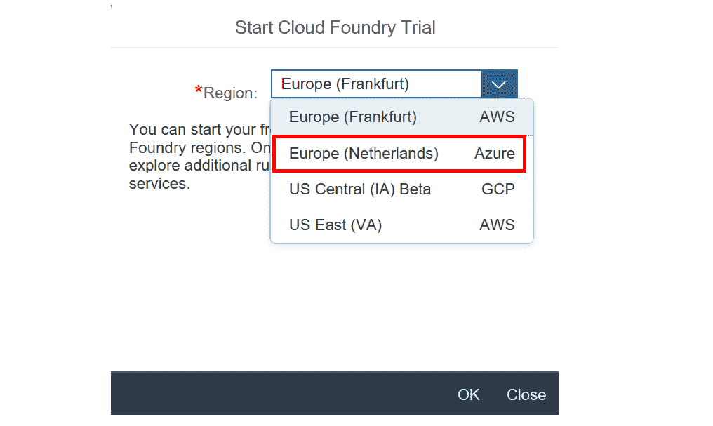

# 为什么 SAP 对 Cloud Foundry 的支持是无限的

> 原文：<https://thenewstack.io/why-saps-support-for-cloud-foundry-is-indefinite/>

根据上周在巴塞罗那举行的 SAP TechEd 2019 大会上我们采访的公司发言人的说法，Cloud Foundry 将继续作为 SAP 云产品的基石，不仅是因为其作为世界上最大的软件制造商之一的庞大 IT 基础设施，也是为了更好地支持其在云原生平台上运行 SAP 软件的客户。

SAP 对 Cloud Foundry 的持续支持，以及其他开源项目，如 [Eclipse](https://en.wikipedia.org/wiki/Eclipse_(software)) ，也反映了这个专有软件巨头与蓬勃发展的开源运动之间的复杂关系。例如，SAP 显然不会支持所有可能与其专有产品竞争的开源工具和平台。但在 Cloud Foundry 的情况下，该公司认为这个选项是最佳选择，允许 SAP 客户在不同的云原生平台上扩展他们对 SAP 软件的使用，当然包括[微软 Azure](https://azure.microsoft.com/en-us/) 、[谷歌云](https://cloud.google.com/)和[亚马逊网络服务(AWS)](https://aws.amazon.com/) 。

通过这种方式，SAP 将继续成为 Cloud Foundry 以及其他开源项目的“领导者”之一，[开发者关系和 SAP 社区副总裁兼负责人 Thomas Grassl](https://de.linkedin.com/in/grassl) 在大会上接受采访时表示。当然，SAP 支持的一个明显优势是，Cloud Foundry 和 cloud native 平台越好，HANA Cloud 就能在其上运行得越好。“我们显然希望继续帮助改进 Cloud Foundry，并不断寻找改进它的方法。我们将继续为企业功能、可扩展性和安全性提供[额外的改进]，”Grassl 说。“在 Kubernetes 上运行 Cloud Foundry 也是我们大力参与的领域。”

SAP 与 Cloud Foundry 的关系始于十多年前，当时 SAP 参与了 Cloud Foundry 的组建，并从创建之日起就开始提供在 Cloud Foundry 上运行的服务。

SAP 的兴趣最初达到顶峰，当时它选择“真正拥抱所有的[超大规模企业](https://en.wikipedia.org/wiki/Hyperscale_computing)，即微软、谷歌、AWS 等。，"[SAP 平台与技术总裁伊尔凡·可汗](https://www.linkedin.com/in/irfan-khan-ab4813/?originalSubdomain=uk)说道。“迁移的趋势是 Cloud Foundry，因为提供的基础设施包含了 Cloud Foundry 和 [OpenStack](https://www.openstack.org/) ，还因为这是用于可移植性的开源基础，”Khan 说。换句话说，Cloud Foundry 自成立以来，一直通过充当“基础设施的通用性”来帮助提供软件即服务提供商(SaaS)或基础设施软件即服务提供商，Khan 说。

Khan 说，自 Cloud Foundry 早期以来，Cloud Foundry 已在很大程度上成为云原生部署的行业标准，允许组织管理 Docker 或 Kubernetes 部署，并在云上需要容量时随意扩展。

Cloud Foundry 是新堆栈的赞助商。

通过 Pixabay 的特征图像。

<svg xmlns:xlink="http://www.w3.org/1999/xlink" viewBox="0 0 68 31" version="1.1"><title>Group</title> <desc>Created with Sketch.</desc></svg>