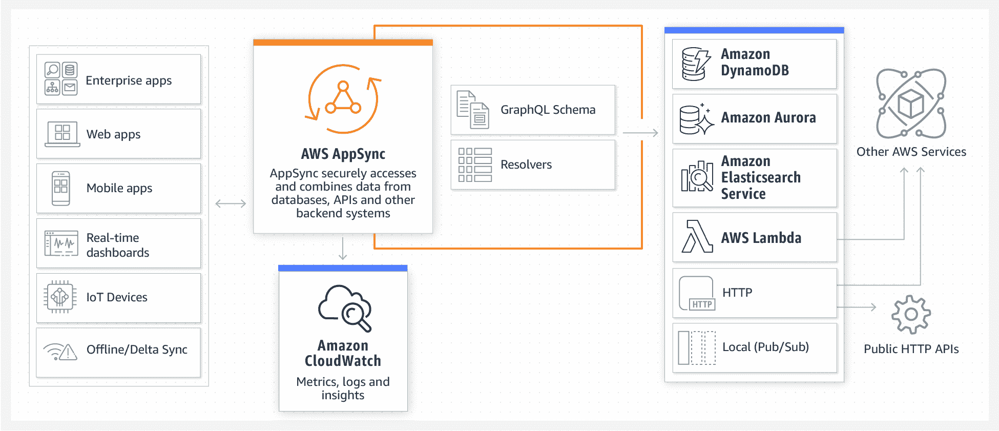
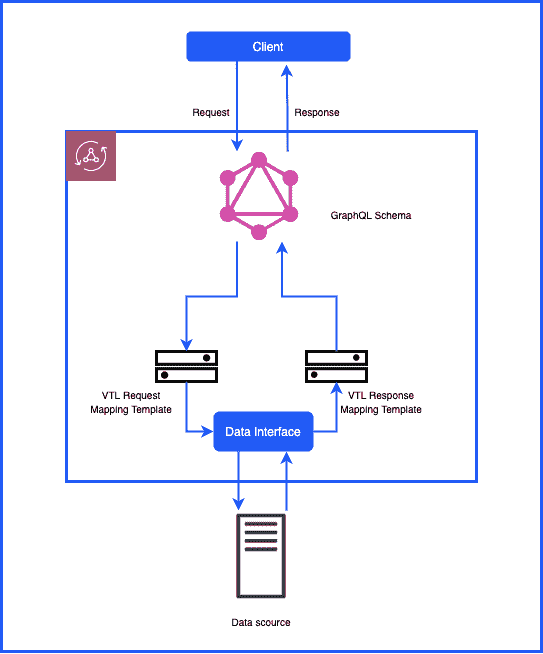
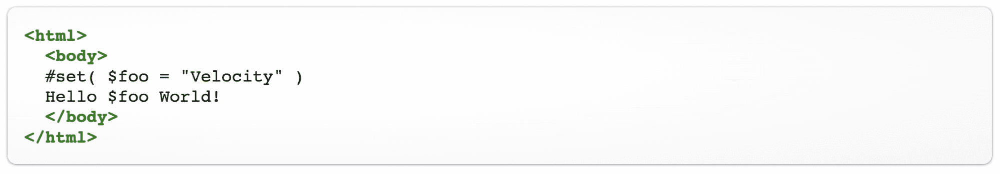
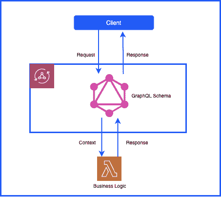
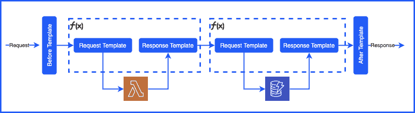

# 为什么无服务器 GraphQL 更适合 AWS AppSync

> 原文：<https://thenewstack.io/why-serverless-graphql-is-better-with-aws-appsync/>

[sarje El Yusuf](https://www.linkedin.com/in/syedsarj/)

[sarje El 是 Atlassian 的一名产品经理，负责引导 Atlassian 工具在其功能集中促进 DevOps 功能。](https://www.linkedin.com/in/syedsarj/)

早在 2018 年，当 [AWS AppSync](https://aws.amazon.com/appsync/) 对世界可用时，我写了一系列[博客](https://medium.com/@yusuf_82810)详细介绍亚马逊网络服务的服务对 [GraphQL](https://graphql.org/) 开发意味着什么。

第一篇文章的标题是[使用 AWS AppSync 的 GraphQL 的舒适性](https://medium.com/thundra/the-comforts-of-graphql-with-aws-appsync-d8b36b9c67)，我提出了使用 AWS 服务开发 GraphQL 应用程序的案例。在后面的帖子中，我谈到了通过 AWS AppSync 使用 AWS lambda 函数的[无服务器 GraphQL，以及监控](https://medium.com/thundra/up-and-running-with-graphql-using-aws-appsync-7202b1607299)无服务器 GraphQL 应用程序的[需求。](https://medium.com/thundra/making-appsync-easier-with-thundra-6570994cda5b)

自 2018 年以来，AWS AppSync 服务有了各种发展，进一步增强了 GraphQL 的开发体验。我将在这篇文章中重点讨论这些发展。

## 重温基础知识

在我们深入了解 AWS AppSync 的最新发展之前，我们有必要确切地知道 GraphQL 是什么，以及 AWS AppSync 服务为使用 GraphQL 构建的开发人员解决了什么问题。

### 图表 QL 101

GraphQL 是一个数据查询和操作语言 API 开发，它允许您定义您到底需要什么数据。它有三个主要组成部分:

*   模式是所有操作的定义
*   数据源，从中查询数据
*   解析器，充当模式操作和数据源之间的连接块。

因此，GraphQL 的结构使其特定于客户端，这允许客户端决定它需要的数据，而不是被各种字段轰炸，而不管其相关性。这也导致了构建 API 时所需端点的大量减少。这通常意味着只有一个端点，所有的查询都指向这个端点。单个端点，返回特定于客户端的请求是 GraphQL 相对于 REST APIs 最明显的优势。

### AWS AppSync 已定义

【T2

AWS 将 AWS AppSync 描述为“移动、web 和企业应用程序的无服务器后端”。那么这到底意味着什么呢？

AWS AppSync 允许开发人员通过提供托管的 GraphQL 服务来构建 GraphQL 应用程序，旨在简化应用程序创建过程。AWS AppSync 允许开发人员定义基于 GraphQL 的 API，包括模式、解析器和数据源。

此外，AppSync 提供了一组全面的数据源，您可以将它们集成到您的 GraphQL 应用程序中，以解析器和 Lambda 函数的形式提供业务逻辑。这允许您通过 AppSync 构建整个后端 API 和应用程序。AppSync 允许您合并 Lambda 函数和第三方 API 等数据源，这一事实允许您连接到应用程序可能需要的几乎任何数据源。

### 了解基础知识后

现在您可以明白为什么 AWS AppSync 是开发 GraphQL 应用程序的可行选择了。当然，在构建生产级软件时，还有其他的顾虑；例如监控、安全性、可伸缩性等等。AWS AppSync 通过其广泛的功能集解决了这些问题，其中一些功能我在 2018 年探索该服务[时已经介绍过了。然而，从那时起，AWS 增加了更多的 AWS AppSync 功能——进一步说明了我为什么要使用该服务，加上 AWS Lambda，并实现了一个无服务器的 GraphQL 应用程序。](https://medium.com/thundra/the-comforts-of-graphql-with-aws-appsync-d8b36b9c67)

所以让我们来看看这些改进。

## 扩展的 AWS AppSync 库

### 直接λ分解器

到目前为止，最近最好的改进之一是使用 Lambda 函数作为解析器的能力。这克服了在 GraphQL 应用程序基础结构中定义 VTL 解析器的需要。

为了理解这次升级的价值，我们需要首先考虑在 AWS AppSync 中传统上是如何定义解析器的。正如上面对 GraphQL 基础知识的简要总结中提到的，GraphQL 应用程序由模式、解析器和数据源组成。解析器的工作是将 GraphQL 请求转换成连接的数据源可以理解的格式。然后，它还负责将响应翻译回来。

【T2

AWS 利用 [Apache 的速度模板语言(VTL)](https://velocity.apache.org/) 作为解析器。VTL 本身的目标是简化网页中动态内容的使用。VTL 的使用提供了各种优势，其中一些优势在 Nader Dabit 的文章“[你不知道的 9 大 AWS AppSync 特性](https://medium.com/open-graphql/top-9-aws-appsync-features-you-didnt-know-about-57224075ffb1)”中得到了强调

然而，VTL 的使用也增加了意想不到的技术开销，因为并非所有开发人员都熟悉该语法。因此，根据我的经验，解析器的创建通常会成为使用 AWS AppSync 开发 GraphQL 应用程序的瓶颈，尽管 AWS 提供了有用的[解析器模板](https://docs.aws.amazon.com/appsync/latest/devguide/resolver-mapping-template-reference-overview.html)来加速开发。

这就是 AWS AppSync 中的新改进的好处，因为它允许您直接使用 AWS Lambda 函数作为解析器。开发人员现在可以选择绕过对 VTL 解析器的需求，设置 AWS Lambda 函数来处理客户端和连接的数据源之间的请求映射。事实上，如果需要，开发人员也可以应用混合解决方案，在您认为合适的地方部署基于 VTL 和 AWS Lambda 的解析器的组合。

关于这个话题的更多信息，请查看伴随公告的[博客文章](https://aws.amazon.com/blogs/mobile/appsync-direct-lambda/#:~:text=AWS%20AppSync%20uses%20VTL%20to,contain%20transformation%20and%20execution%20logic.)，作者[艾德·利马](https://www.linkedin.com/in/ed1ima/)——AWS 的高级产品经理。Ed 详细介绍了 VTL 解析器的优点和缺点，为这一新功能的发布提供了全面的理由，并演示了如何将 AWS Lambda 函数用作 AWS AppSync 中的解析器。

### 管道解析器

2018 年年底[宣布的另一项改进是](https://aws.amazon.com/about-aws/whats-new/2018/11/aws-appsync-launches-pipeline-resolvers-delta-sync-aurora-serverless-support/)[流水线解析器](https://docs.aws.amazon.com/appsync/latest/devguide/pipeline-resolvers.html)。对解析器功能集的这一补充使开发人员能够在一个解析器定义中执行多部分操作。如前所述，解析器由 GraphQL 字段上的 AWS AppSync 请求和响应执行，通常的目的是将这些请求和响应映射到字段。

有了管道功能，这些执行意味着由一个 GraphQL 字段执行触发多个操作，在解析器的“管道”中实现为独立的顺序块。这些独立的块被称为*函数*，每个*函数*可以分别调用独立的数据源。

使用解析器管道时，每个解析器由“之前”和“之后”映射模板以及一系列*函数*组成。反过来，每个函数都拥有管理单个数据源交互的请求和响应映射模板。因此，以正确的顺序堆叠不同的函数允许您执行更复杂的解析器操作。

因此，管道解析器的主要好处之一是能够在一个字段执行中与各种数据源进行交互。理论上，每个函数都管理与单独数据源的交互。支持的另一个用例是在将请求和响应实际映射到 GraphQL 字段之前，执行授权检查、验证和其他类似操作——所有这些都在单个解析器的范围内。

该特性提供了灵活性，并使开发人员能够根据开发 GraphQL 操作时的各种用例来执行急需的复杂操作。这绝对是一项使我们更容易使用 AWS AppSync 进行开发的功能。有关如何构建解析器管道的更多信息，您可以参考 AWS 解决方案架构师 Josh Kahn 撰写的精彩详细的[文章](https://medium.com/@joshua.a.kahn/building-aws-appsync-pipeline-resolvers-with-aws-cloudformation-d57d648ecd34)。

### 实时增强

GraphQL 和 AppSync 等 GraphQL 服务想要实现的功能之一是实时支持聊天室、物联网应用程序、实时社交媒体更新和流媒体等要求苛刻的用例。这是通过使用*订阅*来实现的，订阅由在 GraphQL 字段上执行的突变来触发。订阅了 GraphQL 服务的客户端可以实时更新与用户通信的内容。

最初，AppSync 通过在客户端和服务之间使用 MQTT over WebSockets 协议来支持订阅。但是，【2019 年 11 月，AppSync 增加了对纯 WebSockets 的支持。就实时功能需求而言，这导致了开发人员在使用 AppSync 构建 GraphQL 应用程序时无法利用的巨大增强。

新协议支持可以发送的更高的有效载荷，即 240kb，而 MQTT 最初通过 WebSockets 发送的有效载荷只有区区 128 kb。这也意味着更好的连接和广播速率。我们还改进了将 Cloudwatch 指标与 AppSync APIs 结合使用的方式。

此外，我们看到 GraphQL 订阅的选择集过滤得到了改进，功能更加强大。有了 WebSockets 上的 MQTT，所有订阅的客户机都会收到相同的变异有效负载选择集。这是因为选择集仅由突变的触发客户端定义，因此所有订阅的客户端将无差别地接收突变有效负载的选择集。然而，使用纯 WebSockets，每个客户端现在都可以定义自己的选择集过滤。

最后，AWS AppSync 在今年 4 月的[看到了其实时功能的额外改进。这一次 AWS 发布了对通用 WebSockets 的支持，进一步使开发人员能够在任何编程语言中选择任何 WebSocket 客户端。](https://aws.amazon.com/about-aws/whats-new/2020/04/aws-appsync-enables-support-for-generic-websockets-clients-graphql-real-time-subscriptions/)[现任 AWS 全球解决方案架构移动负责人的斯蒂芬·约翰森](https://www.linkedin.com/in/scjohnsonmobile/)写了一篇[博客文章](https://aws.amazon.com/blogs/mobile/appsync-websockets-python/)，演示如何通过创建 Python WebSocket 客户端来利用通用 WebSockets。

### 通过桑德拉跟踪 AppSync 请求

与任何应用程序一样，AppSync 应用程序容易因恶意请求和/或解析器的未定义行为而导致任何类型的故障。因此，对基于 AWS AppSync 构建的应用程序有正确的可观察性至关重要。今年年初，AWS 宣布了对 AppSync 的原生 AWS X 射线支持。您需要为每个端点逐个启用该服务。

另一方面，您可能希望自动对您的无服务器堆栈以及所有其他资源(如 API- Gateway 和其他 Lambda 函数)有一个更全面的了解。此时，您可以开始使用桑德拉，它会自动收集关于 AppSync 端点的所有信息，并将请求的跟踪链接到您的无服务器架构的其余部分。它不需要更多的工具或努力，只要你将[桑德拉的 AWS cloud formation integration](https://docs.thundra.io/getting-started/quick-start-guide/connect-thundra)插入你的 AWS 账户，它就可以无缝工作。

### 杂项改进

除了我上面描述的 AWS AppSync 特性集的三个主要改进之外，当然还有该服务看到的其他各种增强。例如，回到 2018 年，AppSync 仅在美国东部(N. Virginia)、美国西部(Oregon)和美国东部(Ohio)地区可用。现在，它在 18 个地区提供服务，而且这个列表——就像每个 AWS 服务一样——预计还会增加。另一个这样的改进是提供 2xlarge 实例，用 317.77Gb 的内存来缓存对 AWS AppSync APIs 的 GraphQL 调用。

因此，可以对 AWS AppSync 寄予更多的期望。我们可能会看到更多的创新，不仅是 AWS AppSync，还有其他支持服务，或者可以与 AWS AppSync 结合使用的服务。

## 结论

当考虑到 GraphQL 的好处以及 AppSync 的功能和服务的持续改进时，我相信亚马逊已经彻底改变了数据驱动应用程序的开发方式。这种情况显然有利有弊，但根据我的经验，我强烈建议您习惯使用 GraphQL。AWS AppSync 仍然是一个相对较新的工具，但它也正在发展成为一个非常强大的工具。我们可以期待新的功能不断推出，就像过去两年一样。

<svg xmlns:xlink="http://www.w3.org/1999/xlink" viewBox="0 0 68 31" version="1.1"><title>Group</title> <desc>Created with Sketch.</desc></svg>