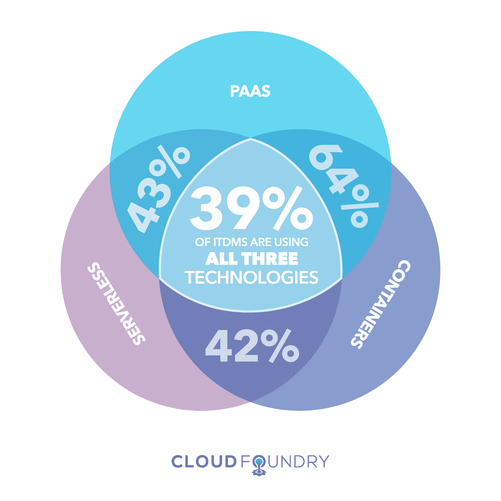
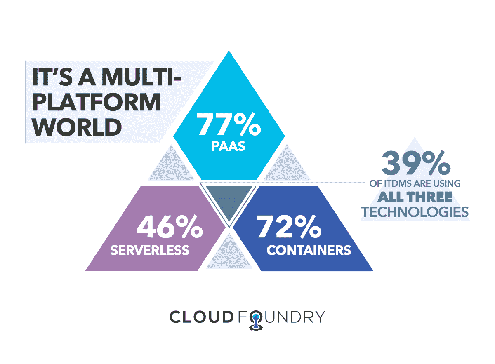

# 为什么无服务器的采用速度比预期的要快

> 原文：<https://thenewstack.io/why-serverless-is-being-adopted-at-a-faster-rate-than-expected/>

无服务器计算使企业能够缩短生产周期，提高灵活性，并在数字化过程中加快速度。而且呈上升趋势。

事实上，在我们 2018 年 6 月的报告 [*中，PaaS、容器和无服务器在多平台世界中的地位*](https://www.cloudfoundry.org/wp-content/uploads/GPS-7-FINAL-REPORT-.pdf) ，我们发现无服务器的评估和采用速度比任何人预期的都要快，与 2016 年容器评估和采用的速度相当。

我们的研究发现，46%的 IT 决策者正在使用和评估无服务器计算，而只有 35%的人在评估无服务器计算，同比增长了 10 个百分点。

## 那么什么是无服务器呢？

术语“无服务器”指的是云服务或平台，使开发人员不必考虑操作系统。他们可以根据需要运行代码，并根据执行时间计费。“无服务器”一词通常与“功能即服务”或“FaaS”互换使用澄清一下，FaaS 是更广泛的无服务器术语的一个子集，它支持运行单独的代码功能，*而不是*整个应用程序。例如，亚马逊网络服务公司的 AWS Lambda 就是一个 FaaS。

如果您像许多组织一样，您的 IT 运营团队已经在使用 FaaS 或更广泛的无服务器模型，因为他们自然会选择提高效率和生产力的方法。但是这种采用无服务器的现象是独一无二的。

## 是什么推动了无服务器评估和采用的激增？

 [Chip Childers

Chip Childers 在大规模计算和开源软件领域已经工作了 20 年。他在 2015 年联合创立了 Cloud Foundry Foundation，并担任 Apache Cloudstack 的第一任副总裁，这是一个他在 SunGard 领导企业云服务时帮助推动的平台，然后担任 Cumulogic 的产品战略副总裁。在 SunGard 之前，他领导了包括 IRS.gov、USMint.gov、美林和 SEI Investments 在内的组织的任务关键型应用程序的重建工作。Chip 是 OSCON、LinuxCon North America、LC Japan、LC EU、ApacheCon、O ' Reilly Software Architecture Conference 等活动的资深演讲者。在他的空闲时间，芯片喜欢与他的黑色实验室远足，驾驶双体船和太阳鱼，并试图跟上他的小女儿。](https://www.cloudfoundry.org/) 

**第一，即时商业价值。**组织正在拥抱不同平台的力量，以确保他们的业务利用新技术，尽可能提高开发人员的工作效率。无服务器让开发人员专注于他们最擅长的事情:编写代码。公司利用这种新发现的灵活性，比竞争对手更快地构建、测试和迭代应用程序(这就是目标)。

需要注意的是，无服务器计算*确实*使用服务器，(物理的和虚拟的)，但是开发者不与它们交互。因此，他们不必考虑基础架构，从而能够将时间集中在关键的业务优先级上。当谈到无服务器时，运营商处理服务器。

**第二，无服务器计算的实用性。**公共云显然为构建应用程序提供了许多选择。无服务器功能被用作公共云提供商各种功能之间的“粘合剂”或“脚本”。

对于许多 IT 决策者来说，无服务器现在是多平台方法的一部分。如上所述，我们的研究发现，超过三分之一(39%)的受访者同时使用 PaaS、容器和无服务器技术。

在这些受访者中，64%报告同时使用 PaaS 和容器，43%报告同时使用 PaaS 和无服务器，42%报告同时使用容器和无服务器。

根据该研究，评估无服务器计算的兴趣水平与 2016 年初评估容器的兴趣水平相当。我们对集装箱的跟踪数据表明，“不使用”的下降是跨越鸿沟的主要指标，因为非用户首先成为评估者，然后成为用户。我们预测同样的模式将会在无服务器中出现。

## 无服务器具有双重用途

传统上，技术首先被用于技术用途，然后更广泛地用于商业价值。那个鸿沟很难跨越。当技术因商业价值而被采用时，它就成为主流。无服务器计算似乎比预期更快地完成了这一转变，主要是因为它可以实现双重目的，即作为应用程序开发平台和其他云服务之间的粘合功能。

开发人员和架构师通过他们的选择和行动将回答的问题是:无服务器模型会成为企业软件的核心抽象吗？或者它将仍然是一个将应用程序如何以其他方式运行联系在一起的实用程序？

<svg xmlns:xlink="http://www.w3.org/1999/xlink" viewBox="0 0 68 31" version="1.1"><title>Group</title> <desc>Created with Sketch.</desc></svg>