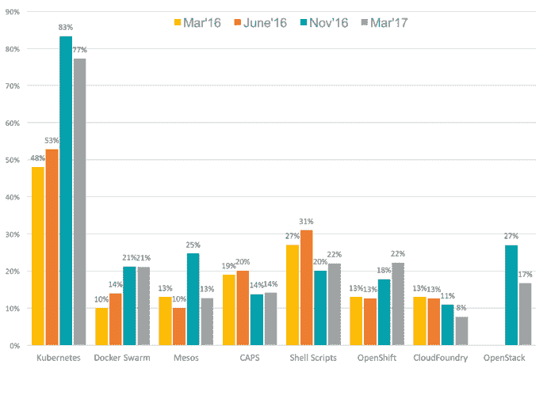

# 为什么无服务器 vs. Kubernetes 不是一个真正的辩论

> 原文：<https://thenewstack.io/why-serverless-vs-kubernetes-isnt-a-real-debate/>

Kubernetes 和 serverless 作为激动人心的强大平台实至名归，它们以多种方式为组织提供了敏捷性、可伸缩性和计算性能方面的巨大提升。然而，很容易忘记 Kubernetes 提供了无服务器替代产品所不具备的优势——反之亦然。成功部署这两种方案的关键是知道何时以及如何决定 Kubernetes 还是 serverless 最合适。

## 库伯内特的原因

 [大卫·西蒙斯

David 是 InfluxData 的物联网开发者传道者，帮助全球的开发者管理他们的设备产生的数据流。他对物联网充满热情，并在“物联网”成为“一件东西”之前帮助开发了第一个物联网开发平台。David 曾在 DragonFly、Riverbed Technologies 和 Sun 等公司担任过多个技术宣传员的角色。他在新墨西哥大学学习计算机科学，拥有哥伦比亚大学的技术写作学士学位。](https://www.influxdata.com/) 

Kubernetes 本身是为云计算而设计的——就像你在谷歌看到的大规模部署，它最初是在谷歌开发的。它已经适应了更小规模的使用，并且在大多数大型云提供商上都可以使用，这也是它在过去几年中爆炸式增长的原因。根据已经接管 Kubernetes 所有权的[云本地计算基金会(CNCF)](https://www.cncf.io/) 的用户调查，Kubernetes 的增长已经远远超过了所有其他形式的编排软件。

自首次亮相以来，Kubernetes 已成为主流。但是，正如从大型机转移到客户机-服务器会有痛苦一样，采用完全基于容器的体系结构，即使是由 Kubernetes 精心策划的体系结构，也会有重大的痛苦。扩展不是即时的——您必须等待容器上线——并且仍然有重大的管理问题需要处理。据 CNCF 称，存储、安全和网络问题仍然是那些通过 Kubernetes 部署其架构的人最关心的问题。

## 也许它是无服务器的

无服务器架构——在许多方面只是微服务架构的重新打包和重新构想——正在与 Kubernetes 竞争，因为它允许扩展应用程序和部署，而没有 Kubernetes 甚至容器的复杂性和配置问题。但不要把两者混淆为等同。

也称为功能即服务(FaaS)无服务器架构(是的，它们仍然需要服务器来运行)是更事件驱动的架构，而容器化的应用程序本质上仍然是相当传统的应用程序，只是被分成许多更小的部分或服务。对于容器化的应用程序，它永远不会完全关闭。即使没有人访问它，容器仍然需要存在和运行。您可以将它们缩减为单个实例，但是它们仍然存在，并且仍然需要花费资金。

一个无服务器的应用程序，如果没有对它的任何功能的请求，可以把成本降到零。除非显式访问它们，否则它们基本上不再存在。这可以大幅降低成本，并加快扩展速度。无服务器应用程序被访问的次数越多，它的规模就越大。

无服务器架构将取代容器化应用程序的想法似乎不是一个合理的提议。不是所有的东西都可以简化为短暂的功能。一些应用程序总是需要在运行时保存数据和状态的能力，而这并不是无服务器架构特别设计的。然而，人们对无服务器的兴趣正在迅速增长。

例如，根据市场和市场研究公司的研究，FaaS 市场预计将从 2016 年的 18.8 亿美元飙升至 2021 年的 77.2 亿美元。

然而，这不是一个零和游戏，无服务器的增长并不一定预示着 Kubernetes 和 containers 的死亡。事实上，它甚至可能扩大 Kubernetes 的使用，至少被主要的 FaaS 提供商作为扩展其无服务器产品的一种方式。

无服务器架构可能会作为一种进一步降低成本的方式而扩展，只需为所使用的服务付费，而无需为运行一个容器或一组容器所需的开销付费，但与任何事情一样，这是一种权衡。不经常被访问的无服务器代码，虽然运行成本不高，但在运行时(如 Java)或底层容器被启动来服务请求的情况下，可能会遭受更长的延迟。这些额外的延迟可能是可接受的，也可能是不可接受的。

然而，从开发人员的角度来看，FaaS 可以提高生产率和开发人员的幸福感。开发人员可以将代码分成更小的部分，更快地投入生产，而无需配置和管理开销，从而提高生产率。

## 结论

应用程序开发和部署策略，就像计算中的一切一样，是不断发展的。通常，从一个体系结构到另一个体系结构的迁移标志着第一个实现的结束，但情况并非总是如此。也没有一个放之四海而皆准的解决方案，至少在这一点上，来解决所有的问题，提供廉价和大规模的应用程序。与任何部署模型一样，需要考虑成本、性能和可管理性之间的权衡。

Kubernetes——以及一般的集装箱化——有其应有的地位，Kubernetes 市场的快速采用和增长证明了它正在满足市场的需求。我看不出对容器化的需求，以及随之而来的对容器编排的需求会很快消失。但这并不总是正确的解决方案。

同样，无服务器 FaaS 显然满足了市场的需求，并显示出显著的整体增长。当然，增长并不一定意味着适合目标，但市场有自我修正以弥补这一点的趋势。

再说一次，Kubernetes vs. serverless 不是一个零和游戏。无服务器的增长并不意味着 Kubernetes 的死亡。每一个都在现代应用程序的开发和部署中扮演着重要的角色。在过去的 20 年里，应用程序的部署一直朝着更小、更易管理、更具成本效益和开发者友好的架构稳步前进，没有理由怀疑这种趋势不会继续下去。虽然无服务器可能是应用程序抽象到其最基本组件的逻辑结论，但并不是所有的应用程序都能以这种方式交付。同样真实的是，出于持久性或可伸缩性的原因，一些应用程序将需要容器，这将需要编排和管理。

这两种技术没有理由不直接相互竞争就不能继续显示出显著的增长。

<svg xmlns:xlink="http://www.w3.org/1999/xlink" viewBox="0 0 68 31" version="1.1"><title>Group</title> <desc>Created with Sketch.</desc></svg>