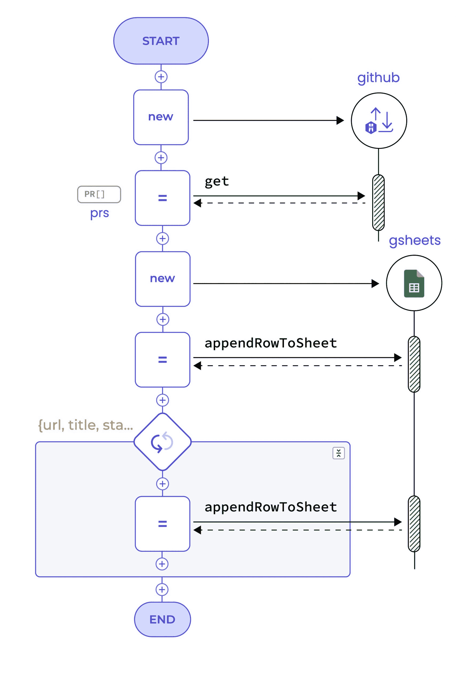

# 你为什么要和芭蕾舞演员一起编程？

> 原文：<https://thenewstack.io/why-should-you-program-with-ballerina/>

现代应用程序，无论是 web 应用程序还是移动应用程序，通常都有前端和后端。有许多前端应用程序技术，后端通常由一个或数百个 API 组成，这取决于应用程序的复杂性。

 [Vishva Ahangama

Vishva 是 WSO2 的高级首席营销官，领导其产品的内容驱动体验的规划和创建。他拥有加拿大渥太华卡尔顿大学的英语学士学位。](https://www.linkedin.com/in/vishvaahangama/?originalSubdomain=lk) 

虽然可以用任何编程语言编写 API，但是开发人员在创建新的 API 和使用已有的 API 时会面临许多挑战。此外，企业集成仍然具有挑战性。

集成编程实践已经变得孤立，使用他们喜欢的集成工具编程的开发人员必须使用另一种工具或编程语言来开发他们应用程序的其余部分。此外，向云的转变意味着团队现在必须在容器中部署集成系统，并使用分布在大量节点上的微服务创建应用程序。

现有的编程语言并不特别擅长理解这些问题和团队试图做的事情。它们根本不是为云而构建的。 [Ballerina，](https://ballerina.io/)一种用于云原生编程和集成的开源语言，为专注于为网络交互创建新 API、新集成和新逻辑的开发人员提供了一套合适的工具和抽象级别。

凭借其用于开发服务和 API 的语法、JSON 支持和内置的并发性，新的通用版本天鹅湖可以进一步简化开发人员构建和部署云原生应用的方式。

以下是开发人员应该选择 Ballerina 为其云原生应用程序编写 API、集成和后端逻辑的主要原因。

## **芭蕾舞演员面向数据和网络**

随着云中的服务越来越多，几乎每个企业应用程序都涉及网络调用。对于开发人员来说，这增加了他们在代码中使用网络资源的责任。芭蕾舞演员配备了一个网络友好型系统，具有强大的功能来处理线上的数据。

Ballerina 使数据建模和通过网络来回发送变得很容易。该语言拥有强大的工具来编写、声明、处理、查询、构造、重构和导航数据。

```
importballerina/http;
importballerina/io;

typeCountryrecord  {
    stringcountry;
    intpopulation;
    stringcontinent;
    intcases;
    intdeaths;

};

// Prints the top 10 countries having the highest case-fatality ratio.

publicfunctionmain()  returnserror?  {
    http:ClientdiseaseEp  =  checknew  ("https://disease.sh/v3");
    Country[]  countries  =  checkdiseaseEp-&gt;get("/covid-19/countries");

    jsonsummary  =
        fromvar  {country,  continent,  population,  cases,  deaths}  incountries
            wherepopulation  &gt;=  100000  &amp;&amp;  deaths  &gt;=  100
            letdecimalcaseFatalityRatio  =  &lt;decimal&gt;deaths  /  &lt;decimal&gt;cases  *
100

            orderbycaseFatalityRatiodescending
            limit10
            select  {country,  continent,  population,  caseFatalityRatio};
    io:println(summary);

}

```

## **借助灵活型系统的力量**

编程语言的类型系统是表示数据和实现逻辑的基础。虽然开发人员必须在其代码中使用网络资源，但编程语言本身必须有助于这一操作。这就是为什么芭蕾舞演员的网络友好型系统是专门针对这一领域。

例如，在典型的编程语言中，有一些标准和协议来定义如何处理通过网络传输的数据，并将其绑定到语言上(数据绑定)。当接收到数据时，开发人员必须将其绑定到语言中的数据结构，以便对其进行操作。

Ballerina 的类型系统不仅能够描述内存中的数据，还能够描述网络上的数据。特别是，为了与 JSON、XML 和其他格式保持一致，已经做了大量的工作。当数据通过网络传输时，开发人员可以将它带入语言中，而无需任何人工的、复杂的数据绑定问题，有效地从众所周知的数据格式和网络数据结构中消除了数据绑定概念。

芭蕾舞演员的类型系统主要是结构性的，增加了对标称类型的支持。这意味着类型兼容性是通过考虑值的结构而不是仅仅依靠类型名来识别的。这与 Java、C++和 C#等语言不同，这些语言具有名义类型系统，在这种系统中，它被实际类型的名称所绑定。

## **序列图模拟网络交互**

在 Ballerina 中，每个程序都可以显示为序列图，自动说明分布式和并发交互。芭蕾舞演员程序中的功能在文本语法和序列图中都有等效的表示。您可以在两种视图之间无缝切换。芭蕾舞女演员独特的图形视图并不是一个噱头。它已经被深入设计到语言中，以提供对函数的网络交互及其并发性使用的真正洞察。

```
importballerina/http;
importballerinax/googleapis.sheets;

configurablestringgithubPAT  =  ?;
configurablestringrepository  =  "ballerina-platform/ballerina-lang";
configurablestringsheetsAccessToken  =  ?;
configurablestringspreadSheetId  =  ?;
configurablestringsheetName  =  "Sheet1";

typePRrecord  {
  stringurl;
  stringtitle;
  stringstate;
  stringcreated_at;
  stringupdated_at;
};

publicfunctionmain()  returnserror?  {
  http:Clientgithub  =  checknew  ("https://api.github.com/repos");
  map<string>  headers  =  {
  "Accept":  "application/vnd.github.v3+json",
  "Authorization":  "token "  +  githubPAT
};

PR[]  prs  =  checkgithub->get(string`/${repository}/pulls`,  headers);

sheets:Clientgsheets  =  checknew  ({auth:  {token:  sheetsAccessToken}});
checkgsheets->appendRowToSheet(spreadSheetId,  sheetName,
    ["Issue",  "Title",  "State",  "Created At",  "Updated At"]);

foreach  var  {url,  title,  state,  created_at,  updated_at}  inprs  {
  checkgsheets->appendRowToSheet(spreadSheetId,  sheetName,
    [url,  title,  state,  created_at,  updated_at]);
}
}

```



虽然 Ballerina 拥有现代编程语言的所有通用功能，但它之所以脱颖而出，是因为它提供了更易于使用、组合和创建云网络服务的语言功能。关于芭蕾舞演员语言特征的深入介绍，我们鼓励您观看语言创作者 Sanjiva Weerawarana 的视频。你也可以看看这篇[博客](https://blog.ballerina.io/posts/2022-02-01-announcing-ballerina-2201.0.0-swan-lake/)。

[https://www.youtube.com/embed/NYrKeElltg8?feature=oembed](https://www.youtube.com/embed/NYrKeElltg8?feature=oembed)

视频

芭蕾舞演员天鹅湖现在可以看了。作为在 Apache License 2.0 下发布的开源实现，它不收取任何许可费，可以在[https://ballerina.io/downloads](https://ballerina.io/downloads)免费下载。

<svg xmlns:xlink="http://www.w3.org/1999/xlink" viewBox="0 0 68 31" version="1.1"><title>Group</title> <desc>Created with Sketch.</desc></svg>