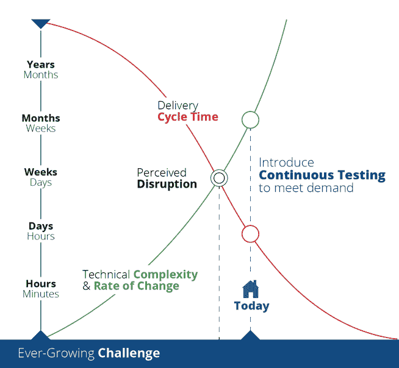
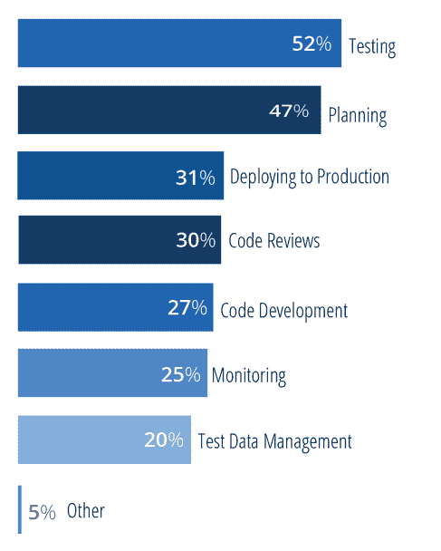
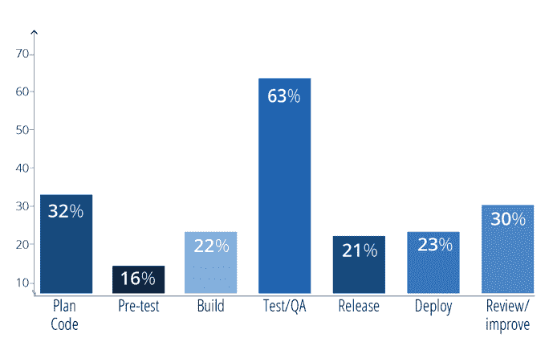

# 为什么软件测试仍然是瓶颈

> 原文：<https://thenewstack.io/why-software-testing-remains-a-bottleneck/>

 [沃尔夫冈·普拉茨

沃尔夫冈是 Tricentis 的创始人兼首席产品官。他是软件测试创新的幕后推手，例如基于模型的测试自动化和线性扩展测试设计方法。](https://www.tricentis.com/team/wolfgang-platz/) 

整个 IT 行业的数字化转型速度已经非常惊人，而且只会越来越快。用一些非常具体的术语来说，考虑一下:

*   世界上有 77 亿人。
*   15 亿人经常使用厕所。
*   50 亿人拥有手机。

突然间，大量的人从非常守旧的生活方式直接跳到了数字时代——创造了对越来越多创新软件的巨大需求。

然而，传统的软件开发和交付方式已经不足以满足这种新的需求。不久以前，大多数公司每年或每两年发布一次软件。现在，迭代通常持续两周或更短时间。虽然交付周期在缩短，但交付积极的用户体验和保持竞争优势所需的技术复杂性却在增加。

对于软件测试来说，这将我们带到了一个转折点。在大多数组织中，当交付周期更长，应用程序复杂性更低时，测试人员已经在竞相跟上步伐。大约每个季度，开发团队都会将一个候选版本传递给 QA，然后 QA 会在规定的时间内尽可能彻底地验证它——主要是手工测试。

现在，数字化转型计划，如 Agile 和 DevOps，正在将传统的测试方法推向崩溃的边缘。如上所述，组织发布的频率越来越高，从每月一次到每小时多次不等。随着组织越来越倾向于使用自动化交付管道的连续交付(CD ),中间质量关口和最终的通过/不通过决定都将取决于测试结果。

在本帖中，我们探讨了衡量您的组织的测试过程是否能够胜任任务的方法，以支持您的 DevOps 的 CD 目标。

## 我们有一个问题(实际上是两个)

在大多数组织中，测试延迟了应用程序的交付，同时对被测试的应用程序是否满足涉众的期望提供了有限的洞察力。在其他事情中，这个过程只是不够快，不足以帮助团队找到并修复缺陷，而这正是最佳的选择。它报告的是低级别的测试失败(例如，78%的测试通过)，而不是提供做出快速发布决策所需的以业务为中心的视角(例如，只有 38%的业务风险经过测试，其中 25%没有正常工作)。

让我们依次快速看一下这些问题。

## 速度问题

DevOps 就是要消除障碍，更快地交付创新软件。然而，随着交付过程的其他方面的简化和加速，测试一直是最大的限制因素。

GitLabs 最近针对开发人员和工程师的一项调查发现，测试比开发过程的任何其他部分都要对更多的延迟负责。

在开发过程中，您在哪里遇到的延迟最多？

DevOps 审查调查也得出了相同的结论，该调查调查了实施 DevOps 的组织中更广泛的 IT 领导者。同样，测试被认为是软件交付过程中最大的障碍。事实上，测试在这里以相当大的优势“赢”了。虽然 63%的受访者报告测试是延迟的主要原因，但仅 32%的受访者提到了第二大延迟原因(计划)。

## 软件生产过程中的主要障碍在哪里？

为什么测试是一个如此可怕的瓶颈？这可能是一整本书的主题。现在，让我们总结一些要点:

*   凯捷、索格蒂和 HPE 的报告[“2018-2019 年世界质量报告”显示，绝大多数测试(超过 80%)仍然是手动执行的，在大型企业组织中甚至更多](https://www.capgemini.com/service/world-quality-report-2018-19/)
*   根据 2015-2018 年在全球 2000 强公司(主要涉及金融、保险、电信、零售和能源行业)中进行的 Tricentis 研究，正在构建、维护和执行的测试案例中约有 67%是多余的，没有为测试工作增加价值。
*   根据 Tricentis 的研究数据，在拥有重要测试自动化的组织中，测试人员花费 17%的时间处理误报，另外 14%的时间用于额外的测试维护任务。
*   根据 [SDLC Partners 的研究](https://sdlcpartners.com/insight/test-data-management-chances-are-your-test-data-is-costing-you-more-time-and-money-than-you-know/)，超过一半的测试人员每周花费 5-15 小时处理测试数据(测试数据的平均等待时间等于两周)。
*   根据 Delphix 的研究，“测试数据管理的状态[”，总共有 84%的测试人员经常被有限的测试环境访问延迟(测试环境的平均等待时间等于 32 天)。](https://www.google.com/url?q=https://www.delphix.com/white-paper/2017-state-test-data-management&sa=D&ust=1576689543895000&usg=AFQjCNEd4PXHn0HLG_hUO7kUFyBu05If7g)
*   根据 Tricentis 的研究报告，回归测试套件的平均执行时间为 16.5 天，但敏捷冲刺的平均时间为两周，从开始到结束——这包括规划、实施和测试。
*   根据 O'Reilly 出版的 Bas Dijkstra 的书[“服务虚拟化”](https://www.oreilly.com/library/view/service-virtualization/9781492049128/)，现在测试中的平均应用程序与 52 个相关系统交互，这意味着单个端到端事务可以跨越一切，从微服务和 API 到各种移动和浏览器界面，到打包的应用程序(SAP、Salesforce、Oracle、Service now……)，到定制/传统应用程序，到大型机。

即使在敏捷和 DevOps 出现之前，软件测试过程也并不完美。现在，我们要求团队“加快速度”,同时现代应用程序架构使测试变得更加复杂。在这种背景下，没有达到速度预期就不足为奇了。

## 洞察力问题

只有 9%的公司对他们的需求/用户故事进行正式的风险评估。根据 Tricentis research 的数据，大多数人试图直观地覆盖他们的主要风险，这导致了 40%的平均业务风险覆盖率。戴着眼罩驾驶赛车你会觉得舒服吗？如果您正在快速交付软件，并且对总业务风险的了解还不到一半，那么这基本上就是您正在做的事情。

此外，大多数组织不能立即区分小问题的测试失败和必须立即解决的关键业务失败。大多数测试结果看起来像这样:

那真正提供了什么样的洞察力？很明显…

*   总共有 53，274 个测试用例。
*   几乎 80%的测试(42278)都通过了。
*   超过 19%的人失败了。
*   大约 1%没有执行。

也许测试失败与一些琐碎的功能有关。也许它们源于最关键的功能:你系统的“引擎”。或者，也许最关键的功能根本没有经过测试。试图追踪这些信息将需要大量的手动调查工作，这些工作会产生延迟且往往不准确的答案。

当今的去/不去决策需要快速做出，甚至是自动和即时的。集中于测试用例数量的测试结果给你留下了一个巨大的盲点，这个盲点变得绝对关键——而且非常危险——正如我们上面所描述的。

## 缩小差距

您如何从交付可疑结果的缓慢、繁重的测试发展到提供加速创新和交付所需的快速反馈的精简测试？这就是我打算在我的新书《企业持续测试:为敏捷和 DevOps 转变测试》中解释的本书的目标读者是高级质量经理和业务主管，他们在交付驱动现代数字业务的软件时，需要实现速度和质量之间的最佳平衡。它还提供了如何以高信心和低业务风险加速交付的路线图。

<svg xmlns:xlink="http://www.w3.org/1999/xlink" viewBox="0 0 68 31" version="1.1"><title>Group</title> <desc>Created with Sketch.</desc></svg>