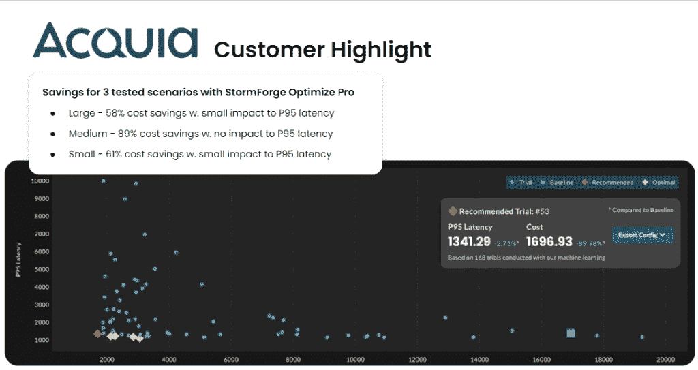

# 为什么 StormForge 说 ML 可以节省 Kubernetes 的云成本

> 原文：<https://thenewstack.io/why-stormforge-says-ml-can-save-kubernetes-cloud-costs/>

人工智能(AI)解决方案提供商 StormForge 表示，它提供了一个非常实用的解决方案来解决一个非常复杂的问题，因为组织不仅面临着管理 Kubernetes 大规模环境的挑战，而且他们还必须解释他们必须处理的大量可观测性数据，以做出关键决策。StormForge 表示，随着今天发布的 Optimize Live 的使用，DevOps 团队可以应用其机器学习(ML)工具，不仅可以通过更好地利用可观测性来提高他们在 Kubernetes 集群上的运营效率，还可以减少云服务和其他成本。

Optimize Live 通过使用 ML 分析现有的可观察性数据来推荐实时配置更改，从而在确保应用性能的同时减少资源使用和成本。StormForge 产品营销副总裁 [Rich Bentley](https://www.linkedin.com/in/rich-bentley-b88121/) 告诉新堆栈，可观察性数据通常为 DevOps 团队提供“大量数据和对正在发生的事情的大量可见性，这真的很重要，但不一定能为他们提供可操作的见解”，以提高 StormForge Optimize Live 提供的应用性能和资源分配。

Bentley 说:“一旦你将代码投入生产，Optimize Live 就会不断地观察可观察性数据，检测何时该做出改变，提出建议，然后应用它们。”

## 充斥着可观测性数据

除了与管理 Kubernetes 集群(通常是大规模的)相关的复杂性之外，为了确保环境保持可操作性和应用程序正常运行，确保资源得到适当分配有时会让位于提高基础架构性能。同时，DevOps 团队可能会被可观测性数据淹没。从理论上讲，这些数据可以用来更好地管理 CPU、内存和其他资源利用的复杂性，但是组织通常缺乏解释可观测性数据的资源和专业知识。

Bentley 在关于新堆栈的简报中解释说，Optimizer Live ML 旨在处理这些数据并提供支持和专业知识，开发运维团队内部通常缺乏以直截了当的方式传达决策所需的“可操作结果”。

Optimizer Live 的 ML 算法处理来自 Kubernetes 环境的可观测性数据，并在持续的基础上提供可操作的结果，因为资源分配和其他决策将随着操作的改变或扩展而改变。ESG Global 的分析师[斯科特·辛克莱尔](https://www.linkedin.com/in/scsinclair/)告诉 The New Stack 说:“即使你今天优化了你的环境，也不意味着它会在九个月后保持优化状态——在这种情况下，通过利用 StormForge 这样的工具，你不仅能够降低风险，因为你能够确保你的应用程序获得他们需要的东西，而且你也能够不给你的员工增加过多的负担。”。“你也可以说‘我们正在减少现有生产应用程序所占用的预算，这为我们提供了更多的机会来扩展、增长和实施新的数字计划，在数字经济中，这将带来更多的收入，让每个人都赚更多的钱。’"

Optimizer Live 的功能更加细致入微，不仅仅是作为一个 ML 工具，传达在管理 Kubernetes 环境的操作时应该做出什么选择。相反，该工具提供了一系列选项，这些选项列在一个图表上，在配置操作时对每个选项的性能和成本因素进行权衡。这些选项包括选择在性能较差时维护成本可能较低的配置，或者选择高成本高性能的选项。

StormForge 的机器学习副总裁约翰·普拉特告诉新的堆栈:“我们正在抽象出更好的细节，因为我们试图在权力和抽象之间取得平衡。”。“这也使您能够在任何环境下工作，从而灵活地完成工作。”

## Acquia 的用法

Drupal 应用程序的平台提供商 Acquia 已经使用 Optimize Live 作为早期采用者，通过更好地分配 CPU、内存和其他资源以用于其提供的客户服务，看到了使用亚马逊网络服务(AWS)的成本节约。

Acquia 的产品管理副总裁 Charley Dublin 告诉新堆栈，Optimizer Live 提供的可操作选项使 Acquia 能够“为我们提供的服务类别提供一个明智的起点，以便我们可以分配足够的资源，但不要太多”。部署服务后,“实时优化使我们能够与服务保持同步，并对其进行监控和管理”。

## 集成和其他功能

StormForge 可以与 DataDog 和 Prometheus 集成，并且很快就能支持 Dynatrace 可观测性工具。Bentley 说，将来还会有其他可观测性工具可供选择。

StormForge 优化实时功能的范围—除了通过分析可观察性数据以推荐资源分配设置来持续优化生产环境的 ML 之外，还包括:

*   由于 ML 客户的特定环境，与 VPA 提供的建议相比，建议有所改进。
*   灵活的可配置策略(例如，按名称空间自动或手动批准建议)。
*   使用 StormForge 平台和通用用户管理、SSO、RBAC、发布自动化和其他工具的可能性。

<svg xmlns:xlink="http://www.w3.org/1999/xlink" viewBox="0 0 68 31" version="1.1"><title>Group</title> <desc>Created with Sketch.</desc></svg>