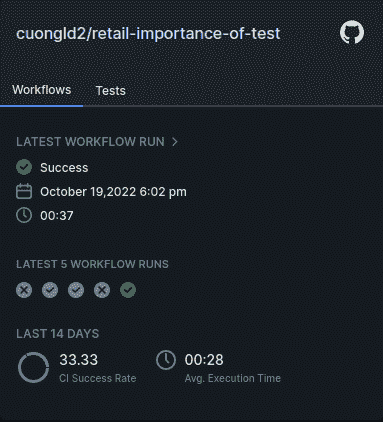

# 为什么测试调试对零售部门至关重要

> 原文：<https://thenewstack.io/why-test-debugging-is-crucial-for-the-retail-sector/>

为了在当今竞争激烈的市场中取得成功，零售公司需要一个高质量的应用程序，在数字优先的经济中跟上客户的购买习惯。当代消费者精通技术，并期待无缝的客户体验——从找到他们想要的产品到支付货款。

一项数字商务 360 研究发现，2020 年，500 强零售公司产生了 8495 亿美元的在线销售额，比前一年增长了 45.3%，这是有史以来的最大增幅。然而，即使产品是无与伦比的，糟糕的客户体验也会让零售商的销售额下降。据报道， [25%的顾客因为糟糕的店内购物体验而将业务转移到其他地方](https://www.salesforce.com/content/dam/web/en_us/www/documents/datasheets/connectedshopperresearchreport.pdf)。

然而，在零售应用中，可能会面临许多问题，其中许多是可以避免的:

*   **性能瓶颈**，包括在变化的负载下无法按预期执行，可能会导致停机或使应用程序在高峰期不可用。
*   **未能确保客户数据的安全存储、复制和传输，可能会导致安全问题**。
*   **问题或间歇性故障**可能由第三方集成引起，如支付提供商。
*   **功能问题**可能包括代码中的错误、不同平台上的兼容性问题或缺乏对旧浏览器的支持。

测试零售应用中的所有功能是否正确集成并按预期工作是发现可能危及用户体验的错误的最有效方法之一。在本帖中，我们将着眼于有效的零售测试策略，以及测试的可观察性和调试如何能够从测试中获得更高的投资回报(ROI)。

## 为什么测试对零售业至关重要

随着电子商务的发展和企业在线迁移，高质量的数字体验至关重要，需要正确的测试策略。测试对零售至关重要，原因有很多，我们将在下面探讨。

### 灵活

测试提供了开发人员快速检测问题和调整现有代码库所需的灵活性。自动化测试提供了工程师保持生产力所需的快速反馈循环。由于持续集成(CI)管道，当测试失败时，工程师除了做出反应之外，什么都不用做。

### 安全性

顾客开始不愿意透露他们的个人信息。然而，零售应用程序需要这些数据来提供个性化的建议，并帮助客户做出购买决定。应用程序安全性测试有助于识别软件代码中可能被攻击者利用的缺陷和漏洞。

### 质量

在自动化测试中，覆盖范围包括新特性和早期迭代中的现有特性。这确保了旧软件功能在发生变化时仍能按预期运行。因为自动化测试可以在没有人工干预的情况下运行多次，所以它们可以保持代码质量，并帮助零售商向最终用户提供无错误的体验。

### 信心和可预测性

自动化测试验证一个特定的特性只做它想要做的事情。这确保了测试结果的一致性和一致性。它还帮助您的工程师对他们的代码库充满信心。

## 演示零售应用示例

在我们的示例[电子商务 web 应用程序](https://github.com/cuongld2/retail-importance-of-test)中，用户可以通过 Stripe 或 PayPal 支付支持购买商品。用户必须登录才能进行购买。注册新帐户需要提供用户名和密码。用户可以在主页上查看所有可用的产品。


图 1:显示所有可用产品的主页

用户可以将产品添加到购物车中，并使用 Stripe 进行购买。

## 演示应用程序的测试

我们需要编写一些测试来确保我们的应用程序按预期工作。下面是检查“Item”和“OrderItem”的对象模型的默认值的测试:

```
from django.test import TestCase
from  ..models import Item,OrderItem

class TestMyModel(TestCase):

  def test_default_value_item(self):
 item  =  Item()
 self.assertEqual(
 item.total,  1)

  def test_default_value_order_item(self):
 item  =  OrderItem()
 self.assertEqual(
 item.quantity,  1)

```

基本上，这些测试只是检查以确保“Item”和“OrderItem”实例的默认值必须是 1。

## 将 GitHub 工作流程与远见相结合

让我们创建一个集成了 Foresight 的 GitHub 工作流文件。这将允许我们在未来监控工作流和调试测试，而不必在 GitHub 操作页面中滚动浏览大量日志。

我们已经设置了这个工作流，为主分支上的每个 pull 请求触发一个 GitHub 动作。我们添加了工作流遥测和 Foresight 测试套件的步骤，因此 Foresight 可以收集工作流和测试指标。有关详细解释，请参见[工作流程遥测和预见测试套件动作如何工作](https://docs.runforesight.com/advanced-configuration/test-kit)。

## 零售应用程序中的生产缺陷

假设你的团队发布了一个新的产品特性，而客户服务团队收到了很多投诉。顾客抱怨说，他们被迫购买每种产品的七件商品，他们不能少买。首席技术官希望立即修复这个缺陷，因为它直接影响客户的购买过程，而且购买量已经明显下降。


图 2:客户在添加新产品时面临的问题

## 借助预见修复 Bug


图 3:最近的工作流程从前瞻角度看是失败的

让我们转到 Foresight 仪表板，看看应用程序的最新版本是否有任何问题。

最新工作流运行失败。

通过查看最近工作流的细节，我们可以看到执行测试的步骤失败了。


图 4:由于测试执行步骤的失败，工作流失败了

单击“Tests”选项卡，查看最近的代码更改和测试状态。


图 5:来自 Foresight 的变更影响分析捕获了代码中最近的变更

我们看到 46 行中有两行没有测试，其中一行测试失败。让我们仔细看看失败的测试。


图 6:在检查“OrderItem”默认值的测试中验证失败

这里我们看到，由于预期默认数量和实际默认数量之间的值不匹配，测试失败了。开发团队在本地测试中运行时已经意识到了这一点，但是他们认为这只是由于环境设置而导致的一个不可靠的测试，并让它溜走了。

在查看了代码更改之后，我们注意到了一些奇怪的事情。


图 7:代码更改“OrderItem”中的默认值现在被设置为 7

在“core/models.py”文件中，quantity 的默认值被意外地设置为 7，这是“OrderItem”的默认值测试失败的原因，也解释了为什么当客户购买新产品时，默认的商品数量被设置为 7。

我们可以通过将“OrderItem”模型的默认值改为 1 来修复这个错误。在将这一变更部署到生产环境之后，我们注意到工作流现在已经通过了。



图 8:修复之后，工作流现在已经通过了

现在问题已经解决，顾客可以少买一件商品。

## 简化监控和调试

Foresight 使监控和调试工作流变得轻而易举，其功能包括工作流亮点、工作流指标、代码捕获更改以及测试过程中每一步的细节。[在这里报名前瞻](https://app.runforesight.com/signup)。

<svg xmlns:xlink="http://www.w3.org/1999/xlink" viewBox="0 0 68 31" version="1.1"><title>Group</title> <desc>Created with Sketch.</desc></svg>