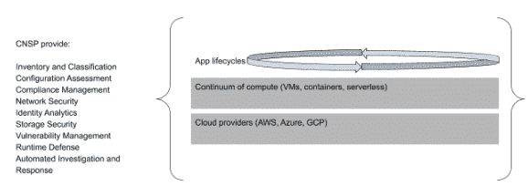
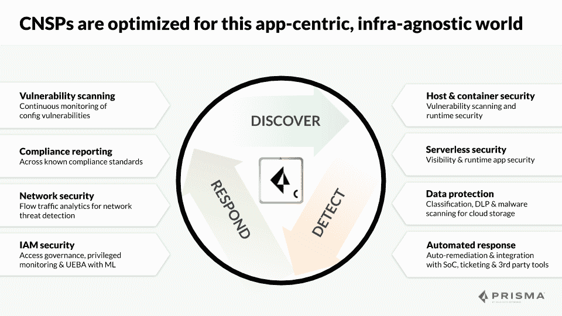

# 为什么云原生安全平台的时代已经到来

> 原文：<https://thenewstack.io/why-the-age-of-the-cloud-native-security-platform-is-here-to-stay/>

[Prisma](https://www.paloaltonetworks.com/prisma/cloud) 赞助了这篇文章。

 [约翰·莫雷罗

John 是 Twistlock 的前首席技术官，现任 Palo Alto Networks 的 Prisma 产品副总裁。John 负责指导产品、产品营销、销售工程和客户成功职能。在加入 Twistlock 之前，John 是一家财富 500 强全球化学公司的 CISO。在此之前，他在微软工作了 14 年，在微软咨询服务和产品团队工作。](https://www.linkedin.com/in/john-morello/) 

不祥之兆是:传统的安全工具和方法不适合保护云原生的开发人员驱动和基础架构无关的多云模式。现在是时候进入[云原生安全平台(CNSP)的时代了。](https://www.paloaltonetworks.com/prisma/cloud)

基础设施即服务( [IaaS)](https://en.wikipedia.org/wiki/Infrastructure_as_a_service) 主要是利用现有的基础设施和运营模式，并将它们转移到更容易扩展的环境中。潜在的商业模式很大程度上是基于消费的。因为基本模式和技术栈基本上没有改变，所以这个时代的当代安全工具可以很容易地适应这种转变，并简单地“提升和转移”到那些 IaaS 平台上运行。然而，在过去的四年里，我们已经进入了云原生时代，其定义是将重点转移到更高价值的成果，而不仅仅是更快的部署和资本支出成本的转移。

## 云原生技术占据中心舞台

原生云将无差别的 IT 基础设施留给提供商，让组织能够专注于构建和运行能够提供竞争优势、连接员工或服务客户的应用，从而推动数字化转型。如云本地计算基金会所定义的[:](https://github.com/cncf/toc/blob/master/DEFINITION.md)

> 云原生技术使组织能够在现代动态环境(如公共云、私有云和混合云)中构建和运行可扩展的应用程序。容器、服务网格、微服务、不可变基础设施和声明式 API 就是这种方法的例子。

CNSPs 针对这个以应用为中心、与基础设施无关的世界进行了优化。它们与开发生命周期相集成，可以通过 API 以编程方式访问，并且可以在应用程序运行的任何地方运行。

## 对新安全模式的需求

CNSP 不是对一种单一的新型威胁的回应，也不是简单地将现有技术混合在一套新的流行词汇后面。相反，它是一种以平台为中心的安全方法，针对当前和未来的云原生架构和运营实践进行了优化。CNSP 不仅与底层基础设施一致，还与用户在基础设施上构建和运行应用的方式一致。它认识到现代应用程序拓扑的多样性以及在整个生命周期中保护它们的重要性。

因此，CNSP 可以定义为在两个维度上提供一个全面的、可编程的安全平台:时间和技术。

安全从业者早就认识到在应用生命周期的早期应用安全性的好处。越早发现并纠正问题，组织面临的风险就越小，解决问题的成本也就越低。然而，IaaS 时代和之前的几代计算技术并不利于将这一愿景变为现实。当开发和安全操作不仅仅是独立的团队，而是具有不同工件和工具的完全独立的规程时，从开发人员到部署再到操作，用一致的方法来监控和实施安全性是不切实际的。Cloud native 通过强调构建和运行应用程序的更集成的方法，从根本上改变了这一等式，这种方法由容器和无服务器等现代工具实现，使这种集成成为现实。CNSP 从第一次构建应用程序开始，在应用程序的整个运行生命周期中提供安全可见性和控制，包装在强调自动化和开发人员体验的 API 和工具中。

## 将安全拼图拼在一起

去年，我们写了[云原生计算选项的连续体](https://thenewstack.io/continuum-cloud-native-topologies/):云原生不是从虚拟机到容器和无服务器的旅程，而是一系列不同的工作负载运行选项，每个选项都有自己的优缺点。一端是虚拟机，它强调兼容性和控制，但需要更多的管理工作。另一端是无服务器，它优化了密度和开发人员的灵活性，但代价是控制和向后兼容性。这里出现了一个重要的观察结果:我们从客户那里看到的现实是，这不是从一端到另一端的旅程，而是一个务实的、基于工作负载的决策。遗留数据库可能很适合驻留在虚拟机中，而新的移动应用程序的前端可能更适合无服务器。

组织正在选择“以上所有”的计算方法，但一个一致的目标是在所有选项中拥有统一的安全功能。很少有组织会主动希望拥有孤立的安全工具，这些工具只能解决连续体的一部分。在 IaaS 时代，[云工作负载保护平台(cwpp)](https://www.gartner.com/reviews/market/cloud-workload-protection-platforms)试图保护其中一些选项，通常只是虚拟机。但是，CNSP 涵盖了从虚拟机到容器到无服务器以及两者之间的所有计算选项。这使组织能够为任何给定的工作负载选择正确的计算选项，而不必担心如何集成不同的监控和防御解决方案。

然而，计算只是技术栈的一半。现代应用通常由运行在 continuum 上的通用计算组件和云平台提供的 PaaS 服务组合而成。正如用户可以选择在虚拟机上运行数据库，在无服务器上运行移动前端一样，他们也可以选择在数据库即服务(DBaaS)平台上运行数据库，或者使用诸如 Elastic Beanstalk 之类的服务来运行前端。

云提供商使用[共享责任模型](https://www.paloaltonetworks.com/cyberpedia/cloud-security-is-a-shared-responsibility)的概念来描述这样一个事实，即他们负责满足底层服务的安全 SLAs 保护物理数据中心，提供控制以限制基于角色的访问等——但客户负责这些服务的安全配置。

## 分担责任是一个三层蛋糕

将这种共享责任模型想象成有三层是很有帮助的。提供商对基础设施和成品服务的底层负责。客户负责他们如何配置这些服务以及在这些服务上运行什么。在 IaaS 时代，人们使用云安全状态管理(CSPM)工具来试图提供这些服务配置的可见性，但却无法洞察在这些服务之上和旁边运行的伴随计算。

考虑像 AWS Lambda 这样的服务的例子。虽然 Amazon 根据其 SLA 和服务条款运行底层服务，但该政策仅提供了一个保证客户安全的机会。如果客户使用不正确的安全组配置 Lambda，应用程序和数据将面临更大的风险。这是堆栈的传统 CSPM 方面。然而，即使使用 CSPM 工具监控服务配置，如果用户运行带有关键漏洞的 Lambda，它也可能受到危害并被滥用来攻击其他资源或泄漏数据。CWPP 工具可能能够检测到这些漏洞并阻止这些攻击，但是在孤立的情况下，它无法确定该功能是否配置了错误的安全组。将这些孤岛扩展到几个云提供商的几十个客户的几十个地区正在使用的数百项服务中，这些差距实际上变得无法解决。因此，CNSP 必须能够提供对这些提供商层组件的监控、可见性和补救，同时还能在云原生复合应用的计算组件之间关联数据和应用策略。

## 与云无关的安全未来

越来越多的组织开始有意地使用多种云。无论是出于供应商管理、数据位置还是其他原因，大型组织很少只使用一个提供商。虽然云提供商在堆栈的两层都添加了安全功能，但这些功能都集中在自己的服务上，不提供跨云的可见性。CNSP 可以跨多个云提供跨时间和技术维度的保护，这样，无论底层服务和计算位于何处，组织都可以在单一平台上实现安全自动化。

作为综合平台，CNSPs 必须提供比 IaaS 时代的单点解决方案更广泛的安全功能。CNSPs 包括以下功能:

*   库存和分类。
*   合规管理。
*   网络安全。
*   我是保安。
*   数据安全。
*   漏洞管理。
*   工作负载安全性。
*   自动调查和响应。

虽然有些功能在生命周期的某些阶段或堆栈的某些层比其他功能更相关，但所有这些功能应该以切实的方式协同工作，以提供比孤立的最佳单点解决方案更强的安全性。例如，虽然运行时防御可能不会在应用生命周期的开发阶段执行，但 CNSP 应该能够自动通知开发团队在生产中发现的对其应用的新威胁，并建议在下一次构建中修复它的方法。

## 云原生组织需要云原生安全平台

CNSP 时代正在从根本上改变传统的企业安全交付方式。云原生生态系统和操作心态带来了传统安全方法无法应对的挑战，但也提供了提供更加集成、自主和最终有效的安全性的机会。CNSPs 在应用程序的整个生命周期、运行应用程序的整个技术堆栈以及运行应用程序的所有云中提供保护。CNSPs 是作为真正的平台构建的，使用丰富的 API 和开放的数据格式。正如云原生本身从根本上改变了云的使用方式，CNSPs 也从根本上改变了云的保护方式。

有兴趣了解更多有关云原生技术和云原生安全性创新的信息吗？加入我们 11 月 18 日在圣地亚哥举办的 Prisma 的 KubeCon 共址活动，[Cloud Native Live:Evolving Security](https://start.paloaltonetworks.com/cloud-native-live.html)。我们的 co-lo 由 Google、AWS 和 Accenture 赞助，并举办关于 Istio、2025 年的云原生企业、安全 DevOps 的持续发展等主题的会议。在这里了解更多。

通过 Pixabay 的特征图像。

<svg xmlns:xlink="http://www.w3.org/1999/xlink" viewBox="0 0 68 31" version="1.1"><title>Group</title> <desc>Created with Sketch.</desc></svg>