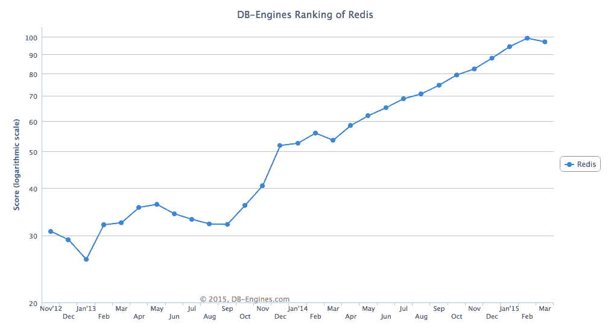

# Redis 生态系统为何蓬勃发展

> 原文：<https://thenewstack.io/why-the-redis-ecosystem-is-flourishing/>

随着越来越多的应用程序寻求使用开源项目作为现场实时应用程序处理的数据结构服务器，内存键值数据存储 [Redis](http://redis.io/) 继续巩固其市场地位。

根据 Rackspace 的产品经理 Matthew Barker 的说法，云托管基础设施提供商 [Rackspace](http://www.rackspace.com/) 目前正在经历一场特别强劲的热潮，他说“随着客户淘汰和替换 Memcached 以及实时应用程序的激增，它正在快速增长。”本月早些时候，Rackspace 在旧金山艺术宫举办了 RedisConf 2015。大约有 250 人参加了会议。

Rackspace 的观点代表了整个数据库市场的趋势。数据库排名网站 [DB-Engines](http://db-engines.com/en/ranking) 将 Redis 列为三月份第十大最受欢迎的数据库管理系统，比一年前的第十三名有所上升。

DB-Engines 根据许多因素计算 Redis 的受欢迎程度，包括专门要求 Redis 专业知识的职位广告数量、推文和新闻提及、Google 趋势兴趣和关键技术论坛上的讨论，如 Stack Overflow(巧合的是[使用 Redis 作为其堆栈的一部分，作为整个 Stack Overflow 网络的缓存层](http://meta.stackexchange.com/questions/69164/does-stack-overflow-use-caching-and-if-so-how))。

## 热数据的 Redis

作为内存中的数据存储，越来越多的企业在扩展应用程序时转向 Redis，以便在内存中执行快速处理任务。这类似于为“热数据”提供了一个实时沙箱:数据端点在最终确定之前会经历读写处理循环，因此会不断变化。

据联合创始人[保罗·内格里](https://twitter.com/hungryblank)称，这就是内容管理 API 服务 [Contentful](https://www.contentful.com/) 在其堆栈中使用 Redis 的方式。Contentful 是一个平台无关的内容管理系统，它通过 API 向任何设备提供内容。目前的客户包括像 Nasty Gal 这样的电子商务网站和像 Playboy 这样的老牌媒体帝国。虽然它们的内容存储在数据服务器中，但在编辑阶段，内容会被复制到 Redis，以便在将内容保存回更永久的数据存储之前对其进行实时编辑。“目前，我们使用 Redis 作为非常热的数据的临时数据存储，从这一点来看，它工作得非常好。一旦客户完成编辑过程，他们的内容就会进入 Elasticsearch，最终进入我们的 AWS 基础设施。”

自从 Redis 在 2009 年创建以来，Negri 一直在各种 IT 角色中使用它，当时他首先创建了几个实验性的库。但在 2011 年，在游戏平台 [Wooga](http://www.wooga.com/) 上，他更认真地看待 Redis，将其视为 MySQL 的替代品。“一开始，我们只是将一小部分数据转移到 Redis 上，然后越来越多的游戏数据转移到 Redis 上。对我们来说，它是一个比 MySQL 性能更高的工具。

“我们使用 Redis 的一个原因是我们对持久性没有严格的要求。你可以承受输掉一场游戏的最后几分钟，而不像在金融领域，你不能输掉任何交易。Redis 对持久性有明确的约定。这不是一个严格的持久性模型，但它非常清晰，定义非常明确。”

## 应用程序的实时需求

游戏应用程序的实时性使其成为 Redis 的常见用例。Rackspace 的 Barker 说“许多游戏公司正在使用 Redis 作为他们的排行榜。”(他还指出了其他排行榜，例如博客网站上文章的上下投票，这是 Redis 广泛使用的另一个例子。)

游戏公司 Scopely 的首席技术官 Ankur Bulsara 加倍使用 Redis，从开源项目转向与企业提供商 Redis Labs 签约。Scopely 目前在应用程序市场上有四个排名第一的游戏，“我们的游戏安装量超过 3000 万”，其中一些最大的游戏每周进行 20 亿次 API 调用，“有些游戏每秒钟看到 40-50，000 次请求，”Bulsara 说。

“我们开始用 Redis 做吸引很多人的事情:排行榜、内存、分类集合和社交应用。

“从哲学上来说，我们喜欢让亚马逊尽可能地管理，所以当亚马逊在 Redis 上使用弹性路径时，我们就切换到了那个。然后，我们遇到了 AWS reinvention 的 Redis 实验室，他们看起来有一个令人信服的弹性套件，特别是，他们为我们提供了一种单击方式来管理我们的规模。我们习惯了 AmazonDB，在那里我们不必管理节点大小，所以现在我们可以像使用 API 一样使用 Redis Labs。

“我们大量使用 DynamoDB 作为主数据存储，然后使用 Redis 作为任务或当前功能，或者为实时事件系统提供动力。我们使用一些 Memcached，但我们越来越多地将 Redis 作为我们的缓存解决方案，我们正在慢慢地脱离 MySQL 和 Redshift 作为我们的分析数据库。

“我们在全球有许多堆栈，我们制作自己的游戏并发布游戏，他们有不同的要求，堆栈的配置也略有不同。一般来说，我们在配置系统中使用 Ansible 和 CloudFormation 剧本，从中我们可以配置 DynamoDB 表或其他东西。

“一个很好的例子是，我们使用 Redis Labs 作为实时警报的分析平台，并使用新的 hyperlog 日志功能来激活用户计数。诸如此类的功能使我们能够提高 Redis 实验室的使用率，超出了我们最初的预期。”

虽然游戏可能看起来像一个特定的垂直行业，但其应用程序需求的实时性指出了其他行业利用 Redis 的内存数据存储容量的一些方式。Barker 指出，排行榜的使用超越了游戏用例，比如文章的上下投票，这是 Redis 如何被使用的另一个例子。

他还看到 Redis 为消息队列、电子商务会话存储和基本缓存提供动力，特别是对于 WordPress 安装。

## Redis 的三个生态系统流

随着 Redis 继续加强其作为业务技术栈的缓存数据库存储的地位，围绕开源项目的生态系统向外扩展。在技术堆栈中，从 Redis 使用流出的两个主要生态系统流是:

*   与 Redis 一起运行的任务管理项目。
*   互补的 NoSQL 技术。

此外，第三个生态系统流正在出现:

*   传统上使用 Redis 来扩展 SaaS 平台安装。

### 与 Redis 一起运行的任务管理项目

作为一个开源项目，围绕 Redis 涌现出了许多其他工具来扩展它的功能以满足特定的用例。

其中最主要的是消息队列，这是 Rackspace 自己在 Redis 内部使用的一个用例。利用 Redis 的内存缓存功能实现实时消息队列的工具包括:

*   **Celery:** Celery 是一个异步作业队列管理器，它使用分布式消息解析来同步管理任务，或者在特定事件或用户输入被触发时管理任务。主要用于实时任务管理，也用于任务调度。Rackspace 在内部使用 Redis 和 Celery 进行作业排队，Barker 确认这是一个用例，他看到越来越多的 Rackspace 客户也使用 Redis。
*   **Resque:** 类似地， [Resque](https://github.com/resque/resque) 是一个“Redis 支持的 Ruby 库，用于创建后台作业，将它们放在多个队列中，并在以后处理它们。”它由 GitHub 创建，可以与任何响应“执行”命令的 Ruby 类或模块一起使用，自从由 GitHub 创建以来，它已经管理了超过 1000 万个作业。为了寻求一种解决方案来处理繁重的后台作业，他们需要一个实时选项来监视陈旧和臃肿的任务，监控待处理的作业，在多台机器上分配工作人员，管理失败的作业而不释放或重试它们，以及其他任务管理职责，所有这些都具有持久的状态。“如果我们让 Redis 处理硬队列问题，我们就可以专注于硬工作者的问题:可见性、可靠性和统计。克里斯·万斯特拉斯在 2009 年 11 月介绍 Resque 时写道。
*   **Sidekiq:** 由 Mike Perham 创建，并考虑到 Resque 兼容性而编写， [Sidekiq](https://github.com/mperham/sidekiq) 使用多线程来支持并行处理数百条消息。这为 Ruby 和 Rails 环境创建了轻量级、高效的后台处理。这个想法是，Sidekiq 可以和 Resque 一起使用，在处理作业队列时提高内存效率。Sidekiq 使用 Redis 存储所有作业和操作数据。

赋予 Redis 用户权力的其他工具包括:

*   **object rocket:**Rackspace 收购的 [ObjectRocket](https://thenewstack.io/tinder-is-scaling-with-mongodb-and-some-help-from-objectrocket/) 旨在快速提升 Redis 的性能实例。目标是让用户专注于扩展他们的应用程序，自动管理 Redis 的扩展。
*   **政委**:除了标准的基准测试之外，早期发布的性能度量工具[政委](https://thenewstack.io/beyond-benchmarking-with-commissar-a-use-case-performance-tool-for-redis/)能够对 Redis 栈环境进行场景测试。
*   **Datadog:** 像 [Datadog](https://www.datadoghq.com/) 这样的分析产品也提供与 Redis 的集成，以可视化的方式跟踪所有 Redis 活动，并能够分析单个数据库和 Redis 集群的性能指标。

### 互补 NoSQL 技术

*   **Elasticsearch:** 作为 Redis 最常用的工具之一， [Elasticsearch](http://www.elastic.co/guide/en/logstash/current/plugins-inputs-redis.html) 是一个实时全文搜索引擎。它经常与 Redis 结合使用，其中缓存的数据存储在 Redis 中，然后通过 Elasticsearch 进行查询。这就是 HipChat 如何扩大其增长规模的[。他们使用 Redis 来缓存数据，比如谁在线，哪个用户在哪个房间。然后，ElasticsSearch 被用作存储和搜索后端，可以监控 Redis 缓存中的使用数据，并根据需要通过添加更多节点来透明地扩展。](http://highscalability.com/blog/2014/1/6/how-hipchat-stores-and-indexes-billions-of-messages-using-el.html)
*   **Logstash:** 同样来自 Elastic，Logstash 是一个中央日志文件管理应用程序，通常与 Elasticsearch、Nginx 和 Redis 一起使用。Vadiraj Joish [去年写了](http://www.thegeekstuff.com/2014/12/logstash-setup/)关于如何建立一个堆栈来收集分布在多个服务器上的多个应用程序的日志；将数据存储在中央文件中；和管理 web GUI 前端，以便更轻松地分析指标和创建粒度报告。对于这个堆栈，Redis 成为一个数据存储库，可以过滤内存中的查询，而 Elasticsearch 则充当 Logstash 整理的所有日志的中央存储。
*   **MongoDB:** 高容量、实时应用程序正在使用 [MongoDB](http://www.mongodb.com/) 和 Redis 的组合来响应每秒超过 200，000 个请求。去年， [MaxCDN 记录了他们如何在其堆栈中使用 MongoDB 和 Redis](https://www.maxcdn.com/blog/learned-stop-worrying-love-logs/) 来支持分析平台。所有 MaxCDN 客户的日志数据都存储在 MongoDB 的专门版本中( [TokuMX](http://www.tokutek.com/products/tokumx-for-mongodb/) )。Redis 然后被用作 MaxCDN 的内容交付网络和他们的 TokuMX 数据库集群之间的高容量消息队列。Bryan Conklin 写道:“Redis 的轻量级足以跟上传入数据的速度。

### Redis 和 SaaS 平台

Marko Martinovic 是专门从事电子商务平台的后端开发人员，他认为 Redis 解决了电子商务企业开始增长时面临的许多扩展问题。在去年的一篇关于[使用 Redis 作为缓存后端和会话存储](http://inchoo.net/magento/using-redis-cache-backend-and-session-storage-in-magento/)的文章中，Martinovic 指出，一旦网站访问和购物会话开始规模化，APC 和 Memcached 等更常见的解决方案就开始陷入困境。当事务量开始成为架构决策中的一个因素时，诸如不能标记相关高速缓存条目组之类的限制进一步加剧了其他数据存储高速缓存选项的使用。

他们的场景与 Redis 看到的管理 WordPress 安装的类似吸收的原因没有什么不同。去年 12 月，来自数字海洋[的斯科特·米勒发布了一个关于使用 Redis 配置 Redis 缓存的教程](https://www.digitalocean.com/community/tutorials/how-to-configure-redis-caching-to-speed-up-wordpress-on-ubuntu-14-04)，以加快 WordPress 页面加载速度，用 Redis 将加载时间减半。使用 Redis，“结果是 WordPress 站点速度更快，使用更少的数据库资源，并提供可调的持久缓存，”Miller 写道。

随着更多面向平台的 SaaS 产品成熟并建立起客户基础，Redis 很可能成为一个重要的堆栈组件，既作为缓存又作为内存存储，就像 WordPress 和 Magento 一样。

<svg xmlns:xlink="http://www.w3.org/1999/xlink" viewBox="0 0 68 31" version="1.1"><title>Group</title> <desc>Created with Sketch.</desc></svg>