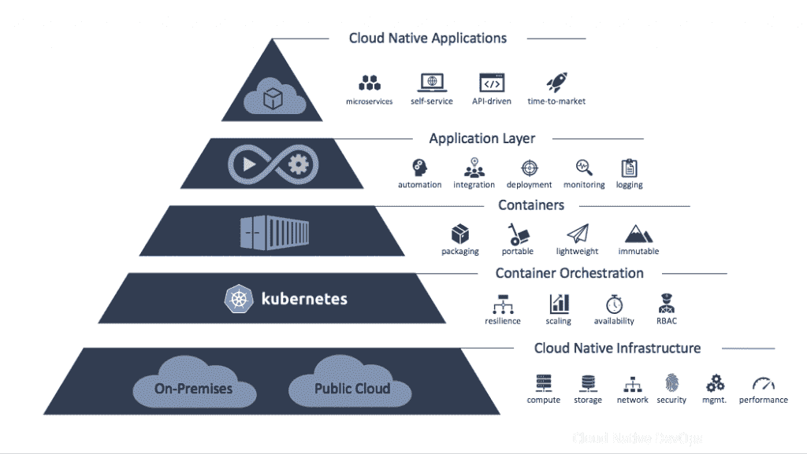
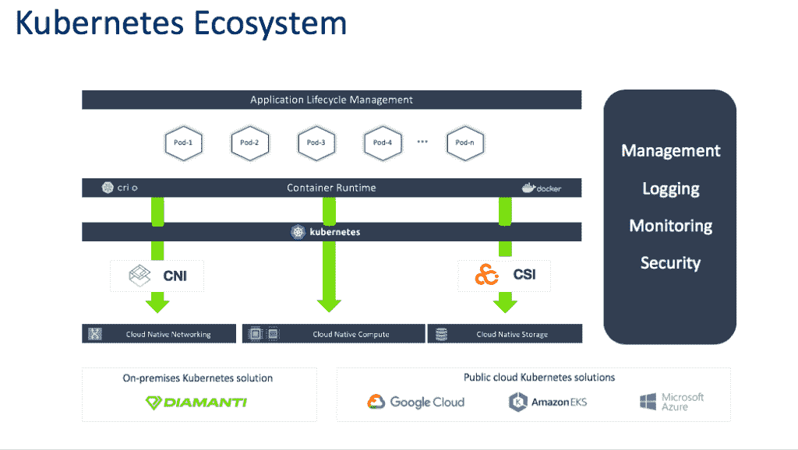
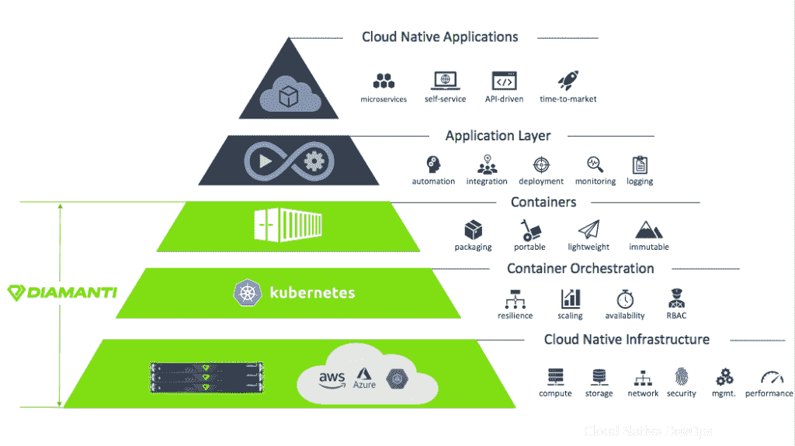

# 为什么 Kubernetes 的这些差距真的是一件好事

> 原文：<https://thenewstack.io/why-those-gaps-in-kubernetes-are-really-a-good-thing/>

[Diamanti](https://diamanti.com/) 赞助本帖。

 [阿尔温德·古普塔

Arvind 是云原生专家、问题解决者和传道者，对学习和教学充满热情。Arvind 在一系列计算机学科中担任过各种技术职务。在开始他的软件测试职业生涯后，Arvind 在 Redback Networks 公司的 ASIC 行业呆了几年，随后在爱立信公司工作，在那里他构建了高级网络芯片。他于 2015 年 10 月加入 Diamanti，在负责解决方案和营销之前，他在将 Diamanti 的硬件平台投入生产方面发挥了重要作用。Arvind 拥有普渡大学的硕士学位。](https://www.linkedin.com/in/guptaarvindk/) 

Kubernetes 允许用户从应用管理和基础设施选项的开放生态系统中进行选择，在云本地计算基金会( [CNCF](https://www.cncf.io/) )的管理下，Kubernetes 已经成为新的 Linux。

Kubernetes 成为容器编排事实上的选择的原因之一是因为它没有提供什么。

为什么？

为了支持各种各样的用例，早期的 Kubernetes 开发人员有意在平台上添加了一些空白，以便为用户提供灵活性。Kubernetes 不是一个万能的平台，而是一个可扩展的平台，用户和供应商可以根据自己的需求，通过定制资源定义( [CRDs](https://kubernetes.io/docs/concepts/extend-kubernetes/api-extension/custom-resources/) )、容器存储接口( [CSI](https://kubernetes.io/blog/2019/01/15/container-storage-interface-ga/) )和容器网络接口( [CNI](https://kubernetes.io/docs/concepts/cluster-administration/networking/) )轻松定制他们的环境。Kubernetes 中有意留下的空白为基础设施和应用层提供了灵活性。

云原生环境的构建模块。

让我们探索这些有意的差距，留给用户的决定，以及做出正确决定的一些关键考虑因素。

## 云原生基础架构的有意差距

### 基础设施

今天，有许多基础设施选择来运行 Kubernetes。它可以在内部或公共云中运行。它也可以在虚拟机或裸机服务器上运行。没有“一刀切”的模式。因此，用户需要根据自己的功能、性能、效率和成本要求做出明智的决定。然而，一个错误的决策会导致对项目结果和客户体验的重大负面影响。

### 储存；储备

就像基础设施一样，选择存储解决方案对于 Kubernetes 用户来说也是一项艰巨的任务。即使这些年来存储取得了巨大的进步，大多数用户仍然在 I/O 瓶颈中挣扎。随着 Kubernetes 成为无状态和有状态应用程序的标准，用户选择能够提供现代数据服务的存储系统非常重要，例如具有最高吞吐量和最低延迟的[灾难恢复](https://en.wikipedia.org/wiki/Disaster_recovery) (DR)和[高可用性](https://blog.openshift.com/tech-preview-get-visibility-into-your-openshift-costs-across-your-hybrid-infrastructure/) (HA)。

### 建立工作关系网

联网是任何云原生应用的基本要求。Kubernetes 有机地管理集群网络，但是向外界公开应用程序以及安全地扩展或互连应用程序是 Kubernetes 用户面临的一些最大挑战。因此，用户在选择网络解决方案时，需要考虑网络拓扑、安全性、延迟和吞吐量要求。

### 资源利用

Kubernetes 在 CPU 和内存级别解决了[噪音邻居](https://searchcloudcomputing.techtarget.com/definition/noisy-neighbor-cloud-computing-performance)问题，但共享存储和网络仍然容易受到占用系统资源的应用程序的攻击。为了防止这种情况，Kubernetes 用户最终会过度配置基础架构，这违背了硬件或软件虚拟化的唯一目的。用户将需要实施能够避免嘈杂的邻居问题并最大化资源利用率的措施。

## 云原生应用程序管理的有意差距

### 用户和集群管理

由于 Kubernetes 与基础设施无关，它只提供基本的集群和用户管理。大多数企业需要比现成可用的功能更强大的功能，包括 Active Directory 集成以及用户和事件跟踪和日志记录。

### 高级定制选项

虽然 Kubernetes 是为容器编排和管理而设计的，但它还包括许多用于进一步定制的高级选项，包括增强的安全性和配置控制等领域。像 Linux 一样，这些选项对于那些熟悉它们的人来说是可用的，但是对于新用户来说不一定是直观的。习惯于使用传统方法(处理基础设施和应用程序管理)的用户可能会被 Kubernetes 的复杂性和错综复杂所困扰。然后，用户可以决定这些高级选项中哪些是重要的。

### 应用生命周期管理(ALM)

Kubernetes 编排容器而不是应用程序。开发人员通常更关心应用程序生命周期管理，而不是管理单个容器。使用 Kubernetes，ALM 组件(如升级应用程序)变得很复杂。用户需要考虑到这一点。

### 多集群管理

随着 Kubernetes 的快速采用，组织更喜欢多个 Kubernetes 集群(用于开发、测试、生产等。)为了简单和隔离。但是，这增加了从单一控制台管理多个集群的复杂性。跨不同(或相同)云提供商、跨不同数据中心和跨不同地区移动应用程序及其数据也增加了复杂性。

## Kubernetes 社区的改进

在 CNCF 的管理下，Kubernetes 社区一直在通过标准化的接口和框架积极发展和改进平台的核心功能。这些努力使供应商和生态系统中的其他贡献者能够填补上述一些空白。

### 操作员框架

操作员是专门为特定 Kubernetes 应用程序的生命周期管理而构建的控制器，具有内置的操作知识。Kubernetes 社区开发了这个框架，为应用程序管理提供自动化、标准化、易用性和灵活性。操作符的一些例子是由各种供应商发布的数据库操作符，例如[微软 SQL 服务器](https://docs.microsoft.com/en-us/sql/t-sql/language-elements/operators-transact-sql?view=sql-server-ver15)、 [MongoDB](https://docs.mongodb.com/manual/reference/operator/) 和 [Crunchy](https://access.crunchydata.com/documentation/postgres-operator/4.0.0/) PostgreSQL。有了数据库操作员，就有可能以完全自动化的方式创建、销毁、克隆、缩放或分片数据库。此外，运营商还提供在生产中运行数据库所需的关键功能，如高可用性(HA)、复制、负载平衡、故障转移和快照。

### 犯罪现场调查和 CNI

在 Kubernetes 的早期，不支持将存储集成到 Kubernetes 中。 [Diamanti](http://www.diamanti.com) 贡献了一个名为[“flex volume”](https://github.com/bakins/zfs-flex-volume)的存储插件，为将存储集成到 Kubernetes 铺平了道路。FlexVolume 插件支持有状态应用在 Kubernetes 上运行。FlexVolume 后来发展成了 CSI，在 Kubernetes 1.13 和更高版本中得到完全支持。类似地，Kubernetes 社区开发了 CNI 插件，允许用户将 Kubernetes 与首选网络解决方案集成。

这些标准接口有助于用第三方解决方案扩展 Kubernetes。但是，这也带来了选择合适的供应商或解决方案来满足存储和网络需求的额外挑战。

## 填补空白

如上所述，Kubernetes 有许多有意的缺口，这赋予了它在任何平台上运行的灵活性。服务提供商和基础设施提供商有责任填补这些空白。

每个公共云提供商都提供 Kubernetes 服务，通过集成到其特定的计算、存储和网络基础架构来填补故意留下的空白。但是，公共云被设计为同构资源。这意味着生产应用程序会受到嘈杂邻居的影响，迫使用户过度配置基础架构，从而导致成本增加。

Kubernetes 生态系统的参考架构。

或者，在本地基础设施上运行 Kubernetes 并不总是容易的。使用 DIY 方法部署 Kubernetes 会带来选择和管理许多不同移动部分的问题，例如 CSI、CNI、硬件、操作系统、安全性、身份和用户管理。去年，许多供应商已经开始提供 [CNCF 认证的 Kubernetes 发行版。然而，拥有一个完全集成的 Kubernetes 平台来解决所有有意的缺口是非常关键的。](https://www.cncf.io/certification/software-conformance/)

Kubernetes 的 Diamanti 超融合基础设施。

DIY Kubernetes 的替代方案是利用现代超融合基础设施(HCI)方法来填补这些空白。Diamanti 是这一领域的先驱，提供完全集成的计算、存储、网络和安全解决方案，同时兼顾集群管理、身份和用户管理、监控和混合云管理。这使得开发人员和运营商能够专注于应用程序开发和部署。此外，Diamanti 平台通过其独特的 IO 管理解决方案完全消除了噪音邻居问题，提供了前所未有的应用性能。

## 结论

Kubernetes 显然是容器编排的最佳平台，设计用于在任何环境中运行。然而，Kubernetes 的构建原则也使得它的开箱即用变得非常困难。由此带来的挑战是，Kubernetes 中存在许多有意添加的缺口，有待社区和供应商来解决。

因此，在组织中采用 Kubernetes 时，重要的是要考虑如何通过基础设施和应用程序管理来最大限度地减少所需的时间、精力和成本，从而满足一整套需求。集成方法是加快实现价值的一种方式，同时确保填补所有这些空白。

来自 Pixabay 的特征图像。

<svg xmlns:xlink="http://www.w3.org/1999/xlink" viewBox="0 0 68 31" version="1.1"><title>Group</title> <desc>Created with Sketch.</desc></svg>