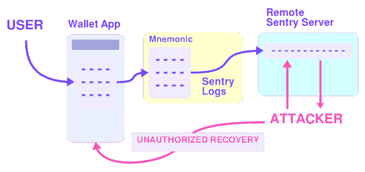
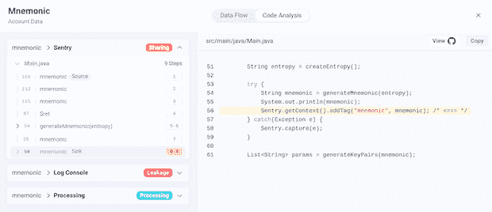

# 为什么不知情的数据泄露是猖獗的区块链黑客攻击的关键

> 原文：<https://thenewstack.io/why-unsuspecting-data-leaks-are-a-key-to-rampant-blockchain-hacks/>

上个月，在最近一系列针对区块链的袭击中，索拉纳·区块链面临着又一次袭击。区块链是加密资产的最终记录，在分类账上记录从一个钱包到另一个钱包的交易保证了资金转移和操作几乎保持匿名。

这对犯罪分子来说绝对是一颗宝石，因为 1)到目前为止，在这个现代分散金融(DeFi)世界中几乎没有金融和安全法规；  2)在区块链匿名保证了一个非常困难的调查轨迹，几乎没有办法查明钱的实际去向。

> 想象一下成百上千的库珀每天带着装满现金的袋子从上百架飞机上跳下:D

区块链攻击的主要载体是智能合同漏洞、协议和设计缺陷、与加密相关的错误、地毯拉骗局等。其中，钱包受损和密钥泄露共占去年攻击总数的 14%!

## 黑客

8 月 3 日，SOL、BTC、ETH、USDT 和 Solana 以及区块链以太坊上价值约 600 万美元的货币从数千个个人钱包中被转移到黑客的钱包中，并最终被发送到各种洗钱钱包中。

SlowMist 是第一个 [报告](https://slowmist.medium.com/analysis-of-large-scale-theft-of-solana-5782cc999df4) 这次攻击并开始调查的人。当对 T21 的彻底调查还在进行时，一些不可否认的事实已经浮出水面。攻击的关键以及攻击的发现是自诩为“DeFi 的罗宾汉”的 Slope wallet 应用程序。

## 信任的陡坡

像成千上万的其他应用程序一样，Slope 使用了一个名为 Sentry 的日志监控工具来跟踪应用程序中的各种事件。这是常见的做法，本身并不被认为有害。但是，请注意，从技术上讲，应用程序在与人交互时产生的任何东西都可以被跟踪并发送到相应的日志跟踪服务器。

在这种情况下，来自 v2.2.0+的 Slope wallet 悄悄地从应用程序中收集敏感数据，如助记符和私钥，并将其发送到他们自己托管的 Sentry 服务器。而哨兵 [则特别推荐](https://docs.sentry.io/platforms/python/guides/logging/data-management/sensitive-data/) 用户擦洗敏感数据，每一条建议客观上都很难落实。

此外，不同的应用程序对哪些数据被视为敏感数据有不同的定义和要求。不可能真正创建一个通用的准则来记录什么和不记录什么。然而，在这种情况下，日志助记符绝对是为攻击者提供攻击钱包的垫脚石的可靠方法。

### *T5 什么是助记符？*

*助记符通常是 12 个单词的集合，用户可以在创建新的加密钱包时选择。如果用户无法使用密码，他们可以使用助记符找回钱包。在没有集中式密码存储和恢复系统的情况下，它提供了更加用户友好的恢复系统。这是如此重要，以至于有些人使用金属种子盘来存储他们的记忆。*

虽然 SlowMist 调查仍未完成，但毫无疑问，记录助记符的决定是一个危险的决定。分析表明，大约 31%的已知受害者钱包与哨兵日志中发现的钱包相同。因此，助记符泄漏可能只是一种关联，也可能实际上是根本原因。不管怎样，我们都不会感到惊讶。这就是能够访问托管的 sentry 服务器的人能够访问它的方式:



但是，我们了解开发人员，我们同情他们。这不是他们的错——这个时代的编码范式很复杂。现代软件是建立在一层又一层的库和其他代码之上的。日志记录已经从在地下室机器的本地控制台上打印漂亮的东西，发展到监视全球运行的数百万设备和机器上的数十亿个动作。收集所有用户操作及其详细信息的细粒度数据，有时与关键的钱包详细信息一样致命。数据现在已经超出了应用程序的范围。它不会回来了。

## 如何解决这个问题？

再多的操作安全和隐私政策也无法解决这个问题。现代软件的本质阻止了对这种泄漏进行详细的人工审查。我们需要的是帮助我们了解大型代码库中的数据发生了什么的工具，以便隐私/安全工程师或开发人员自己能够在泄漏发生之前识别出具体的可能泄漏点。这种左移的方法以前在安全领域使用过——现在是时候为数据和隐私实现它了。

## **使用 Privado 开源寻找助记术漏洞**

虽然我们无法真正获得 Slope 应用程序的源代码，但我们肯定可以尝试用一个示例应用程序来重现这个场景。让我们用这个我修改过的简单的 [BitcoinWallet](https://github.com/tuxology/BitcoinWallet) 应用程序，给一个假想的端点添加一些哨兵日志:

```
public static void main(String[]  args)  throws  Exception  {

      // initialize Sentry

      Sentry.init(options  -&gt;  {

            options.setDsn("https://examplePublicKey@o0.ingest.sentry.io/0");

      });

      String entropy  =  createEntropy();

      try  {

            String mnemonic  =  generateMnemonic(entropy);

            System.out.println(mnemonic);

            Sentry.getContext().addTag("mnemonic",  mnemonic);

      }  catch(Exception  e)  {

            Sentry.capture(e);

```

这里我们可以看到，用户的助记符可能会“意外”泄露给他们正在运行的 Sentry 服务。想象一下，但是在应用程序的深层。因此，每当用户创建一个新钱包并获得 12 个单词的助记符(这实际上是找回钱包的关键)时，就会有一个风险，即它会被记录到他们的中央登录基础架构中。

现在发现这种泄漏的一种方法是使用 Privado 开源工具。开发人员可以运行隐私扫描，开始探索它发现的数据，并直观地查看是否有类似助记符的东西流向第三方日志服务，如下所示:



要在这个样本 BitcoinWallet 应用程序上亲自尝试这一点，或者在您自己的 Java 应用程序中查找数据泄漏，请前往 [Privado OSS repo](https://github.com/Privado-Inc/privado) 进行尝试。除了开箱即用的发现之外，Privado 中还有数百个可以定义为规则的自定义源和接收器。如果您遇到想要添加的有趣的数据源和数据汇，请随时为项目做贡献并提交 pull 请求。

```
-  id:  Data.Sensitive.AccountData.Mnemonic

name:  Mnemonic

category:  Account Data

isSensitive:  False

sensitivity:  high

patterns:

   -  "(?i).*(mnemonic)"

tags:

   law:  GDPR

```

在本例中，为了跟踪钱包助记符，我只需将上述规则添加到一个 [规则 YAML 文件](https://github.com/Privado-Inc/privado/pull/64/files) 中，数据跟踪就一直进行到 Sentry sink！

现在是时候为每位开发人员和数据安全分析师提供隐私工程工具了，这样我们就可以共同确保应用程序中的隐私数据从开发的第一天起就保持隐私。

<svg xmlns:xlink="http://www.w3.org/1999/xlink" viewBox="0 0 68 31" version="1.1"><title>Group</title> <desc>Created with Sketch.</desc></svg>